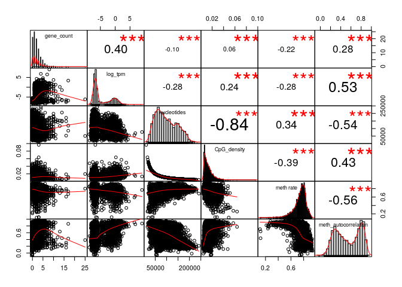
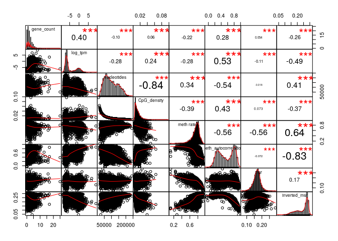
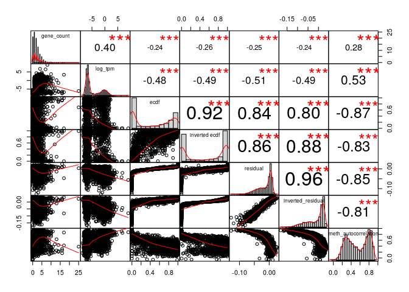
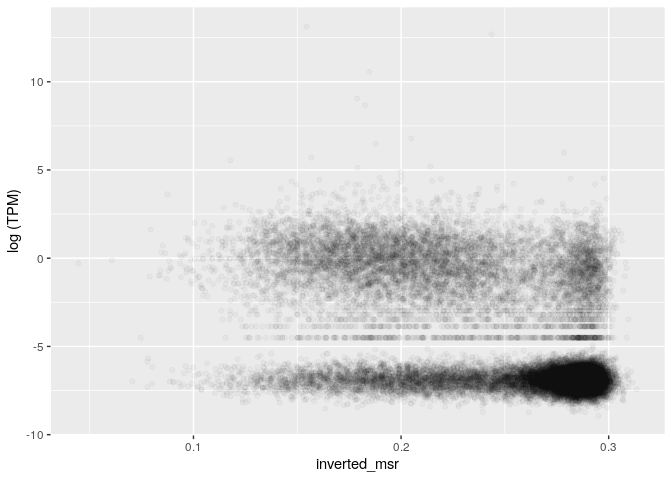
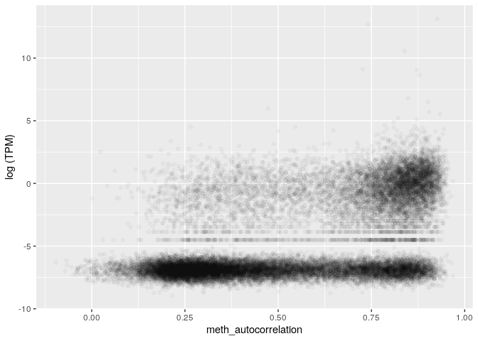
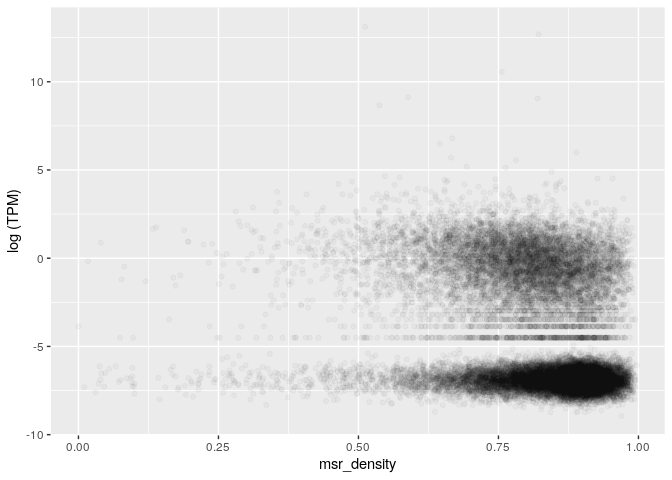
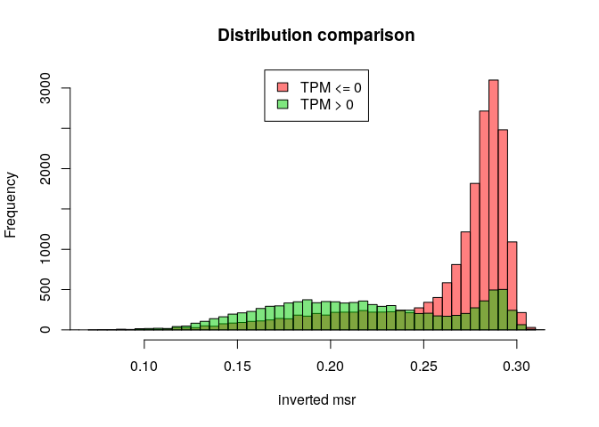
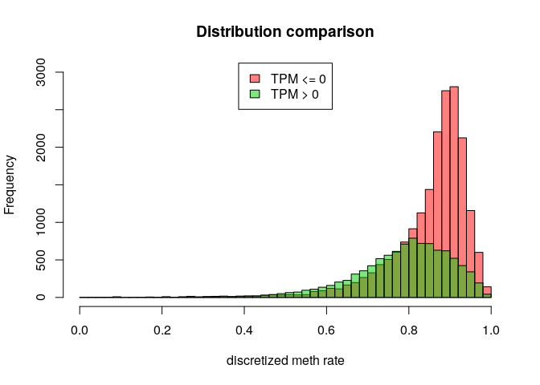
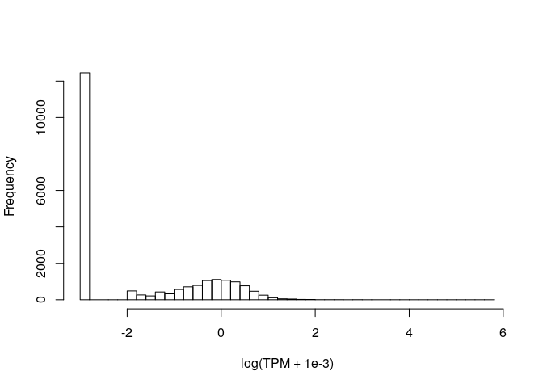

MSR and expression for stomach, windows of 1000 sites, extended genes set
================

The DataFrame is the following (excluding some columns for readability):

    ## 21 rows had too many nucleotides

    ##   start_chr start_position end_position gene_count total_TPM meth rate
    ## 2      chr1          88881       181138         18      4.36 0.8133116
    ## 3      chr1         181138       356081         10      0.00 0.7509289
    ## 6      chr1         535250       632769         14      6.68 0.7614178
    ## 7      chr1         632769       742325          7      5.36 0.7494013
    ## 8      chr1         742325       827393          8      0.25 0.7042525
    ## 9      chr1         827393       891580          3      0.00 0.6920191

The full scheme includes:

**nucleotides**: number of nucleotides in the window

**CpG density**: fraction of nucleotides that is a C of a CpG site (= 1000/nucleotides)

**meth rate**: ratio of methylated CpG sites

**gene\_count**: number of genes included (even partially) inside the interval

**total\_TPM**: sum of the TPMs of the genes in the interval

then the MSR and some related statistics: **msr**, **inverted msr**, **msr ecdf **, **inverted msr ecdf**, **residual** (residual of the linear regression between msr and meth rate), **inverted residual**.

First let's see if there are pairwise correlations between the features.

TPM for regions with 0 genes is considered 0.

###### Basic features:

###### Comparison with simple MSR statistics:

###### Comparison with other MSR statistics:

inverted msr vs log(tpm): 

    ## missing data:  2.073393 %

    ## 
    ## train_data_proportion:  0.2

The fraction of fragments that have TPM&gt;0 (train data)

    ## [1] 0.3404032

Logistic Regression Model for TPM presence with basic predictors (nucleotides, CpG\_density, meth rate, msr\_density):

    ## TRAIN DATA

    ## accuracy:  0.6999124

    ## TEST DATA

    ## accuracy:  0.7149242

Logistic Regression Model with inverted\_msr as predictor

    ## TRAIN DATA

    ## accuracy:  0.7325153

    ## TEST DATA

    ## accuracy:  0.7425291

Logistic Regression Model with all predictors

    ## TRAIN DATA

    ## accuracy:  0.7640666

    ## TEST DATA

    ## accuracy:  0.768951

#### Predicting log(TPM)

Distribution of TPM values (only for regions that contains some genes) 

Linear model for TPM with standard predictors, available information about genes:

    ## 
    ## Call:
    ## lm(formula = log_tpm ~ ., data = train_model_data[, standard_predictors])
    ## 
    ## Residuals:
    ##     Min      1Q  Median      3Q     Max 
    ## -9.6632 -1.8209 -0.1331  1.6104 12.1788 
    ## 
    ## Coefficients:
    ##                           Estimate Std. Error t value Pr(>|t|)    
    ## (Intercept)             -1.171e+01  5.093e-01 -22.997  < 2e-16 ***
    ## gene_count               3.318e-01  1.897e-02  17.491  < 2e-16 ***
    ## nucleotides              2.429e-07  1.426e-06   0.170    0.865    
    ## CpG_density              6.698e+01  8.518e+00   7.863 4.45e-15 ***
    ## `meth rate`              3.060e+00  4.278e-01   7.154 9.46e-13 ***
    ## meth_autocorrelation     4.709e+00  1.849e-01  25.468  < 2e-16 ***
    ## genes_nucleotides_count  1.920e-05  1.073e-06  17.891  < 2e-16 ***
    ## ---
    ## Signif. codes:  0 '***' 0.001 '**' 0.01 '*' 0.05 '.' 0.1 ' ' 1
    ## 
    ## Residual standard error: 2.497 on 5698 degrees of freedom
    ## Multiple R-squared:  0.373,  Adjusted R-squared:  0.3724 
    ## F-statistic:   565 on 6 and 5698 DF,  p-value: < 2.2e-16

    ## Test data R squared:  0.3647312

Linear model for TPM with all features and MSR statistics, available information about genes:

    ## 
    ## Call:
    ## lm(formula = log_tpm ~ ., data = train_model_data[, c(standard_predictors, 
    ##     msr_predictors)])
    ## 
    ## Residuals:
    ##     Min      1Q  Median      3Q     Max 
    ## -9.8162 -1.6785 -0.1275  1.4447 12.0464 
    ## 
    ## Coefficients:
    ##                           Estimate Std. Error t value Pr(>|t|)    
    ## (Intercept)             -1.178e+01  2.985e+00  -3.948 7.96e-05 ***
    ## gene_count               3.325e-01  1.883e-02  17.661  < 2e-16 ***
    ## nucleotides             -1.318e-06  1.455e-06  -0.906  0.36518    
    ## CpG_density              6.329e+01  8.584e+00   7.373 1.91e-13 ***
    ## `meth rate`              4.162e+00  1.870e+00   2.226  0.02605 *  
    ## meth_autocorrelation     2.837e+00  3.369e-01   8.420  < 2e-16 ***
    ## genes_nucleotides_count  1.880e-05  1.064e-06  17.672  < 2e-16 ***
    ## msr                      1.442e+00  4.020e+00   0.359  0.71985    
    ## inverted_msr             1.259e+00  1.516e+01   0.083  0.93386    
    ## ecdf                     1.139e+00  2.710e-01   4.204 2.67e-05 ***
    ## `inverted ecdf`         -1.520e+00  2.629e-01  -5.783 7.72e-09 ***
    ## residual                -2.591e+01  8.061e+00  -3.214  0.00131 ** 
    ## inverted_residual        2.987e+00  1.580e+01   0.189  0.85005    
    ## ---
    ## Signif. codes:  0 '***' 0.001 '**' 0.01 '*' 0.05 '.' 0.1 ' ' 1
    ## 
    ## Residual standard error: 2.471 on 5692 degrees of freedom
    ## Multiple R-squared:  0.387,  Adjusted R-squared:  0.3857 
    ## F-statistic: 299.5 on 12 and 5692 DF,  p-value: < 2.2e-16

    ## Test data R squared:  0.3813727

Linear model for TPM with adding inverted msr, available information about genes:

    ## 
    ## Call:
    ## lm(formula = log_tpm ~ ., data = train_model_data[, c(standard_predictors, 
    ##     "inverted_msr")])
    ## 
    ## Residuals:
    ##     Min      1Q  Median      3Q     Max 
    ## -9.8907 -1.7334 -0.1206  1.4632 11.9719 
    ## 
    ## Coefficients:
    ##                           Estimate Std. Error t value Pr(>|t|)    
    ## (Intercept)             -8.750e+00  5.921e-01 -14.779  < 2e-16 ***
    ## gene_count               3.374e-01  1.883e-02  17.918  < 2e-16 ***
    ## nucleotides             -7.542e-07  1.418e-06  -0.532    0.595    
    ## CpG_density              6.530e+01  8.452e+00   7.725 1.31e-14 ***
    ## `meth rate`              4.686e+00  4.570e-01  10.256  < 2e-16 ***
    ## meth_autocorrelation     3.014e+00  2.547e-01  11.834  < 2e-16 ***
    ## genes_nucleotides_count  1.878e-05  1.066e-06  17.626  < 2e-16 ***
    ## inverted_msr            -1.264e+01  1.317e+00  -9.596  < 2e-16 ***
    ## ---
    ## Signif. codes:  0 '***' 0.001 '**' 0.01 '*' 0.05 '.' 0.1 ' ' 1
    ## 
    ## Residual standard error: 2.478 on 5697 degrees of freedom
    ## Multiple R-squared:  0.383,  Adjusted R-squared:  0.3822 
    ## F-statistic: 505.2 on 7 and 5697 DF,  p-value: < 2.2e-16

    ## Test data R squared:  0.3782946

Linear model for TPM with basic features but no information about genes:

    ## 
    ## Call:
    ## lm(formula = log_tpm ~ ., data = train_model_data[, c("log_tpm", 
    ##     basic_predictors)])
    ## 
    ## Residuals:
    ##     Min      1Q  Median      3Q     Max 
    ## -5.6705 -1.9552 -0.3659  1.9167 13.7690 
    ## 
    ## Coefficients:
    ##                        Estimate Std. Error t value Pr(>|t|)    
    ## (Intercept)          -1.118e+01  5.467e-01 -20.455  < 2e-16 ***
    ## nucleotides           2.078e-06  1.539e-06   1.351    0.177    
    ## CpG_density           4.399e+01  9.238e+00   4.762 1.97e-06 ***
    ## `meth rate`           2.851e+00  4.610e-01   6.185 6.65e-10 ***
    ## meth_autocorrelation  6.382e+00  1.924e-01  33.175  < 2e-16 ***
    ## ---
    ## Signif. codes:  0 '***' 0.001 '**' 0.01 '*' 0.05 '.' 0.1 ' ' 1
    ## 
    ## Residual standard error: 2.718 on 5700 degrees of freedom
    ## Multiple R-squared:  0.257,  Adjusted R-squared:  0.2565 
    ## F-statistic: 492.9 on 4 and 5700 DF,  p-value: < 2.2e-16

    ## Test data R squared:  0.262032

Linear model for TPM with all features but no information about genes:

    ## 
    ## Call:
    ## lm(formula = log_tpm ~ ., data = train_model_data[, c("log_tpm", 
    ##     basic_predictors, msr_predictors)])
    ## 
    ## Residuals:
    ##     Min      1Q  Median      3Q     Max 
    ## -6.8621 -1.6449 -0.4451  1.7135 13.5868 
    ## 
    ## Coefficients:
    ##                        Estimate Std. Error t value Pr(>|t|)    
    ## (Intercept)          -6.940e+00  3.242e+00  -2.140  0.03237 *  
    ## nucleotides           1.368e-06  1.570e-06   0.872  0.38352    
    ## CpG_density           4.145e+01  9.308e+00   4.453 8.63e-06 ***
    ## `meth rate`           9.676e+00  2.024e+00   4.780 1.80e-06 ***
    ## meth_autocorrelation  4.178e+00  3.635e-01  11.492  < 2e-16 ***
    ## msr                   1.046e+01  4.362e+00   2.397  0.01654 *  
    ## inverted_msr         -3.757e+01  1.644e+01  -2.285  0.02234 *  
    ## ecdf                  1.433e+00  2.945e-01   4.865 1.18e-06 ***
    ## `inverted ecdf`      -1.862e+00  2.856e-01  -6.521 7.61e-11 ***
    ## residual             -4.367e+01  8.746e+00  -4.993 6.12e-07 ***
    ## inverted_residual     4.710e+01  1.712e+01   2.751  0.00595 ** 
    ## ---
    ## Signif. codes:  0 '***' 0.001 '**' 0.01 '*' 0.05 '.' 0.1 ' ' 1
    ## 
    ## Residual standard error: 2.687 on 5694 degrees of freedom
    ## Multiple R-squared:  0.2744, Adjusted R-squared:  0.2732 
    ## F-statistic: 215.4 on 10 and 5694 DF,  p-value: < 2.2e-16

    ## Test data R squared:  0.28345

Linear model for TPM with inverted msr but no information about genes:

    ## 
    ## Call:
    ## lm(formula = log_tpm ~ ., data = train_model_data[, c("log_tpm", 
    ##     basic_predictors, "inverted_msr")])
    ## 
    ## Residuals:
    ##     Min      1Q  Median      3Q     Max 
    ## -6.2351 -1.7610 -0.4303  1.8104 13.5487 
    ## 
    ## Coefficients:
    ##                        Estimate Std. Error t value Pr(>|t|)    
    ## (Intercept)          -8.098e+00  6.403e-01 -12.648  < 2e-16 ***
    ## nucleotides           9.715e-07  1.532e-06   0.634    0.526    
    ## CpG_density           4.229e+01  9.175e+00   4.609 4.13e-06 ***
    ## `meth rate`           4.502e+00  4.925e-01   9.142  < 2e-16 ***
    ## meth_autocorrelation  4.623e+00  2.720e-01  17.000  < 2e-16 ***
    ## inverted_msr         -1.302e+01  1.434e+00  -9.085  < 2e-16 ***
    ## ---
    ## Signif. codes:  0 '***' 0.001 '**' 0.01 '*' 0.05 '.' 0.1 ' ' 1
    ## 
    ## Residual standard error: 2.699 on 5699 degrees of freedom
    ## Multiple R-squared:  0.2676, Adjusted R-squared:  0.267 
    ## F-statistic: 416.4 on 5 and 5699 DF,  p-value: < 2.2e-16

    ## Test data R squared:  0.2782723
