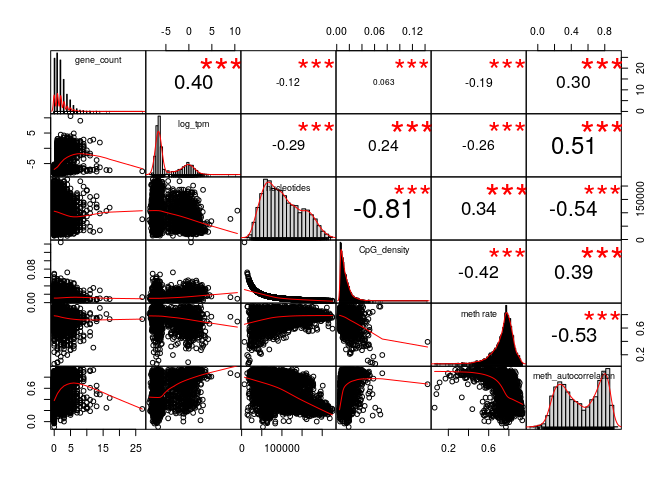
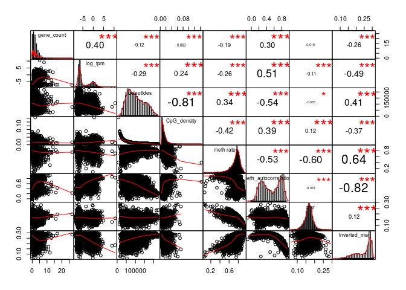
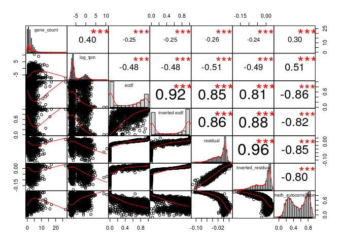
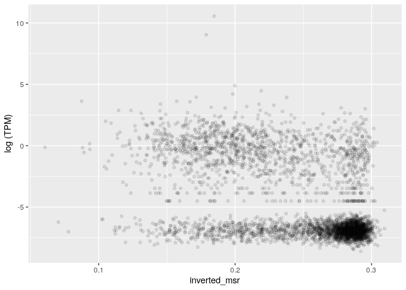
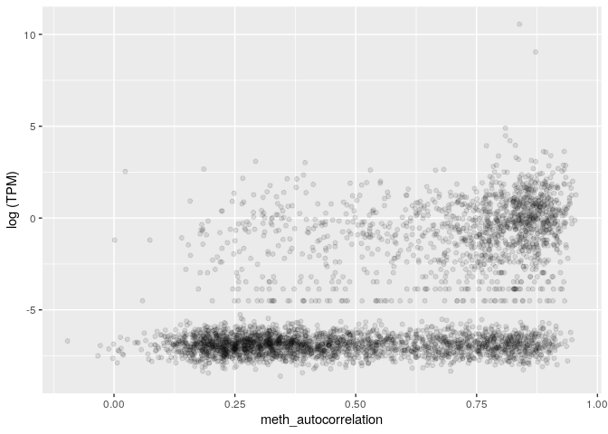
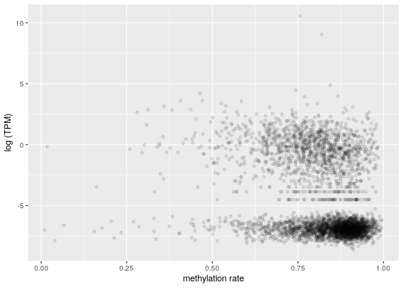
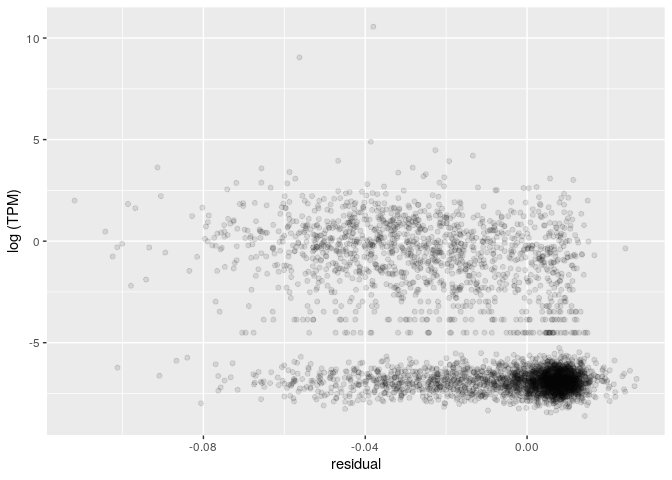

MSR and expression for stomach, windows of 1000 sites, extended genes set
================

The DataFrame is the following (excluding some columns for readability):

    ## 21 rows had too many nucleotides

    ##   start_chr start_position end_position gene_count total_TPM meth rate
    ## 2      chr1          88881       181138         18      4.36 0.8133116
    ## 3      chr1         181138       356081         10      0.00 0.7509289
    ## 6      chr1         535250       632769         14      6.68 0.7614178
    ## 7      chr1         632769       742325          7      5.36 0.7494013
    ## 8      chr1         742325       827393          8      0.25 0.7042525
    ## 9      chr1         827393       891580          3      0.00 0.6920191

###### Basic features:

###### Comparison with simple MSR statistics:

###### Comparison with other MSR statistics:

inverted msr vs log(tpm): 

    ## missing data:  2.073393 %

    ## 
    ## train_data_proportion:  0.2

Linear model for TPM with standard predictors, available information about genes:

    ## 
    ## Call:
    ## lm(formula = log_tpm ~ ., data = train_model_data[, standard_predictors])
    ## 
    ## Residuals:
    ##     Min      1Q  Median      3Q     Max 
    ## -7.4248 -1.8623 -0.1601  1.6196 15.8827 
    ## 
    ## Coefficients:
    ##                           Estimate Std. Error t value Pr(>|t|)    
    ## (Intercept)             -1.039e+01  5.197e-01 -20.000  < 2e-16 ***
    ## gene_count               3.406e-01  1.939e-02  17.565  < 2e-16 ***
    ## nucleotides             -5.606e-07  1.451e-06  -0.386    0.699    
    ## CpG_density              4.743e+01  8.537e+00   5.556 2.88e-08 ***
    ## `meth rate`              1.793e+00  4.309e-01   4.160 3.23e-05 ***
    ## meth_autocorrelation     4.683e+00  1.916e-01  24.434  < 2e-16 ***
    ## genes_nucleotides_count  1.794e-05  1.057e-06  16.969  < 2e-16 ***
    ## ---
    ## Signif. codes:  0 '***' 0.001 '**' 0.01 '*' 0.05 '.' 0.1 ' ' 1
    ## 
    ## Residual standard error: 2.54 on 5698 degrees of freedom
    ## Multiple R-squared:  0.3595, Adjusted R-squared:  0.3588 
    ## F-statistic:   533 on 6 and 5698 DF,  p-value: < 2.2e-16

    ## Test data R squared:  0.3674407

Linear model for TPM with all features and MSR statistics, available information about genes:

    ## 
    ## Call:
    ## lm(formula = log_tpm ~ ., data = train_model_data[, c(standard_predictors, 
    ##     msr_predictors)])
    ## 
    ## Residuals:
    ##     Min      1Q  Median      3Q     Max 
    ## -7.6850 -1.6548 -0.1527  1.4142 15.9675 
    ## 
    ## Coefficients:
    ##                           Estimate Std. Error t value Pr(>|t|)    
    ## (Intercept)             -3.705e+00  2.702e+00  -1.371 0.170306    
    ## gene_count               3.355e-01  1.922e-02  17.455  < 2e-16 ***
    ## nucleotides             -1.995e-06  1.470e-06  -1.357 0.174704    
    ## CpG_density              3.995e+01  8.634e+00   4.628 3.78e-06 ***
    ## `meth rate`              5.521e+00  1.756e+00   3.143 0.001680 ** 
    ## meth_autocorrelation     2.210e+00  3.498e-01   6.319 2.83e-10 ***
    ## genes_nucleotides_count  1.763e-05  1.047e-06  16.838  < 2e-16 ***
    ## msr                      1.743e+00  3.990e+00   0.437 0.662189    
    ## inverted_msr            -3.125e+01  1.350e+01  -2.315 0.020650 *  
    ## ecdf                     4.099e-01  2.689e-01   1.524 0.127450    
    ## `inverted ecdf`         -8.722e-01  2.633e-01  -3.313 0.000929 ***
    ## residual                -2.494e+01  8.161e+00  -3.056 0.002251 ** 
    ## inverted_residual        3.206e+01  1.431e+01   2.241 0.025062 *  
    ## ---
    ## Signif. codes:  0 '***' 0.001 '**' 0.01 '*' 0.05 '.' 0.1 ' ' 1
    ## 
    ## Residual standard error: 2.513 on 5692 degrees of freedom
    ## Multiple R-squared:  0.374,  Adjusted R-squared:  0.3727 
    ## F-statistic: 283.4 on 12 and 5692 DF,  p-value: < 2.2e-16

    ## Test data R squared:  0.3844789

Linear model for TPM with adding inverted msr, available information about genes:

    ## 
    ## Call:
    ## lm(formula = log_tpm ~ ., data = train_model_data[, c(standard_predictors, 
    ##     "inverted_msr")])
    ## 
    ## Residuals:
    ##    Min     1Q Median     3Q    Max 
    ## -7.379 -1.671 -0.146  1.432 16.186 
    ## 
    ## Coefficients:
    ##                           Estimate Std. Error t value Pr(>|t|)    
    ## (Intercept)             -6.864e+00  6.134e-01 -11.191  < 2e-16 ***
    ## gene_count               3.396e-01  1.920e-02  17.682  < 2e-16 ***
    ## nucleotides             -1.992e-06  1.443e-06  -1.380    0.168    
    ## CpG_density              4.374e+01  8.463e+00   5.169 2.44e-07 ***
    ## `meth rate`              3.497e+00  4.562e-01   7.665 2.09e-14 ***
    ## meth_autocorrelation     2.738e+00  2.642e-01  10.364  < 2e-16 ***
    ## genes_nucleotides_count  1.769e-05  1.047e-06  16.892  < 2e-16 ***
    ## inverted_msr            -1.427e+01  1.349e+00 -10.578  < 2e-16 ***
    ## ---
    ## Signif. codes:  0 '***' 0.001 '**' 0.01 '*' 0.05 '.' 0.1 ' ' 1
    ## 
    ## Residual standard error: 2.516 on 5697 degrees of freedom
    ## Multiple R-squared:  0.3718, Adjusted R-squared:  0.3711 
    ## F-statistic: 481.8 on 7 and 5697 DF,  p-value: < 2.2e-16

    ## Test data R squared:  0.3811723

Linear model for TPM with basic features but no information about genes:

    ## 
    ## Call:
    ## lm(formula = log_tpm ~ ., data = train_model_data[, c("log_tpm", 
    ##     basic_predictors)])
    ## 
    ## Residuals:
    ##     Min      1Q  Median      3Q     Max 
    ## -5.8146 -1.9318 -0.4161  1.9773 16.2535 
    ## 
    ## Coefficients:
    ##                        Estimate Std. Error t value Pr(>|t|)    
    ## (Intercept)          -9.924e+00  5.560e-01 -17.848  < 2e-16 ***
    ## nucleotides           1.602e-06  1.559e-06   1.028 0.304118    
    ## CpG_density           2.260e+01  9.200e+00   2.457 0.014058 *  
    ## `meth rate`           1.588e+00  4.622e-01   3.437 0.000592 ***
    ## meth_autocorrelation  6.451e+00  1.976e-01  32.648  < 2e-16 ***
    ## ---
    ## Signif. codes:  0 '***' 0.001 '**' 0.01 '*' 0.05 '.' 0.1 ' ' 1
    ## 
    ## Residual standard error: 2.75 on 5700 degrees of freedom
    ## Multiple R-squared:  0.2494, Adjusted R-squared:  0.2488 
    ## F-statistic: 473.4 on 4 and 5700 DF,  p-value: < 2.2e-16

    ## Test data R squared:  0.2634542

Linear model for TPM with all features but no information about genes:

    ## 
    ## Call:
    ## lm(formula = log_tpm ~ ., data = train_model_data[, c("log_tpm", 
    ##     basic_predictors, msr_predictors)])
    ## 
    ## Residuals:
    ##     Min      1Q  Median      3Q     Max 
    ## -6.7823 -1.6146 -0.4646  1.7478 16.2485 
    ## 
    ## Coefficients:
    ##                        Estimate Std. Error t value Pr(>|t|)    
    ## (Intercept)           7.016e-01  2.916e+00   0.241   0.8099    
    ## nucleotides           5.892e-07  1.577e-06   0.374   0.7086    
    ## CpG_density           1.526e+01  9.293e+00   1.643   0.1005    
    ## `meth rate`           9.640e+00  1.892e+00   5.094 3.62e-07 ***
    ## meth_autocorrelation  3.673e+00  3.742e-01   9.815  < 2e-16 ***
    ## msr                   7.438e+00  4.308e+00   1.727   0.0843 .  
    ## inverted_msr         -6.226e+01  1.455e+01  -4.278 1.92e-05 ***
    ## ecdf                  7.341e-01  2.904e-01   2.528   0.0115 *  
    ## `inverted ecdf`      -1.222e+00  2.843e-01  -4.300 1.73e-05 ***
    ## residual             -3.800e+01  8.808e+00  -4.314 1.63e-05 ***
    ## inverted_residual     6.700e+01  1.542e+01   4.346 1.41e-05 ***
    ## ---
    ## Signif. codes:  0 '***' 0.001 '**' 0.01 '*' 0.05 '.' 0.1 ' ' 1
    ## 
    ## Residual standard error: 2.716 on 5694 degrees of freedom
    ## Multiple R-squared:  0.2684, Adjusted R-squared:  0.2671 
    ## F-statistic: 208.8 on 10 and 5694 DF,  p-value: < 2.2e-16

    ## Test data R squared:  0.2853716

Linear model for TPM with inverted msr but no information about genes:

    ## 
    ## Call:
    ## lm(formula = log_tpm ~ ., data = train_model_data[, c("log_tpm", 
    ##     basic_predictors, "inverted_msr")])
    ## 
    ## Residuals:
    ##     Min      1Q  Median      3Q     Max 
    ## -6.5855 -1.6684 -0.4682  1.7521 16.5832 
    ## 
    ## Coefficients:
    ##                        Estimate Std. Error t value Pr(>|t|)    
    ## (Intercept)          -6.131e+00  6.589e-01  -9.306  < 2e-16 ***
    ## nucleotides           2.672e-08  1.551e-06   0.017   0.9863    
    ## CpG_density           1.885e+01  9.120e+00   2.066   0.0388 *  
    ## `meth rate`           3.412e+00  4.897e-01   6.967  3.6e-12 ***
    ## meth_autocorrelation  4.347e+00  2.803e-01  15.512  < 2e-16 ***
    ## inverted_msr         -1.531e+01  1.460e+00 -10.490  < 2e-16 ***
    ## ---
    ## Signif. codes:  0 '***' 0.001 '**' 0.01 '*' 0.05 '.' 0.1 ' ' 1
    ## 
    ## Residual standard error: 2.724 on 5699 degrees of freedom
    ## Multiple R-squared:  0.2636, Adjusted R-squared:  0.2629 
    ## F-statistic:   408 on 5 and 5699 DF,  p-value: < 2.2e-16

    ## Test data R squared:  0.2795629
