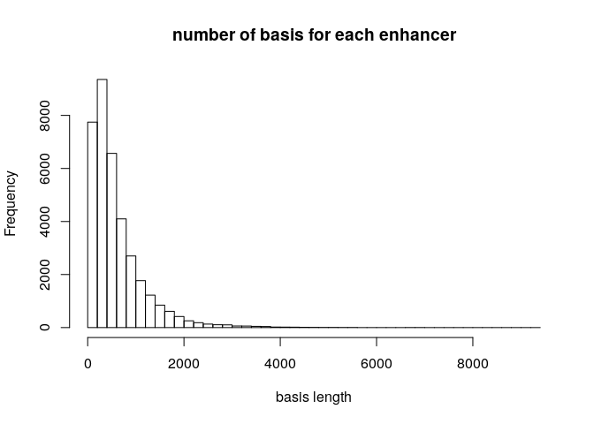
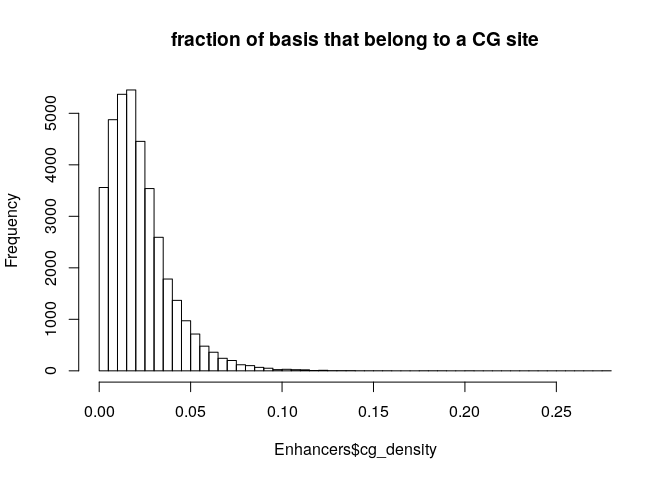
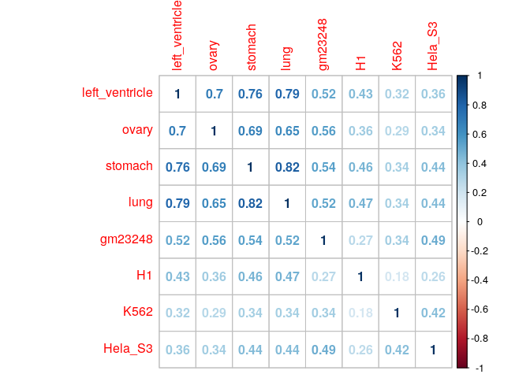
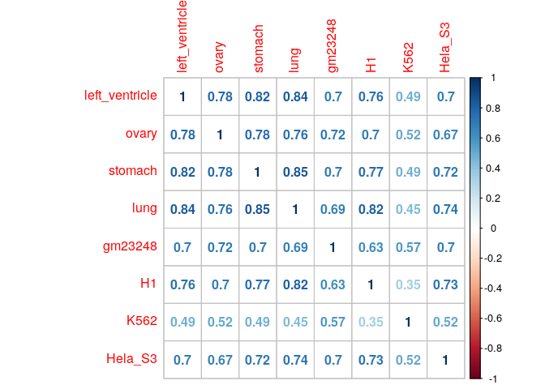
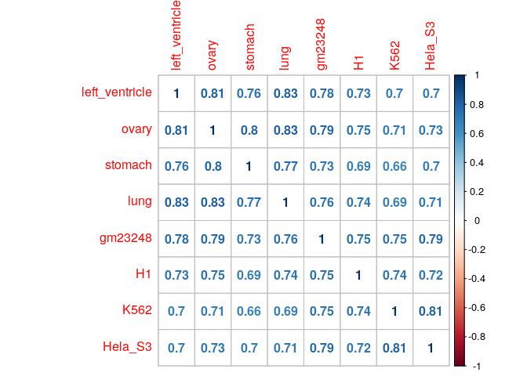

Enhancer study
================

Enhancers length distribution: 

CpG density distribution on Enhancers: 

Average CpG density on Enhancers:

    ## [1] 0.02272099

Methilation proportion correlation on Enhancers: 

Binaryzed Enhancers, proportion of equal enhancers: 

    ##                left_ventricle     ovary   stomach      lung   gm23248        H1
    ## left_ventricle      100.00000  78.45109  81.89880  83.57957  69.77489  75.83578
    ## ovary                78.45109 100.00000  77.78468  75.81645  71.89274  69.68612
    ## stomach              81.89880  77.78468 100.00000  85.15706  70.18421  76.71687
    ## lung                 83.57957  75.81645  85.15706 100.00000  68.85863  81.88696
    ## gm23248              69.77489  71.89274  70.18421  68.85863 100.00000  62.81354
    ## H1                   75.83578  69.68612  76.71687  81.88696  62.81354 100.00000
    ## K562                 48.86441  51.68073  48.53242  44.98189  57.29429  34.84880
    ## Hela_S3              69.78317  66.88544  71.81458  73.79928  69.90007  73.49444
    ##                     K562   Hela_S3
    ## left_ventricle  48.86441  69.78317
    ## ovary           51.68073  66.88544
    ## stomach         48.53242  71.81458
    ## lung            44.98189  73.79928
    ## gm23248         57.29429  69.90007
    ## H1              34.84880  73.49444
    ## K562           100.00000  51.93498
    ## Hela_S3         51.93498 100.00000

Correlation in gene expression ( log(TPM+1e-3) ): 
