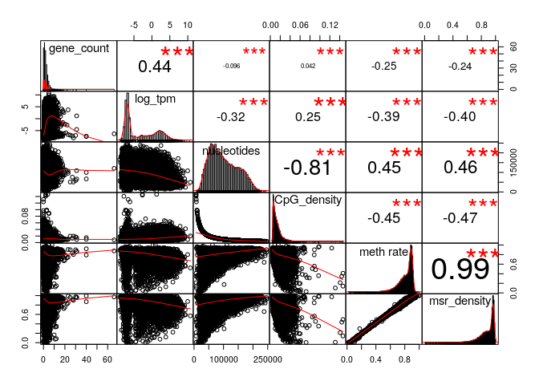
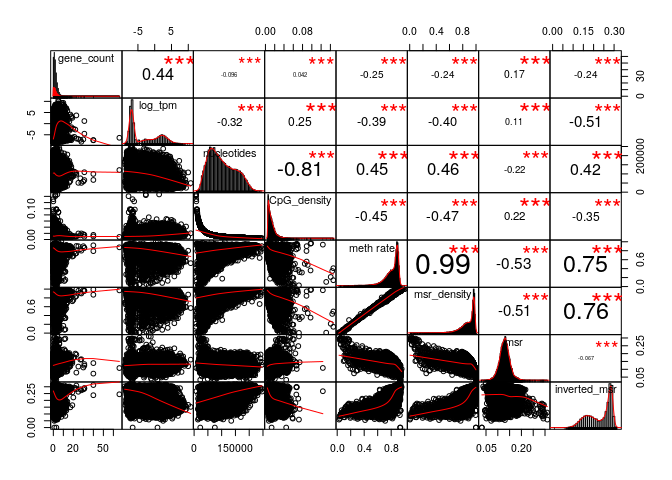
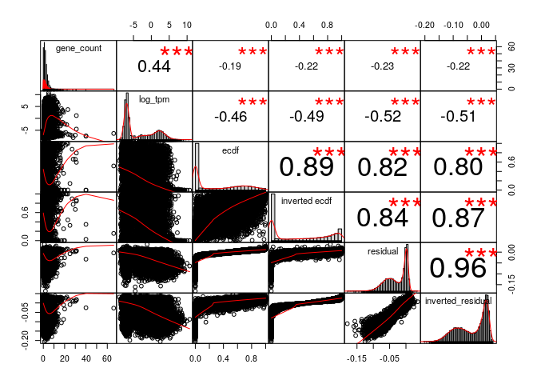
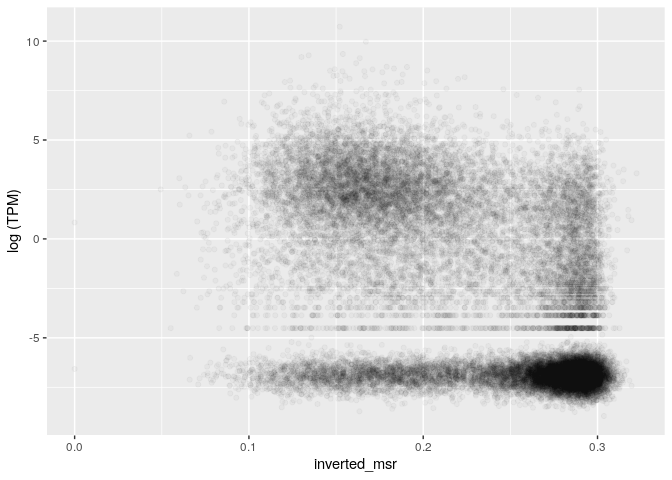
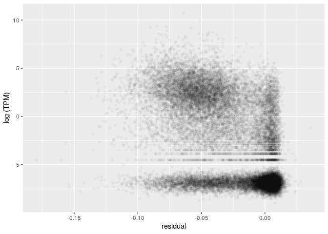
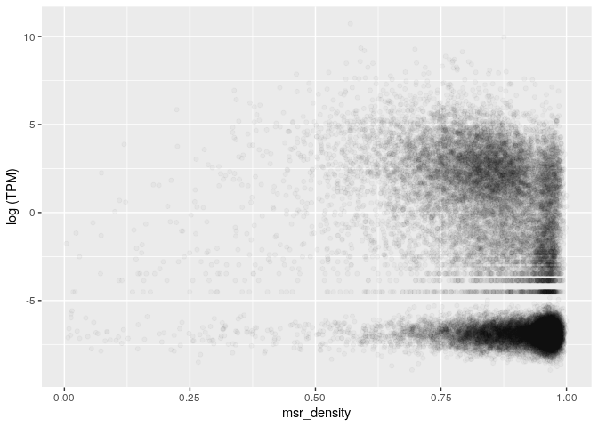
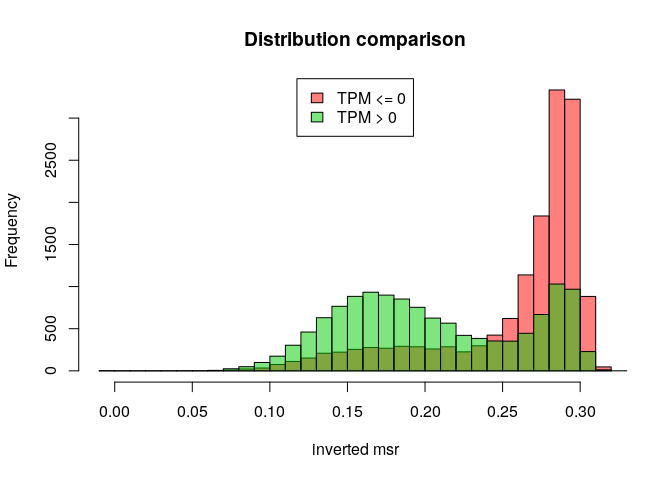
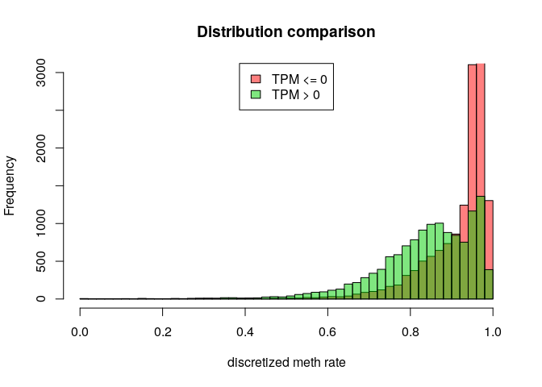
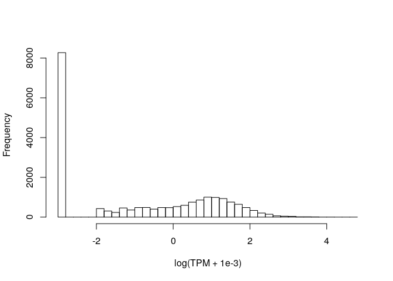

MSR and expression for H1, windows of 1000 sites, extended genes set
================

The DataFrame is the following (excluding some columns for readability):

    ## 21 rows had too many nucleotides

    ##    start_chr start_position end_position gene_count total_TPM meth rate
    ## 8       chr1         742325       827393          8      8.58 0.7437343
    ## 9       chr1         827393       891580          3      0.10 0.7831758
    ## 10      chr1         891580       921648          4      0.19 0.7042774
    ## 12      chr1         940826       961902          2     73.88 0.4715903
    ## 13      chr1         961902       982731          2      0.26 0.7012655
    ## 14      chr1         982731      1007283          3      2.42 0.4854497

The full scheme includes:

**nucleotides**: number of nucleotides in the window

**CpG density**: fraction of nucleotides that is a C of a CpG site (= 1000/nucleotides)

**meth rate**: ratio of methylated CpG sites

**gene\_count**: number of genes included (even partially) inside the interval

**total\_TPM**: sum of the TPMs of the genes in the interval

then the MSR and some related statistics: **msr**, **inverted msr**, **msr ecdf **, **inverted msr ecdf**, **residual** (residual of the linear regression between msr and meth rate), **inverted residual**.

First let's see if there are pairwise correlations between the features.

TPM for regions with 0 genes is considered 0.

###### Basic features:

###### Comparison with simple MSR statistics:

###### Comparison with other MSR statistics:

inverted msr vs log(tpm): 

    ## missing data:  10.69308 %

    ## 
    ## train_data_proportion:  0.2

The fraction of fragments that have TPM&gt;0 (train data)

    ## [1] 0.480492

Logistic Regression Model for TPM presence with basic predictors (nucleotides, CpG\_density, meth rate, msr\_density):

    ## TRAIN DATA

    ## accuracy:  0.7122814

    ## TEST DATA

    ## accuracy:  0.7105655

Logistic Regression Model with inverted\_msr as predictor

    ## TRAIN DATA

    ## accuracy:  0.734384

    ## TEST DATA

    ## accuracy:  0.7270936

Logistic Regression Model with all predictors

    ## TRAIN DATA

    ## accuracy:  0.7407265

    ## TEST DATA

    ## accuracy:  0.7345409

#### Predicting log(TPM)

Distribution of TPM values (only for regions that contains some genes) 

Linear model for TPM with standard predictors, available information about genes:

    ## 
    ## Call:
    ## lm(formula = log_tpm ~ ., data = train_model_data[, standard_predictors])
    ## 
    ## Residuals:
    ##      Min       1Q   Median       3Q      Max 
    ## -17.3886  -2.3666  -0.2572   2.5550  13.0902 
    ## 
    ## Coefficients:
    ##                           Estimate Std. Error t value Pr(>|t|)    
    ## (Intercept)              4.460e+00  5.721e-01   7.797 7.63e-15 ***
    ## gene_count               4.972e-01  2.527e-02  19.673  < 2e-16 ***
    ## nucleotides             -2.696e-05  1.968e-06 -13.697  < 2e-16 ***
    ## CpG_density             -2.654e+01  1.268e+01  -2.094   0.0363 *  
    ## `meth rate`              4.190e+01  4.418e+00   9.483  < 2e-16 ***
    ## msr_density             -4.608e+01  4.051e+00 -11.374  < 2e-16 ***
    ## genes_nucleotides_count  3.904e-05  1.502e-06  25.992  < 2e-16 ***
    ## ---
    ## Signif. codes:  0 '***' 0.001 '**' 0.01 '*' 0.05 '.' 0.1 ' ' 1
    ## 
    ## Residual standard error: 3.427 on 5196 degrees of freedom
    ## Multiple R-squared:  0.3989, Adjusted R-squared:  0.3982 
    ## F-statistic: 574.7 on 6 and 5196 DF,  p-value: < 2.2e-16

    ## Test data R squared:  0.3976208

Linear model for TPM with all features and MSR statistics, available information about genes:

    ## 
    ## Call:
    ## lm(formula = log_tpm ~ ., data = train_model_data[, c(standard_predictors, 
    ##     msr_predictors)])
    ## 
    ## Residuals:
    ##      Min       1Q   Median       3Q      Max 
    ## -15.6222  -2.0210  -0.0024   2.1935  11.9308 
    ## 
    ## Coefficients:
    ##                           Estimate Std. Error t value Pr(>|t|)    
    ## (Intercept)             -1.953e+01  3.832e+00  -5.098 3.55e-07 ***
    ## gene_count               4.775e-01  2.412e-02  19.796  < 2e-16 ***
    ## nucleotides             -1.188e-05  1.986e-06  -5.981 2.37e-09 ***
    ## CpG_density              3.285e+01  1.237e+01   2.655 0.007961 ** 
    ## `meth rate`              3.581e+01  4.349e+00   8.235 2.25e-16 ***
    ## msr_density             -3.101e+01  4.749e+00  -6.529 7.26e-11 ***
    ## genes_nucleotides_count  3.276e-05  1.449e-06  22.600  < 2e-16 ***
    ## msr                      2.291e+01  4.309e+00   5.316 1.11e-07 ***
    ## inverted_msr             3.801e+01  2.194e+01   1.732 0.083310 .  
    ## ecdf                    -2.743e-01  3.758e-01  -0.730 0.465496    
    ## `inverted ecdf`         -1.292e+00  3.510e-01  -3.683 0.000233 ***
    ## residual                -4.862e+01  8.165e+00  -5.955 2.78e-09 ***
    ## inverted_residual       -3.675e+01  2.280e+01  -1.612 0.107031    
    ## ---
    ## Signif. codes:  0 '***' 0.001 '**' 0.01 '*' 0.05 '.' 0.1 ' ' 1
    ## 
    ## Residual standard error: 3.242 on 5190 degrees of freedom
    ## Multiple R-squared:  0.4625, Adjusted R-squared:  0.4613 
    ## F-statistic: 372.2 on 12 and 5190 DF,  p-value: < 2.2e-16

    ## Test data R squared:  0.4530734

Linear model for TPM with adding inverted msr, available information about genes:

    ## 
    ## Call:
    ## lm(formula = log_tpm ~ ., data = train_model_data[, c(standard_predictors, 
    ##     "inverted_msr")])
    ## 
    ## Residuals:
    ##      Min       1Q   Median       3Q      Max 
    ## -16.8231  -2.0685  -0.1134   2.2674  12.8766 
    ## 
    ## Coefficients:
    ##                           Estimate Std. Error t value Pr(>|t|)    
    ## (Intercept)              4.832e-01  5.790e-01   0.835   0.4040    
    ## gene_count               4.951e-01  2.423e-02  20.437  < 2e-16 ***
    ## nucleotides             -1.610e-05  1.954e-06  -8.243  < 2e-16 ***
    ## CpG_density              3.001e+01  1.244e+01   2.413   0.0159 *  
    ## `meth rate`              2.888e+01  4.279e+00   6.748 1.66e-11 ***
    ## msr_density             -2.466e+01  4.010e+00  -6.149 8.37e-10 ***
    ## genes_nucleotides_count  3.343e-05  1.464e-06  22.839  < 2e-16 ***
    ## inverted_msr            -2.572e+01  1.201e+00 -21.422  < 2e-16 ***
    ## ---
    ## Signif. codes:  0 '***' 0.001 '**' 0.01 '*' 0.05 '.' 0.1 ' ' 1
    ## 
    ## Residual standard error: 3.285 on 5195 degrees of freedom
    ## Multiple R-squared:  0.4477, Adjusted R-squared:  0.4469 
    ## F-statistic: 601.5 on 7 and 5195 DF,  p-value: < 2.2e-16

    ## Test data R squared:  0.4403672

Linear model for TPM with basic features but no information about genes:

    ## 
    ## Call:
    ## lm(formula = log_tpm ~ ., data = train_model_data[, c("log_tpm", 
    ##     basic_predictors)])
    ## 
    ## Residuals:
    ##     Min      1Q  Median      3Q     Max 
    ## -15.956  -3.095  -1.015   3.519  11.687 
    ## 
    ## Coefficients:
    ##               Estimate Std. Error t value Pr(>|t|)    
    ## (Intercept)  1.203e+01  6.176e-01  19.485  < 2e-16 ***
    ## nucleotides -3.201e-05  2.252e-06 -14.216  < 2e-16 ***
    ## CpG_density -1.026e+02  1.440e+01  -7.125 1.19e-12 ***
    ## `meth rate`  3.343e+01  5.064e+00   6.603 4.45e-11 ***
    ## msr_density -4.285e+01  4.649e+00  -9.219  < 2e-16 ***
    ## ---
    ## Signif. codes:  0 '***' 0.001 '**' 0.01 '*' 0.05 '.' 0.1 ' ' 1
    ## 
    ## Residual standard error: 3.935 on 5198 degrees of freedom
    ## Multiple R-squared:  0.207,  Adjusted R-squared:  0.2063 
    ## F-statistic: 339.1 on 4 and 5198 DF,  p-value: < 2.2e-16

    ## Test data R squared:  0.2071402

Linear model for TPM with all features but no information about genes:

    ## 
    ## Call:
    ## lm(formula = log_tpm ~ ., data = train_model_data[, c("log_tpm", 
    ##     basic_predictors, msr_predictors)])
    ## 
    ## Residuals:
    ##     Min      1Q  Median      3Q     Max 
    ## -9.6610 -2.1925 -0.5285  2.8574 10.9630 
    ## 
    ## Coefficients:
    ##                     Estimate Std. Error t value Pr(>|t|)    
    ## (Intercept)       -1.732e+01  4.314e+00  -4.014 6.05e-05 ***
    ## nucleotides       -1.186e-05  2.231e-06  -5.313 1.12e-07 ***
    ## CpG_density       -1.237e+01  1.388e+01  -0.891 0.372858    
    ## `meth rate`        2.793e+01  4.895e+00   5.706 1.22e-08 ***
    ## msr_density       -2.064e+01  5.343e+00  -3.863 0.000113 ***
    ## msr                3.775e+01  4.821e+00   7.830 5.86e-15 ***
    ## inverted_msr       1.974e+01  2.471e+01   0.799 0.424595    
    ## ecdf              -1.475e-01  4.225e-01  -0.349 0.726995    
    ## `inverted ecdf`   -1.646e+00  3.952e-01  -4.164 3.18e-05 ***
    ## residual          -6.669e+01  9.183e+00  -7.262 4.38e-13 ***
    ## inverted_residual -1.989e+01  2.568e+01  -0.774 0.438683    
    ## ---
    ## Signif. codes:  0 '***' 0.001 '**' 0.01 '*' 0.05 '.' 0.1 ' ' 1
    ## 
    ## Residual standard error: 3.654 on 5192 degrees of freedom
    ## Multiple R-squared:  0.317,  Adjusted R-squared:  0.3157 
    ## F-statistic:   241 on 10 and 5192 DF,  p-value: < 2.2e-16

    ## Test data R squared:  0.3077898

Linear model for TPM with inverted msr but no information about genes:

    ## 
    ## Call:
    ## lm(formula = log_tpm ~ ., data = train_model_data[, c("log_tpm", 
    ##     basic_predictors, "inverted_msr")])
    ## 
    ## Residuals:
    ##     Min      1Q  Median      3Q     Max 
    ## -10.087  -2.402  -0.705   2.967  11.600 
    ## 
    ## Coefficients:
    ##                Estimate Std. Error t value Pr(>|t|)    
    ## (Intercept)   6.162e+00  6.291e-01   9.794  < 2e-16 ***
    ## nucleotides  -1.766e-05  2.204e-06  -8.012 1.38e-15 ***
    ## CpG_density  -1.993e+01  1.400e+01  -1.424 0.154528    
    ## `meth rate`   1.706e+01  4.829e+00   3.532 0.000416 ***
    ## msr_density  -1.514e+01  4.530e+00  -3.342 0.000837 ***
    ## inverted_msr -3.332e+01  1.333e+00 -24.993  < 2e-16 ***
    ## ---
    ## Signif. codes:  0 '***' 0.001 '**' 0.01 '*' 0.05 '.' 0.1 ' ' 1
    ## 
    ## Residual standard error: 3.718 on 5197 degrees of freedom
    ## Multiple R-squared:  0.292,  Adjusted R-squared:  0.2914 
    ## F-statistic: 428.8 on 5 and 5197 DF,  p-value: < 2.2e-16

    ## Test data R squared:  0.2835502
