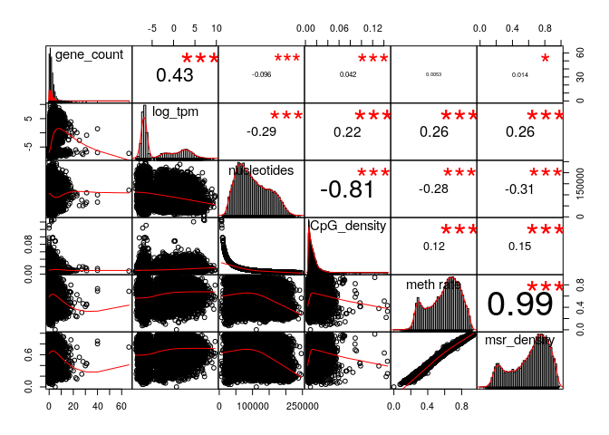
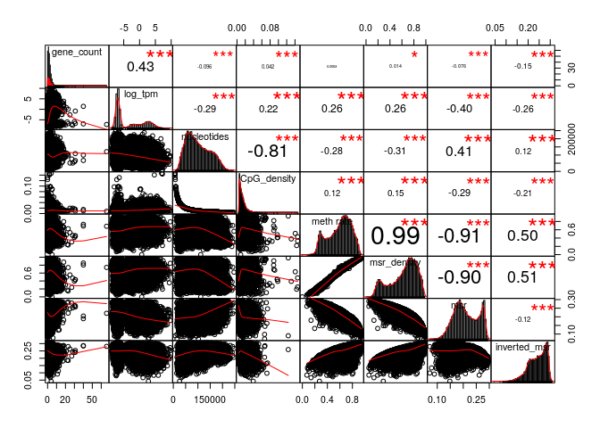
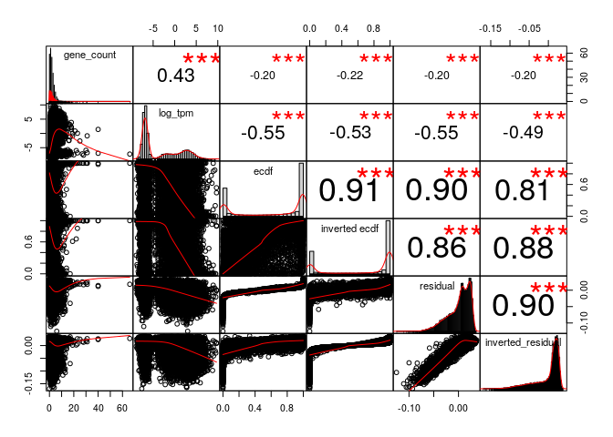
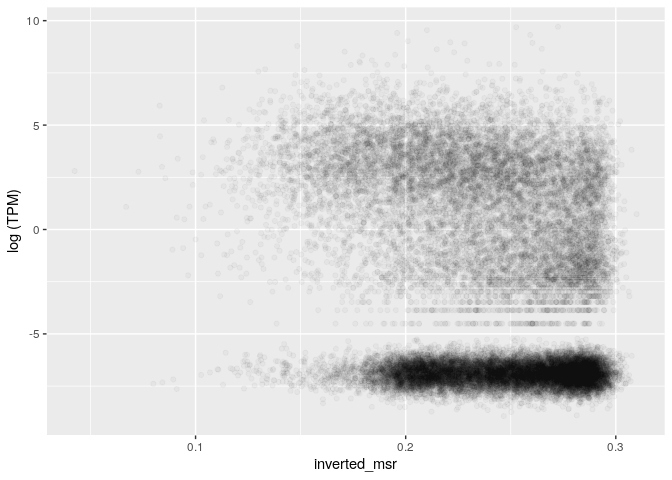
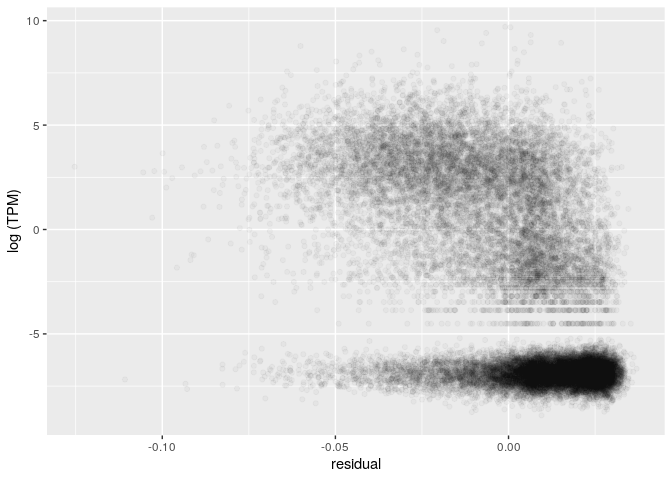
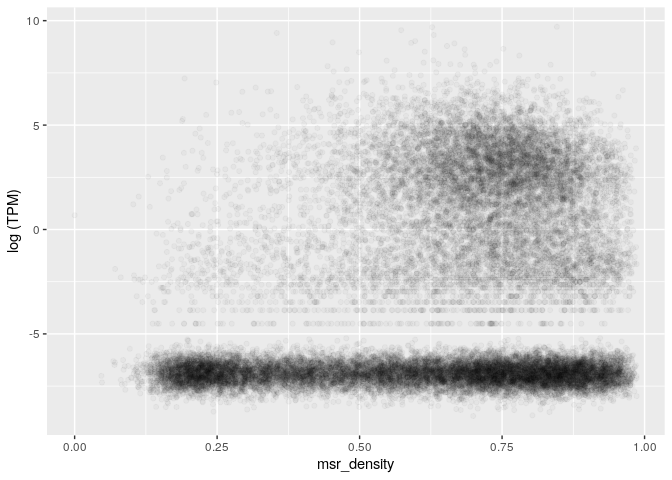
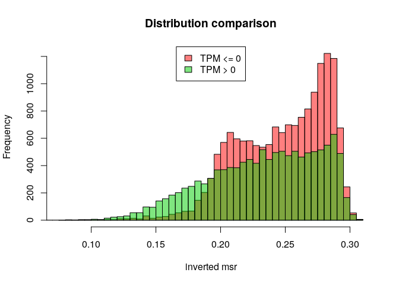
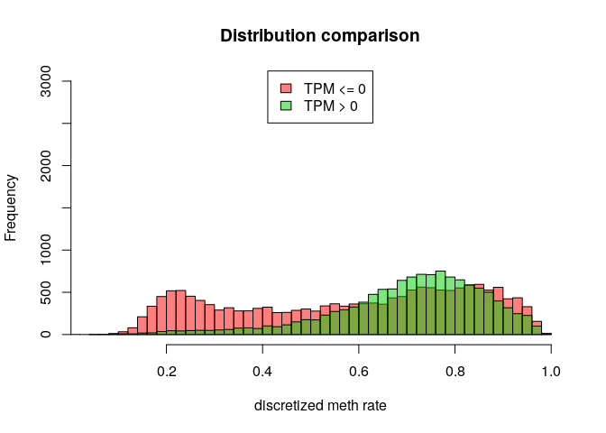
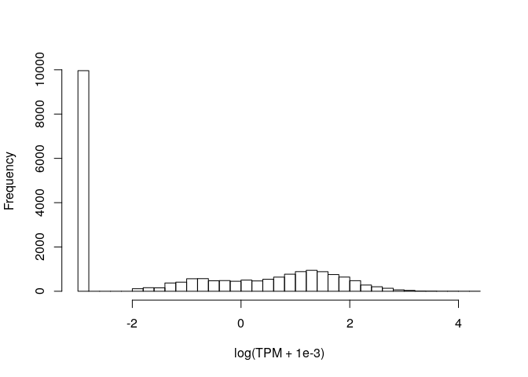

MSR and expression for gm23248, windows of 1000 sites, extended genes set
================

The DataFrame is the following (excluding some columns for readability):

    ## 21 rows had too many nucleotides

    ##    start_chr start_position end_position gene_count total_TPM meth rate
    ## 8       chr1         742325       827393          8     13.82 0.7004203
    ## 9       chr1         827393       891580          3      1.51 0.6156760
    ## 10      chr1         891580       921648          4      2.64 0.5181516
    ## 12      chr1         940826       961902          2     55.61 0.4359565
    ## 13      chr1         961902       982731          2      1.68 0.6481908
    ## 14      chr1         982731      1007283          3      3.24 0.3828651

The full scheme includes:

**nucleotides**: number of nucleotides in the window

**CpG density**: fraction of nucleotides that is a C of a CpG site (= 1000/nucleotides)

**meth rate**: ratio of methylated CpG sites

**gene\_count**: number of genes included (even partially) inside the interval

**total\_TPM**: sum of the TPMs of the genes in the interval

then the MSR and some related statistics: **msr**, **inverted msr**, **msr ecdf **, **inverted msr ecdf**, **residual** (residual of the linear regression between msr and meth rate), **inverted residual**.

First let's see if there are pairwise correlations between the features.

TPM for regions with 0 genes is considered 0.

###### Basic features:

###### Comparison with simple MSR statistics:

###### Comparison with other MSR statistics:

inverted msr vs log(tpm): 

    ## missing data:  4.212008 %

    ## 
    ## train_data_proportion:  0.2

The fraction of fragments that have TPM&gt;0 (train data)

    ## [1] 0.437276

Logistic Regression Model for TPM presence with basic predictors (nucleotides, CpG\_density, meth rate, msr\_density):

    ## TRAIN DATA

    ## accuracy:  0.6344086

    ## TEST DATA

    ## accuracy:  0.6407902

Logistic Regression Model with inverted\_msr as predictor

    ## TRAIN DATA

    ## accuracy:  0.5817204

    ## TEST DATA

    ## accuracy:  0.5961745

Logistic Regression Model with all predictors

    ## TRAIN DATA

    ## accuracy:  0.7439068

    ## TEST DATA

    ## accuracy:  0.739742

#### Predicting log(TPM)

Distribution of TPM values (only for regions that contains some genes) 

Linear model for TPM with standard predictors, available information about genes:

    ## 
    ## Call:
    ## lm(formula = log_tpm ~ ., data = train_model_data[, standard_predictors])
    ## 
    ## Residuals:
    ##      Min       1Q   Median       3Q      Max 
    ## -28.6495  -2.7130  -0.3218   2.6564  11.1013 
    ## 
    ## Coefficients:
    ##                           Estimate Std. Error t value Pr(>|t|)    
    ## (Intercept)             -6.858e+00  4.849e-01 -14.142  < 2e-16 ***
    ## gene_count               6.457e-01  2.665e-02  24.231  < 2e-16 ***
    ## nucleotides             -1.823e-05  2.114e-06  -8.620  < 2e-16 ***
    ## CpG_density              4.734e+01  1.276e+01   3.711 0.000208 ***
    ## `meth rate`              7.972e+00  2.515e+00   3.170 0.001531 ** 
    ## msr_density             -3.336e+00  2.075e+00  -1.608 0.107862    
    ## genes_nucleotides_count  3.311e-05  1.519e-06  21.802  < 2e-16 ***
    ## ---
    ## Signif. codes:  0 '***' 0.001 '**' 0.01 '*' 0.05 '.' 0.1 ' ' 1
    ## 
    ## Residual standard error: 3.676 on 5573 degrees of freedom
    ## Multiple R-squared:  0.3402, Adjusted R-squared:  0.3395 
    ## F-statistic: 478.9 on 6 and 5573 DF,  p-value: < 2.2e-16

    ## Test data R squared:  0.3536359

Linear model for TPM with all features and MSR statistics, available information about genes:

    ## 
    ## Call:
    ## lm(formula = log_tpm ~ ., data = train_model_data[, c(standard_predictors, 
    ##     msr_predictors)])
    ## 
    ## Residuals:
    ##      Min       1Q   Median       3Q      Max 
    ## -21.5228  -1.9332  -0.2511   2.0372  11.6326 
    ## 
    ## Coefficients:
    ##                           Estimate Std. Error t value Pr(>|t|)    
    ## (Intercept)             -2.174e+01  2.921e+00  -7.442 1.14e-13 ***
    ## gene_count               5.317e-01  2.411e-02  22.056  < 2e-16 ***
    ## nucleotides             -3.744e-06  1.958e-06  -1.912  0.05591 .  
    ## CpG_density              6.831e+00  1.182e+01   0.578  0.56330    
    ## `meth rate`              1.835e+01  3.207e+00   5.722 1.11e-08 ***
    ## msr_density             -1.332e+01  3.233e+00  -4.120 3.84e-05 ***
    ## genes_nucleotides_count  2.428e-05  1.384e-06  17.543  < 2e-16 ***
    ## msr                      3.449e+01  6.464e+00   5.336 9.89e-08 ***
    ## inverted_msr             3.873e+01  1.547e+01   2.504  0.01232 *  
    ## ecdf                    -1.030e+00  3.691e-01  -2.789  0.00531 ** 
    ## `inverted ecdf`         -2.082e+00  3.512e-01  -5.929 3.24e-09 ***
    ## residual                -8.724e+01  1.112e+01  -7.843 5.22e-15 ***
    ## inverted_residual       -2.275e+01  1.586e+01  -1.435  0.15142    
    ## ---
    ## Signif. codes:  0 '***' 0.001 '**' 0.01 '*' 0.05 '.' 0.1 ' ' 1
    ## 
    ## Residual standard error: 3.296 on 5567 degrees of freedom
    ## Multiple R-squared:  0.4702, Adjusted R-squared:  0.4691 
    ## F-statistic: 411.7 on 12 and 5567 DF,  p-value: < 2.2e-16

    ## Test data R squared:  0.4653177

Linear model for TPM with adding inverted msr, available information about genes:

    ## 
    ## Call:
    ## lm(formula = log_tpm ~ ., data = train_model_data[, c(standard_predictors, 
    ##     "inverted_msr")])
    ## 
    ## Residuals:
    ##     Min      1Q  Median      3Q     Max 
    ## -24.705  -2.234  -0.291   2.187  11.149 
    ## 
    ## Coefficients:
    ##                           Estimate Std. Error t value Pr(>|t|)    
    ## (Intercept)              2.064e+00  5.347e-01   3.859 0.000115 ***
    ## gene_count               5.607e-01  2.481e-02  22.602  < 2e-16 ***
    ## nucleotides             -1.110e-05  1.970e-06  -5.634 1.84e-08 ***
    ## CpG_density              4.557e+00  1.188e+01   0.383 0.701387    
    ## `meth rate`             -1.599e+00  2.347e+00  -0.681 0.495798    
    ## msr_density              9.247e+00  1.963e+00   4.711 2.52e-06 ***
    ## genes_nucleotides_count  2.700e-05  1.419e-06  19.027  < 2e-16 ***
    ## inverted_msr            -4.547e+01  1.483e+00 -30.652  < 2e-16 ***
    ## ---
    ## Signif. codes:  0 '***' 0.001 '**' 0.01 '*' 0.05 '.' 0.1 ' ' 1
    ## 
    ## Residual standard error: 3.401 on 5572 degrees of freedom
    ## Multiple R-squared:  0.4354, Adjusted R-squared:  0.4347 
    ## F-statistic: 613.9 on 7 and 5572 DF,  p-value: < 2.2e-16

    ## Test data R squared:  0.4420708

Linear model for TPM with basic features but no information about genes:

    ## 
    ## Call:
    ## lm(formula = log_tpm ~ ., data = train_model_data[, c("log_tpm", 
    ##     basic_predictors)])
    ## 
    ## Residuals:
    ##    Min     1Q Median     3Q    Max 
    ## -7.364 -3.701 -0.871  3.916 12.675 
    ## 
    ## Coefficients:
    ##               Estimate Std. Error t value Pr(>|t|)    
    ## (Intercept) -2.998e+00  5.444e-01  -5.507 3.81e-08 ***
    ## nucleotides -2.491e-05  2.414e-06 -10.321  < 2e-16 ***
    ## CpG_density -8.563e+00  1.461e+01  -0.586    0.558    
    ## `meth rate`  1.647e+00  2.888e+00   0.570    0.569    
    ## msr_density  2.282e+00  2.383e+00   0.958    0.338    
    ## ---
    ## Signif. codes:  0 '***' 0.001 '**' 0.01 '*' 0.05 '.' 0.1 ' ' 1
    ## 
    ## Residual standard error: 4.233 on 5575 degrees of freedom
    ## Multiple R-squared:  0.1249, Adjusted R-squared:  0.1243 
    ## F-statistic:   199 on 4 and 5575 DF,  p-value: < 2.2e-16

    ## Test data R squared:  0.1301106

Linear model for TPM with all features but no information about genes:

    ## 
    ## Call:
    ## lm(formula = log_tpm ~ ., data = train_model_data[, c("log_tpm", 
    ##     basic_predictors, msr_predictors)])
    ## 
    ## Residuals:
    ##      Min       1Q   Median       3Q      Max 
    ## -10.1560  -2.2312  -0.7932   2.6174  12.7405 
    ## 
    ## Coefficients:
    ##                     Estimate Std. Error t value Pr(>|t|)    
    ## (Intercept)       -2.406e+01  3.236e+00  -7.436 1.20e-13 ***
    ## nucleotides       -5.069e-06  2.158e-06  -2.349 0.018856 *  
    ## CpG_density       -4.495e+01  1.301e+01  -3.456 0.000552 ***
    ## `meth rate`        1.785e+01  3.553e+00   5.023 5.24e-07 ***
    ## msr_density       -1.348e+01  3.585e+00  -3.761 0.000171 ***
    ## msr                4.516e+01  7.153e+00   6.314 2.93e-10 ***
    ## inverted_msr       5.321e+01  1.715e+01   3.103 0.001923 ** 
    ## ecdf              -9.359e-01  4.094e-01  -2.286 0.022277 *  
    ## `inverted ecdf`   -2.789e+00  3.888e-01  -7.174 8.24e-13 ***
    ## residual          -1.239e+02  1.227e+01 -10.098  < 2e-16 ***
    ## inverted_residual -2.753e+01  1.758e+01  -1.566 0.117488    
    ## ---
    ## Signif. codes:  0 '***' 0.001 '**' 0.01 '*' 0.05 '.' 0.1 ' ' 1
    ## 
    ## Residual standard error: 3.656 on 5569 degrees of freedom
    ## Multiple R-squared:  0.3482, Adjusted R-squared:  0.347 
    ## F-statistic: 297.4 on 10 and 5569 DF,  p-value: < 2.2e-16

    ## Test data R squared:  0.3362135

Linear model for TPM with inverted msr but no information about genes:

    ## 
    ## Call:
    ## lm(formula = log_tpm ~ ., data = train_model_data[, c("log_tpm", 
    ##     basic_predictors, "inverted_msr")])
    ## 
    ## Residuals:
    ##      Min       1Q   Median       3Q      Max 
    ## -12.5902  -2.6754  -0.8974   2.9189  13.2341 
    ## 
    ## Coefficients:
    ##                Estimate Std. Error t value Pr(>|t|)    
    ## (Intercept)   7.717e+00  5.737e-01  13.452  < 2e-16 ***
    ## nucleotides  -1.465e-05  2.193e-06  -6.681 2.61e-11 ***
    ## CpG_density  -5.210e+01  1.322e+01  -3.942 8.17e-05 ***
    ## `meth rate`  -9.441e+00  2.620e+00  -3.603 0.000317 ***
    ## msr_density   1.733e+01  2.187e+00   7.922 2.80e-15 ***
    ## inverted_msr -5.827e+01  1.619e+00 -36.000  < 2e-16 ***
    ## ---
    ## Signif. codes:  0 '***' 0.001 '**' 0.01 '*' 0.05 '.' 0.1 ' ' 1
    ## 
    ## Residual standard error: 3.813 on 5574 degrees of freedom
    ## Multiple R-squared:   0.29,  Adjusted R-squared:  0.2894 
    ## F-statistic: 455.3 on 5 and 5574 DF,  p-value: < 2.2e-16

    ## Test data R squared:  0.2900602
