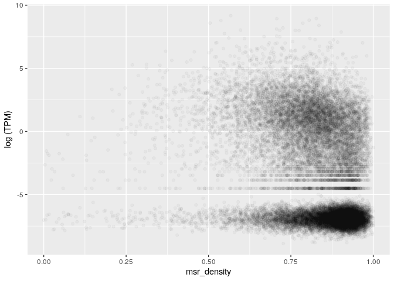

MSR and expression for heart left ventricle, windows of 1000 sites, extended genes set
================

The DataFrame is the following (excluding some columns for readability):

    ## 21 rows had too many nucleotides

    ##    start_chr start_position end_position gene_count total_TPM meth rate
    ## 8       chr1         742325       827393          8     19.46 0.6926883
    ## 9       chr1         827393       891580          3      0.03 0.6604949
    ## 10      chr1         891580       921648          4      0.06 0.5515606
    ## 12      chr1         940826       961902          2     16.12 0.4330459
    ## 13      chr1         961902       982731          2     94.04 0.6091376
    ## 14      chr1         982731      1007283          3      8.32 0.4504092

The full scheme includes:

**nucleotides**: number of nucleotides in the window

**CpG density**: fraction of nucleotides that is a C of a CpG site (= 1000/nucleotides)

**meth rate**: ratio of methylated CpG sites

**gene\_count**: number of genes included (even partially) inside the interval

**total\_TPM**: sum of the TPMs of the genes in the interval

then the MSR and some related statistics: **msr**, **inverted msr**, **msr ecdf **, **inverted msr ecdf**, **residual** (residual of the linear regression between msr and meth rate), **inverted residual**.

First let's see if there are pairwise correlations between the features.

TPM for regions with 0 genes is considered 0.

###### Basic features:

###### Comparison with simple MSR statistics:

###### Comparison with other MSR statistics:

inverted msr vs log(tpm): 

    ## missing data:  6.985685 %

    ## 
    ## train_data_proportion:  0.2

The fraction of fragments that have at least TPM (train data)

    ## [1] 0.442148

Logistic Regression Model for TPM presence with basic predictors (nucleotides, CpG\_density, meth rate, msr\_density):

    ## TRAIN DATA

    ## accuracy:  0.7115704

    ## TEST DATA

    ## accuracy:  0.7060018

Logistic Regression Model with inverted\_msr as predictor

    ## TRAIN DATA

    ## accuracy:  0.7331611

    ## TEST DATA

    ## accuracy:  0.7308207

Logistic Regression Model with all predictors

    ## TRAIN DATA

    ## accuracy:  0.7477394

    ## TEST DATA

    ## accuracy:  0.7460442

#### Predicting log(TPM)

Distribution of TPM values (only for regions that contains some genes) 

Linear model for TPM with standard predictors, available information about genes:

    ## 
    ## Call:
    ## lm(formula = log_tpm ~ ., data = train_model_data[, standard_predictors])
    ## 
    ## Residuals:
    ##      Min       1Q   Median       3Q      Max 
    ## -13.3018  -2.1344  -0.0812   2.0120  13.4825 
    ## 
    ## Coefficients:
    ##                           Estimate Std. Error t value Pr(>|t|)    
    ## (Intercept)             -1.565e+00  4.976e-01  -3.145  0.00167 ** 
    ## gene_count               5.228e-01  2.429e-02  21.523  < 2e-16 ***
    ## nucleotides             -8.776e-06  1.781e-06  -4.928 8.53e-07 ***
    ## CpG_density              4.639e+01  1.084e+01   4.278 1.92e-05 ***
    ## `meth rate`              3.195e+01  1.844e+00  17.324  < 2e-16 ***
    ## msr_density             -3.328e+01  1.704e+00 -19.526  < 2e-16 ***
    ## genes_nucleotides_count  2.570e-05  1.273e-06  20.190  < 2e-16 ***
    ## ---
    ## Signif. codes:  0 '***' 0.001 '**' 0.01 '*' 0.05 '.' 0.1 ' ' 1
    ## 
    ## Residual standard error: 2.999 on 5412 degrees of freedom
    ## Multiple R-squared:  0.4015, Adjusted R-squared:  0.4009 
    ## F-statistic: 605.2 on 6 and 5412 DF,  p-value: < 2.2e-16

    ## Test data R squared:  0.3862089

Linear model for TPM with all features and MSR statistics, available information about genes:

    ## 
    ## Call:
    ## lm(formula = log_tpm ~ ., data = train_model_data[, c(standard_predictors, 
    ##     msr_predictors)])
    ## 
    ## Residuals:
    ##      Min       1Q   Median       3Q      Max 
    ## -10.2028  -1.7813  -0.0501   1.7280  13.0946 
    ## 
    ## Coefficients:
    ##                           Estimate Std. Error t value Pr(>|t|)    
    ## (Intercept)             -3.237e+01  4.451e+00  -7.272 4.03e-13 ***
    ## gene_count               4.871e-01  2.334e-02  20.876  < 2e-16 ***
    ## nucleotides             -1.262e-06  1.795e-06  -0.703 0.482128    
    ## CpG_density              6.209e+01  1.089e+01   5.700 1.26e-08 ***
    ## `meth rate`              2.328e+01  2.143e+00  10.863  < 2e-16 ***
    ## msr_density             -2.176e+01  3.039e+00  -7.161 9.11e-13 ***
    ## genes_nucleotides_count  2.146e-05  1.233e-06  17.405  < 2e-16 ***
    ## msr                      2.765e+01  4.209e+00   6.570 5.49e-11 ***
    ## inverted_msr             8.536e+01  2.375e+01   3.594 0.000329 ***
    ## ecdf                     6.567e-01  2.887e-01   2.275 0.022970 *  
    ## `inverted ecdf`         -1.720e+00  2.894e-01  -5.943 2.97e-09 ***
    ## residual                -6.842e+01  7.794e+00  -8.778  < 2e-16 ***
    ## inverted_residual       -7.512e+01  2.415e+01  -3.110 0.001879 ** 
    ## ---
    ## Signif. codes:  0 '***' 0.001 '**' 0.01 '*' 0.05 '.' 0.1 ' ' 1
    ## 
    ## Residual standard error: 2.86 on 5406 degrees of freedom
    ## Multiple R-squared:  0.4562, Adjusted R-squared:  0.455 
    ## F-statistic: 377.9 on 12 and 5406 DF,  p-value: < 2.2e-16

    ## Test data R squared:  0.4375678

Linear model for TPM with adding inverted msr, available information about genes:

    ## 
    ## Call:
    ## lm(formula = log_tpm ~ ., data = train_model_data[, c(standard_predictors, 
    ##     "inverted_msr")])
    ## 
    ## Residuals:
    ##      Min       1Q   Median       3Q      Max 
    ## -10.7198  -1.8597  -0.1163   1.8452  12.8724 
    ## 
    ## Coefficients:
    ##                           Estimate Std. Error t value Pr(>|t|)    
    ## (Intercept)             -2.484e+00  4.847e-01  -5.126 3.07e-07 ***
    ## gene_count               5.173e-01  2.354e-02  21.975  < 2e-16 ***
    ## nucleotides             -5.882e-06  1.732e-06  -3.395 0.000691 ***
    ## CpG_density              5.111e+01  1.051e+01   4.863 1.19e-06 ***
    ## `meth rate`              2.019e+01  1.893e+00  10.665  < 2e-16 ***
    ## msr_density             -1.572e+01  1.897e+00  -8.287  < 2e-16 ***
    ## genes_nucleotides_count  2.250e-05  1.245e-06  18.073  < 2e-16 ***
    ## inverted_msr            -2.158e+01  1.148e+00 -18.795  < 2e-16 ***
    ## ---
    ## Signif. codes:  0 '***' 0.001 '**' 0.01 '*' 0.05 '.' 0.1 ' ' 1
    ## 
    ## Residual standard error: 2.906 on 5411 degrees of freedom
    ## Multiple R-squared:  0.4382, Adjusted R-squared:  0.4375 
    ## F-statistic:   603 on 7 and 5411 DF,  p-value: < 2.2e-16

    ## Test data R squared:  0.41952

Linear model for TPM with basic features but no information about genes:

    ## 
    ## Call:
    ## lm(formula = log_tpm ~ ., data = train_model_data[, c("log_tpm", 
    ##     basic_predictors)])
    ## 
    ## Residuals:
    ##     Min      1Q  Median      3Q     Max 
    ## -12.759  -2.648  -0.398   2.732  13.343 
    ## 
    ## Coefficients:
    ##               Estimate Std. Error t value Pr(>|t|)    
    ## (Intercept)  3.686e+00  5.357e-01   6.880 6.67e-12 ***
    ## nucleotides -9.695e-06  1.999e-06  -4.849 1.27e-06 ***
    ## CpG_density -6.335e+00  1.212e+01  -0.523    0.601    
    ## `meth rate`  4.431e+01  2.042e+00  21.698  < 2e-16 ***
    ## msr_density -4.775e+01  1.871e+00 -25.514  < 2e-16 ***
    ## ---
    ## Signif. codes:  0 '***' 0.001 '**' 0.01 '*' 0.05 '.' 0.1 ' ' 1
    ## 
    ## Residual standard error: 3.38 on 5414 degrees of freedom
    ## Multiple R-squared:  0.2396, Adjusted R-squared:  0.239 
    ## F-statistic: 426.4 on 4 and 5414 DF,  p-value: < 2.2e-16

    ## Test data R squared:  0.225543

Linear model for TPM with all features but no information about genes:

    ## 
    ## Call:
    ## lm(formula = log_tpm ~ ., data = train_model_data[, c("log_tpm", 
    ##     basic_predictors, msr_predictors)])
    ## 
    ## Residuals:
    ##      Min       1Q   Median       3Q      Max 
    ## -12.7165  -1.9213  -0.3793   2.2594  12.9511 
    ## 
    ## Coefficients:
    ##                     Estimate Std. Error t value Pr(>|t|)    
    ## (Intercept)       -3.315e+01  4.923e+00  -6.735 1.81e-11 ***
    ## nucleotides       -8.594e-08  1.975e-06  -0.044  0.96530    
    ## CpG_density        2.173e+01  1.198e+01   1.813  0.06989 .  
    ## `meth rate`        3.201e+01  2.354e+00  13.602  < 2e-16 ***
    ## msr_density       -2.843e+01  3.354e+00  -8.475  < 2e-16 ***
    ## msr                3.970e+01  4.640e+00   8.555  < 2e-16 ***
    ## inverted_msr       8.464e+01  2.626e+01   3.224  0.00127 ** 
    ## ecdf               1.075e+00  3.183e-01   3.376  0.00074 ***
    ## `inverted ecdf`   -2.654e+00  3.186e-01  -8.330  < 2e-16 ***
    ## residual          -9.740e+01  8.567e+00 -11.368  < 2e-16 ***
    ## inverted_residual -6.572e+01  2.671e+01  -2.461  0.01389 *  
    ## ---
    ## Signif. codes:  0 '***' 0.001 '**' 0.01 '*' 0.05 '.' 0.1 ' ' 1
    ## 
    ## Residual standard error: 3.164 on 5408 degrees of freedom
    ## Multiple R-squared:  0.3342, Adjusted R-squared:  0.333 
    ## F-statistic: 271.5 on 10 and 5408 DF,  p-value: < 2.2e-16

    ## Test data R squared:  0.3157559

Linear model for TPM with inverted msr but no information about genes:

    ## 
    ## Call:
    ## lm(formula = log_tpm ~ ., data = train_model_data[, c("log_tpm", 
    ##     basic_predictors, "inverted_msr")])
    ## 
    ## Residuals:
    ##     Min      1Q  Median      3Q     Max 
    ## -9.4384 -2.1773 -0.4779  2.3541 12.6044 
    ## 
    ## Coefficients:
    ##                Estimate Std. Error t value Pr(>|t|)    
    ## (Intercept)   2.198e+00  5.192e-01   4.234 2.34e-05 ***
    ## nucleotides  -6.259e-06  1.927e-06  -3.249  0.00117 ** 
    ## CpG_density   4.163e+00  1.165e+01   0.357  0.72083    
    ## `meth rate`   2.834e+01  2.099e+00  13.507  < 2e-16 ***
    ## msr_density  -2.440e+01  2.103e+00 -11.606  < 2e-16 ***
    ## inverted_msr -2.709e+01  1.267e+00 -21.388  < 2e-16 ***
    ## ---
    ## Signif. codes:  0 '***' 0.001 '**' 0.01 '*' 0.05 '.' 0.1 ' ' 1
    ## 
    ## Residual standard error: 3.246 on 5413 degrees of freedom
    ## Multiple R-squared:  0.2988, Adjusted R-squared:  0.2982 
    ## F-statistic: 461.3 on 5 and 5413 DF,  p-value: < 2.2e-16

    ## Test data R squared:  0.2829946
