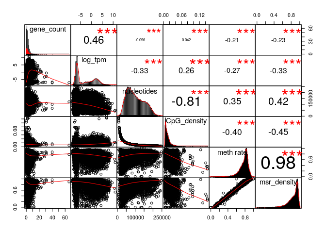
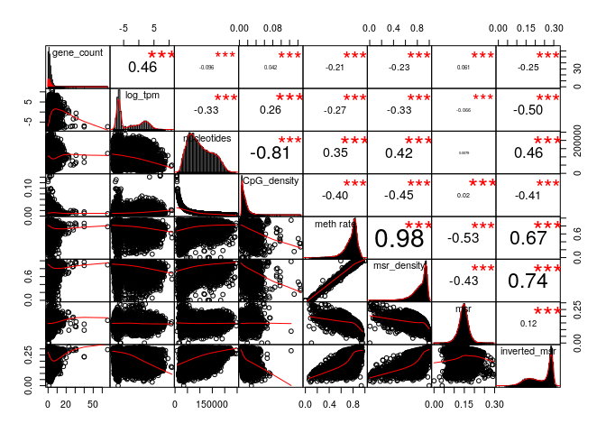
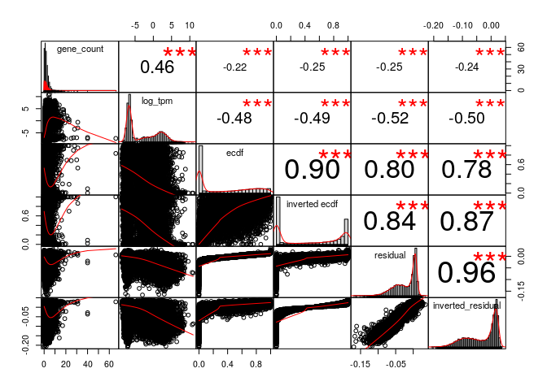
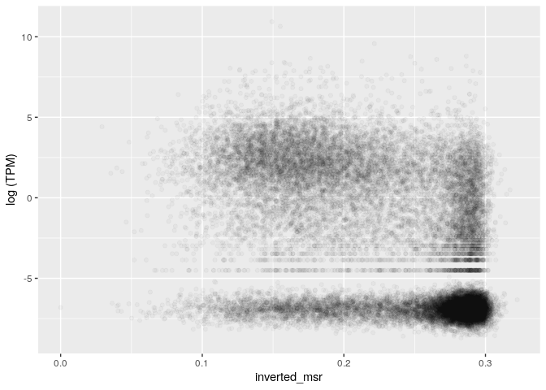
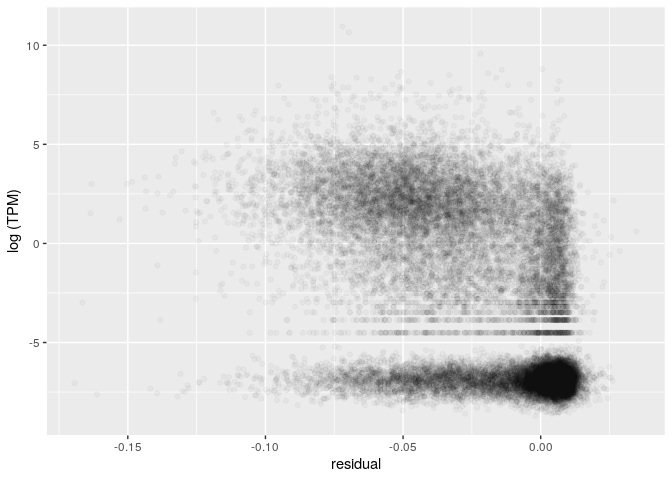
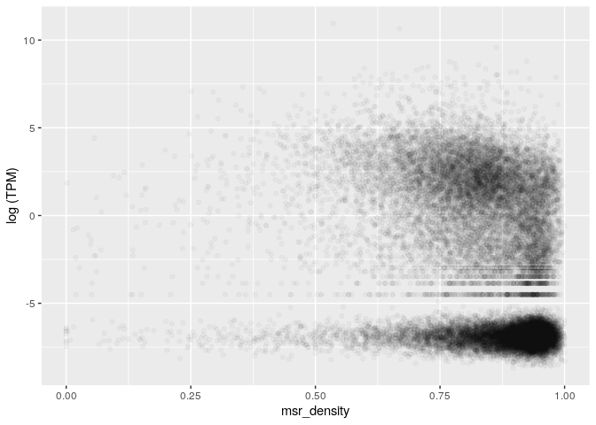
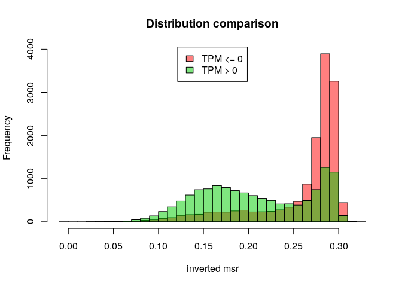
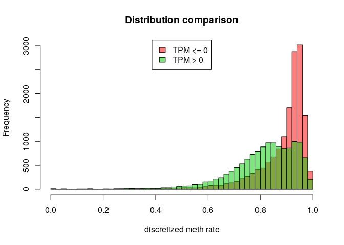
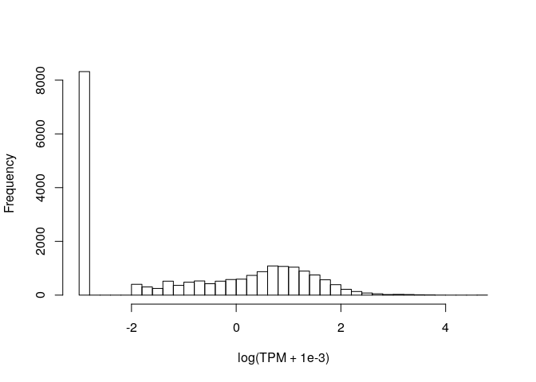

MSR and expression for lung, windows of 1000 sites, extended genes set
================

The DataFrame is the following (excluding some columns for readability):

    ## 21 rows had too many nucleotides

    ##    start_chr start_position end_position gene_count total_TPM meth rate
    ## 8       chr1         742325       827393          8      8.34 0.7046637
    ## 9       chr1         827393       891580          3      0.00 0.7007728
    ## 10      chr1         891580       921648          4      0.35 0.5013244
    ## 12      chr1         940826       961902          2     52.11 0.4380840
    ## 13      chr1         961902       982731          2      1.63 0.6650541
    ## 14      chr1         982731      1007283          3     19.61 0.4254677

The full scheme includes:

**nucleotides**: number of nucleotides in the window

**CpG density**: fraction of nucleotides that is a C of a CpG site (= 1000/nucleotides)

**meth rate**: ratio of methylated CpG sites

**gene\_count**: number of genes included (even partially) inside the interval

**total\_TPM**: sum of the TPMs of the genes in the interval

then the MSR and some related statistics: **msr**, **inverted msr**, **msr ecdf **, **inverted msr ecdf**, **residual** (residual of the linear regression between msr and meth rate), **inverted residual**.

First let's see if there are pairwise correlations between the features.

TPM for regions with 0 genes is considered 0.

###### Basic features:

###### Comparison with simple MSR statistics:

###### Comparison with other MSR statistics:

inverted msr vs log(tpm): 

    ## missing data:  8.077306 %

    ## 
    ## train_data_proportion:  0.2

The fraction of fragments that have TPM&gt;0 (train data)

    ## [1] 0.4892624

Logistic Regression Model for TPM presence with basic predictors (nucleotides, CpG\_density, meth rate, msr\_density):

    ## TRAIN DATA

    ## accuracy:  0.7096172

    ## TEST DATA

    ## accuracy:  0.7073706

Logistic Regression Model with inverted\_msr as predictor

    ## TRAIN DATA

    ## accuracy:  0.7236228

    ## TEST DATA

    ## accuracy:  0.7252486

Logistic Regression Model with all predictors

    ## TRAIN DATA

    ## accuracy:  0.7361345

    ## TEST DATA

    ## accuracy:  0.7339775

#### Predicting log(TPM)

Distribution of TPM values (only for regions that contains some genes) 

Linear model for TPM with standard predictors, available information about genes:

    ## 
    ## Call:
    ## lm(formula = log_tpm ~ ., data = train_model_data[, standard_predictors])
    ## 
    ## Residuals:
    ##      Min       1Q   Median       3Q      Max 
    ## -23.0566  -2.2865  -0.0557   2.2841  14.5478 
    ## 
    ## Coefficients:
    ##                           Estimate Std. Error t value Pr(>|t|)    
    ## (Intercept)             -7.687e-02  5.418e-01  -0.142  0.88719    
    ## gene_count               5.297e-01  2.440e-02  21.712  < 2e-16 ***
    ## nucleotides             -1.578e-05  1.846e-06  -8.549  < 2e-16 ***
    ## CpG_density              3.292e+01  1.151e+01   2.862  0.00423 ** 
    ## `meth rate`              3.568e+01  2.287e+00  15.602  < 2e-16 ***
    ## msr_density             -3.681e+01  2.041e+00 -18.037  < 2e-16 ***
    ## genes_nucleotides_count  3.455e-05  1.404e-06  24.603  < 2e-16 ***
    ## ---
    ## Signif. codes:  0 '***' 0.001 '**' 0.01 '*' 0.05 '.' 0.1 ' ' 1
    ## 
    ## Residual standard error: 3.236 on 5348 degrees of freedom
    ## Multiple R-squared:  0.4299, Adjusted R-squared:  0.4292 
    ## F-statistic: 672.1 on 6 and 5348 DF,  p-value: < 2.2e-16

    ## Test data R squared:  0.4273292

Linear model for TPM with all features and MSR statistics, available information about genes:

    ## 
    ## Call:
    ## lm(formula = log_tpm ~ ., data = train_model_data[, c(standard_predictors, 
    ##     msr_predictors)])
    ## 
    ## Residuals:
    ##      Min       1Q   Median       3Q      Max 
    ## -22.1915  -1.9661  -0.0569   2.0500  14.6522 
    ## 
    ## Coefficients:
    ##                           Estimate Std. Error t value Pr(>|t|)    
    ## (Intercept)             -3.404e+01  7.011e+00  -4.855 1.24e-06 ***
    ## gene_count               5.020e-01  2.362e-02  21.250  < 2e-16 ***
    ## nucleotides             -7.495e-06  1.921e-06  -3.902 9.68e-05 ***
    ## CpG_density              5.008e+01  1.177e+01   4.255 2.13e-05 ***
    ## `meth rate`              2.632e+01  2.665e+00   9.875  < 2e-16 ***
    ## msr_density             -2.646e+01  4.509e+00  -5.869 4.64e-09 ***
    ## genes_nucleotides_count  2.994e-05  1.374e-06  21.798  < 2e-16 ***
    ## msr                      2.535e+01  4.356e+00   5.818 6.30e-09 ***
    ## inverted_msr             1.035e+02  3.729e+01   2.777  0.00551 ** 
    ## ecdf                     3.276e-01  3.239e-01   1.011  0.31193    
    ## `inverted ecdf`         -1.282e+00  3.162e-01  -4.054 5.10e-05 ***
    ## residual                -6.830e+01  8.041e+00  -8.494  < 2e-16 ***
    ## inverted_residual       -9.257e+01  3.767e+01  -2.458  0.01402 *  
    ## ---
    ## Signif. codes:  0 '***' 0.001 '**' 0.01 '*' 0.05 '.' 0.1 ' ' 1
    ## 
    ## Residual standard error: 3.115 on 5342 degrees of freedom
    ## Multiple R-squared:  0.4724, Adjusted R-squared:  0.4713 
    ## F-statistic: 398.7 on 12 and 5342 DF,  p-value: < 2.2e-16

    ## Test data R squared:  0.4688948

Linear model for TPM with adding inverted msr, available information about genes:

    ## 
    ## Call:
    ## lm(formula = log_tpm ~ ., data = train_model_data[, c(standard_predictors, 
    ##     "inverted_msr")])
    ## 
    ## Residuals:
    ##      Min       1Q   Median       3Q      Max 
    ## -23.8529  -2.0433  -0.0949   2.1230  14.7165 
    ## 
    ## Coefficients:
    ##                           Estimate Std. Error t value Pr(>|t|)    
    ## (Intercept)             -1.360e+00  5.332e-01  -2.552   0.0108 *  
    ## gene_count               5.294e-01  2.377e-02  22.274  < 2e-16 ***
    ## nucleotides             -1.201e-05  1.812e-06  -6.626 3.78e-11 ***
    ## CpG_density              4.573e+01  1.123e+01   4.071 4.74e-05 ***
    ## `meth rate`              2.242e+01  2.360e+00   9.499  < 2e-16 ***
    ## msr_density             -1.826e+01  2.268e+00  -8.050 1.01e-15 ***
    ## genes_nucleotides_count  3.104e-05  1.384e-06  22.436  < 2e-16 ***
    ## inverted_msr            -2.019e+01  1.188e+00 -16.992  < 2e-16 ***
    ## ---
    ## Signif. codes:  0 '***' 0.001 '**' 0.01 '*' 0.05 '.' 0.1 ' ' 1
    ## 
    ## Residual standard error: 3.152 on 5347 degrees of freedom
    ## Multiple R-squared:  0.4591, Adjusted R-squared:  0.4584 
    ## F-statistic: 648.3 on 7 and 5347 DF,  p-value: < 2.2e-16

    ## Test data R squared:  0.453669

Linear model for TPM with basic features but no information about genes:

    ## 
    ## Call:
    ## lm(formula = log_tpm ~ ., data = train_model_data[, c("log_tpm", 
    ##     basic_predictors)])
    ## 
    ## Residuals:
    ##      Min       1Q   Median       3Q      Max 
    ## -16.3294  -2.8602  -0.5437   3.1583  13.5228 
    ## 
    ## Coefficients:
    ##               Estimate Std. Error t value Pr(>|t|)    
    ## (Intercept)  5.779e+00  5.956e-01   9.702  < 2e-16 ***
    ## nucleotides -1.644e-05  2.108e-06  -7.800 7.38e-15 ***
    ## CpG_density -2.722e+01  1.308e+01  -2.081   0.0374 *  
    ## `meth rate`  5.211e+01  2.572e+00  20.263  < 2e-16 ***
    ## msr_density -5.523e+01  2.276e+00 -24.262  < 2e-16 ***
    ## ---
    ## Signif. codes:  0 '***' 0.001 '**' 0.01 '*' 0.05 '.' 0.1 ' ' 1
    ## 
    ## Residual standard error: 3.71 on 5350 degrees of freedom
    ## Multiple R-squared:  0.2505, Adjusted R-squared:  0.2499 
    ## F-statistic: 446.9 on 4 and 5350 DF,  p-value: < 2.2e-16

    ## Test data R squared:  0.237616

Linear model for TPM with all features but no information about genes:

    ## 
    ## Call:
    ## lm(formula = log_tpm ~ ., data = train_model_data[, c("log_tpm", 
    ##     basic_predictors, msr_predictors)])
    ## 
    ## Residuals:
    ##      Min       1Q   Median       3Q      Max 
    ## -12.5774  -2.1870  -0.5355   2.6885  13.8114 
    ## 
    ## Coefficients:
    ##                     Estimate Std. Error t value Pr(>|t|)    
    ## (Intercept)       -3.422e+01  7.886e+00  -4.340 1.45e-05 ***
    ## nucleotides       -4.694e-06  2.148e-06  -2.185   0.0289 *  
    ## CpG_density        6.512e+00  1.318e+01   0.494   0.6212    
    ## `meth rate`        3.846e+01  2.974e+00  12.934  < 2e-16 ***
    ## msr_density       -3.392e+01  5.067e+00  -6.693 2.41e-11 ***
    ## msr                4.226e+01  4.875e+00   8.669  < 2e-16 ***
    ## inverted_msr       9.038e+01  4.193e+01   2.155   0.0312 *  
    ## ecdf               4.490e-01  3.638e-01   1.234   0.2172    
    ## `inverted ecdf`   -1.935e+00  3.548e-01  -5.452 5.20e-08 ***
    ## residual          -1.041e+02  8.980e+00 -11.589  < 2e-16 ***
    ## inverted_residual -7.060e+01  4.236e+01  -1.667   0.0956 .  
    ## ---
    ## Signif. codes:  0 '***' 0.001 '**' 0.01 '*' 0.05 '.' 0.1 ' ' 1
    ## 
    ## Residual standard error: 3.504 on 5344 degrees of freedom
    ## Multiple R-squared:  0.3321, Adjusted R-squared:  0.3308 
    ## F-statistic: 265.7 on 10 and 5344 DF,  p-value: < 2.2e-16

    ## Test data R squared:  0.3193102

Linear model for TPM with inverted msr but no information about genes:

    ## 
    ## Call:
    ## lm(formula = log_tpm ~ ., data = train_model_data[, c("log_tpm", 
    ##     basic_predictors, "inverted_msr")])
    ## 
    ## Residuals:
    ##      Min       1Q   Median       3Q      Max 
    ## -10.6955  -2.4169  -0.6218   2.8105  13.8415 
    ## 
    ## Coefficients:
    ##                Estimate Std. Error t value Pr(>|t|)    
    ## (Intercept)   3.779e+00  5.837e-01   6.474 1.04e-10 ***
    ## nucleotides  -1.176e-05  2.048e-06  -5.743 9.80e-09 ***
    ## CpG_density  -5.769e+00  1.267e+01  -0.455    0.649    
    ## `meth rate`   3.322e+01  2.659e+00  12.493  < 2e-16 ***
    ## msr_density  -2.937e+01  2.556e+00 -11.493  < 2e-16 ***
    ## inverted_msr -2.641e+01  1.332e+00 -19.821  < 2e-16 ***
    ## ---
    ## Signif. codes:  0 '***' 0.001 '**' 0.01 '*' 0.05 '.' 0.1 ' ' 1
    ## 
    ## Residual standard error: 3.581 on 5349 degrees of freedom
    ## Multiple R-squared:  0.3018, Adjusted R-squared:  0.3011 
    ## F-statistic: 462.3 on 5 and 5349 DF,  p-value: < 2.2e-16

    ## Test data R squared:  0.2861754
