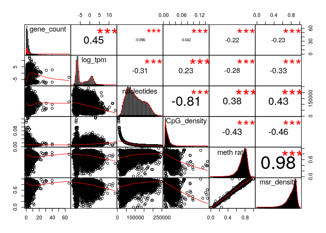
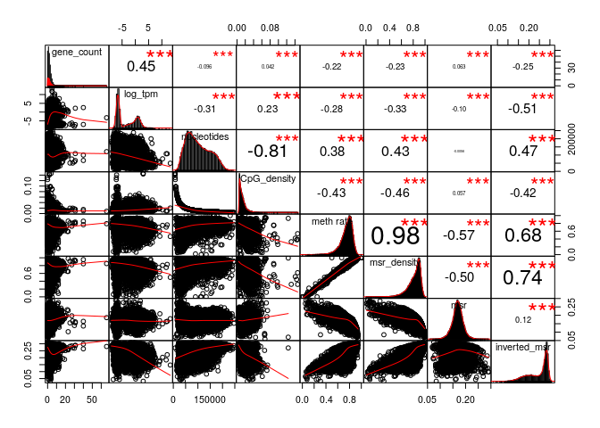
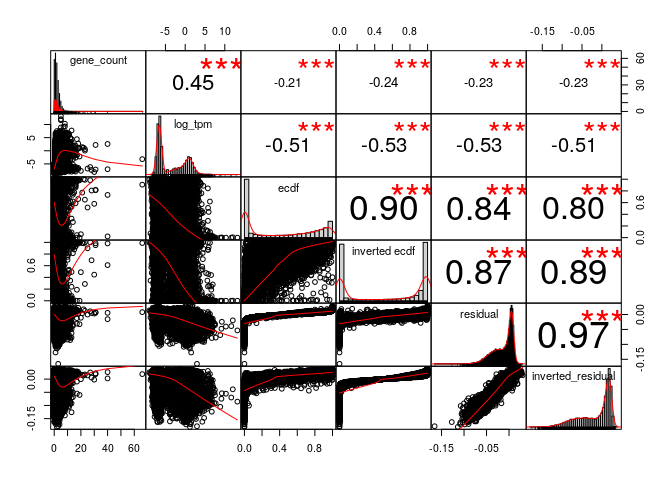
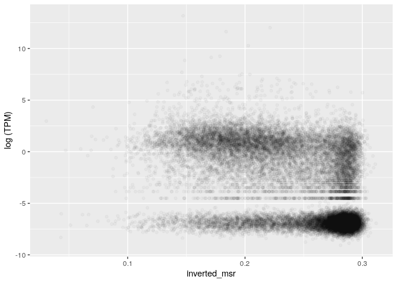
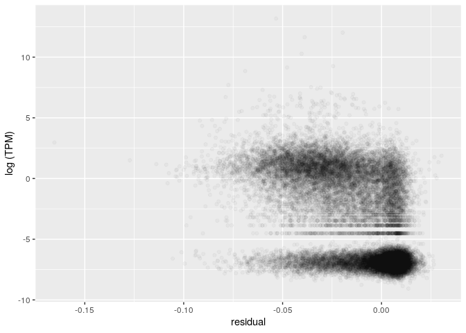
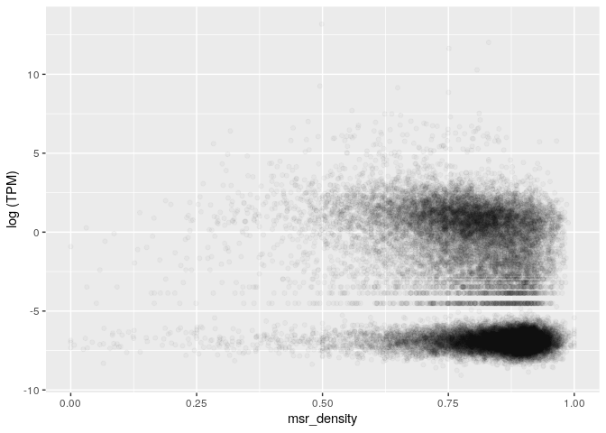
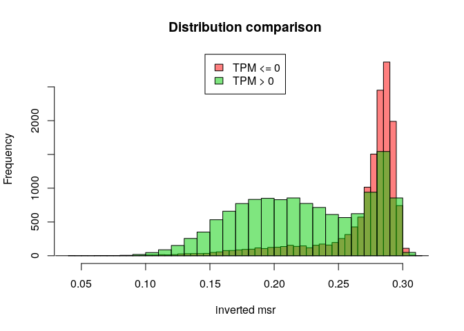
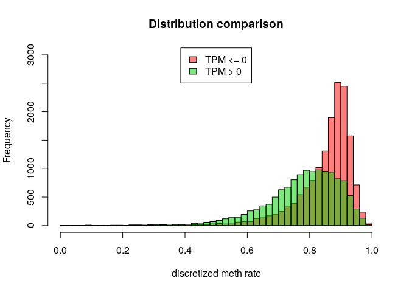
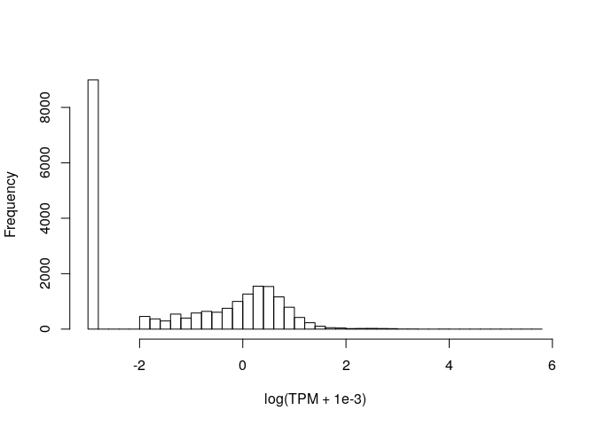

MSR and expression for ovary, windows of 1000 sites, extended genes set
================

The DataFrame is the following (excluding some columns for readability):

    ## 21 rows had too many nucleotides

    ##    start_chr start_position end_position gene_count total_TPM meth rate
    ## 8       chr1         742325       827393          8      1.57 0.7116420
    ## 9       chr1         827393       891580          3      0.00 0.6440638
    ## 10      chr1         891580       921648          4      0.02 0.5002695
    ## 12      chr1         940826       961902          2      2.05 0.3971166
    ## 13      chr1         961902       982731          2      0.01 0.6196993
    ## 14      chr1         982731      1007283          3      1.45 0.3961765

The full scheme includes:

**nucleotides**: number of nucleotides in the window

**CpG density**: fraction of nucleotides that is a C of a CpG site (= 1000/nucleotides)

**meth rate**: ratio of methylated CpG sites

**gene\_count**: number of genes included (even partially) inside the interval

**total\_TPM**: sum of the TPMs of the genes in the interval

then the MSR and some related statistics: **msr**, **inverted msr**, **msr ecdf **, **inverted msr ecdf**, **residual** (residual of the linear regression between msr and meth rate), **inverted residual**.

First let's see if there are pairwise correlations between the features.

TPM for regions with 0 genes is considered 0.

###### Basic features:

###### Comparison with simple MSR statistics:

###### Comparison with other MSR statistics:

inverted msr vs log(tpm): 

    ## missing data:  4.64797 %

    ## 
    ## train_data_proportion:  0.2

The fraction of fragments that have TPM&gt;0 (train data)

    ## [1] 0.4714671

Logistic Regression Model for TPM presence with basic predictors (nucleotides, CpG\_density, meth rate, msr\_density):

    ## TRAIN DATA

    ## accuracy:  0.6883888

    ## TEST DATA

    ## accuracy:  0.698317

Logistic Regression Model with inverted\_msr as predictor

    ## TRAIN DATA

    ## accuracy:  0.7341134

    ## TEST DATA

    ## accuracy:  0.7380974

Logistic Regression Model with all predictors

    ## TRAIN DATA

    ## accuracy:  0.7380738

    ## TEST DATA

    ## accuracy:  0.7418774

#### Predicting log(TPM)

Distribution of TPM values (only for regions that contains some genes) 

Linear model for TPM with standard predictors, available information about genes:

    ## 
    ## Call:
    ## lm(formula = log_tpm ~ ., data = train_model_data[, standard_predictors])
    ## 
    ## Residuals:
    ##      Min       1Q   Median       3Q      Max 
    ## -15.4729  -1.9173  -0.0687   1.9717   8.4863 
    ## 
    ## Coefficients:
    ##                           Estimate Std. Error t value Pr(>|t|)    
    ## (Intercept)             -3.616e-01  4.471e-01  -0.809    0.419    
    ## gene_count               4.572e-01  2.057e-02  22.229   <2e-16 ***
    ## nucleotides             -1.562e-05  1.532e-06 -10.198   <2e-16 ***
    ## CpG_density              1.472e+01  9.863e+00   1.493    0.135    
    ## `meth rate`              2.642e+01  2.006e+00  13.172   <2e-16 ***
    ## msr_density             -2.891e+01  1.874e+00 -15.430   <2e-16 ***
    ## genes_nucleotides_count  3.421e-05  1.123e-06  30.452   <2e-16 ***
    ## ---
    ## Signif. codes:  0 '***' 0.001 '**' 0.01 '*' 0.05 '.' 0.1 ' ' 1
    ## 
    ## Residual standard error: 2.735 on 5548 degrees of freedom
    ## Multiple R-squared:  0.4392, Adjusted R-squared:  0.4386 
    ## F-statistic: 724.1 on 6 and 5548 DF,  p-value: < 2.2e-16

    ## Test data R squared:  0.4340646

Linear model for TPM with all features and MSR statistics, available information about genes:

    ## 
    ## Call:
    ## lm(formula = log_tpm ~ ., data = train_model_data[, c(standard_predictors, 
    ##     msr_predictors)])
    ## 
    ## Residuals:
    ##      Min       1Q   Median       3Q      Max 
    ## -14.2803  -1.5837  -0.0534   1.6265   9.6498 
    ## 
    ## Coefficients:
    ##                           Estimate Std. Error t value Pr(>|t|)    
    ## (Intercept)             -2.493e+01  4.075e+00  -6.117 1.02e-09 ***
    ## gene_count               4.338e-01  1.940e-02  22.359  < 2e-16 ***
    ## nucleotides             -7.324e-06  1.553e-06  -4.715 2.48e-06 ***
    ## CpG_density              3.309e+01  9.865e+00   3.354 0.000800 ***
    ## `meth rate`              1.153e+01  2.246e+00   5.135 2.92e-07 ***
    ## msr_density             -1.657e+01  2.969e+00  -5.583 2.48e-08 ***
    ## genes_nucleotides_count  2.986e-05  1.074e-06  27.790  < 2e-16 ***
    ## msr                      6.223e+00  4.616e+00   1.348 0.177643    
    ## inverted_msr             9.297e+01  2.127e+01   4.370 1.26e-05 ***
    ## ecdf                     4.397e-01  2.611e-01   1.684 0.092249 .  
    ## `inverted ecdf`         -1.980e+00  2.619e-01  -7.558 4.78e-14 ***
    ## residual                -5.121e+01  8.765e+00  -5.843 5.42e-09 ***
    ## inverted_residual       -8.259e+01  2.170e+01  -3.805 0.000143 ***
    ## ---
    ## Signif. codes:  0 '***' 0.001 '**' 0.01 '*' 0.05 '.' 0.1 ' ' 1
    ## 
    ## Residual standard error: 2.575 on 5542 degrees of freedom
    ## Multiple R-squared:  0.5034, Adjusted R-squared:  0.5023 
    ## F-statistic: 468.1 on 12 and 5542 DF,  p-value: < 2.2e-16

    ## Test data R squared:  0.491861

Linear model for TPM with adding inverted msr, available information about genes:

    ## 
    ## Call:
    ## lm(formula = log_tpm ~ ., data = train_model_data[, c(standard_predictors, 
    ##     "inverted_msr")])
    ## 
    ## Residuals:
    ##      Min       1Q   Median       3Q      Max 
    ## -15.0853  -1.7003  -0.1019   1.7283   9.5010 
    ## 
    ## Coefficients:
    ##                           Estimate Std. Error t value Pr(>|t|)    
    ## (Intercept)             -4.615e-01  4.275e-01  -1.080  0.28037    
    ## gene_count               4.462e-01  1.967e-02  22.684  < 2e-16 ***
    ## nucleotides             -1.105e-05  1.478e-06  -7.471 9.16e-14 ***
    ## CpG_density              2.814e+01  9.448e+00   2.979  0.00291 ** 
    ## `meth rate`              1.311e+01  2.004e+00   6.542 6.60e-11 ***
    ## msr_density             -9.004e+00  1.992e+00  -4.520 6.30e-06 ***
    ## genes_nucleotides_count  3.086e-05  1.084e-06  28.473  < 2e-16 ***
    ## inverted_msr            -2.719e+01  1.189e+00 -22.859  < 2e-16 ***
    ## ---
    ## Signif. codes:  0 '***' 0.001 '**' 0.01 '*' 0.05 '.' 0.1 ' ' 1
    ## 
    ## Residual standard error: 2.615 on 5547 degrees of freedom
    ## Multiple R-squared:  0.4875, Adjusted R-squared:  0.4868 
    ## F-statistic: 753.6 on 7 and 5547 DF,  p-value: < 2.2e-16

    ## Test data R squared:  0.4780867

Linear model for TPM with basic features but no information about genes:

    ## 
    ## Call:
    ## lm(formula = log_tpm ~ ., data = train_model_data[, c("log_tpm", 
    ##     basic_predictors)])
    ## 
    ## Residuals:
    ##      Min       1Q   Median       3Q      Max 
    ## -12.0877  -2.7144  -0.5482   2.9114  11.0120 
    ## 
    ## Coefficients:
    ##               Estimate Std. Error t value Pr(>|t|)    
    ## (Intercept)  6.100e+00  5.038e-01  12.107  < 2e-16 ***
    ## nucleotides -1.885e-05  1.817e-06 -10.376  < 2e-16 ***
    ## CpG_density -6.100e+01  1.163e+01  -5.246 1.61e-07 ***
    ## `meth rate`  3.656e+01  2.370e+00  15.426  < 2e-16 ***
    ## msr_density -4.221e+01  2.206e+00 -19.134  < 2e-16 ***
    ## ---
    ## Signif. codes:  0 '***' 0.001 '**' 0.01 '*' 0.05 '.' 0.1 ' ' 1
    ## 
    ## Residual standard error: 3.266 on 5550 degrees of freedom
    ## Multiple R-squared:    0.2,  Adjusted R-squared:  0.1995 
    ## F-statistic:   347 on 4 and 5550 DF,  p-value: < 2.2e-16

    ## Test data R squared:  0.2024821

Linear model for TPM with all features but no information about genes:

    ## 
    ## Call:
    ## lm(formula = log_tpm ~ ., data = train_model_data[, c("log_tpm", 
    ##     basic_predictors, msr_predictors)])
    ## 
    ## Residuals:
    ##     Min      1Q  Median      3Q     Max 
    ## -8.4324 -1.8568 -0.5753  2.2629 10.9059 
    ## 
    ## Coefficients:
    ##                     Estimate Std. Error t value Pr(>|t|)    
    ## (Intercept)       -2.040e+01  4.780e+00  -4.268 2.00e-05 ***
    ## nucleotides       -6.977e-06  1.809e-06  -3.858 0.000116 ***
    ## CpG_density       -2.451e+01  1.148e+01  -2.135 0.032767 *  
    ## `meth rate`        1.517e+01  2.626e+00   5.777 8.01e-09 ***
    ## msr_density       -1.843e+01  3.483e+00  -5.292 1.25e-07 ***
    ## msr                1.483e+01  5.409e+00   2.742 0.006117 ** 
    ## inverted_msr       7.555e+01  2.495e+01   3.028 0.002472 ** 
    ## ecdf               2.711e-01  3.060e-01   0.886 0.375728    
    ## `inverted ecdf`   -2.669e+00  3.067e-01  -8.702  < 2e-16 ***
    ## residual          -7.282e+01  1.027e+01  -7.092 1.49e-12 ***
    ## inverted_residual -5.948e+01  2.545e+01  -2.337 0.019475 *  
    ## ---
    ## Signif. codes:  0 '***' 0.001 '**' 0.01 '*' 0.05 '.' 0.1 ' ' 1
    ## 
    ## Residual standard error: 3.022 on 5544 degrees of freedom
    ## Multiple R-squared:  0.3161, Adjusted R-squared:  0.3149 
    ## F-statistic: 256.3 on 10 and 5544 DF,  p-value: < 2.2e-16

    ## Test data R squared:  0.313097

Linear model for TPM with inverted msr but no information about genes:

    ## 
    ## Call:
    ## lm(formula = log_tpm ~ ., data = train_model_data[, c("log_tpm", 
    ##     basic_predictors, "inverted_msr")])
    ## 
    ## Residuals:
    ##    Min     1Q Median     3Q    Max 
    ## -9.223 -2.137 -0.691  2.474 10.365 
    ## 
    ## Coefficients:
    ##                Estimate Std. Error t value Pr(>|t|)    
    ## (Intercept)   5.481e+00  4.771e-01  11.490  < 2e-16 ***
    ## nucleotides  -1.282e-05  1.734e-06  -7.392 1.66e-13 ***
    ## CpG_density  -3.685e+01  1.104e+01  -3.339 0.000846 ***
    ## `meth rate`   1.793e+01  2.356e+00   7.613 3.13e-14 ***
    ## msr_density  -1.477e+01  2.345e+00  -6.296 3.28e-10 ***
    ## inverted_msr -3.555e+01  1.387e+00 -25.636  < 2e-16 ***
    ## ---
    ## Signif. codes:  0 '***' 0.001 '**' 0.01 '*' 0.05 '.' 0.1 ' ' 1
    ## 
    ## Residual standard error: 3.089 on 5549 degrees of freedom
    ## Multiple R-squared:  0.2848, Adjusted R-squared:  0.2841 
    ## F-statistic: 441.8 on 5 and 5549 DF,  p-value: < 2.2e-16

    ## Test data R squared:  0.2863202
