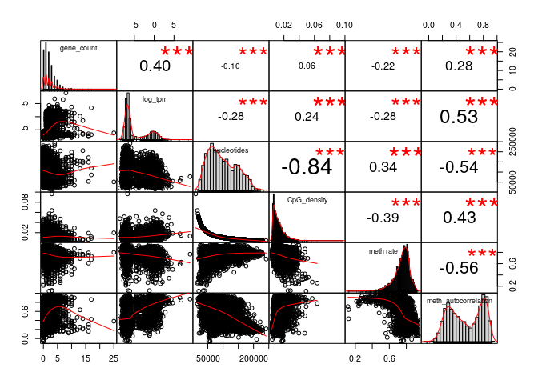
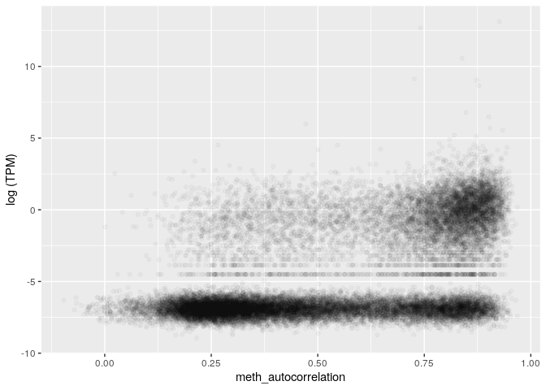

MSR and expression for stomach, windows of 1000 sites, extended genes set
================

The DataFrame is the following (excluding some columns for readability):

    ## 21 rows had too many nucleotides

    ##    start_chr start_position end_position gene_count total_TPM meth rate
    ## 6       chr1         535250       632769         14      6.68 0.7614178
    ## 8       chr1         742325       827393          8      0.25 0.7042525
    ## 9       chr1         827393       891580          3      0.00 0.6920191
    ## 10      chr1         891580       921648          4      0.00 0.5218526
    ## 12      chr1         940826       961902          2      0.82 0.4183129
    ## 13      chr1         961902       982731          2      0.01 0.6514289

The full scheme includes:

**nucleotides**: number of nucleotides in the window

**CpG density**: fraction of nucleotides that is a C of a CpG site (= 1000/nucleotides)

**meth rate**: ratio of methylated CpG sites

**gene\_count**: number of genes included (even partially) inside the interval

**total\_TPM**: sum of the TPMs of the genes in the interval

then the MSR and some related statistics: **msr**, **inverted msr**, **msr ecdf **, **inverted msr ecdf**, **residual** (residual of the linear regression between msr and meth rate), **inverted residual**.

First let's see if there are pairwise correlations between the features.

TPM for regions with 0 genes is considered 0.

###### Basic features:

###### Comparison with simple MSR statistics:

###### Comparison with other MSR statistics:

inverted msr vs log(tpm): 

    ## missing data:  5.0702 %

    ## 
    ## train_data_proportion:  0.2

The fraction of fragments that have TPM&gt;0 (train data)

    ## [1] 0.3462929

Logistic Regression Model for TPM presence with basic predictors (nucleotides, CpG\_density, meth rate, msr\_density):

    ## TRAIN DATA

    ## accuracy:  0.7146474

    ## TEST DATA

    ## accuracy:  0.717185

Logistic Regression Model with inverted\_msr as predictor

    ## TRAIN DATA

    ## accuracy:  0.7330922

    ## TEST DATA

    ## accuracy:  0.7412312

Logistic Regression Model with all predictors

    ## TRAIN DATA

    ## accuracy:  0.7640145

    ## TEST DATA

    ## accuracy:  0.7595372

#### Predicting log(TPM)

Distribution of TPM values (only for regions that contains some genes) 

Linear model for TPM with standard predictors, available information about genes:

    ## 
    ## Call:
    ## lm(formula = log_tpm ~ ., data = train_model_data[, standard_predictors])
    ## 
    ## Residuals:
    ##      Min       1Q   Median       3Q      Max 
    ## -12.0832  -1.9351  -0.3069   1.8230  10.5872 
    ## 
    ## Coefficients:
    ##                           Estimate Std. Error t value Pr(>|t|)    
    ## (Intercept)             -3.220e+00  4.360e-01  -7.384 1.76e-13 ***
    ## gene_count               2.911e-01  1.933e-02  15.062  < 2e-16 ***
    ## nucleotides             -7.416e-06  1.538e-06  -4.821 1.47e-06 ***
    ## CpG_density              2.190e+01  9.092e+00   2.409    0.016 *  
    ## `meth rate`              3.492e+01  2.364e+00  14.773  < 2e-16 ***
    ## msr_density             -3.430e+01  2.138e+00 -16.045  < 2e-16 ***
    ## genes_nucleotides_count  2.363e-05  1.092e-06  21.651  < 2e-16 ***
    ## ---
    ## Signif. codes:  0 '***' 0.001 '**' 0.01 '*' 0.05 '.' 0.1 ' ' 1
    ## 
    ## Residual standard error: 2.655 on 5523 degrees of freedom
    ## Multiple R-squared:  0.3153, Adjusted R-squared:  0.3145 
    ## F-statistic: 423.9 on 6 and 5523 DF,  p-value: < 2.2e-16

    ## Test data R squared:  0.329432

Linear model for TPM with all features and MSR statistics, available information about genes:

    ## 
    ## Call:
    ## lm(formula = log_tpm ~ ., data = train_model_data[, c(standard_predictors, 
    ##     msr_predictors)])
    ## 
    ## Residuals:
    ##      Min       1Q   Median       3Q      Max 
    ## -11.3732  -1.6852  -0.1508   1.4791  10.0201 
    ## 
    ## Coefficients:
    ##                           Estimate Std. Error t value Pr(>|t|)    
    ## (Intercept)             -2.192e+01  3.771e+00  -5.814 6.46e-09 ***
    ## gene_count               2.771e-01  1.850e-02  14.974  < 2e-16 ***
    ## nucleotides             -1.926e-06  1.543e-06  -1.248  0.21211    
    ## CpG_density              4.753e+01  8.995e+00   5.283 1.32e-07 ***
    ## `meth rate`              2.045e+01  2.698e+00   7.581 3.99e-14 ***
    ## msr_density             -2.122e+01  3.210e+00  -6.610 4.21e-11 ***
    ## genes_nucleotides_count  1.970e-05  1.058e-06  18.622  < 2e-16 ***
    ## msr                      7.068e+00  4.071e+00   1.736  0.08257 .  
    ## inverted_msr             6.537e+01  2.011e+01   3.252  0.00115 ** 
    ## ecdf                     2.890e-01  2.570e-01   1.125  0.26082    
    ## `inverted ecdf`         -1.336e+00  2.683e-01  -4.979 6.59e-07 ***
    ## residual                -3.628e+01  7.812e+00  -4.645 3.49e-06 ***
    ## inverted_residual       -6.280e+01  2.079e+01  -3.021  0.00253 ** 
    ## ---
    ## Signif. codes:  0 '***' 0.001 '**' 0.01 '*' 0.05 '.' 0.1 ' ' 1
    ## 
    ## Residual standard error: 2.534 on 5517 degrees of freedom
    ## Multiple R-squared:  0.3767, Adjusted R-squared:  0.3753 
    ## F-statistic: 277.8 on 12 and 5517 DF,  p-value: < 2.2e-16

    ## Test data R squared:  0.3834857

Linear model for TPM with adding inverted msr, available information about genes:

    ## 
    ## Call:
    ## lm(formula = log_tpm ~ ., data = train_model_data[, c(standard_predictors, 
    ##     "inverted_msr")])
    ## 
    ## Residuals:
    ##      Min       1Q   Median       3Q      Max 
    ## -11.8582  -1.6896  -0.2135   1.5184  10.0543 
    ## 
    ## Coefficients:
    ##                           Estimate Std. Error t value Pr(>|t|)    
    ## (Intercept)             -2.921e+00  4.203e-01  -6.950 4.09e-12 ***
    ## gene_count               2.848e-01  1.862e-02  15.293  < 2e-16 ***
    ## nucleotides             -4.762e-06  1.487e-06  -3.202  0.00137 ** 
    ## CpG_density              4.265e+01  8.815e+00   4.839 1.34e-06 ***
    ## `meth rate`              1.926e+01  2.399e+00   8.028 1.20e-15 ***
    ## msr_density             -1.407e+01  2.278e+00  -6.176 7.02e-10 ***
    ## genes_nucleotides_count  2.046e-05  1.063e-06  19.253  < 2e-16 ***
    ## inverted_msr            -2.317e+01  1.117e+00 -20.741  < 2e-16 ***
    ## ---
    ## Signif. codes:  0 '***' 0.001 '**' 0.01 '*' 0.05 '.' 0.1 ' ' 1
    ## 
    ## Residual standard error: 2.557 on 5522 degrees of freedom
    ## Multiple R-squared:  0.3648, Adjusted R-squared:  0.364 
    ## F-statistic:   453 on 7 and 5522 DF,  p-value: < 2.2e-16

    ## Test data R squared:  0.3727717

Linear model for TPM with basic features but no information about genes:

    ## 
    ## Call:
    ## lm(formula = log_tpm ~ ., data = train_model_data[, c("log_tpm", 
    ##     basic_predictors)])
    ## 
    ## Residuals:
    ##      Min       1Q   Median       3Q      Max 
    ## -10.3382  -2.1745  -0.7484   2.4165  12.2170 
    ## 
    ## Coefficients:
    ##               Estimate Std. Error t value Pr(>|t|)    
    ## (Intercept)  5.143e-01  4.541e-01   1.133   0.2574    
    ## nucleotides -6.848e-06  1.675e-06  -4.089  4.4e-05 ***
    ## CpG_density -2.246e+01  9.825e+00  -2.286   0.0223 *  
    ## `meth rate`  4.903e+01  2.540e+00  19.306  < 2e-16 ***
    ## msr_density -4.943e+01  2.281e+00 -21.671  < 2e-16 ***
    ## ---
    ## Signif. codes:  0 '***' 0.001 '**' 0.01 '*' 0.05 '.' 0.1 ' ' 1
    ## 
    ## Residual standard error: 2.901 on 5525 degrees of freedom
    ## Multiple R-squared:  0.182,  Adjusted R-squared:  0.1814 
    ## F-statistic: 307.2 on 4 and 5525 DF,  p-value: < 2.2e-16

    ## Test data R squared:  0.1904839

Linear model for TPM with all features but no information about genes:

    ## 
    ## Call:
    ## lm(formula = log_tpm ~ ., data = train_model_data[, c("log_tpm", 
    ##     basic_predictors, msr_predictors)])
    ## 
    ## Residuals:
    ##     Min      1Q  Median      3Q     Max 
    ## -6.5476 -1.6232 -0.4668  1.8177 11.8100 
    ## 
    ## Coefficients:
    ##                     Estimate Std. Error t value Pr(>|t|)    
    ## (Intercept)       -2.245e+01  4.057e+00  -5.534 3.28e-08 ***
    ## nucleotides        3.505e-07  1.653e-06   0.212  0.83204    
    ## CpG_density        1.916e+01  9.626e+00   1.990  0.04664 *  
    ## `meth rate`        3.091e+01  2.879e+00  10.739  < 2e-16 ***
    ## msr_density       -2.936e+01  3.440e+00  -8.536  < 2e-16 ***
    ## msr                1.711e+01  4.365e+00   3.919 8.99e-05 ***
    ## inverted_msr       6.177e+01  2.163e+01   2.856  0.00430 ** 
    ## ecdf               1.861e-01  2.765e-01   0.673  0.50094    
    ## `inverted ecdf`   -1.587e+00  2.886e-01  -5.499 3.98e-08 ***
    ## residual          -5.060e+01  8.392e+00  -6.030 1.75e-09 ***
    ## inverted_residual -5.815e+01  2.236e+01  -2.600  0.00934 ** 
    ## ---
    ## Signif. codes:  0 '***' 0.001 '**' 0.01 '*' 0.05 '.' 0.1 ' ' 1
    ## 
    ## Residual standard error: 2.728 on 5519 degrees of freedom
    ## Multiple R-squared:  0.2777, Adjusted R-squared:  0.2763 
    ## F-statistic: 212.1 on 10 and 5519 DF,  p-value: < 2.2e-16

    ## Test data R squared:  0.2792991

Linear model for TPM with inverted msr but no information about genes:

    ## 
    ## Call:
    ## lm(formula = log_tpm ~ ., data = train_model_data[, c("log_tpm", 
    ##     basic_predictors, "inverted_msr")])
    ## 
    ## Residuals:
    ##     Min      1Q  Median      3Q     Max 
    ## -7.4111 -1.7168 -0.6132  1.9151 11.7874 
    ## 
    ## Coefficients:
    ##                Estimate Std. Error t value Pr(>|t|)    
    ## (Intercept)   5.551e-01  4.328e-01   1.283   0.1996    
    ## nucleotides  -3.877e-06  1.601e-06  -2.422   0.0155 *  
    ## CpG_density   7.664e+00  9.449e+00   0.811   0.4173    
    ## `meth rate`   2.828e+01  2.574e+00  10.987   <2e-16 ***
    ## msr_density  -2.309e+01  2.442e+00  -9.456   <2e-16 ***
    ## inverted_msr -2.820e+01  1.192e+00 -23.661   <2e-16 ***
    ## ---
    ## Signif. codes:  0 '***' 0.001 '**' 0.01 '*' 0.05 '.' 0.1 ' ' 1
    ## 
    ## Residual standard error: 2.765 on 5524 degrees of freedom
    ## Multiple R-squared:  0.2572, Adjusted R-squared:  0.2566 
    ## F-statistic: 382.6 on 5 and 5524 DF,  p-value: < 2.2e-16

    ## Test data R squared:  0.259541
