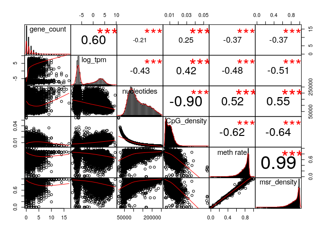
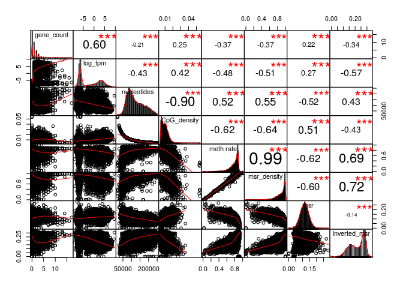
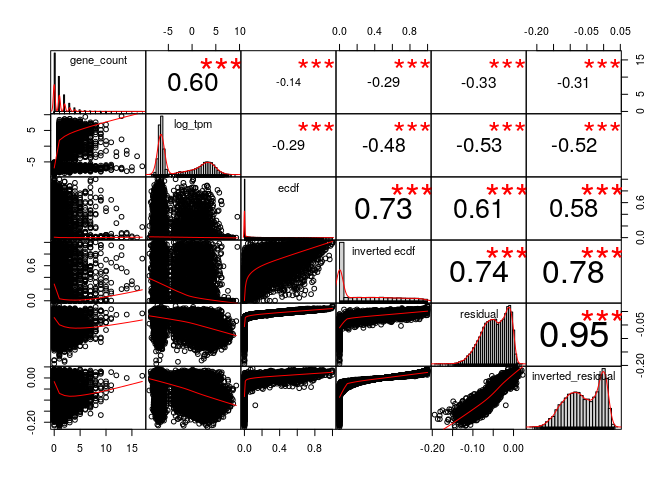
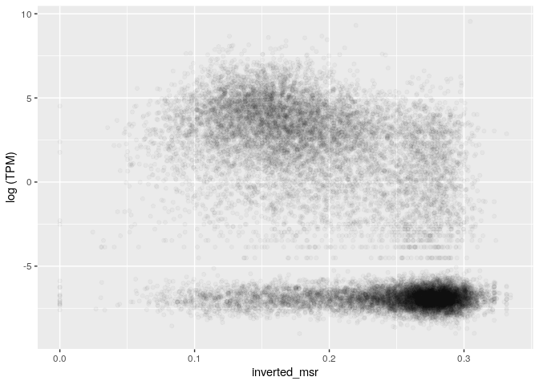
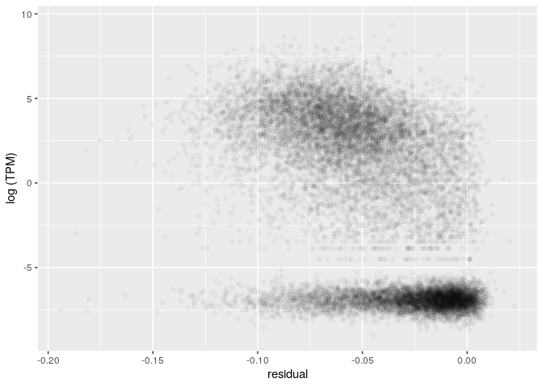
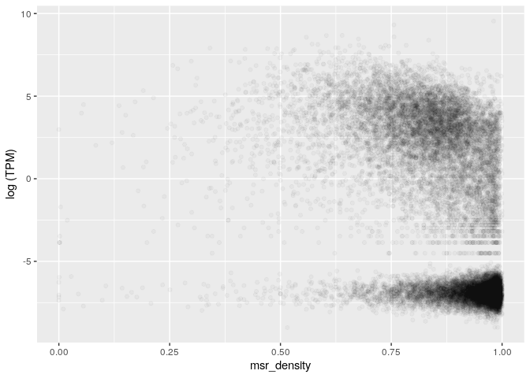
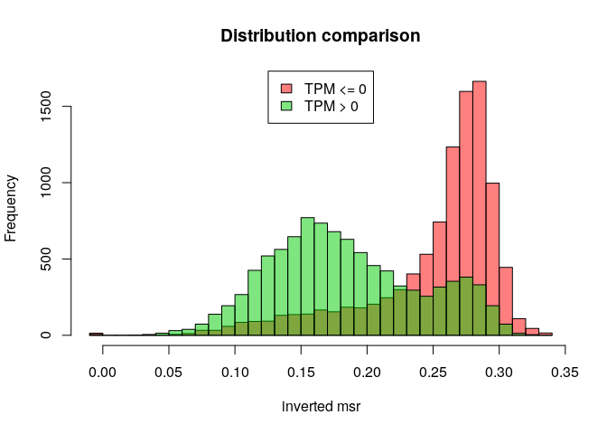
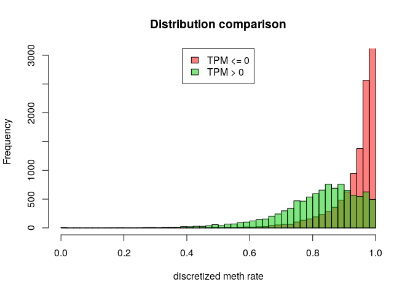
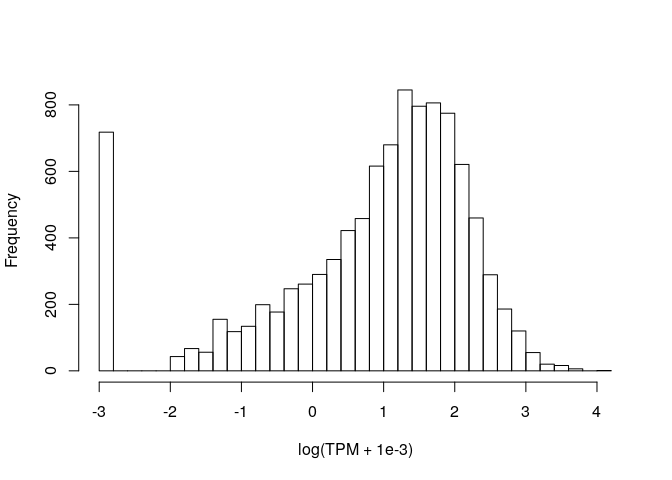

MSR and expression for mouse forebrain, windows of 1000 sites, extended genes set
================

The DataFrame is the following (excluding some columns for readability):

    ## 178 rows had too many nucleotides

    ##    start_chr start_position end_position gene_count total_TPM meth rate
    ## 11      chr1        4785534      4888166          3    223.77 0.6687347
    ## 19      chr1        6095894      6228621          2     22.08 0.7470742
    ## 38      chr1        9387107      9557973          2     56.80 0.7478582
    ## 39      chr1        9557973      9700441          3      4.99 0.7506454
    ## 40      chr1        9700441      9798477          2     19.43 0.5976616
    ## 42      chr1        9906844     10004349          4      3.82 0.6524336

The full scheme includes:

**nucleotides**: number of nucleotides in the window

**CpG density**: fraction of nucleotides that is a C of a CpG site (= 1000/nucleotides)

**meth rate**: ratio of methylated CpG sites

**gene\_count**: number of genes included (even partially) inside the interval

**total\_TPM**: sum of the TPMs of the genes in the interval

then the MSR and some related statistics: **msr**, **inverted msr**, **msr ecdf **, **inverted msr ecdf**, **residual** (residual of the linear regression between msr and meth rate), **inverted residual**.

First let's see if there are pairwise correlations between the features.

TPM for regions with 0 genes is considered 0.

###### Basic features:

###### Comparison with simple MSR statistics:

###### Comparison with other MSR statistics:

inverted msr vs log(tpm): 

    ## missing data:  25.26976 %

    ## 
    ## train_data_proportion:  0.2

The fraction of fragments that have TPM&gt;0 (train data)

    ## [1] 0.5788337

Logistic Regression Model for TPM presence with basic predictors (nucleotides, CpG\_density, meth rate, msr\_density):

    ## TRAIN DATA

    ## accuracy:  0.7303301

    ## TEST DATA

    ## accuracy:  0.7349017

Logistic Regression Model with inverted\_msr as predictor

    ## TRAIN DATA

    ## accuracy:  0.7682814

    ## TEST DATA

    ## accuracy:  0.7630544

Logistic Regression Model with all predictors

    ## TRAIN DATA

    ## accuracy:  0.7648874

    ## TEST DATA

    ## accuracy:  0.7591978

#### Predicting log(TPM)

Distribution of TPM values (only for regions that contains some genes) 

Linear model for TPM with standard predictors, available information about genes:

    ## 
    ## Call:
    ## lm(formula = log_tpm ~ ., data = train_model_data[, standard_predictors])
    ## 
    ## Residuals:
    ##      Min       1Q   Median       3Q      Max 
    ## -16.5142  -2.0089  -0.4449   2.0310  11.7977 
    ## 
    ## Coefficients:
    ##                           Estimate Std. Error t value Pr(>|t|)    
    ## (Intercept)              6.078e+00  1.079e+00   5.634 1.91e-08 ***
    ## gene_count               1.564e+00  4.982e-02  31.401  < 2e-16 ***
    ## nucleotides             -2.973e-05  3.595e-06  -8.271  < 2e-16 ***
    ## CpG_density             -1.875e+02  4.046e+01  -4.633 3.74e-06 ***
    ## `meth rate`              6.355e+01  4.901e+00  12.966  < 2e-16 ***
    ## msr_density             -6.348e+01  4.335e+00 -14.642  < 2e-16 ***
    ## genes_nucleotides_count  5.074e-05  2.029e-06  25.009  < 2e-16 ***
    ## ---
    ## Signif. codes:  0 '***' 0.001 '**' 0.01 '*' 0.05 '.' 0.1 ' ' 1
    ## 
    ## Residual standard error: 3.087 on 3234 degrees of freedom
    ## Multiple R-squared:  0.6258, Adjusted R-squared:  0.6251 
    ## F-statistic: 901.4 on 6 and 3234 DF,  p-value: < 2.2e-16

    ## Test data R squared:  0.6269479

Linear model for TPM with all features and MSR statistics, available information about genes:

    ## 
    ## Call:
    ## lm(formula = log_tpm ~ ., data = train_model_data[, c(standard_predictors, 
    ##     msr_predictors)])
    ## 
    ## Residuals:
    ##      Min       1Q   Median       3Q      Max 
    ## -16.1451  -1.8457  -0.1366   1.7970  10.0706 
    ## 
    ## Coefficients:
    ##                           Estimate Std. Error t value Pr(>|t|)    
    ## (Intercept)             -2.300e+01  1.085e+01  -2.121 0.034026 *  
    ## gene_count               1.530e+00  4.826e-02  31.701  < 2e-16 ***
    ## nucleotides             -1.468e-05  3.774e-06  -3.889 0.000103 ***
    ## CpG_density             -7.431e+00  4.118e+01  -0.180 0.856810    
    ## `meth rate`              4.904e+01  5.301e+00   9.251  < 2e-16 ***
    ## msr_density             -4.435e+01  7.114e+00  -6.234 5.13e-10 ***
    ## genes_nucleotides_count  4.325e-05  1.998e-06  21.644  < 2e-16 ***
    ## msr                      2.371e+01  5.137e+00   4.615 4.08e-06 ***
    ## inverted_msr             6.161e+01  5.675e+01   1.086 0.277720    
    ## ecdf                     1.199e+00  5.103e-01   2.349 0.018859 *  
    ## `inverted ecdf`         -1.550e+00  3.741e-01  -4.143 3.52e-05 ***
    ## residual                -2.430e+01  7.933e+00  -3.063 0.002210 ** 
    ## inverted_residual       -7.422e+01  5.709e+01  -1.300 0.193729    
    ## ---
    ## Signif. codes:  0 '***' 0.001 '**' 0.01 '*' 0.05 '.' 0.1 ' ' 1
    ## 
    ## Residual standard error: 2.954 on 3228 degrees of freedom
    ## Multiple R-squared:  0.6579, Adjusted R-squared:  0.6566 
    ## F-statistic: 517.3 on 12 and 3228 DF,  p-value: < 2.2e-16

    ## Test data R squared:  0.6501792

Linear model for TPM with adding inverted msr, available information about genes:

    ## 
    ## Call:
    ## lm(formula = log_tpm ~ ., data = train_model_data[, c(standard_predictors, 
    ##     "inverted_msr")])
    ## 
    ## Residuals:
    ##      Min       1Q   Median       3Q      Max 
    ## -16.4276  -1.8430  -0.2655   1.8481  10.0884 
    ## 
    ## Coefficients:
    ##                           Estimate Std. Error t value Pr(>|t|)    
    ## (Intercept)              1.890e+00  1.074e+00   1.760   0.0786 .  
    ## gene_count               1.561e+00  4.805e-02  32.494  < 2e-16 ***
    ## nucleotides             -2.197e-05  3.502e-06  -6.274 3.98e-10 ***
    ## CpG_density             -5.980e+01  3.986e+01  -1.500   0.1337    
    ## `meth rate`              4.583e+01  4.860e+00   9.431  < 2e-16 ***
    ## msr_density             -4.010e+01  4.440e+00  -9.032  < 2e-16 ***
    ## genes_nucleotides_count  4.414e-05  2.001e-06  22.054  < 2e-16 ***
    ## inverted_msr            -2.044e+01  1.307e+00 -15.646  < 2e-16 ***
    ## ---
    ## Signif. codes:  0 '***' 0.001 '**' 0.01 '*' 0.05 '.' 0.1 ' ' 1
    ## 
    ## Residual standard error: 2.977 on 3233 degrees of freedom
    ## Multiple R-squared:  0.6521, Adjusted R-squared:  0.6514 
    ## F-statistic: 865.9 on 7 and 3233 DF,  p-value: < 2.2e-16

    ## Test data R squared:  0.6437318

Linear model for TPM with basic features but no information about genes:

    ## 
    ## Call:
    ## lm(formula = log_tpm ~ ., data = train_model_data[, c("log_tpm", 
    ##     basic_predictors)])
    ## 
    ## Residuals:
    ##      Min       1Q   Median       3Q      Max 
    ## -18.8779  -3.6928   0.5764   3.6468  10.9199 
    ## 
    ## Coefficients:
    ##               Estimate Std. Error t value Pr(>|t|)    
    ## (Intercept)  1.913e+01  1.482e+00  12.907  < 2e-16 ***
    ## nucleotides -3.085e-05  5.047e-06  -6.112 1.10e-09 ***
    ## CpG_density -3.069e+02  5.632e+01  -5.449 5.43e-08 ***
    ## `meth rate`  8.980e+01  6.780e+00  13.245  < 2e-16 ***
    ## msr_density -9.700e+01  5.984e+00 -16.209  < 2e-16 ***
    ## ---
    ## Signif. codes:  0 '***' 0.001 '**' 0.01 '*' 0.05 '.' 0.1 ' ' 1
    ## 
    ## Residual standard error: 4.342 on 3236 degrees of freedom
    ## Multiple R-squared:  0.2592, Adjusted R-squared:  0.2583 
    ## F-statistic: 283.1 on 4 and 3236 DF,  p-value: < 2.2e-16

    ## Test data R squared:  0.2542489

Linear model for TPM with all features but no information about genes:

    ## 
    ## Call:
    ## lm(formula = log_tpm ~ ., data = train_model_data[, c("log_tpm", 
    ##     basic_predictors, msr_predictors)])
    ## 
    ## Residuals:
    ##      Min       1Q   Median       3Q      Max 
    ## -11.6836  -2.5543   0.2159   3.0345  11.6100 
    ## 
    ## Coefficients:
    ##                     Estimate Std. Error t value Pr(>|t|)    
    ## (Intercept)       -4.881e+01  1.472e+01  -3.316 0.000924 ***
    ## nucleotides       -3.426e-06  5.127e-06  -0.668 0.504015    
    ## CpG_density        3.723e+01  5.581e+01   0.667 0.504800    
    ## `meth rate`        5.437e+01  7.164e+00   7.589 4.18e-14 ***
    ## msr_density       -5.639e+01  9.677e+00  -5.827 6.20e-09 ***
    ## msr                5.015e+01  6.944e+00   7.221 6.40e-13 ***
    ## inverted_msr       1.694e+02  7.696e+01   2.201 0.027800 *  
    ## ecdf               4.101e+00  6.897e-01   5.946 3.04e-09 ***
    ## `inverted ecdf`   -3.681e+00  5.052e-01  -7.285 4.02e-13 ***
    ## residual          -7.972e+01  1.070e+01  -7.452 1.17e-13 ***
    ## inverted_residual -1.738e+02  7.747e+01  -2.244 0.024893 *  
    ## ---
    ## Signif. codes:  0 '***' 0.001 '**' 0.01 '*' 0.05 '.' 0.1 ' ' 1
    ## 
    ## Residual standard error: 4.021 on 3230 degrees of freedom
    ## Multiple R-squared:  0.366,  Adjusted R-squared:  0.364 
    ## F-statistic: 186.5 on 10 and 3230 DF,  p-value: < 2.2e-16

    ## Test data R squared:  0.3563605

Linear model for TPM with inverted msr but no information about genes:

    ## 
    ## Call:
    ## lm(formula = log_tpm ~ ., data = train_model_data[, c("log_tpm", 
    ##     basic_predictors, "inverted_msr")])
    ## 
    ## Residuals:
    ##      Min       1Q   Median       3Q      Max 
    ## -14.1426  -2.9003   0.1052   3.2298  11.5483 
    ## 
    ## Coefficients:
    ##                Estimate Std. Error t value Pr(>|t|)    
    ## (Intercept)   1.085e+01  1.463e+00   7.416 1.53e-13 ***
    ## nucleotides  -1.692e-05  4.823e-06  -3.508 0.000458 ***
    ## CpG_density  -6.235e+01  5.467e+01  -1.140 0.254179    
    ## `meth rate`   5.495e+01  6.650e+00   8.264  < 2e-16 ***
    ## msr_density  -5.253e+01  6.093e+00  -8.621  < 2e-16 ***
    ## inverted_msr -3.434e+01  1.748e+00 -19.651  < 2e-16 ***
    ## ---
    ## Signif. codes:  0 '***' 0.001 '**' 0.01 '*' 0.05 '.' 0.1 ' ' 1
    ## 
    ## Residual standard error: 4.105 on 3235 degrees of freedom
    ## Multiple R-squared:  0.3382, Adjusted R-squared:  0.3372 
    ## F-statistic: 330.7 on 5 and 3235 DF,  p-value: < 2.2e-16

    ## Test data R squared:  0.3249953
