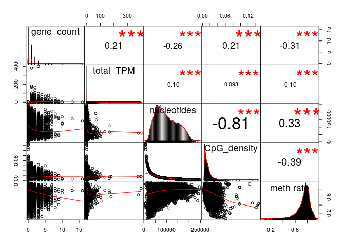
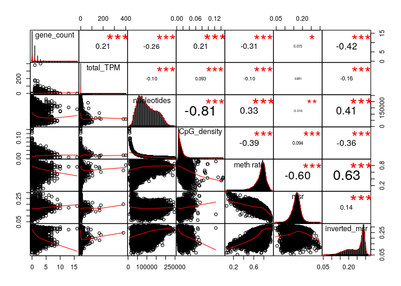
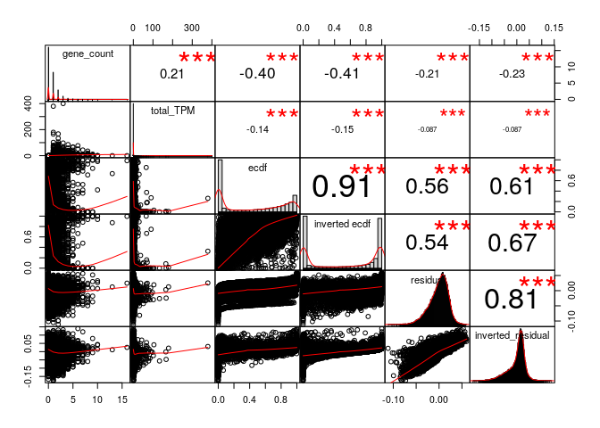
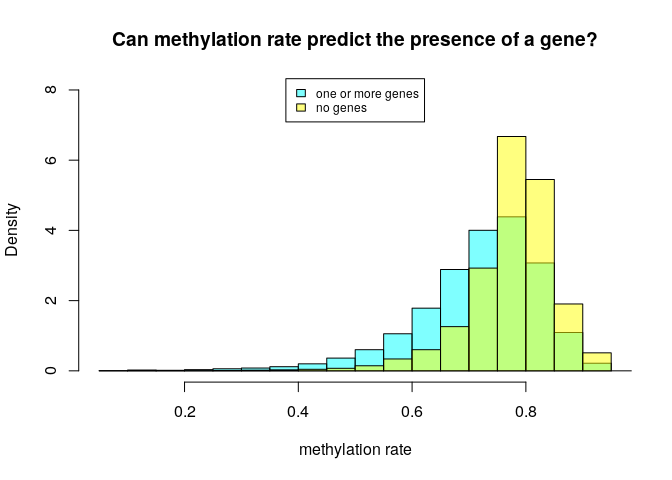
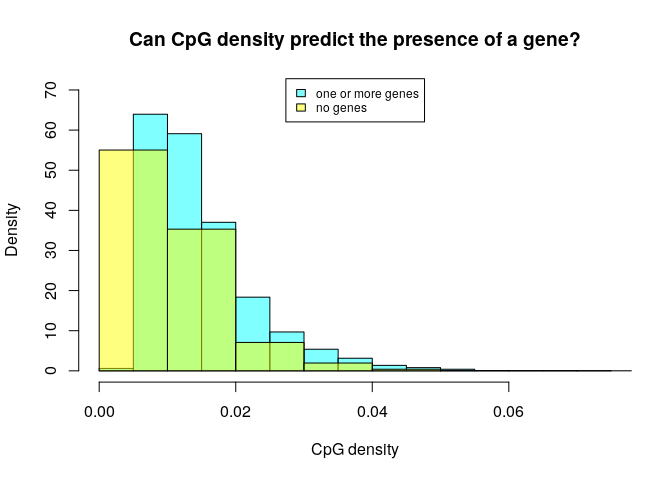
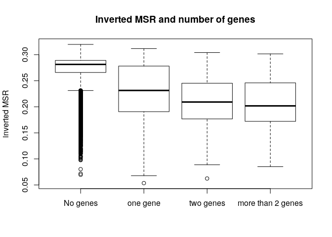

MSR and expression
================

Here I will investigate if there is a relationship between the presence of genes and genes expression in a certain genomic region and the MSR (with some of its derivate statistics).

I chose stomach cells data in order to do this, and CpG windows of size 1000, that corresponds to a variable window size in term of nucleotides (on average about 100,000).

This is an example of total-rna-seq file, that shows for each "gene" its transcripts and some measures of expression. In this case I just kept two colums. The first one indicates the "gene"", the second one is the Transcript Per Million that is a relative measure of how much a gene is expressed.

    ##                    gene_id    TPM
    ##     1:     ENSG00000000003   0.49
    ##     2:     ENSG00000000005   0.00
    ##     3:     ENSG00000000419   0.24
    ##     4:     ENSG00000000457   0.28
    ##     5:     ENSG00000000460   2.18
    ##    ---                           
    ## 60818: gSpikein_ERCC-00165   8.98
    ## 60819: gSpikein_ERCC-00168   0.04
    ## 60820: gSpikein_ERCC-00170   0.56
    ## 60821: gSpikein_ERCC-00171 530.85
    ## 60822:    gSpikein_phiX174  98.55

This is the annotation file that store the position occupied by each human gene.

    ##         chr     start       end strand              id                    anno
    ##     1: chr1     65419     71585      + ENSG00000186092 genebody_protein_coding
    ##     2: chr1    450703    451697      - ENSG00000284733 genebody_protein_coding
    ##     3: chr1    685679    686673      - ENSG00000284662 genebody_protein_coding
    ##     4: chr1    923928    944581      + ENSG00000187634 genebody_protein_coding
    ##     5: chr1    944204    959309      - ENSG00000188976 genebody_protein_coding
    ##    ---                                                                        
    ## 19801: chrY  24763069  24813492      - ENSG00000187191 genebody_protein_coding
    ## 19802: chrY  24833843  24907040      + ENSG00000205916 genebody_protein_coding
    ## 19803: chrY  25030901  25062548      - ENSG00000185894 genebody_protein_coding
    ## 19804: chrY  25622162  25624902      + ENSG00000172288 genebody_protein_coding
    ## 19805: chrX 135309480 135309659      + ENSG00000283644 genebody_protein_coding

The number of genes is much less than the ones in the total-rna-seq file, since the first one also contains so called pseudogenes and other stuff.

So the final dataFrame is the following (excluding some columns for readability):

    ## 21 rows had too many nucleotides

    ##    start_chr start_positions end_positions gene_count total_TPM       msr
    ## 6       chr1          535250        632769          0      0.00 0.1771844
    ## 8       chr1          742325        827393          0      0.00 0.1564140
    ## 9       chr1          827393        891580          0      0.00 0.1834515
    ## 10      chr1          891580        921648          0      0.00 0.2179909
    ## 11      chr1          921648        940826          1      0.09 0.2254051
    ## 12      chr1          940826        961902          2      0.82 0.1666917

The full scheme includes:

**nucleotides**: number of nucleotides in the window

**CpG density**: fraction of nucleotides that is a C of a CpG site (= 1000/nucleotides)

**meth rate**: ratio of methylated CpG sites

**gene\_count**: number of genes included (even partially) inside the interval

**total\_TPM**: sum of the TPMs of the genes in the interval

then the MSR and some related statistics: **msr**, **inverted msr**, **msr ecdf **, **inverted msr ecdf**, **residual** (residual of the linear regression between msr and meth rate), **inverted residual**.

First let's see if there are pairwise correlations between the features.

###### Basic features:

###### Comparison with simple MSR statistics:

###### Comparison with other MSR statistics:

#### Predicting gene presence

Check if features can predict gene presence:

The fraction of fragments that have at least one gene inside is

    ## [1] 0.4420778

Logistic Regression Model for gene presence with basic predictors (nucleotides, CpG\_density, meth rate):

    ##        prediction
    ## actual      FALSE      TRUE
    ##   FALSE 0.4077293 0.1396092
    ##   TRUE  0.1905036 0.2621579

    ## 
    ## accuracy:  0.6698872

Logistic Regression Model with inverted\_msr as predictor

    ##        prediction
    ## actual       FALSE       TRUE
    ##   FALSE 0.46329287 0.08404569
    ##   TRUE  0.17423317 0.27842827

    ## 
    ## accuracy:  0.7417211

Adding other predictors doesn't significantly improve the accuracy.

#### Predicting TPM

Linear model for TPM with standard predictors:

    ## 
    ## Call:
    ## lm(formula = total_TPM ~ ., data = data_table[gene_presence, 
    ##     c(essentials)])
    ## 
    ## Residuals:
    ##    Min     1Q Median     3Q    Max 
    ## -13.21  -1.56  -0.85   0.04 397.10 
    ## 
    ## Coefficients:
    ##               Estimate Std. Error t value Pr(>|t|)    
    ## (Intercept)  2.772e+00  7.341e-01   3.776  0.00016 ***
    ## gene_count   8.499e-01  6.935e-02  12.255  < 2e-16 ***
    ## nucleotides -1.494e-05  3.054e-06  -4.892 1.01e-06 ***
    ## CpG_density -3.399e+00  1.561e+01  -0.218  0.82765    
    ## `meth rate` -1.384e+00  6.687e-01  -2.069  0.03854 *  
    ## ---
    ## Signif. codes:  0 '***' 0.001 '**' 0.01 '*' 0.05 '.' 0.1 ' ' 1
    ## 
    ## Residual standard error: 7.346 on 12863 degrees of freedom
    ##   (23 observations deleted due to missingness)
    ## Multiple R-squared:  0.02176,    Adjusted R-squared:  0.02146 
    ## F-statistic: 71.53 on 4 and 12863 DF,  p-value: < 2.2e-16

Linear model for TPM with all MSR statistics:

    ## 
    ## Call:
    ## lm(formula = total_TPM ~ ., data = data_table[gene_presence, 
    ##     c(essentials, msr_predictors)])
    ## 
    ## Residuals:
    ##    Min     1Q Median     3Q    Max 
    ## -12.22  -1.56  -0.81   0.08 378.16 
    ## 
    ## Coefficients: (1 not defined because of singularities)
    ##                     Estimate Std. Error t value Pr(>|t|)    
    ## (Intercept)        5.671e+00  1.035e+01   0.548 0.583741    
    ## gene_count         8.162e-01  6.216e-02  13.131  < 2e-16 ***
    ## nucleotides       -1.065e-05  2.963e-06  -3.595 0.000326 ***
    ## CpG_density        6.437e+00  1.445e+01   0.446 0.655890    
    ## `meth rate`       -3.258e+00  4.918e+00  -0.662 0.507696    
    ## msr               -1.594e+01  4.036e+01  -0.395 0.692775    
    ## inverted_msr       3.945e+00  3.643e+00   1.083 0.278864    
    ## ecdf               1.225e-01  4.166e-01   0.294 0.768695    
    ## `inverted ecdf`   -1.023e+00  4.158e-01  -2.461 0.013875 *  
    ## residual           4.911e+00  3.922e+01   0.125 0.900356    
    ## inverted_residual         NA         NA      NA       NA    
    ## ---
    ## Signif. codes:  0 '***' 0.001 '**' 0.01 '*' 0.05 '.' 0.1 ' ' 1
    ## 
    ## Residual standard error: 6.466 on 12593 degrees of freedom
    ##   (288 observations deleted due to missingness)
    ## Multiple R-squared:  0.02905,    Adjusted R-squared:  0.02836 
    ## F-statistic: 41.87 on 9 and 12593 DF,  p-value: < 2.2e-16

There is no signal, one problem can be that we are only considering expression by a limited set of genes.
