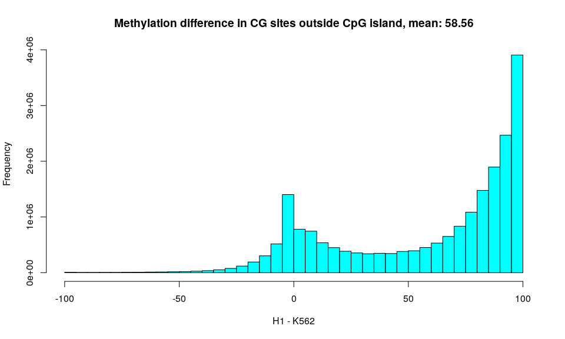
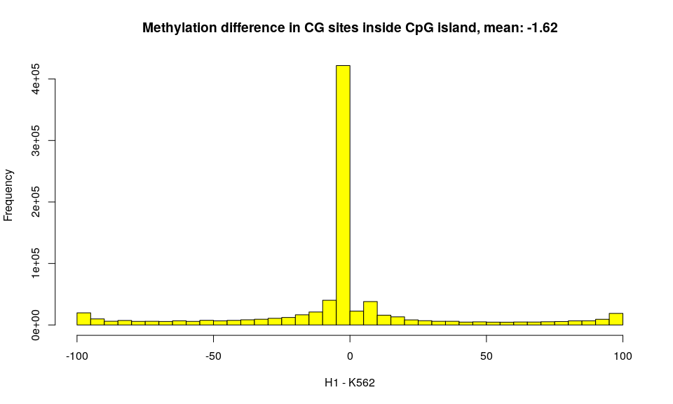
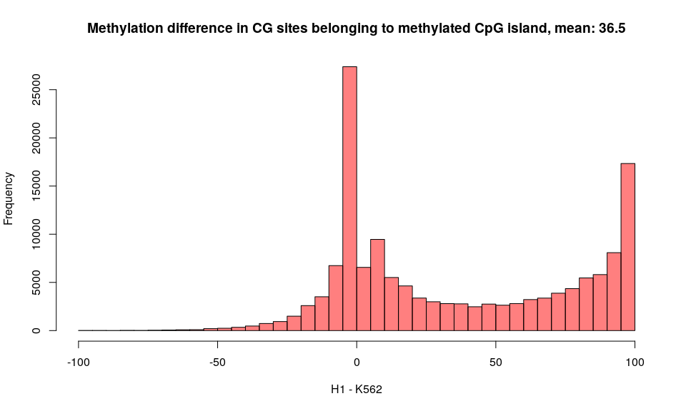
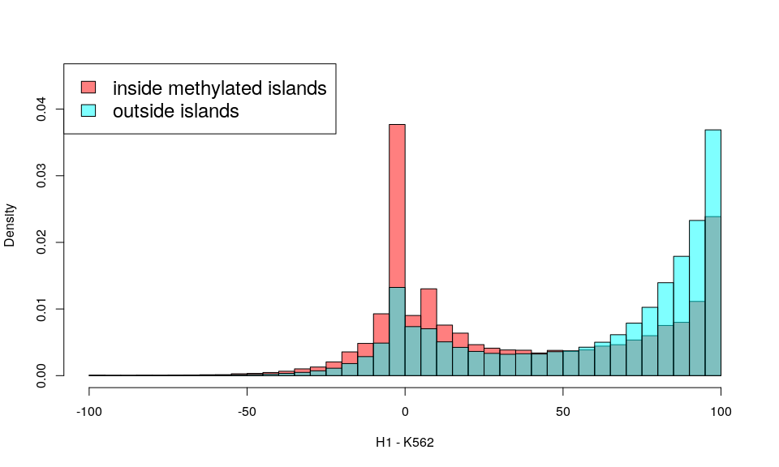

K562 demethylation
================

In order to compare K562 cells methylation with H1 cells we can check the distribution of the difference in the methylation proportion for each site. So for each site I subtract the methylation rate of H1 with the one of K562.

It's interesting to check this difference considering only the Islands that have a high methylation rate: 

