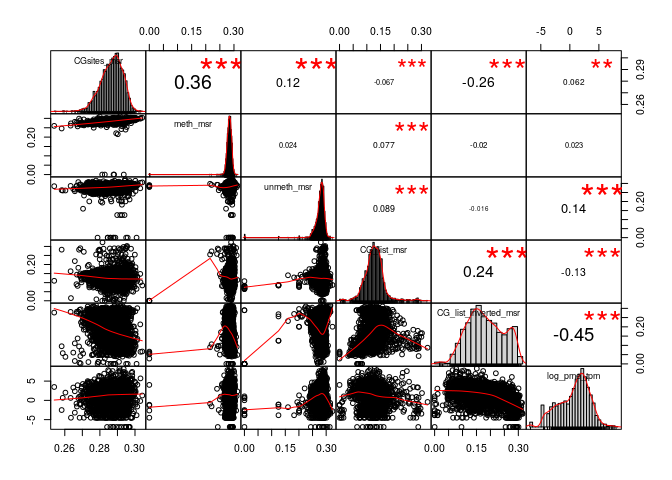
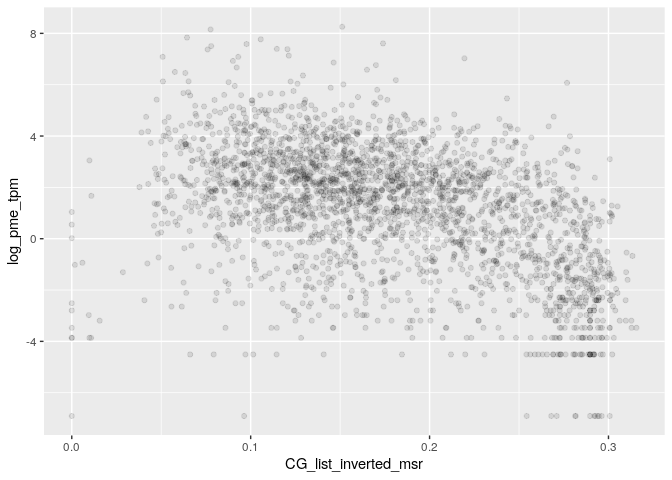
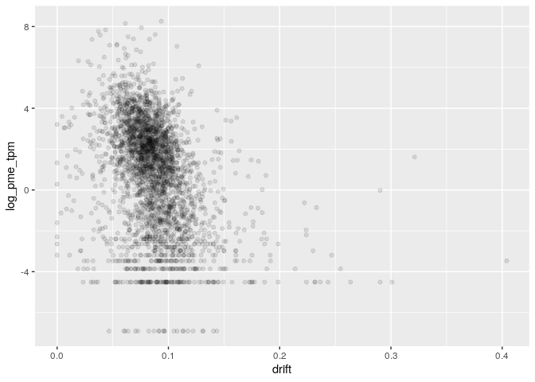
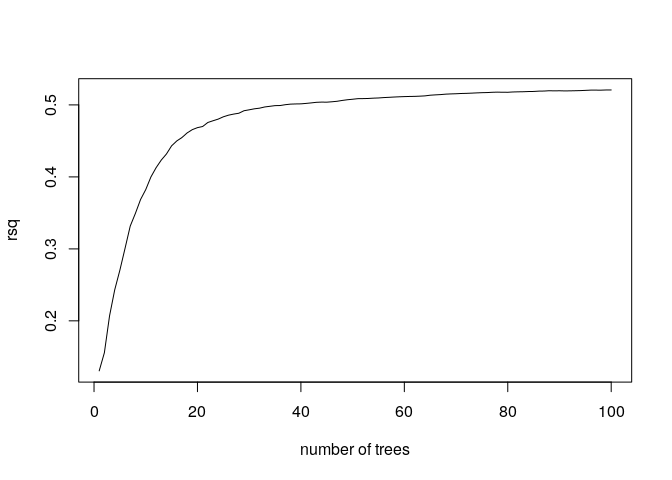

MSR and expression for H1 genes
================

    ## TPM fraction:  0.7970407

    ## protein_coding TPM fraction:  0.6840699

###### Basic features:

###### Comparison with MSR statistics:

meth\_autocorrelation vs log(tpm):

CG\_list\_inverted\_msr vs log(tpm):

meth\_rate\_binary vs log(tpm):

drift vs log(tpm):

    ## missing data:  14.58641 %

    ## train_data_proportion:  0.6

    ## 
    ## 
    ## basic missing data:  0 %

    ## train_data_proportion:  0.6

Linear model for log\_tpm with basic features:

    ## 
    ## Call:
    ## lm(formula = formula, data = train_model_data[, c(response_variable, 
    ##     predictors)])
    ## 
    ## Residuals:
    ##      Min       1Q   Median       3Q      Max 
    ## -10.0284  -1.4168   0.4131   1.5787   8.1881 
    ## 
    ## Coefficients:
    ##                  Estimate Std. Error t value Pr(>|t|)    
    ## (Intercept)       13.4855     0.5123   26.32   <2e-16 ***
    ## log_nucleotides   -5.9048     0.2307  -25.60   <2e-16 ***
    ## CG_density      -108.3638     4.5898  -23.61   <2e-16 ***
    ## log_CG_count       6.8455     0.2440   28.05   <2e-16 ***
    ## meth_rate         -2.9394     0.1694  -17.35   <2e-16 ***
    ## ---
    ## Signif. codes:  0 '***' 0.001 '**' 0.01 '*' 0.05 '.' 0.1 ' ' 1
    ## 
    ## Residual standard error: 2.281 on 10075 degrees of freedom
    ## Multiple R-squared:  0.09763,    Adjusted R-squared:  0.09727 
    ## F-statistic: 272.5 on 4 and 10075 DF,  p-value: < 2.2e-16
    ## 
    ## Test data R squared:  0.116934

    ## 
    ## keeping also data with NA msr features:

    ## predictors:  log_nucleotides CG_density log_CG_count meth_rate 
    ## Test data R squared:  0.231039

Linear model for log\_tpm with basic features with meth\_autocorrelation and drift:

    ## 
    ## Call:
    ## lm(formula = formula, data = train_model_data[, c(response_variable, 
    ##     predictors)])
    ## 
    ## Residuals:
    ##     Min      1Q  Median      3Q     Max 
    ## -7.9438 -1.0368  0.1527  1.1550  9.8703 
    ## 
    ## Coefficients:
    ##                       Estimate Std. Error t value Pr(>|t|)    
    ## (Intercept)            0.64155    0.49254   1.303    0.193    
    ## log_nucleotides       -1.78459    0.19917  -8.960  < 2e-16 ***
    ## CG_density           -22.97570    4.02341  -5.710 1.16e-08 ***
    ## log_CG_count           2.15580    0.21227  10.156  < 2e-16 ***
    ## meth_rate              2.07042    0.15430  13.418  < 2e-16 ***
    ## meth_autocorrelation   5.30655    0.09561  55.503  < 2e-16 ***
    ## drift                -24.92289    0.90742 -27.466  < 2e-16 ***
    ## ---
    ## Signif. codes:  0 '***' 0.001 '**' 0.01 '*' 0.05 '.' 0.1 ' ' 1
    ## 
    ## Residual standard error: 1.852 on 10073 degrees of freedom
    ## Multiple R-squared:  0.4048, Adjusted R-squared:  0.4045 
    ## F-statistic:  1142 on 6 and 10073 DF,  p-value: < 2.2e-16
    ## 
    ## Test data R squared:  0.4130808

    ## 
    ## keeping also data with NA msr features:

    ## predictors:  log_nucleotides CG_density log_CG_count meth_rate meth_autocorrelation drift 
    ## Test data R squared:  0.4551792

Linear model for TPM with all predictors:

    ## 
    ## Call:
    ## lm(formula = formula, data = train_model_data[, c(response_variable, 
    ##     predictors)])
    ## 
    ## Residuals:
    ##     Min      1Q  Median      3Q     Max 
    ## -7.8218 -1.0409  0.1438  1.1519  9.7247 
    ## 
    ## Coefficients:
    ##                      Estimate Std. Error t value Pr(>|t|)    
    ## (Intercept)            6.7230     1.2708   5.290 1.25e-07 ***
    ## log_nucleotides       -1.9927     0.2013  -9.901  < 2e-16 ***
    ## CG_density           -29.3450     4.1419  -7.085 1.48e-12 ***
    ## log_CG_count           2.2292     0.2154  10.351  < 2e-16 ***
    ## meth_rate              2.4284     0.2375  10.226  < 2e-16 ***
    ## meth_autocorrelation   5.1831     0.1377  37.644  < 2e-16 ***
    ## drift                -23.4234     1.0972 -21.349  < 2e-16 ***
    ## CGsites_msr          -13.3114     3.7088  -3.589 0.000333 ***
    ## meth_msr              -6.2890     1.3830  -4.547 5.50e-06 ***
    ## unmeth_msr             1.1868     0.7752   1.531 0.125804    
    ## CG_list_msr            0.9769     0.8700   1.123 0.261542    
    ## CG_list_inverted_msr  -2.0255     0.6519  -3.107 0.001896 ** 
    ## ---
    ## Signif. codes:  0 '***' 0.001 '**' 0.01 '*' 0.05 '.' 0.1 ' ' 1
    ## 
    ## Residual standard error: 1.847 on 10068 degrees of freedom
    ## Multiple R-squared:  0.4083, Adjusted R-squared:  0.4077 
    ## F-statistic: 631.7 on 11 and 10068 DF,  p-value: < 2.2e-16
    ## 
    ## Test data R squared:  0.4158886

Lasso:

    ## lambda: 0.1

    ## 
    ## Test data R squared:  0.3988284

Normalized lasso coefficient:

    ## 11 x 1 sparse Matrix of class "dgCMatrix"
    ##                                 s0
    ## log_nucleotides       .           
    ## CG_density            .           
    ## log_CG_count          0.1074988297
    ## meth_rate             0.0971576667
    ## meth_autocorrelation  1.1738173338
    ## drift                -0.4261163892
    ## CGsites_msr          -0.0001805821
    ## meth_msr              .           
    ## unmeth_msr            .           
    ## CG_list_msr          -0.0643142093
    ## CG_list_inverted_msr  .

Random Forest

    ## predictors:  log_nucleotides CG_density log_CG_count meth_rate meth_autocorrelation drift

    ## 
    ##  test rsq:  0.5120832

Importance

    ##                        %IncMSE IncNodePurity
    ## log_nucleotides      1.5851411      7416.268
    ## CG_density           0.7873145      7333.544
    ## log_CG_count         1.6233786      9329.580
    ## meth_rate            1.3797577     13258.208
    ## meth_autocorrelation 4.8510322     28257.339
    ## drift                1.1790051     12798.905

Performance

