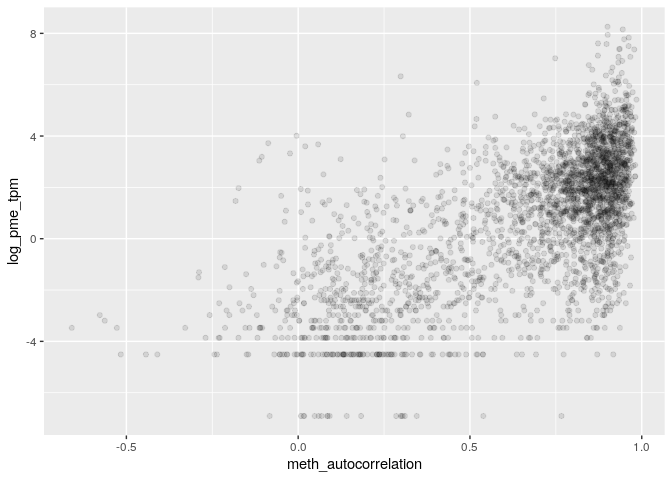
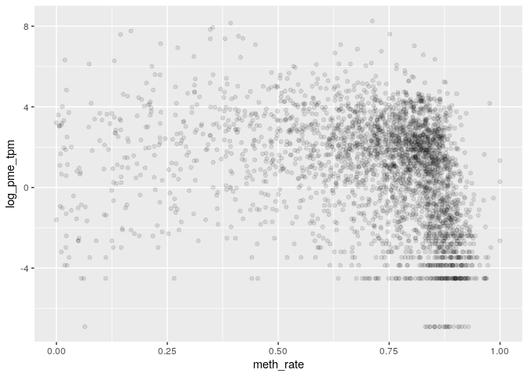

MSR and expression for H1 genes
================

    ## TPM fraction:  0.7970407

    ## protein_coding TPM fraction:  0.6840699

###### Basic features:

###### Comparison with MSR statistics:

meth\_autocorrelation vs log(tpm):

CG\_list\_inverted\_msr vs log(tpm):

meth\_rate\_binary vs log(tpm):

drift vs log(tpm):

    ## missing data:  14.58641 %

    ## train_data_proportion:  0.6

    ## 
    ## 
    ## basic missing data:  0 %

    ## train_data_proportion:  0.6

Linear model for log\_tpm with basic features:

    ## 
    ## Call:
    ## lm(formula = formula, data = train_model_data[, c(response_variable, 
    ##     predictors)])
    ## 
    ## Residuals:
    ##      Min       1Q   Median       3Q      Max 
    ## -10.1078  -1.3938   0.3794   1.5656   7.5359 
    ## 
    ## Coefficients:
    ##                  Estimate Std. Error t value Pr(>|t|)    
    ## (Intercept)       14.0281     0.5170   27.13   <2e-16 ***
    ## log_nucleotides   -6.2190     0.2317  -26.84   <2e-16 ***
    ## CG_density      -112.8636     4.7144  -23.94   <2e-16 ***
    ## log_CG_count       7.2125     0.2461   29.30   <2e-16 ***
    ## meth_rate         -2.9618     0.1699  -17.43   <2e-16 ***
    ## ---
    ## Signif. codes:  0 '***' 0.001 '**' 0.01 '*' 0.05 '.' 0.1 ' ' 1
    ## 
    ## Residual standard error: 2.267 on 10075 degrees of freedom
    ## Multiple R-squared:  0.1033, Adjusted R-squared:  0.103 
    ## F-statistic: 290.2 on 4 and 10075 DF,  p-value: < 2.2e-16
    ## 
    ## Test data R squared:  0.1091397

    ## 
    ## keeping also data with NA msr features:

    ## predictors:  log_nucleotides CG_density log_CG_count meth_rate 
    ## Test data R squared:  0.23613

Linear model for log\_tpm with basic features with meth\_autocorrelation and drift:

    ## 
    ## Call:
    ## lm(formula = formula, data = train_model_data[, c(response_variable, 
    ##     predictors)])
    ## 
    ## Residuals:
    ##     Min      1Q  Median      3Q     Max 
    ## -8.3281 -1.0267  0.1456  1.1598  9.6905 
    ## 
    ## Coefficients:
    ##                       Estimate Std. Error t value Pr(>|t|)    
    ## (Intercept)            0.34142    0.49977   0.683    0.495    
    ## log_nucleotides       -1.72467    0.20147  -8.560  < 2e-16 ***
    ## CG_density           -19.02157    4.16162  -4.571 4.92e-06 ***
    ## log_CG_count           2.09306    0.21566   9.705  < 2e-16 ***
    ## meth_rate              2.05953    0.15507  13.282  < 2e-16 ***
    ## meth_autocorrelation   5.30057    0.09504  55.771  < 2e-16 ***
    ## drift                -22.82878    0.89973 -25.373  < 2e-16 ***
    ## ---
    ## Signif. codes:  0 '***' 0.001 '**' 0.01 '*' 0.05 '.' 0.1 ' ' 1
    ## 
    ## Residual standard error: 1.845 on 10073 degrees of freedom
    ## Multiple R-squared:  0.4067, Adjusted R-squared:  0.4063 
    ## F-statistic:  1151 on 6 and 10073 DF,  p-value: < 2.2e-16
    ## 
    ## Test data R squared:  0.4107893

    ## 
    ## keeping also data with NA msr features:

    ## predictors:  log_nucleotides CG_density log_CG_count meth_rate meth_autocorrelation drift 
    ## Test data R squared:  0.4577739

Linear model for TPM with all predictors:

    ## 
    ## Call:
    ## lm(formula = formula, data = train_model_data[, c(response_variable, 
    ##     predictors)])
    ## 
    ## Residuals:
    ##     Min      1Q  Median      3Q     Max 
    ## -8.1828 -1.0391  0.1239  1.1593  9.1788 
    ## 
    ## Coefficients:
    ##                       Estimate Std. Error t value Pr(>|t|)    
    ## (Intercept)            7.07340    1.25359   5.642 1.72e-08 ***
    ## log_nucleotides       -1.91098    0.20365  -9.384  < 2e-16 ***
    ## CG_density           -24.57066    4.27024  -5.754 8.97e-09 ***
    ## log_CG_count           2.16686    0.21917   9.887  < 2e-16 ***
    ## meth_rate              2.24056    0.23877   9.384  < 2e-16 ***
    ## meth_autocorrelation   5.14480    0.13618  37.780  < 2e-16 ***
    ## drift                -21.23247    1.08581 -19.554  < 2e-16 ***
    ## CGsites_msr          -19.12889    3.61839  -5.287 1.27e-07 ***
    ## meth_msr              -2.62013    1.24462  -2.105  0.03530 *  
    ## unmeth_msr             1.50155    0.79201   1.896  0.05801 .  
    ## CG_list_msr            0.07184    0.87474   0.082  0.93455    
    ## CG_list_inverted_msr  -1.87428    0.65401  -2.866  0.00417 ** 
    ## ---
    ## Signif. codes:  0 '***' 0.001 '**' 0.01 '*' 0.05 '.' 0.1 ' ' 1
    ## 
    ## Residual standard error: 1.84 on 10068 degrees of freedom
    ## Multiple R-squared:  0.4099, Adjusted R-squared:  0.4092 
    ## F-statistic: 635.7 on 11 and 10068 DF,  p-value: < 2.2e-16
    ## 
    ## Test data R squared:  0.4143066

Lasso:

    ## lambda: 0.1

    ## 
    ## Test data R squared:  0.3930399

Normalized lasso coefficient:

    ## 11 x 1 sparse Matrix of class "dgCMatrix"
    ##                               s0
    ## log_nucleotides       .         
    ## CG_density            .         
    ## log_CG_count          0.09281974
    ## meth_rate             0.08167380
    ## meth_autocorrelation  1.18794920
    ## drift                -0.39779799
    ## CGsites_msr          -0.02549565
    ## meth_msr              .         
    ## unmeth_msr            .         
    ## CG_list_msr          -0.06176509
    ## CG_list_inverted_msr  .

Random Forest

    ## predictors:  log_nucleotides CG_density log_CG_count meth_rate meth_autocorrelation drift

    ## 
    ##  test rsq:  0.5181167

Importance

    ##                        %IncMSE IncNodePurity
    ## log_nucleotides      1.6600001      7475.370
    ## CG_density           0.7211925      7428.763
    ## log_CG_count         1.7144266      9291.345
    ## meth_rate            1.3408957     12692.676
    ## meth_autocorrelation 4.6919722     28486.598
    ## drift                1.2665710     12828.133

Performance

    ## Double reads proportion:  0.8871146
    ## Hemimethylation proportion on double reads:  0.04013152

Regions with high predicted expression and low error

    ## 0.3539738

    ## 0.6628444

    ## 0.8160734

    ## 0.9695385

regions with low predicted expression and low error

    ## -1.342111

    ## -1.378506

    ## -1.39219

    ## -1.48974

Regions with true expression &gt;&gt; predicted

    ## 8.219464

    ## 7.268978

    ## 6.88226

    ## 6.876202

Regions with true expression &lt;&lt; predicted

    ## -8.184485

    ## -8.158851

    ## -7.571764

    ## -6.865441
