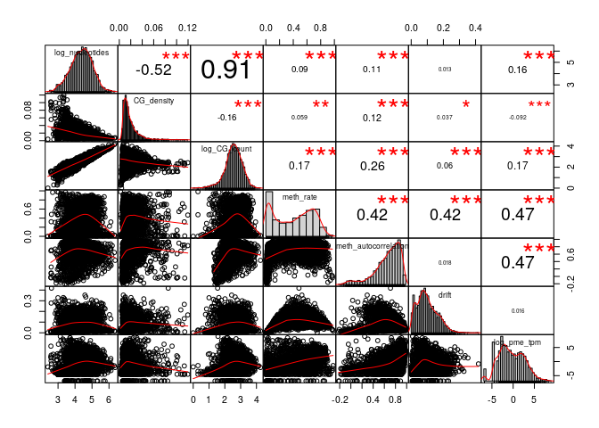
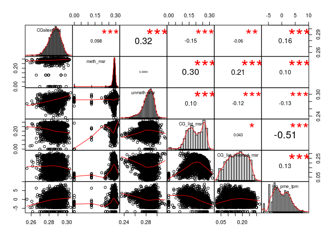
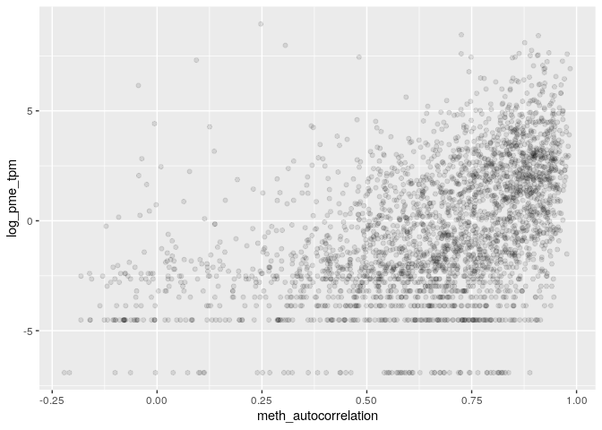
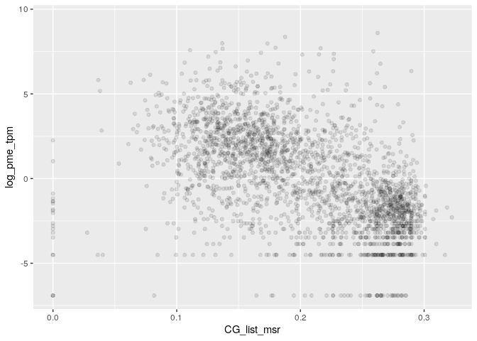
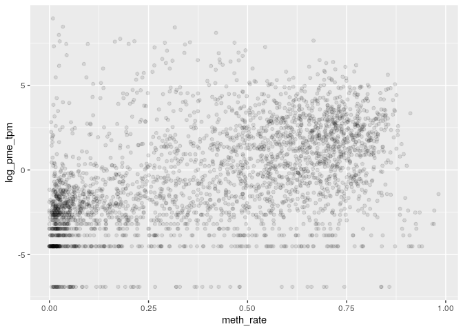
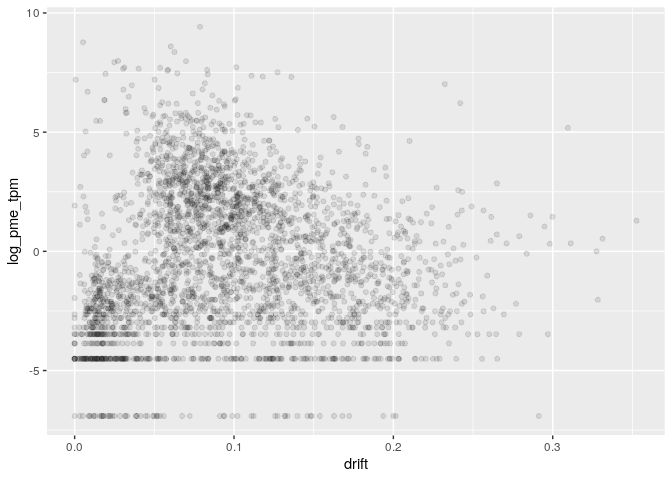
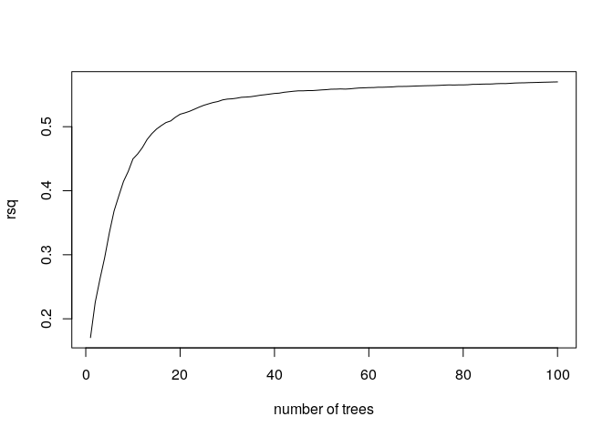
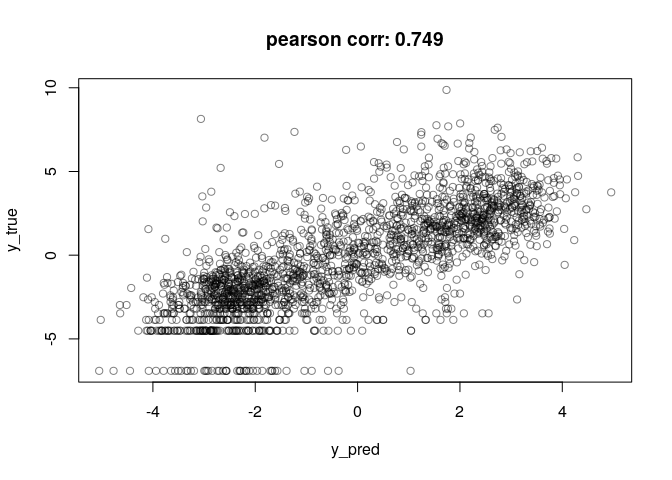

MSR and expression for K562 genes
================

    ## TPM fraction:  0.7816413

    ## protein_coding TPM fraction:  0.7452935

###### Basic features:

###### Comparison with MSR statistics:

meth\_autocorrelation vs log(tpm):

CG\_list\_inverted\_msr vs log(tpm):

meth\_rate\_binary vs log(tpm):

drift vs log(tpm):

    ## missing data:  18.11988 %

    ## train_data_proportion:  0.6

    ## 
    ## 
    ## basic missing data:  0 %

    ## train_data_proportion:  0.6

Linear model for log\_tpm with basic features:

    ## 
    ## Call:
    ## lm(formula = formula, data = train_model_data[, c(response_variable, 
    ##     predictors)])
    ## 
    ## Residuals:
    ##    Min     1Q Median     3Q    Max 
    ## -8.845 -1.365 -0.037  1.275 12.175 
    ## 
    ## Coefficients:
    ##                  Estimate Std. Error t value Pr(>|t|)    
    ## (Intercept)      -0.59589    0.55171  -1.080   0.2801    
    ## log_nucleotides   0.67058    0.24947   2.688   0.0072 ** 
    ## CG_density      -44.76202    4.71025  -9.503  < 2e-16 ***
    ## log_CG_count     -1.47430    0.26431  -5.578  2.5e-08 ***
    ## meth_rate         5.36440    0.09369  57.257  < 2e-16 ***
    ## ---
    ## Signif. codes:  0 '***' 0.001 '**' 0.01 '*' 0.05 '.' 0.1 ' ' 1
    ## 
    ## Residual standard error: 2.339 on 9658 degrees of freedom
    ## Multiple R-squared:  0.3039, Adjusted R-squared:  0.3036 
    ## F-statistic:  1054 on 4 and 9658 DF,  p-value: < 2.2e-16
    ## 
    ## Test data R squared:  0.2962737

    ## 
    ## keeping also data with NA msr features:

    ## predictors:  log_nucleotides CG_density log_CG_count meth_rate 
    ## Test data R squared:  0.246589

Linear model for log\_tpm with basic features with meth\_autocorrelation and drift:

    ## 
    ## Call:
    ## lm(formula = formula, data = train_model_data[, c(response_variable, 
    ##     predictors)])
    ## 
    ## Residuals:
    ##     Min      1Q  Median      3Q     Max 
    ## -9.2260 -1.2244 -0.0382  1.1952 12.5562 
    ## 
    ## Coefficients:
    ##                       Estimate Std. Error t value Pr(>|t|)    
    ## (Intercept)           -8.10857    0.55626 -14.577  < 2e-16 ***
    ## log_nucleotides        2.49961    0.22929  10.902  < 2e-16 ***
    ## CG_density           -27.77077    4.24659  -6.540 6.48e-11 ***
    ## log_CG_count          -3.17896    0.24077 -13.203  < 2e-16 ***
    ## meth_rate              4.73381    0.09434  50.179  < 2e-16 ***
    ## meth_autocorrelation   5.96674    0.16347  36.501  < 2e-16 ***
    ## drift                 -4.62566    0.46685  -9.908  < 2e-16 ***
    ## ---
    ## Signif. codes:  0 '***' 0.001 '**' 0.01 '*' 0.05 '.' 0.1 ' ' 1
    ## 
    ## Residual standard error: 2.089 on 9656 degrees of freedom
    ## Multiple R-squared:  0.4447, Adjusted R-squared:  0.4444 
    ## F-statistic:  1289 on 6 and 9656 DF,  p-value: < 2.2e-16
    ## 
    ## Test data R squared:  0.4371575

    ## 
    ## keeping also data with NA msr features:

    ## predictors:  log_nucleotides CG_density log_CG_count meth_rate meth_autocorrelation drift 
    ## Test data R squared:  0.384843

Linear model for TPM with all predictors:

    ## 
    ## Call:
    ## lm(formula = formula, data = train_model_data[, c(response_variable, 
    ##     predictors)])
    ## 
    ## Residuals:
    ##     Min      1Q  Median      3Q     Max 
    ## -9.1854 -1.2013 -0.0059  1.1591 12.8382 
    ## 
    ## Coefficients:
    ##                      Estimate Std. Error t value Pr(>|t|)    
    ## (Intercept)           -8.3312     1.4525  -5.736 1.00e-08 ***
    ## log_nucleotides        2.2828     0.2321   9.834  < 2e-16 ***
    ## CG_density           -30.4525     4.3224  -7.045 1.98e-12 ***
    ## log_CG_count          -2.4721     0.2435 -10.151  < 2e-16 ***
    ## meth_rate              2.5210     0.2828   8.914  < 2e-16 ***
    ## meth_autocorrelation   4.0323     0.2053  19.638  < 2e-16 ***
    ## drift                  3.4165     0.7418   4.606 4.16e-06 ***
    ## CGsites_msr            6.6071     3.9954   1.654 0.098220 .  
    ## meth_msr              11.6754     1.1475  10.175  < 2e-16 ***
    ## unmeth_msr            -2.6453     2.1196  -1.248 0.212052    
    ## CG_list_msr          -14.9476     1.0867 -13.755  < 2e-16 ***
    ## CG_list_inverted_msr  -3.3904     0.9129  -3.714 0.000205 ***
    ## ---
    ## Signif. codes:  0 '***' 0.001 '**' 0.01 '*' 0.05 '.' 0.1 ' ' 1
    ## 
    ## Residual standard error: 2.056 on 9651 degrees of freedom
    ## Multiple R-squared:  0.4625, Adjusted R-squared:  0.4619 
    ## F-statistic: 755.1 on 11 and 9651 DF,  p-value: < 2.2e-16
    ## 
    ## Test data R squared:  0.4552212

Lasso:

    ## lambda: 0.1

    ## 
    ## Test data R squared:  0.4454737

Normalized lasso coefficient:

    ## 11 x 1 sparse Matrix of class "dgCMatrix"
    ##                              s0
    ## log_nucleotides       .        
    ## CG_density           -0.7686417
    ## log_CG_count          .        
    ## meth_rate             0.5328008
    ## meth_autocorrelation  0.6036090
    ## drift                 .        
    ## CGsites_msr           .        
    ## meth_msr              0.2190297
    ## unmeth_msr            .        
    ## CG_list_msr          -0.8531962
    ## CG_list_inverted_msr  .

Random Forest

    ## predictors:  log_nucleotides CG_density log_CG_count meth_rate meth_autocorrelation drift

    ## 
    ##  test rsq:  0.5624047

Importance

    ##                       %IncMSE IncNodePurity
    ## log_nucleotides      2.327472     10706.267
    ## CG_density           2.627016     14618.076
    ## log_CG_count         1.564238      8808.443
    ## meth_rate            6.036035     23141.625
    ## meth_autocorrelation 3.418777     20028.134
    ## drift                2.675451     15219.713

Performance

