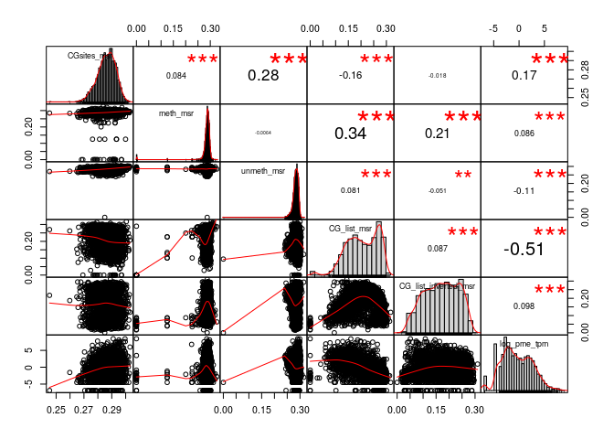
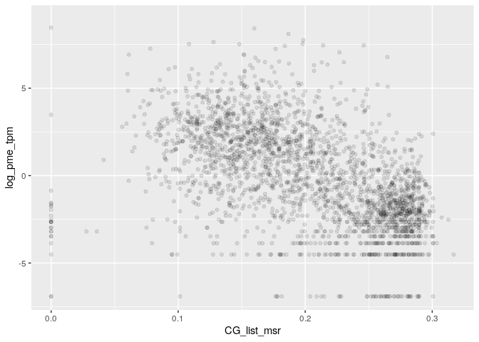
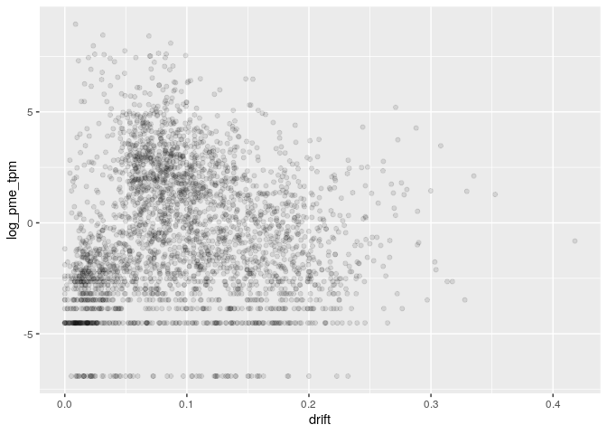
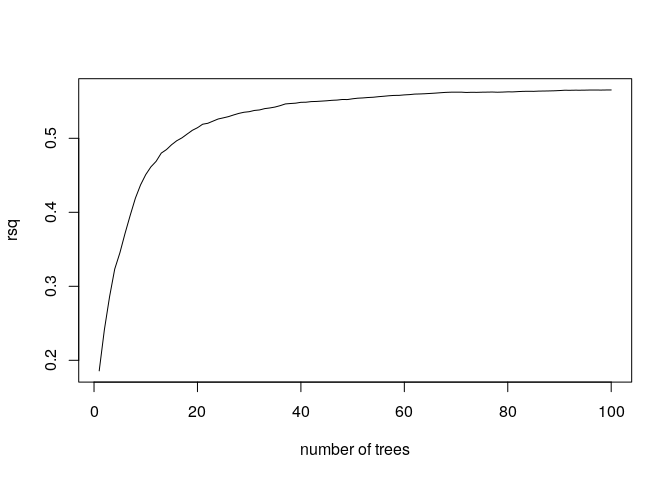
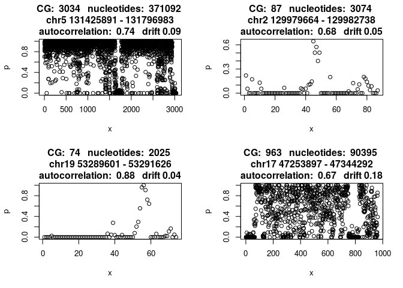

MSR and expression for K562 genes
================

    ## TPM fraction:  0.7816413

    ## protein_coding TPM fraction:  0.7452935

###### Basic features:

###### Comparison with MSR statistics:

meth\_autocorrelation vs log(tpm):

CG\_list\_inverted\_msr vs log(tpm):

meth\_rate\_binary vs log(tpm):

drift vs log(tpm):

    ## missing data:  18.11988 %

    ## train_data_proportion:  0.6

    ## 
    ## 
    ## basic missing data:  0 %

    ## train_data_proportion:  0.6

Linear model for log\_tpm with basic features:

    ## 
    ## Call:
    ## lm(formula = formula, data = train_model_data[, c(response_variable, 
    ##     predictors)])
    ## 
    ## Residuals:
    ##     Min      1Q  Median      3Q     Max 
    ## -8.6229 -1.3588 -0.0148  1.2924 12.0724 
    ## 
    ## Coefficients:
    ##                  Estimate Std. Error t value Pr(>|t|)    
    ## (Intercept)      -0.45919    0.53357  -0.861   0.3895    
    ## log_nucleotides   0.55658    0.24189   2.301   0.0214 *  
    ## CG_density      -45.06141    4.46319 -10.096  < 2e-16 ***
    ## log_CG_count     -1.30630    0.25659  -5.091 3.63e-07 ***
    ## meth_rate         5.28567    0.09211  57.383  < 2e-16 ***
    ## ---
    ## Signif. codes:  0 '***' 0.001 '**' 0.01 '*' 0.05 '.' 0.1 ' ' 1
    ## 
    ## Residual standard error: 2.311 on 9658 degrees of freedom
    ## Multiple R-squared:  0.3035, Adjusted R-squared:  0.3032 
    ## F-statistic:  1052 on 4 and 9658 DF,  p-value: < 2.2e-16
    ## 
    ## Test data R squared:  0.2974893

    ## 
    ## keeping also data with NA msr features:

    ## predictors:  log_nucleotides CG_density log_CG_count meth_rate 
    ## Test data R squared:  0.2586815

Linear model for log\_tpm with basic features with meth\_autocorrelation and drift:

    ## 
    ## Call:
    ## lm(formula = formula, data = train_model_data[, c(response_variable, 
    ##     predictors)])
    ## 
    ## Residuals:
    ##     Min      1Q  Median      3Q     Max 
    ## -7.8194 -1.2055 -0.0306  1.2008 10.7406 
    ## 
    ## Coefficients:
    ##                       Estimate Std. Error t value Pr(>|t|)    
    ## (Intercept)           -8.51864    0.54294 -15.690  < 2e-16 ***
    ## log_nucleotides        2.56711    0.22284  11.520  < 2e-16 ***
    ## CG_density           -24.77834    4.02939  -6.149 8.09e-10 ***
    ## log_CG_count          -3.17575    0.23401 -13.571  < 2e-16 ***
    ## meth_rate              4.60163    0.09261  49.688  < 2e-16 ***
    ## meth_autocorrelation   6.08477    0.16285  37.365  < 2e-16 ***
    ## drift                 -4.17726    0.45930  -9.095  < 2e-16 ***
    ## ---
    ## Signif. codes:  0 '***' 0.001 '**' 0.01 '*' 0.05 '.' 0.1 ' ' 1
    ## 
    ## Residual standard error: 2.062 on 9656 degrees of freedom
    ## Multiple R-squared:  0.4455, Adjusted R-squared:  0.4452 
    ## F-statistic:  1293 on 6 and 9656 DF,  p-value: < 2.2e-16
    ## 
    ## Test data R squared:  0.4368803

    ## 
    ## keeping also data with NA msr features:

    ## predictors:  log_nucleotides CG_density log_CG_count meth_rate meth_autocorrelation drift 
    ## Test data R squared:  0.39393

Linear model for TPM with all predictors:

    ## 
    ## Call:
    ## lm(formula = formula, data = train_model_data[, c(response_variable, 
    ##     predictors)])
    ## 
    ## Residuals:
    ##     Min      1Q  Median      3Q     Max 
    ## -9.2383 -1.1731 -0.0234  1.1538 10.7292 
    ## 
    ## Coefficients:
    ##                      Estimate Std. Error t value Pr(>|t|)    
    ## (Intercept)           -7.4402     1.4415  -5.162 2.50e-07 ***
    ## log_nucleotides        2.3321     0.2253  10.351  < 2e-16 ***
    ## CG_density           -27.9728     4.0951  -6.831 8.95e-12 ***
    ## log_CG_count          -2.4532     0.2360 -10.397  < 2e-16 ***
    ## meth_rate              2.3998     0.2863   8.384  < 2e-16 ***
    ## meth_autocorrelation   4.0787     0.2050  19.897  < 2e-16 ***
    ## drift                  4.7125     0.7215   6.532 6.83e-11 ***
    ## CGsites_msr            3.1503     3.9638   0.795    0.427    
    ## meth_msr              11.8057     1.1789  10.015  < 2e-16 ***
    ## unmeth_msr            -2.9701     2.1736  -1.366    0.172    
    ## CG_list_msr          -15.5327     1.1122 -13.966  < 2e-16 ***
    ## CG_list_inverted_msr  -4.1499     0.9002  -4.610 4.07e-06 ***
    ## ---
    ## Signif. codes:  0 '***' 0.001 '**' 0.01 '*' 0.05 '.' 0.1 ' ' 1
    ## 
    ## Residual standard error: 2.025 on 9651 degrees of freedom
    ## Multiple R-squared:  0.4656, Adjusted R-squared:  0.465 
    ## F-statistic: 764.4 on 11 and 9651 DF,  p-value: < 2.2e-16
    ## 
    ## Test data R squared:  0.4512016

Lasso:

    ## lambda: 0.1

    ## 
    ## Test data R squared:  0.4394296

Normalized lasso coefficient:

    ## 11 x 1 sparse Matrix of class "dgCMatrix"
    ##                              s0
    ## log_nucleotides       .        
    ## CG_density           -0.7557909
    ## log_CG_count          .        
    ## meth_rate             0.5303542
    ## meth_autocorrelation  0.6124922
    ## drift                 .        
    ## CGsites_msr           .        
    ## meth_msr              0.1983267
    ## unmeth_msr            .        
    ## CG_list_msr          -0.8322120
    ## CG_list_inverted_msr  .

Random Forest

    ## predictors:  log_nucleotides CG_density log_CG_count meth_rate meth_autocorrelation drift

    ## 
    ##  test rsq:  0.5685

Importance

    ##                       %IncMSE IncNodePurity
    ## log_nucleotides      2.404497     10853.899
    ## CG_density           2.446640     14702.240
    ## log_CG_count         1.509005      8618.408
    ## meth_rate            6.115503     22868.303
    ## meth_autocorrelation 3.407353     20911.385
    ## drift                2.517950     14498.656

Performance

Interpretation

    ## Double reads proportion:  0.9316094
    ## Hemimethylation proportion on double reads:  0.01575834

Regions with high predicted expression and low error

    ## -4.600312e-05

    ## 0.323871

    ## 0.4454601

    ## 0.8219401

regions with low predicted expression and low error

    ## -0.8992155

    ## -0.9444062

    ## -0.9473352

    ## -0.982586

Regions with true expression &gt;&gt; predicted

    ## 10.73996

    ## 9.400097

    ## 8.833727

    ## 8.798096

Regions with true expression &lt;&lt; predicted

    ## -9.217347

    ## -8.416477

    ## -8.205722

    ## -7.365206
