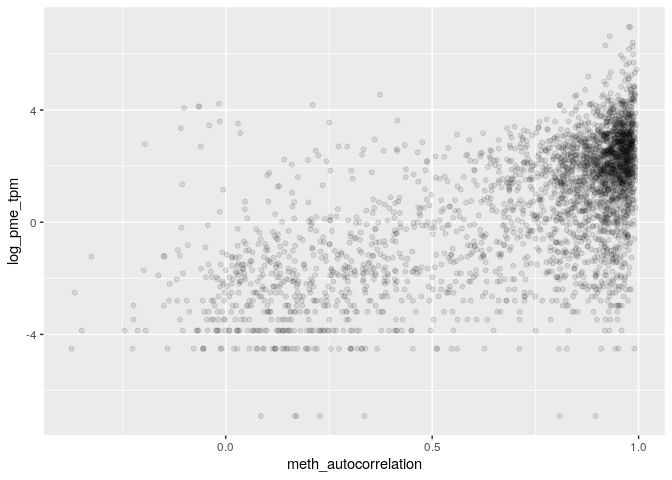

MSR and expression for endodermal cell genes
================

    ## TPM fraction:  0.7251034

    ## protein_coding TPM fraction:  0.2631708

###### Basic features:

###### Comparison with MSR statistics:

meth\_autocorrelation vs log(tpm):

CG\_list\_inverted\_msr vs log(tpm):

meth\_rate\_binary vs log(tpm):

drift vs log(tpm):

    ## missing data:  16.26926 %

    ## train_data_proportion:  0.7

    ## 
    ## 
    ## basic missing data:  0 %

    ## train_data_proportion:  0.7

Linear model for log\_tpm with basic features:

    ## 
    ## Call:
    ## lm(formula = formula, data = train_model_data[, c(response_variable, 
    ##     predictors)])
    ## 
    ## Residuals:
    ##     Min      1Q  Median      3Q     Max 
    ## -8.7965 -1.3638  0.3792  1.4554  6.5368 
    ## 
    ## Coefficients:
    ##                 Estimate Std. Error t value Pr(>|t|)    
    ## (Intercept)       8.9800     0.4390   20.46   <2e-16 ***
    ## log_nucleotides  -3.7505     0.1968  -19.06   <2e-16 ***
    ## CG_density      -81.5073     4.0593  -20.08   <2e-16 ***
    ## log_CG_count      4.8783     0.2086   23.38   <2e-16 ***
    ## meth_rate        -3.7297     0.1426  -26.16   <2e-16 ***
    ## ---
    ## Signif. codes:  0 '***' 0.001 '**' 0.01 '*' 0.05 '.' 0.1 ' ' 1
    ## 
    ## Residual standard error: 1.985 on 11523 degrees of freedom
    ## Multiple R-squared:  0.0939, Adjusted R-squared:  0.09359 
    ## F-statistic: 298.5 on 4 and 11523 DF,  p-value: < 2.2e-16
    ## 
    ## Test data R squared:  0.1078347

    ## 
    ## keeping also data with NA msr features:

    ## predictors:  log_nucleotides CG_density log_CG_count meth_rate 
    ## Test data R squared:  0.2200544

Linear model for log\_tpm with basic features with meth\_autocorrelation and drift:

    ## 
    ## Call:
    ## lm(formula = formula, data = train_model_data[, c(response_variable, 
    ##     predictors)])
    ## 
    ## Residuals:
    ##     Min      1Q  Median      3Q     Max 
    ## -8.1388 -0.8464  0.1524  0.9667 11.3408 
    ## 
    ## Coefficients:
    ##                       Estimate Std. Error t value Pr(>|t|)    
    ## (Intercept)           -0.39765    0.40197  -0.989  0.32256    
    ## log_nucleotides       -0.51893    0.16575  -3.131  0.00175 ** 
    ## CG_density           -13.94049    3.38279  -4.121 3.80e-05 ***
    ## log_CG_count           1.01426    0.17774   5.707 1.18e-08 ***
    ## meth_rate              0.01002    0.12468   0.080  0.93597    
    ## meth_autocorrelation   3.78728    0.07595  49.866  < 2e-16 ***
    ## drift                -23.17006    0.56120 -41.286  < 2e-16 ***
    ## ---
    ## Signif. codes:  0 '***' 0.001 '**' 0.01 '*' 0.05 '.' 0.1 ' ' 1
    ## 
    ## Residual standard error: 1.583 on 11521 degrees of freedom
    ## Multiple R-squared:  0.4233, Adjusted R-squared:  0.423 
    ## F-statistic:  1409 on 6 and 11521 DF,  p-value: < 2.2e-16
    ## 
    ## Test data R squared:  0.4422445

    ## 
    ## keeping also data with NA msr features:

    ## predictors:  log_nucleotides CG_density log_CG_count meth_rate meth_autocorrelation drift 
    ## Test data R squared:  0.4730143

Linear model for TPM with all predictors:

    ## 
    ## Call:
    ## lm(formula = formula, data = train_model_data[, c(response_variable, 
    ##     predictors)])
    ## 
    ## Residuals:
    ##     Min      1Q  Median      3Q     Max 
    ## -8.1518 -0.8430  0.1484  0.9662 11.2205 
    ## 
    ## Coefficients:
    ##                      Estimate Std. Error t value Pr(>|t|)    
    ## (Intercept)            0.5603     1.0001   0.560 0.575350    
    ## log_nucleotides       -0.6039     0.1669  -3.619 0.000297 ***
    ## CG_density           -14.7949     3.4588  -4.277 1.91e-05 ***
    ## log_CG_count           1.0329     0.1780   5.804 6.66e-09 ***
    ## meth_rate              0.6675     0.1742   3.831 0.000128 ***
    ## meth_autocorrelation   3.3447     0.1145  29.215  < 2e-16 ***
    ## drift                -23.1323     0.6880 -33.621  < 2e-16 ***
    ## CGsites_msr           -8.3162     2.9727  -2.797 0.005159 ** 
    ## meth_msr               2.3901     1.2009   1.990 0.046586 *  
    ## unmeth_msr             3.8520     0.6071   6.345 2.31e-10 ***
    ## CG_list_msr            3.0025     0.6564   4.574 4.83e-06 ***
    ## CG_list_inverted_msr  -2.7894     0.4859  -5.741 9.66e-09 ***
    ## ---
    ## Signif. codes:  0 '***' 0.001 '**' 0.01 '*' 0.05 '.' 0.1 ' ' 1
    ## 
    ## Residual standard error: 1.579 on 11516 degrees of freedom
    ## Multiple R-squared:  0.4267, Adjusted R-squared:  0.4262 
    ## F-statistic: 779.3 on 11 and 11516 DF,  p-value: < 2.2e-16
    ## 
    ## Test data R squared:  0.444104

Lasso:

    ## lambda: 0.1

    ## 
    ## Test data R squared:  0.4311533

Normalized lasso coefficient:

    ## 11 x 1 sparse Matrix of class "dgCMatrix"
    ##                              s0
    ## log_nucleotides       .        
    ## CG_density            .        
    ## log_CG_count          0.1057630
    ## meth_rate             .        
    ## meth_autocorrelation  0.8539282
    ## drift                -0.6010923
    ## CGsites_msr           .        
    ## meth_msr              .        
    ## unmeth_msr            .        
    ## CG_list_msr           .        
    ## CG_list_inverted_msr  .

Random Forest

    ## predictors:  log_nucleotides CG_density log_CG_count meth_rate meth_autocorrelation drift

    ## 
    ##  test rsq:  0.5485705

Importance

    ##                        %IncMSE IncNodePurity
    ## log_nucleotides      1.0719870      6057.658
    ## CG_density           0.3902148      5212.270
    ## log_CG_count         1.0775707      7672.083
    ## meth_rate            1.0488015     10751.384
    ## meth_autocorrelation 2.8751631     21758.512
    ## drift                1.7940775     17517.100

Performance

