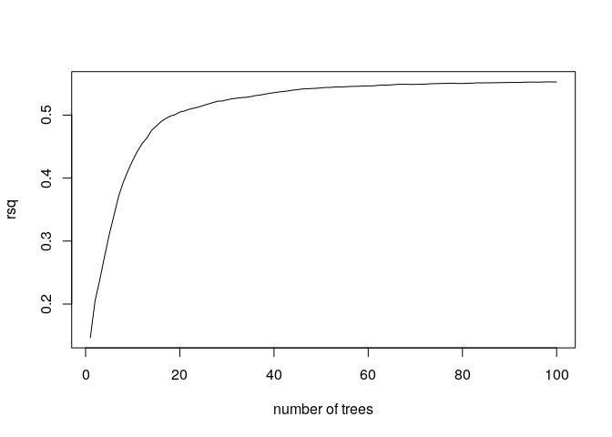
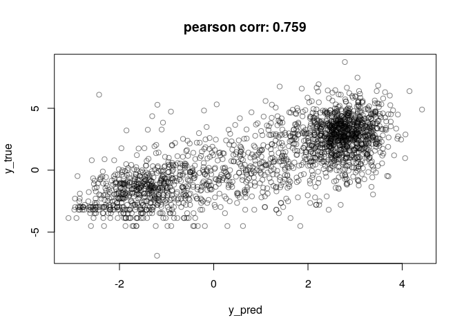

MSR and expression for gm23248 genes
================

    ## TPM fraction:  0.8612678

    ## protein_coding TPM fraction:  0.8200301

###### Basic features:

###### Comparison with MSR statistics:

meth\_autocorrelation vs log(tpm):

CG\_list\_inverted\_msr vs log(tpm):

meth\_rate\_binary vs log(tpm):

drift vs log(tpm):

    ## missing data:  13.78311 %

    ## train_data_proportion:  0.6

    ## 
    ## 
    ## basic missing data:  0 %

    ## train_data_proportion:  0.6

Linear model for log\_tpm with basic features:

    ## 
    ## Call:
    ## lm(formula = formula, data = train_model_data[, c(response_variable, 
    ##     predictors)])
    ## 
    ## Residuals:
    ##     Min      1Q  Median      3Q     Max 
    ## -8.7458 -1.6811  0.2101  1.6772  9.4633 
    ## 
    ## Coefficients:
    ##                 Estimate Std. Error t value Pr(>|t|)    
    ## (Intercept)       6.5607     0.5474  11.985   <2e-16 ***
    ## log_nucleotides  -3.3203     0.2438 -13.617   <2e-16 ***
    ## CG_density      -45.7646     4.9534  -9.239   <2e-16 ***
    ## log_CG_count      3.1947     0.2595  12.309   <2e-16 ***
    ## meth_rate         3.1670     0.1496  21.172   <2e-16 ***
    ## ---
    ## Signif. codes:  0 '***' 0.001 '**' 0.01 '*' 0.05 '.' 0.1 ' ' 1
    ## 
    ## Residual standard error: 2.348 on 10169 degrees of freedom
    ## Multiple R-squared:  0.06797,    Adjusted R-squared:  0.0676 
    ## F-statistic: 185.4 on 4 and 10169 DF,  p-value: < 2.2e-16
    ## 
    ## Test data R squared:  0.08795003

    ## 
    ## keeping also data with NA msr features:

    ## predictors:  log_nucleotides CG_density log_CG_count meth_rate 
    ## Test data R squared:  0.1088798

Linear model for log\_tpm with basic features with meth\_autocorrelation and drift:

    ## 
    ## Call:
    ## lm(formula = formula, data = train_model_data[, c(response_variable, 
    ##     predictors)])
    ## 
    ## Residuals:
    ##     Min      1Q  Median      3Q     Max 
    ## -6.9596 -1.1000  0.0387  1.0881 10.0101 
    ## 
    ## Coefficients:
    ##                       Estimate Std. Error t value Pr(>|t|)    
    ## (Intercept)            0.06282    0.49408   0.127  0.89882    
    ## log_nucleotides       -0.18214    0.19263  -0.946  0.34439    
    ## CG_density           -29.80844    3.92344  -7.598 3.28e-14 ***
    ## log_CG_count           0.64087    0.20515   3.124  0.00179 ** 
    ## meth_rate              0.67452    0.12725   5.301 1.18e-07 ***
    ## meth_autocorrelation   3.78564    0.14368  26.347  < 2e-16 ***
    ## drift                -19.37911    0.51054 -37.958  < 2e-16 ***
    ## ---
    ## Signif. codes:  0 '***' 0.001 '**' 0.01 '*' 0.05 '.' 0.1 ' ' 1
    ## 
    ## Residual standard error: 1.764 on 10167 degrees of freedom
    ## Multiple R-squared:  0.4741, Adjusted R-squared:  0.4738 
    ## F-statistic:  1528 on 6 and 10167 DF,  p-value: < 2.2e-16
    ## 
    ## Test data R squared:  0.4678723

    ## 
    ## keeping also data with NA msr features:

    ## predictors:  log_nucleotides CG_density log_CG_count meth_rate meth_autocorrelation drift 
    ## Test data R squared:  0.4945448

Linear model for TPM with all predictors:

    ## 
    ## Call:
    ## lm(formula = formula, data = train_model_data[, c(response_variable, 
    ##     predictors)])
    ## 
    ## Residuals:
    ##     Min      1Q  Median      3Q     Max 
    ## -6.9615 -1.1091  0.0435  1.0872 10.0405 
    ## 
    ## Coefficients:
    ##                       Estimate Std. Error t value Pr(>|t|)    
    ## (Intercept)            3.98875    1.29576   3.078 0.002087 ** 
    ## log_nucleotides       -0.03156    0.20203  -0.156 0.875884    
    ## CG_density           -31.06670    4.04629  -7.678 1.77e-14 ***
    ## log_CG_count           0.39367    0.21430   1.837 0.066237 .  
    ## meth_rate              1.43959    0.31730   4.537 5.77e-06 ***
    ## meth_autocorrelation   3.70773    0.17246  21.499  < 2e-16 ***
    ## drift                -18.62534    0.62206 -29.941  < 2e-16 ***
    ## CGsites_msr          -18.57435    3.50371  -5.301 1.17e-07 ***
    ## meth_msr              -4.29652    1.85073  -2.322 0.020278 *  
    ## unmeth_msr             8.85495    1.56941   5.642 1.72e-08 ***
    ## CG_list_msr            1.81983    1.22319   1.488 0.136843    
    ## CG_list_inverted_msr  -3.26770    0.88342  -3.699 0.000218 ***
    ## ---
    ## Signif. codes:  0 '***' 0.001 '**' 0.01 '*' 0.05 '.' 0.1 ' ' 1
    ## 
    ## Residual standard error: 1.757 on 10162 degrees of freedom
    ## Multiple R-squared:  0.4784, Adjusted R-squared:  0.4778 
    ## F-statistic: 847.2 on 11 and 10162 DF,  p-value: < 2.2e-16
    ## 
    ## Test data R squared:  0.4717421

Lasso:

    ## lambda: 0.1

    ## 
    ## Test data R squared:  0.4583056

Normalized lasso coefficient:

    ## 11 x 1 sparse Matrix of class "dgCMatrix"
    ##                               s0
    ## log_nucleotides       0.15961189
    ## CG_density           -0.15840109
    ## log_CG_count          .         
    ## meth_rate             0.05806934
    ## meth_autocorrelation  0.64930159
    ## drift                -0.95137592
    ## CGsites_msr           .         
    ## meth_msr              .         
    ## unmeth_msr            .         
    ## CG_list_msr          -0.10529440
    ## CG_list_inverted_msr  .

Random Forest

    ## predictors:  log_nucleotides CG_density log_CG_count meth_rate meth_autocorrelation drift

    ## 
    ##  test rsq:  0.5690826

Importance

    ##                        %IncMSE IncNodePurity
    ## log_nucleotides      1.4631390      6995.209
    ## CG_density           0.5806595      6020.944
    ## log_CG_count         1.1768625      8112.391
    ## meth_rate            1.3355520      7970.705
    ## meth_autocorrelation 3.2047704     19027.164
    ## drift                3.8485799     25940.915

Performance

