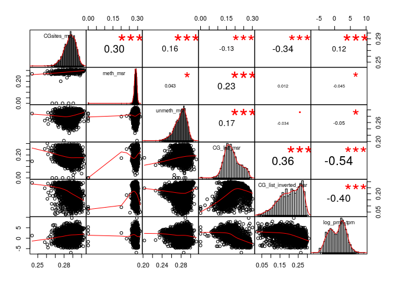
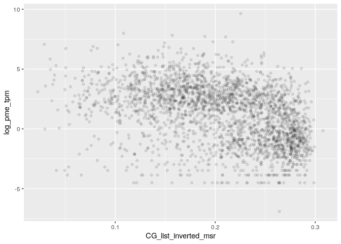

MSR and expression for gm23248, windows of 1000 sites, extended genes set
================

    ## TPM fraction:  0.8612678

    ## protein_coding TPM fraction:  0.8200301

###### Basic features:

###### Comparison with MSR statistics:

meth\_autocorrelation vs log(tpm): 

CG\_list\_inverted\_msr vs log(tpm): 

meth\_rate\_binary vs log(tpm): 

drift vs log(tpm): 

    ## missing data:  13.78311 %

    ## 
    ## train_data_proportion:  0.6

    ## 
    ## 
    ## basic missing data:  0 %

    ## 
    ## train_data_proportion:  0.6

Linear model for log\_tpm with basic features:

    ## 
    ## Call:
    ## lm(formula = formula, data = train_model_data[, c(response_variable, 
    ##     predictors)])
    ## 
    ## Residuals:
    ##     Min      1Q  Median      3Q     Max 
    ## -8.3584 -1.7270  0.1985  1.6835  9.1059 
    ## 
    ## Coefficients:
    ##                 Estimate Std. Error t value Pr(>|t|)    
    ## (Intercept)       7.3623     0.5400   13.63   <2e-16 ***
    ## log_nucleotides  -3.7336     0.2408  -15.51   <2e-16 ***
    ## CG_density      -51.3403     4.8212  -10.65   <2e-16 ***
    ## log_CG_count      3.6295     0.2573   14.11   <2e-16 ***
    ## meth_rate         3.2457     0.1494   21.73   <2e-16 ***
    ## ---
    ## Signif. codes:  0 '***' 0.001 '**' 0.01 '*' 0.05 '.' 0.1 ' ' 1
    ## 
    ## Residual standard error: 2.356 on 10169 degrees of freedom
    ## Multiple R-squared:  0.07645,    Adjusted R-squared:  0.07609 
    ## F-statistic: 210.4 on 4 and 10169 DF,  p-value: < 2.2e-16
    ## 
    ## Test data R squared:  0.07590995

Linear model for log\_tpm with basic features with meth\_autocorrelation and drift:

    ## 
    ## Call:
    ## lm(formula = formula, data = train_model_data[, c(response_variable, 
    ##     predictors)])
    ## 
    ## Residuals:
    ##     Min      1Q  Median      3Q     Max 
    ## -7.0154 -1.1315  0.0431  1.1051  9.6866 
    ## 
    ## Coefficients:
    ##                      Estimate Std. Error t value Pr(>|t|)    
    ## (Intercept)            0.2282     0.5004   0.456   0.6483    
    ## log_nucleotides       -0.3841     0.1941  -1.979   0.0478 *  
    ## CG_density           -31.9623     3.9165  -8.161 3.72e-16 ***
    ## log_CG_count           0.8479     0.2075   4.087 4.41e-05 ***
    ## meth_rate              0.9062     0.1282   7.066 1.70e-12 ***
    ## meth_autocorrelation   3.9151     0.1432  27.333  < 2e-16 ***
    ## drift                -19.0343     0.5177 -36.770  < 2e-16 ***
    ## ---
    ## Signif. codes:  0 '***' 0.001 '**' 0.01 '*' 0.05 '.' 0.1 ' ' 1
    ## 
    ## Residual standard error: 1.787 on 10167 degrees of freedom
    ## Multiple R-squared:  0.4687, Adjusted R-squared:  0.4684 
    ## F-statistic:  1495 on 6 and 10167 DF,  p-value: < 2.2e-16
    ## 
    ## Test data R squared:  0.4764029

    ## 
    ## keeping also data with NA msr features:

    ## Test data R squared:  0.5019031

Linear model for TPM with all predictors:

    ## 
    ## Call:
    ## lm(formula = formula, data = train_model_data[, c(response_variable, 
    ##     predictors)])
    ## 
    ## Residuals:
    ##     Min      1Q  Median      3Q     Max 
    ## -6.9935 -1.1440  0.0428  1.1070  9.6224 
    ## 
    ## Coefficients:
    ##                      Estimate Std. Error t value Pr(>|t|)    
    ## (Intercept)            3.4530     1.2914   2.674  0.00751 ** 
    ## log_nucleotides       -0.2515     0.2026  -1.241  0.21447    
    ## CG_density           -33.2308     4.0371  -8.231  < 2e-16 ***
    ## log_CG_count           0.6342     0.2159   2.938  0.00331 ** 
    ## meth_rate              1.8106     0.3159   5.732 1.02e-08 ***
    ## meth_autocorrelation   3.7246     0.1743  21.367  < 2e-16 ***
    ## drift                -18.3131     0.6302 -29.057  < 2e-16 ***
    ## CGsites_msr          -19.5743     3.5113  -5.575 2.54e-08 ***
    ## meth_msr              -1.2404     1.7283  -0.718  0.47297    
    ## unmeth_msr             9.4770     1.5309   6.190 6.23e-10 ***
    ## CG_list_msr            2.1091     1.2134   1.738  0.08222 .  
    ## CG_list_inverted_msr  -3.8916     0.8929  -4.359 1.32e-05 ***
    ## ---
    ## Signif. codes:  0 '***' 0.001 '**' 0.01 '*' 0.05 '.' 0.1 ' ' 1
    ## 
    ## Residual standard error: 1.781 on 10162 degrees of freedom
    ## Multiple R-squared:  0.4729, Adjusted R-squared:  0.4724 
    ## F-statistic: 828.9 on 11 and 10162 DF,  p-value: < 2.2e-16
    ## 
    ## Test data R squared:  0.4801629

Linear model with few predictors

    ## 
    ## Call:
    ## lm(formula = formula, data = train_model_data[, c(response_variable, 
    ##     predictors)])
    ## 
    ## Residuals:
    ##     Min      1Q  Median      3Q     Max 
    ## -8.0056 -1.0936  0.1004  1.1728  9.1688 
    ## 
    ## Coefficients:
    ##                        Estimate Std. Error t value Pr(>|t|)    
    ## (Intercept)           6.469e-01  1.345e-01    4.81 1.53e-06 ***
    ## meth_autocorrelation  3.869e+00  1.337e-01   28.93  < 2e-16 ***
    ## drift                -1.912e+01  4.641e-01  -41.20  < 2e-16 ***
    ## nucleotides           2.202e-06  1.360e-07   16.19  < 2e-16 ***
    ## ---
    ## Signif. codes:  0 '***' 0.001 '**' 0.01 '*' 0.05 '.' 0.1 ' ' 1
    ## 
    ## Residual standard error: 1.838 on 10170 degrees of freedom
    ## Multiple R-squared:  0.4377, Adjusted R-squared:  0.4375 
    ## F-statistic:  2639 on 3 and 10170 DF,  p-value: < 2.2e-16
    ## 
    ## Test data R squared:  0.4459453

Lasso:

    ## lambda: 0.1

    ## 11 x 1 sparse Matrix of class "dgCMatrix"
    ##                               s0
    ## log_nucleotides        0.2606892
    ## CG_density           -11.9950465
    ## log_CG_count           .        
    ## meth_rate              0.7257556
    ## meth_autocorrelation   3.6738822
    ## drift                -16.4695673
    ## CGsites_msr            .        
    ## meth_msr               .        
    ## unmeth_msr             .        
    ## CG_list_msr           -1.5367542
    ## CG_list_inverted_msr   .

    ## 
    ## Test data R squared:  0.4709611
