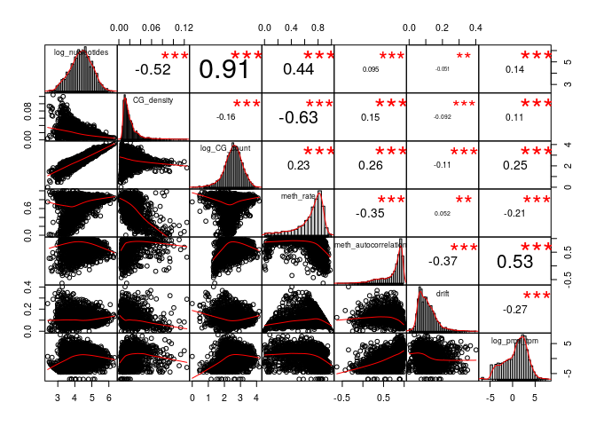

MSR and expression for lung genes
================

    ## TPM fraction:  0.6771144

    ## protein_coding TPM fraction:  0.5682601

###### Basic features:

###### Comparison with MSR statistics:

meth\_autocorrelation vs log(tpm): 

CG\_list\_inverted\_msr vs log(tpm): 

meth\_rate\_binary vs log(tpm): 

drift vs log(tpm): 

    ## missing data:  14.96263 %

    ## 
    ## train_data_proportion:  0.6

    ## 
    ## 
    ## basic missing data:  0 %

    ## 
    ## train_data_proportion:  0.6

Linear model for log\_tpm with basic features:

    ## 
    ## Call:
    ## lm(formula = formula, data = train_model_data[, c(response_variable, 
    ##     predictors)])
    ## 
    ## Residuals:
    ##     Min      1Q  Median      3Q     Max 
    ## -9.1516 -1.2271  0.3926  1.4530  7.5566 
    ## 
    ## Coefficients:
    ##                 Estimate Std. Error t value Pr(>|t|)    
    ## (Intercept)      10.1800     0.5140  19.806   <2e-16 ***
    ## log_nucleotides  -4.2560     0.2304 -18.470   <2e-16 ***
    ## CG_density      -71.7988     4.7984 -14.963   <2e-16 ***
    ## log_CG_count      4.6191     0.2422  19.070   <2e-16 ***
    ## meth_rate        -1.3937     0.1694  -8.228   <2e-16 ***
    ## ---
    ## Signif. codes:  0 '***' 0.001 '**' 0.01 '*' 0.05 '.' 0.1 ' ' 1
    ## 
    ## Residual standard error: 2.142 on 10030 degrees of freedom
    ## Multiple R-squared:  0.04907,    Adjusted R-squared:  0.04869 
    ## F-statistic: 129.4 on 4 and 10030 DF,  p-value: < 2.2e-16
    ## 
    ## Test data R squared:  0.06530807

    ## 
    ## 
    ## keeping also data with NA msr features:

    ## Test data R squared:  0.09890924

Linear model for log\_tpm with basic features with meth\_autocorrelation and drift:

    ## 
    ## Call:
    ## lm(formula = formula, data = train_model_data[, c(response_variable, 
    ##     predictors)])
    ## 
    ## Residuals:
    ##     Min      1Q  Median      3Q     Max 
    ## -8.7034 -1.0785  0.1666  1.2030  9.5674 
    ## 
    ## Coefficients:
    ##                      Estimate Std. Error t value Pr(>|t|)    
    ## (Intercept)            0.1620     0.5660   0.286 0.774729    
    ## log_nucleotides       -1.3197     0.2235  -5.905 3.64e-09 ***
    ## CG_density           -21.4925     4.5461  -4.728 2.30e-06 ***
    ## log_CG_count           1.4366     0.2368   6.066 1.36e-09 ***
    ## meth_rate              0.6202     0.1633   3.799 0.000146 ***
    ## meth_autocorrelation   4.5485     0.1367  33.282  < 2e-16 ***
    ## drift                 -5.8020     0.5046 -11.499  < 2e-16 ***
    ## ---
    ## Signif. codes:  0 '***' 0.001 '**' 0.01 '*' 0.05 '.' 0.1 ' ' 1
    ## 
    ## Residual standard error: 1.935 on 10028 degrees of freedom
    ## Multiple R-squared:  0.2242, Adjusted R-squared:  0.2237 
    ## F-statistic: 482.9 on 6 and 10028 DF,  p-value: < 2.2e-16
    ## 
    ## Test data R squared:  0.2367656

    ## 
    ## 
    ## keeping also data with NA msr features:

    ## Test data R squared:  0.266048

Linear model for TPM with all predictors:

    ## 
    ## Call:
    ## lm(formula = formula, data = train_model_data[, c(response_variable, 
    ##     predictors)])
    ## 
    ## Residuals:
    ##     Min      1Q  Median      3Q     Max 
    ## -8.6347 -1.0709  0.1493  1.1915  9.3948 
    ## 
    ## Coefficients:
    ##                      Estimate Std. Error t value Pr(>|t|)    
    ## (Intercept)            6.6959     1.3545   4.943 7.80e-07 ***
    ## log_nucleotides       -1.3376     0.2263  -5.911 3.52e-09 ***
    ## CG_density           -25.3885     4.6482  -5.462 4.82e-08 ***
    ## log_CG_count           1.2184     0.2393   5.092 3.61e-07 ***
    ## meth_rate              0.6647     0.2627   2.530  0.01142 *  
    ## meth_autocorrelation   4.8625     0.1803  26.968  < 2e-16 ***
    ## drift                 -7.1768     0.6687 -10.733  < 2e-16 ***
    ## CGsites_msr          -18.4847     3.8544  -4.796 1.64e-06 ***
    ## meth_msr              -6.5884     1.6518  -3.989 6.69e-05 ***
    ## unmeth_msr             3.1569     1.1099   2.844  0.00446 ** 
    ## CG_list_msr            1.5409     0.9642   1.598  0.11005    
    ## CG_list_inverted_msr   0.8943     0.7305   1.224  0.22092    
    ## ---
    ## Signif. codes:  0 '***' 0.001 '**' 0.01 '*' 0.05 '.' 0.1 ' ' 1
    ## 
    ## Residual standard error: 1.928 on 10023 degrees of freedom
    ## Multiple R-squared:  0.2301, Adjusted R-squared:  0.2292 
    ## F-statistic: 272.3 on 11 and 10023 DF,  p-value: < 2.2e-16
    ## 
    ## Test data R squared:  0.237813

Linear model with few predictors

    ## 
    ## Call:
    ## lm(formula = formula, data = train_model_data[, c(response_variable, 
    ##     predictors)])
    ## 
    ## Residuals:
    ##     Min      1Q  Median      3Q     Max 
    ## -9.0048 -1.0980  0.1655  1.2339  9.6131 
    ## 
    ## Coefficients:
    ##                        Estimate Std. Error t value Pr(>|t|)    
    ## (Intercept)          -2.003e+00  1.304e-01 -15.353   <2e-16 ***
    ## meth_autocorrelation  4.648e+00  1.178e-01  39.449   <2e-16 ***
    ## drift                -5.699e+00  4.887e-01 -11.660   <2e-16 ***
    ## nucleotides           4.178e-07  1.422e-07   2.939   0.0033 ** 
    ## ---
    ## Signif. codes:  0 '***' 0.001 '**' 0.01 '*' 0.05 '.' 0.1 ' ' 1
    ## 
    ## Residual standard error: 1.941 on 10031 degrees of freedom
    ## Multiple R-squared:  0.2193, Adjusted R-squared:  0.2191 
    ## F-statistic: 939.2 on 3 and 10031 DF,  p-value: < 2.2e-16
    ## 
    ## Test data R squared:  0.2250718

Lasso:

    ## lambda: 0.1

    ## 11 x 1 sparse Matrix of class "dgCMatrix"
    ##                             s0
    ## log_nucleotides       .       
    ## CG_density            .       
    ## log_CG_count          .       
    ## meth_rate             .       
    ## meth_autocorrelation  4.223710
    ## drift                -4.231104
    ## CGsites_msr          -1.475711
    ## meth_msr              .       
    ## unmeth_msr            .       
    ## CG_list_msr           .       
    ## CG_list_inverted_msr  .

    ## 
    ## Test data R squared:  0.2227787
