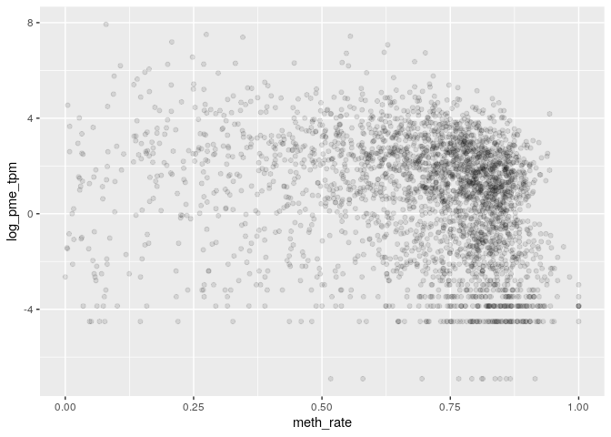

MSR and expression for lung genes
================

    ## TPM fraction:  0.6771144

    ## protein_coding TPM fraction:  0.5682601

###### Basic features:

###### Comparison with MSR statistics:

meth\_autocorrelation vs log(tpm):

CG\_list\_inverted\_msr vs log(tpm):

meth\_rate\_binary vs log(tpm):

drift vs log(tpm):

    ## missing data:  14.96263 %

    ## train_data_proportion:  0.6

    ## 
    ## 
    ## basic missing data:  0 %

    ## train_data_proportion:  0.6

Linear model for log\_tpm with basic features:

    ## 
    ## Call:
    ## lm(formula = formula, data = train_model_data[, c(response_variable, 
    ##     predictors)])
    ## 
    ## Residuals:
    ##     Min      1Q  Median      3Q     Max 
    ## -9.2586 -1.2126  0.3886  1.4440  8.6552 
    ## 
    ## Coefficients:
    ##                 Estimate Std. Error t value Pr(>|t|)    
    ## (Intercept)      11.4817     0.5103  22.498   <2e-16 ***
    ## log_nucleotides  -4.8763     0.2287 -21.317   <2e-16 ***
    ## CG_density      -85.9276     4.7543 -18.074   <2e-16 ***
    ## log_CG_count      5.3151     0.2404  22.112   <2e-16 ***
    ## meth_rate        -1.5566     0.1707  -9.118   <2e-16 ***
    ## ---
    ## Signif. codes:  0 '***' 0.001 '**' 0.01 '*' 0.05 '.' 0.1 ' ' 1
    ## 
    ## Residual standard error: 2.153 on 10030 degrees of freedom
    ## Multiple R-squared:  0.059,  Adjusted R-squared:  0.05862 
    ## F-statistic: 157.2 on 4 and 10030 DF,  p-value: < 2.2e-16
    ## 
    ## Test data R squared:  0.05106917

    ## 
    ## keeping also data with NA msr features:

    ## predictors:  log_nucleotides CG_density log_CG_count meth_rate 
    ## Test data R squared:  0.1147499

Linear model for log\_tpm with basic features with meth\_autocorrelation and drift:

    ## 
    ## Call:
    ## lm(formula = formula, data = train_model_data[, c(response_variable, 
    ##     predictors)])
    ## 
    ## Residuals:
    ##     Min      1Q  Median      3Q     Max 
    ## -8.7408 -1.0901  0.1591  1.1894 10.5406 
    ## 
    ## Coefficients:
    ##                      Estimate Std. Error t value Pr(>|t|)    
    ## (Intercept)            1.0036     0.5670   1.770 0.076749 .  
    ## log_nucleotides       -1.7538     0.2236  -7.844 4.82e-15 ***
    ## CG_density           -31.3108     4.5337  -6.906 5.28e-12 ***
    ## log_CG_count           1.8980     0.2371   8.005 1.33e-15 ***
    ## meth_rate              0.5682     0.1652   3.439 0.000586 ***
    ## meth_autocorrelation   4.6094     0.1363  33.813  < 2e-16 ***
    ## drift                 -5.2083     0.4940 -10.543  < 2e-16 ***
    ## ---
    ## Signif. codes:  0 '***' 0.001 '**' 0.01 '*' 0.05 '.' 0.1 ' ' 1
    ## 
    ## Residual standard error: 1.948 on 10028 degrees of freedom
    ## Multiple R-squared:  0.2304, Adjusted R-squared:   0.23 
    ## F-statistic: 500.5 on 6 and 10028 DF,  p-value: < 2.2e-16
    ## 
    ## Test data R squared:  0.2280701

    ## 
    ## keeping also data with NA msr features:

    ## predictors:  log_nucleotides CG_density log_CG_count meth_rate meth_autocorrelation drift 
    ## Test data R squared:  0.2799863

Linear model for TPM with all predictors:

    ## 
    ## Call:
    ## lm(formula = formula, data = train_model_data[, c(response_variable, 
    ##     predictors)])
    ## 
    ## Residuals:
    ##     Min      1Q  Median      3Q     Max 
    ## -8.6490 -1.0866  0.1503  1.1878 10.4802 
    ## 
    ## Coefficients:
    ##                      Estimate Std. Error t value Pr(>|t|)    
    ## (Intercept)            7.8448     1.3682   5.734 1.01e-08 ***
    ## log_nucleotides       -1.7671     0.2263  -7.809 6.33e-15 ***
    ## CG_density           -35.3137     4.6508  -7.593 3.40e-14 ***
    ## log_CG_count           1.7182     0.2392   7.182 7.35e-13 ***
    ## meth_rate              0.3882     0.2621   1.481    0.139    
    ## meth_autocorrelation   4.8002     0.1803  26.628  < 2e-16 ***
    ## drift                 -6.3574     0.6542  -9.718  < 2e-16 ***
    ## CGsites_msr          -24.7784     3.8922  -6.366 2.02e-10 ***
    ## meth_msr              -1.7870     1.6159  -1.106    0.269    
    ## unmeth_msr             4.6284     1.1042   4.192 2.79e-05 ***
    ## CG_list_msr            0.3672     0.9603   0.382    0.702    
    ## CG_list_inverted_msr   0.8043     0.7303   1.101    0.271    
    ## ---
    ## Signif. codes:  0 '***' 0.001 '**' 0.01 '*' 0.05 '.' 0.1 ' ' 1
    ## 
    ## Residual standard error: 1.94 on 10023 degrees of freedom
    ## Multiple R-squared:  0.2364, Adjusted R-squared:  0.2356 
    ## F-statistic: 282.2 on 11 and 10023 DF,  p-value: < 2.2e-16
    ## 
    ## Test data R squared:  0.2301079

Lasso:

    ## lambda: 0.1

    ## 
    ## Test data R squared:  0.2175632

Normalized lasso coefficient:

    ## 11 x 1 sparse Matrix of class "dgCMatrix"
    ##                                s0
    ## log_nucleotides       .          
    ## CG_density            .          
    ## log_CG_count          .          
    ## meth_rate             .          
    ## meth_autocorrelation  0.848578437
    ## drift                -0.168492528
    ## CGsites_msr          -0.014432112
    ## meth_msr              .          
    ## unmeth_msr            0.008397421
    ## CG_list_msr           .          
    ## CG_list_inverted_msr  .

Random Forest

    ## predictors:  log_nucleotides CG_density log_CG_count meth_rate meth_autocorrelation drift

    ## 
    ##  test rsq:  0.3243855

Importance

    ##                        %IncMSE IncNodePurity
    ## log_nucleotides      1.6408989      7365.669
    ## CG_density           0.6935493      7566.333
    ## log_CG_count         1.3972792      8634.497
    ## meth_rate            1.3263253      9292.333
    ## meth_autocorrelation 2.7233756     17631.812
    ## drift                1.0035036     11129.245

Performance

