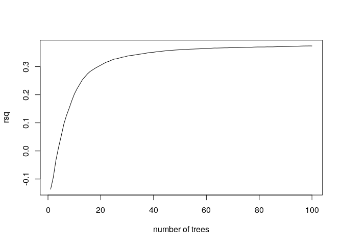

MSR and expression for ovary genes
================

    ## TPM fraction:  0.9626415

###### Basic features:

###### Comparison with MSR statistics:

meth\_autocorrelation vs log(tpm):

CG\_list\_inverted\_msr vs log(tpm):

meth\_rate\_binary vs log(tpm):

drift vs log(tpm):

    ## missing data:  58.00524 %

    ## train_data_proportion:  0.7

    ## 
    ## 
    ## basic missing data:  0 %

    ## train_data_proportion:  0.7

Linear model for log\_tpm with basic features:

    ## 
    ## Call:
    ## lm(formula = formula, data = train_model_data[, c(response_variable, 
    ##     predictors)])
    ## 
    ## Residuals:
    ##     Min      1Q  Median      3Q     Max 
    ## -7.9824 -1.4959  0.2029  1.6795  8.7407 
    ## 
    ## Coefficients:
    ##                 Estimate Std. Error t value Pr(>|t|)    
    ## (Intercept)       5.0174     0.3780   13.28   <2e-16 ***
    ## log_nucleotides  -4.0867     0.1654  -24.70   <2e-16 ***
    ## CG_density      -85.3761     3.5257  -24.21   <2e-16 ***
    ## log_CG_count      5.8958     0.1718   34.31   <2e-16 ***
    ## meth_rate        -2.9951     0.1265  -23.68   <2e-16 ***
    ## ---
    ## Signif. codes:  0 '***' 0.001 '**' 0.01 '*' 0.05 '.' 0.1 ' ' 1
    ## 
    ## Residual standard error: 2.199 on 17272 degrees of freedom
    ## Multiple R-squared:  0.1309, Adjusted R-squared:  0.1307 
    ## F-statistic: 650.3 on 4 and 17272 DF,  p-value: < 2.2e-16
    ## 
    ## Test data R squared:  0.1262427

    ## 
    ## keeping also data with NA msr features:

    ## predictors:  log_nucleotides CG_density log_CG_count meth_rate 
    ## Test data R squared:  0.2429296

Linear model for log\_tpm with basic features with meth\_autocorrelation and drift:

    ## 
    ## Call:
    ## lm(formula = formula, data = train_model_data[, c(response_variable, 
    ##     predictors)])
    ## 
    ## Residuals:
    ##     Min      1Q  Median      3Q     Max 
    ## -7.1828 -1.2044  0.1931  1.3162 10.1445 
    ## 
    ## Coefficients:
    ##                      Estimate Std. Error t value Pr(>|t|)    
    ## (Intercept)           -4.1055     0.4256  -9.647  < 2e-16 ***
    ## log_nucleotides       -0.9302     0.1646  -5.651 1.62e-08 ***
    ## CG_density           -24.7112     3.4964  -7.068 1.64e-12 ***
    ## log_CG_count           2.1347     0.1749  12.207  < 2e-16 ***
    ## meth_rate             -0.1061     0.1297  -0.818    0.414    
    ## meth_autocorrelation   3.9264     0.1010  38.883  < 2e-16 ***
    ## drift                 -7.4852     0.4421 -16.930  < 2e-16 ***
    ## ---
    ## Signif. codes:  0 '***' 0.001 '**' 0.01 '*' 0.05 '.' 0.1 ' ' 1
    ## 
    ## Residual standard error: 2.003 on 17270 degrees of freedom
    ## Multiple R-squared:  0.2789, Adjusted R-squared:  0.2787 
    ## F-statistic:  1113 on 6 and 17270 DF,  p-value: < 2.2e-16
    ## 
    ## Test data R squared:  0.2615662

    ## 
    ## keeping also data with NA msr features:

    ## predictors:  log_nucleotides CG_density log_CG_count meth_rate meth_autocorrelation drift 
    ## Test data R squared:  0.3227535

Linear model for TPM with all predictors:

    ## 
    ## Call:
    ## lm(formula = formula, data = train_model_data[, c(response_variable, 
    ##     predictors)])
    ## 
    ## Residuals:
    ##     Min      1Q  Median      3Q     Max 
    ## -7.3726 -1.1812  0.1649  1.3032  9.7761 
    ## 
    ## Coefficients:
    ##                      Estimate Std. Error t value Pr(>|t|)    
    ## (Intercept)           -3.7310     0.9998  -3.732 0.000191 ***
    ## log_nucleotides       -0.9507     0.1654  -5.747 9.21e-09 ***
    ## CG_density           -25.2841     3.5574  -7.108 1.23e-12 ***
    ## log_CG_count           2.1807     0.1752  12.447  < 2e-16 ***
    ## meth_rate              2.0012     0.2518   7.948 2.01e-15 ***
    ## meth_autocorrelation   3.2372     0.1219  26.561  < 2e-16 ***
    ## drift                 -4.4047     0.5582  -7.891 3.17e-15 ***
    ## CGsites_msr            2.7615     2.8093   0.983 0.325636    
    ## meth_msr              -5.4425     1.2210  -4.457 8.35e-06 ***
    ## unmeth_msr             0.3815     0.9411   0.405 0.685221    
    ## CG_list_msr            4.8657     0.8821   5.516 3.52e-08 ***
    ## CG_list_inverted_msr  -8.6244     0.6945 -12.419  < 2e-16 ***
    ## ---
    ## Signif. codes:  0 '***' 0.001 '**' 0.01 '*' 0.05 '.' 0.1 ' ' 1
    ## 
    ## Residual standard error: 1.992 on 17265 degrees of freedom
    ## Multiple R-squared:  0.2871, Adjusted R-squared:  0.2866 
    ## F-statistic:   632 on 11 and 17265 DF,  p-value: < 2.2e-16
    ## 
    ## Test data R squared:  0.2680918

Lasso:

    ## lambda: 0.1

    ## 
    ## Test data R squared:  0.2572469

Normalized lasso coefficient:

    ## 11 x 1 sparse Matrix of class "dgCMatrix"
    ##                               s0
    ## log_nucleotides       .         
    ## CG_density            .         
    ## log_CG_count          0.43801123
    ## meth_rate             .         
    ## meth_autocorrelation  0.79779602
    ## drift                -0.20060599
    ## CGsites_msr           .         
    ## meth_msr              .         
    ## unmeth_msr            .         
    ## CG_list_msr           .         
    ## CG_list_inverted_msr -0.09371037

Random Forest

    ## predictors:  log_nucleotides CG_density log_CG_count meth_rate meth_autocorrelation drift

    ## 
    ##  test rsq:  0.3960463

Importance

    ##                       %IncMSE IncNodePurity
    ## log_nucleotides      2.655583      22894.50
    ## CG_density           1.146429      15724.01
    ## log_CG_count         2.683572      26825.52
    ## meth_rate            1.178371      20432.76
    ## meth_autocorrelation 1.993708      37629.07
    ## drift                1.327500      23332.07

Performance

