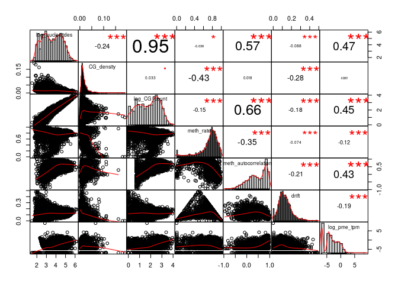
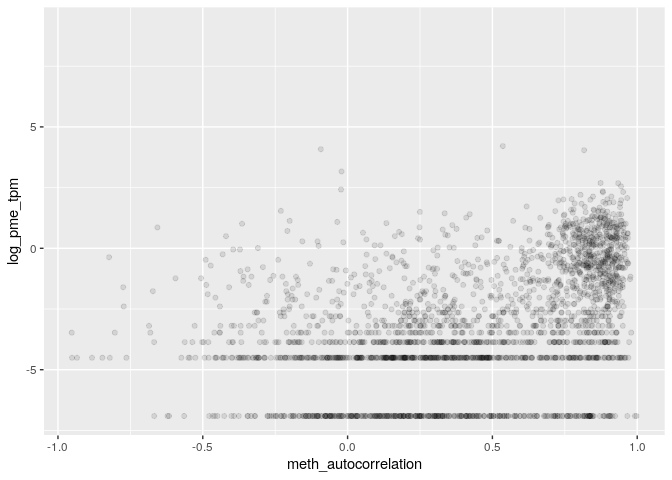

MSR and expression for stomach, windows of 1000 sites, extended genes set
================

    ## TPM fraction:  0.9087224

    ## protein_coding TPM fraction:  0.02264877

###### Basic features:

###### Comparison with MSR statistics:

meth\_autocorrelation vs log(tpm): 

CG\_list\_inverted\_msr vs log(tpm): 

meth\_rate\_binary vs log(tpm): 

    ## missing data:  6.22299 %

    ## 
    ## train_data_proportion:  0.6

Linear model for log\_tpm with basic features:

    ## 
    ## Call:
    ## lm(formula = formula, data = train_model_data[, c(response_variable, 
    ##     predictors)])
    ## 
    ## Residuals:
    ##     Min      1Q  Median      3Q     Max 
    ## -7.6525 -1.2296  0.2921  1.5071  7.2004 
    ## 
    ## Coefficients:
    ##                  Estimate Std. Error t value Pr(>|t|)    
    ## (Intercept)        3.6107     0.4416   8.176 3.25e-16 ***
    ## log_nucleotides   -3.4810     0.1983 -17.557  < 2e-16 ***
    ## CG_density       -79.4174     3.9663 -20.023  < 2e-16 ***
    ## log_CG_count       5.1201     0.2030  25.220  < 2e-16 ***
    ## meth_rate_binary  -2.2523     0.1318 -17.086  < 2e-16 ***
    ## ---
    ## Signif. codes:  0 '***' 0.001 '**' 0.01 '*' 0.05 '.' 0.1 ' ' 1
    ## 
    ## Residual standard error: 2.119 on 11062 degrees of freedom
    ## Multiple R-squared:  0.1349, Adjusted R-squared:  0.1346 
    ## F-statistic: 431.3 on 4 and 11062 DF,  p-value: < 2.2e-16
    ## 
    ## Test data R squared:  0.1298789

Linear model for log\_tpm with basic features with meth\_autocorrelation:

    ## 
    ## Call:
    ## lm(formula = formula, data = train_model_data[, c(response_variable, 
    ##     predictors)])
    ## 
    ## Residuals:
    ##     Min      1Q  Median      3Q     Max 
    ## -6.9199 -1.1088  0.2013  1.3005  8.2874 
    ## 
    ## Coefficients:
    ##                       Estimate Std. Error t value Pr(>|t|)    
    ## (Intercept)           -5.90809    0.46549 -12.692  < 2e-16 ***
    ## log_nucleotides       -0.57443    0.19577  -2.934  0.00335 ** 
    ## CG_density           -17.83511    3.94483  -4.521 6.21e-06 ***
    ## log_CG_count           1.54534    0.20572   7.512 6.27e-14 ***
    ## meth_rate_binary       0.30619    0.13592   2.253  0.02429 *  
    ## meth_autocorrelation   4.21561    0.09842  42.832  < 2e-16 ***
    ## ---
    ## Signif. codes:  0 '***' 0.001 '**' 0.01 '*' 0.05 '.' 0.1 ' ' 1
    ## 
    ## Residual standard error: 1.963 on 11061 degrees of freedom
    ## Multiple R-squared:  0.258,  Adjusted R-squared:  0.2576 
    ## F-statistic: 769.1 on 5 and 11061 DF,  p-value: < 2.2e-16
    ## 
    ## Test data R squared:  0.2556807

Linear model for TPM with all predictors:

    ## 
    ## Call:
    ## lm(formula = formula, data = train_model_data[, c(response_variable, 
    ##     predictors)])
    ## 
    ## Residuals:
    ##     Min      1Q  Median      3Q     Max 
    ## -7.0621 -1.1119  0.1744  1.2908  7.9594 
    ## 
    ## Coefficients:
    ##                      Estimate Std. Error t value Pr(>|t|)    
    ## (Intercept)            0.2569     1.1149   0.230 0.817743    
    ## log_nucleotides       -0.8366     0.1974  -4.237 2.28e-05 ***
    ## CG_density           -25.0315     4.0144  -6.235 4.67e-10 ***
    ## log_CG_count           1.8086     0.2101   8.607  < 2e-16 ***
    ## meth_rate_binary       1.1332     0.2480   4.570 4.93e-06 ***
    ## meth_autocorrelation   3.6545     0.1377  26.546  < 2e-16 ***
    ## CGsites_msr          -13.9351     3.1991  -4.356 1.34e-05 ***
    ## meth_msr              -6.1809     1.3050  -4.736 2.20e-06 ***
    ## unmeth_msr             2.7286     0.7485   3.646 0.000268 ***
    ## CG_list_msr            1.6988     0.9119   1.863 0.062494 .  
    ## CG_list_inverted_msr  -5.1856     0.6582  -7.878 3.64e-15 ***
    ## ---
    ## Signif. codes:  0 '***' 0.001 '**' 0.01 '*' 0.05 '.' 0.1 ' ' 1
    ## 
    ## Residual standard error: 1.95 on 11056 degrees of freedom
    ## Multiple R-squared:  0.2678, Adjusted R-squared:  0.2671 
    ## F-statistic: 404.3 on 10 and 11056 DF,  p-value: < 2.2e-16
    ## 
    ## Test data R squared:  0.2663382

Linear model with few predictors

    ## 
    ## Call:
    ## lm(formula = formula, data = train_model_data[, c(response_variable, 
    ##     predictors)])
    ## 
    ## Residuals:
    ##    Min     1Q Median     3Q    Max 
    ## -6.807 -1.153  0.241  1.364  8.464 
    ## 
    ## Coefficients:
    ##                        Estimate Std. Error t value Pr(>|t|)    
    ## (Intercept)          -5.010e+00  6.452e-02  -77.66   <2e-16 ***
    ## meth_autocorrelation  4.680e+00  8.301e-02   56.38   <2e-16 ***
    ## nucleotides           2.702e-06  1.449e-07   18.65   <2e-16 ***
    ## ---
    ## Signif. codes:  0 '***' 0.001 '**' 0.01 '*' 0.05 '.' 0.1 ' ' 1
    ## 
    ## Residual standard error: 2.001 on 11064 degrees of freedom
    ## Multiple R-squared:  0.2286, Adjusted R-squared:  0.2285 
    ## F-statistic:  1640 on 2 and 11064 DF,  p-value: < 2.2e-16
    ## 
    ## Test data R squared:  0.2263425

Lasso:

    ## lambda: 0.1

    ## 10 x 1 sparse Matrix of class "dgCMatrix"
    ##                               s0
    ## log_nucleotides       0.09920308
    ## CG_density            .         
    ## log_CG_count          0.77332057
    ## meth_rate_binary      .         
    ## meth_autocorrelation  3.69864372
    ## CGsites_msr           .         
    ## meth_msr              .         
    ## unmeth_msr            .         
    ## CG_list_msr          -1.68598091
    ## CG_list_inverted_msr  .

    ## 
    ## Test data R squared:  0.252536
