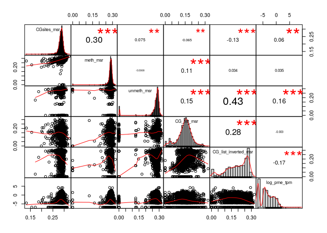
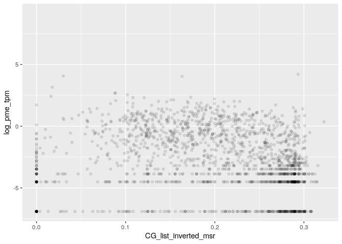
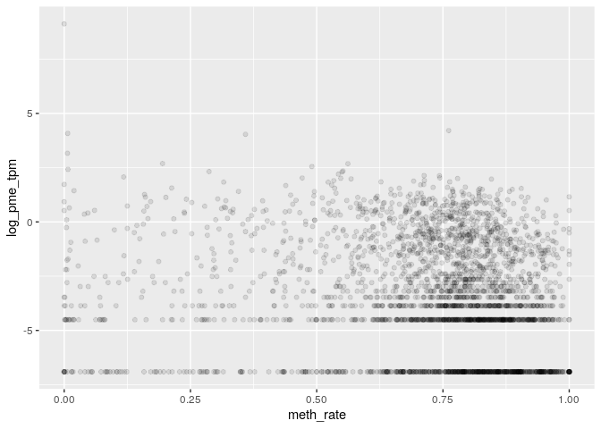

MSR and expression for stomach genes
================

    ## TPM fraction:  0.9087224

###### Basic features:

###### Comparison with MSR statistics:

meth\_autocorrelation vs log(tpm):

CG\_list\_inverted\_msr vs log(tpm):

meth\_rate\_binary vs log(tpm):

drift vs log(tpm):

    ## missing data:  44.19514 %

    ## train_data_proportion:  0.7

    ## 
    ## 
    ## basic missing data:  0 %

    ## train_data_proportion:  0.7

Linear model for log\_tpm with basic features:

    ## 
    ## Call:
    ## lm(formula = formula, data = train_model_data[, c(response_variable, 
    ##     predictors)])
    ## 
    ## Residuals:
    ##     Min      1Q  Median      3Q     Max 
    ## -7.2603 -1.4578  0.1217  1.5900  8.0744 
    ## 
    ## Coefficients:
    ##                 Estimate Std. Error t value Pr(>|t|)    
    ## (Intercept)       0.1381     0.2990   0.462    0.644    
    ## log_nucleotides  -2.6584     0.1313 -20.242   <2e-16 ***
    ## CG_density      -57.3810     2.7110 -21.166   <2e-16 ***
    ## log_CG_count      4.5698     0.1325  34.483   <2e-16 ***
    ## meth_rate        -2.0492     0.0984 -20.825   <2e-16 ***
    ## ---
    ## Signif. codes:  0 '***' 0.001 '**' 0.01 '*' 0.05 '.' 0.1 ' ' 1
    ## 
    ## Residual standard error: 2.2 on 22262 degrees of freedom
    ## Multiple R-squared:  0.2241, Adjusted R-squared:  0.224 
    ## F-statistic:  1607 on 4 and 22262 DF,  p-value: < 2.2e-16
    ## 
    ## Test data R squared:  0.2122878

    ## 
    ## keeping also data with NA msr features:

    ## predictors:  log_nucleotides CG_density log_CG_count meth_rate 
    ## Test data R squared:  0.2088614

Linear model for log\_tpm with basic features with meth\_autocorrelation and drift:

    ## 
    ## Call:
    ## lm(formula = formula, data = train_model_data[, c(response_variable, 
    ##     predictors)])
    ## 
    ## Residuals:
    ##     Min      1Q  Median      3Q     Max 
    ## -6.5993 -1.3074  0.1255  1.4283  9.0982 
    ## 
    ## Coefficients:
    ##                       Estimate Std. Error t value Pr(>|t|)    
    ## (Intercept)           -5.35393    0.32611 -16.418  < 2e-16 ***
    ## log_nucleotides       -0.36671    0.13374  -2.742  0.00611 ** 
    ## CG_density           -17.84074    2.74383  -6.502 8.09e-11 ***
    ## log_CG_count           1.51562    0.14102  10.748  < 2e-16 ***
    ## meth_rate              0.07930    0.10632   0.746  0.45577    
    ## meth_autocorrelation   2.59375    0.07038  36.851  < 2e-16 ***
    ## drift                 -4.52187    0.32457 -13.932  < 2e-16 ***
    ## ---
    ## Signif. codes:  0 '***' 0.001 '**' 0.01 '*' 0.05 '.' 0.1 ' ' 1
    ## 
    ## Residual standard error: 2.09 on 22260 degrees of freedom
    ## Multiple R-squared:  0.2999, Adjusted R-squared:  0.2997 
    ## F-statistic:  1589 on 6 and 22260 DF,  p-value: < 2.2e-16
    ## 
    ## Test data R squared:  0.2983191

    ## 
    ## keeping also data with NA msr features:

    ## predictors:  log_nucleotides CG_density log_CG_count meth_rate meth_autocorrelation drift 
    ## Test data R squared:  0.2432676

Linear model for TPM with all predictors:

    ## 
    ## Call:
    ## lm(formula = formula, data = train_model_data[, c(response_variable, 
    ##     predictors)])
    ## 
    ## Residuals:
    ##     Min      1Q  Median      3Q     Max 
    ## -6.6486 -1.2693  0.1156  1.3826  8.6186 
    ## 
    ## Coefficients:
    ##                       Estimate Std. Error t value Pr(>|t|)    
    ## (Intercept)           -3.80816    0.59835  -6.364 2.00e-10 ***
    ## log_nucleotides       -0.38348    0.13293  -2.885  0.00392 ** 
    ## CG_density           -18.54488    2.74393  -6.759 1.43e-11 ***
    ## log_CG_count           1.66540    0.14107  11.805  < 2e-16 ***
    ## meth_rate              1.46679    0.16757   8.754  < 2e-16 ***
    ## meth_autocorrelation   2.25154    0.07782  28.933  < 2e-16 ***
    ## drift                 -1.80895    0.39683  -4.559 5.18e-06 ***
    ## CGsites_msr           -6.85140    1.59487  -4.296 1.75e-05 ***
    ## meth_msr              -3.11068    0.69325  -4.487 7.26e-06 ***
    ## unmeth_msr             3.55873    0.37811   9.412  < 2e-16 ***
    ## CG_list_msr            2.39510    0.54965   4.357 1.32e-05 ***
    ## CG_list_inverted_msr  -6.83039    0.37537 -18.197  < 2e-16 ***
    ## ---
    ## Signif. codes:  0 '***' 0.001 '**' 0.01 '*' 0.05 '.' 0.1 ' ' 1
    ## 
    ## Residual standard error: 2.07 on 22255 degrees of freedom
    ## Multiple R-squared:  0.3134, Adjusted R-squared:  0.313 
    ## F-statistic: 923.4 on 11 and 22255 DF,  p-value: < 2.2e-16
    ## 
    ## Test data R squared:  0.3119928

Lasso:

    ## lambda: 0.1

    ## 
    ## Test data R squared:  0.3008784

Normalized lasso coefficient:

    ## 11 x 1 sparse Matrix of class "dgCMatrix"
    ##                               s0
    ## log_nucleotides       0.19573278
    ## CG_density            .         
    ## log_CG_count          0.54366918
    ## meth_rate             .         
    ## meth_autocorrelation  0.68520770
    ## drift                -0.09326496
    ## CGsites_msr           .         
    ## meth_msr              .         
    ## unmeth_msr            .         
    ## CG_list_msr          -0.01202045
    ## CG_list_inverted_msr -0.16509282

Random Forest

    ## predictors:  log_nucleotides CG_density log_CG_count meth_rate meth_autocorrelation drift

    ## 
    ##  test rsq:  0.420084

Importance

    ##                        %IncMSE IncNodePurity
    ## log_nucleotides      3.5414010      39727.97
    ## CG_density           0.9567507      18605.57
    ## log_CG_count         2.9196878      35165.08
    ## meth_rate            0.6900706      19621.26
    ## meth_autocorrelation 1.9726086      40301.92
    ## drift                0.9882324      23314.01

Performance

