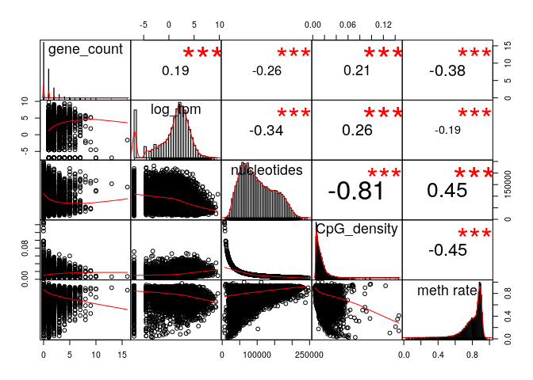
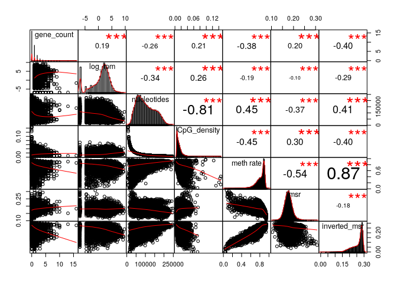
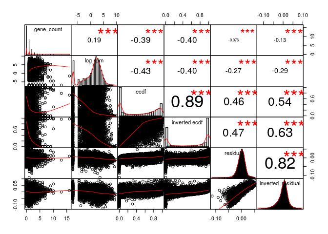
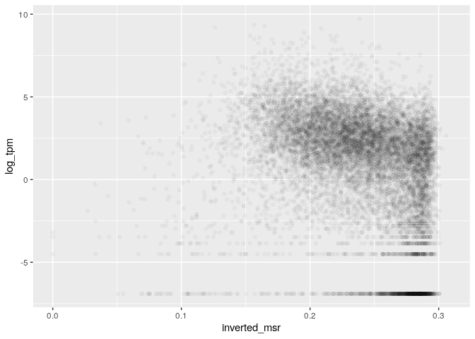
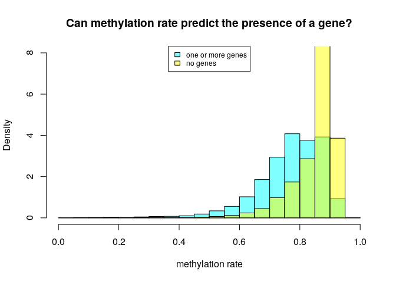
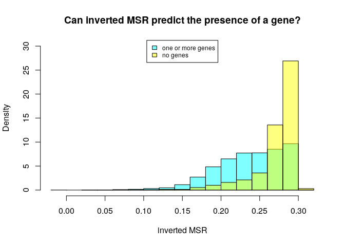
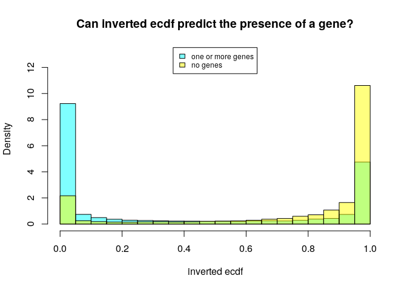
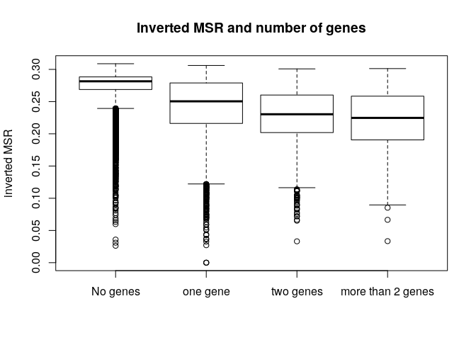

MSR and expression for H1, windows of 1000 sites
================

Here I will investigate if there is a relationship between the presence of genes and genes expression in a certain genomic region and the MSR (with some of its derivate statistics).

I chose H1 cells data in order to do this, and CpG windows of size 1000, that corresponds to a variable window size in term of nucleotides (on average about 100,000).

This is an example of total-rna-seq file, that shows for each "gene" its transcripts and some measures of expression. In this case I just kept two colums. The first one indicates the "gene"", the second one is the Transcript Per Million that is a relative measure of how much a gene is expressed.

    ##                    gene_id   TPM
    ##     1:     ENSG00000000003 45.14
    ##     2:     ENSG00000000005  0.92
    ##     3:     ENSG00000000419 28.25
    ##     4:     ENSG00000000457  1.78
    ##     5:     ENSG00000000460 15.50
    ##    ---                          
    ## 60818: gSpikein_ERCC-00165  0.00
    ## 60819: gSpikein_ERCC-00168  0.00
    ## 60820: gSpikein_ERCC-00170  0.16
    ## 60821: gSpikein_ERCC-00171  0.50
    ## 60822:    gSpikein_phiX174  0.00

This is the annotation file that store the position occupied by each human gene.

    ##         chr     start       end strand              id                    anno
    ##     1: chr1     65419     71585      + ENSG00000186092 genebody_protein_coding
    ##     2: chr1    450703    451697      - ENSG00000284733 genebody_protein_coding
    ##     3: chr1    685679    686673      - ENSG00000284662 genebody_protein_coding
    ##     4: chr1    923928    944581      + ENSG00000187634 genebody_protein_coding
    ##     5: chr1    944204    959309      - ENSG00000188976 genebody_protein_coding
    ##    ---                                                                        
    ## 19801: chrY  24763069  24813492      - ENSG00000187191 genebody_protein_coding
    ## 19802: chrY  24833843  24907040      + ENSG00000205916 genebody_protein_coding
    ## 19803: chrY  25030901  25062548      - ENSG00000185894 genebody_protein_coding
    ## 19804: chrY  25622162  25624902      + ENSG00000172288 genebody_protein_coding
    ## 19805: chrX 135309480 135309659      + ENSG00000283644 genebody_protein_coding

The number of genes is much less than the ones in the total-rna-seq file, since the first one also contains so called pseudogenes and other stuff.

So the final dataFrame is the following (excluding some columns for readability):

    ## 21 rows had too many nucleotides

    ##    start_chr start_position end_position gene_count total_TPM meth rate
    ## 12      chr1         940826       961902          2     73.88 0.4715903
    ## 13      chr1         961902       982731          2      0.26 0.7012655
    ## 14      chr1         982731      1007283          2     73.78 0.4854497
    ## 23      chr1        1206432      1228380          2     30.36 0.8951453
    ## 24      chr1        1228380      1246900          2     15.04 0.6799055
    ## 26      chr1        1274217      1295503          2     11.54 0.8296808

The full scheme includes:

**nucleotides**: number of nucleotides in the window

**CpG density**: fraction of nucleotides that is a C of a CpG site (= 1000/nucleotides)

**meth rate**: ratio of methylated CpG sites

**gene\_count**: number of genes included (even partially) inside the interval

**total\_TPM**: sum of the TPMs of the genes in the interval

then the MSR and some related statistics: **msr**, **inverted msr**, **msr ecdf **, **inverted msr ecdf**, **residual** (residual of the linear regression between msr and meth rate), **inverted residual**.

First let's see if there are pairwise correlations between the features.

###### Basic features:

log(TPM) is considered only for fragments with at least a gene.

###### Comparison with simple MSR statistics:

###### Comparison with other MSR statistics:

inverted msr vs log(tpm): 

#### Predicting gene presence

Check if features can predict gene presence:

The fraction of fragments that have at least one gene inside is

    ## [1] 0.4420778

Logistic Regression Model for gene presence with basic predictors (nucleotides, CpG\_density, meth rate, msr\_density):

    ##        prediction
    ## actual       FALSE       TRUE
    ##   FALSE 0.45335677 0.09288357
    ##   TRUE  0.17844193 0.27531773

    ## 
    ## accuracy:  0.7286745

Logistic Regression Model with inverted\_msr as predictor

    ##        prediction
    ## actual       FALSE       TRUE
    ##   FALSE 0.46526023 0.08098011
    ##   TRUE  0.19518002 0.25857964

    ## 
    ## accuracy:  0.7238399

Logistic Regression Model with all predictors

    ##        prediction
    ## actual      FALSE      TRUE
    ##   FALSE 0.4349705 0.1112698
    ##   TRUE  0.1402776 0.3134820

    ## 
    ## accuracy:  0.7484526

#### Predicting log(TPM)

Distribution of TPM values (only for regions that contains some genes) 

Linear model for TPM with standard predictors:

    ## 
    ## Call:
    ## lm(formula = log_tpm ~ ., data = model_data[, standard_predictors])
    ## 
    ## Residuals:
    ##      Min       1Q   Median       3Q      Max 
    ## -14.2736  -1.2121   0.4911   1.8096  10.8627 
    ## 
    ## Coefficients:
    ##                           Estimate Std. Error t value Pr(>|t|)    
    ## (Intercept)              5.812e+00  2.848e-01  20.409  < 2e-16 ***
    ## gene_count               5.880e-01  2.820e-02  20.848  < 2e-16 ***
    ## nucleotides             -4.098e-05  1.248e-06 -32.824  < 2e-16 ***
    ## CpG_density             -2.885e+01  6.209e+00  -4.647  3.4e-06 ***
    ## `meth rate`             -4.070e+01  1.271e+00 -32.019  < 2e-16 ***
    ## genes_nucleotides_count  1.357e-05  8.804e-07  15.416  < 2e-16 ***
    ## msr_density              3.807e+01  1.201e+00  31.682  < 2e-16 ***
    ## ---
    ## Signif. codes:  0 '***' 0.001 '**' 0.01 '*' 0.05 '.' 0.1 ' ' 1
    ## 
    ## Residual standard error: 2.835 on 12382 degrees of freedom
    ## Multiple R-squared:  0.2451, Adjusted R-squared:  0.2448 
    ## F-statistic: 670.1 on 6 and 12382 DF,  p-value: < 2.2e-16

Linear model for TPM with all features and MSR statistics:

    ## 
    ## Call:
    ## lm(formula = log_tpm ~ ., data = model_data[, c(standard_predictors, 
    ##     msr_predictors)])
    ## 
    ## Residuals:
    ##      Min       1Q   Median       3Q      Max 
    ## -13.1327  -1.2176   0.3328   1.6947   9.5595 
    ## 
    ## Coefficients: (2 not defined because of singularities)
    ##                           Estimate Std. Error t value Pr(>|t|)    
    ## (Intercept)             -2.110e+00  9.399e-01  -2.245  0.02481 *  
    ## gene_count               5.594e-01  2.695e-02  20.757  < 2e-16 ***
    ## nucleotides             -3.102e-05  1.232e-06 -25.179  < 2e-16 ***
    ## CpG_density             -8.725e-01  6.107e+00  -0.143  0.88640    
    ## `meth rate`             -1.834e+01  1.681e+00 -10.913  < 2e-16 ***
    ## genes_nucleotides_count  1.225e-05  8.413e-07  14.559  < 2e-16 ***
    ## msr_density              2.387e+01  1.904e+00  12.534  < 2e-16 ***
    ## msr                      1.109e+01  3.963e+00   2.798  0.00515 ** 
    ## inverted_msr            -2.522e+00  2.433e+00  -1.037  0.29989    
    ## ecdf                    -2.369e+00  1.497e-01 -15.832  < 2e-16 ***
    ## `inverted ecdf`         -8.385e-01  1.599e-01  -5.242 1.61e-07 ***
    ## residual                        NA         NA      NA       NA    
    ## inverted_residual               NA         NA      NA       NA    
    ## ---
    ## Signif. codes:  0 '***' 0.001 '**' 0.01 '*' 0.05 '.' 0.1 ' ' 1
    ## 
    ## Residual standard error: 2.705 on 12378 degrees of freedom
    ## Multiple R-squared:  0.313,  Adjusted R-squared:  0.3124 
    ## F-statistic: 563.9 on 10 and 12378 DF,  p-value: < 2.2e-16

Linear model for TPM with some features:

    ## 
    ## Call:
    ## lm(formula = log_tpm ~ ., data = model_data[, c(standard_predictors, 
    ##     "inverted_msr")])
    ## 
    ## Residuals:
    ##      Min       1Q   Median       3Q      Max 
    ## -14.1954  -1.1917   0.4475   1.7847   9.6267 
    ## 
    ## Coefficients:
    ##                           Estimate Std. Error t value Pr(>|t|)    
    ## (Intercept)              5.091e+00  2.839e-01   17.93  < 2e-16 ***
    ## gene_count               5.750e-01  2.785e-02   20.65  < 2e-16 ***
    ## nucleotides             -3.808e-05  1.243e-06  -30.65  < 2e-16 ***
    ## CpG_density             -2.399e+01  6.134e+00   -3.91 9.26e-05 ***
    ## `meth rate`             -2.367e+01  1.567e+00  -15.10  < 2e-16 ***
    ## genes_nucleotides_count  1.291e-05  8.698e-07   14.84  < 2e-16 ***
    ## msr_density              2.848e+01  1.299e+00   21.93  < 2e-16 ***
    ## inverted_msr            -2.230e+01  1.230e+00  -18.12  < 2e-16 ***
    ## ---
    ## Signif. codes:  0 '***' 0.001 '**' 0.01 '*' 0.05 '.' 0.1 ' ' 1
    ## 
    ## Residual standard error: 2.798 on 12381 degrees of freedom
    ## Multiple R-squared:  0.2646, Adjusted R-squared:  0.2642 
    ## F-statistic: 636.5 on 7 and 12381 DF,  p-value: < 2.2e-16
