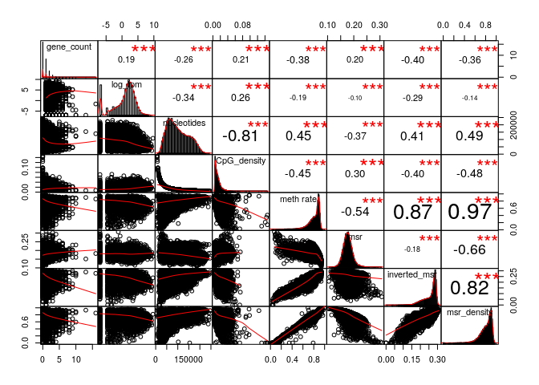

MSR and expression for H1, windows of 1000 sites
================

Here I will investigate if there is a relationship between the presence of genes and genes expression in a certain genomic region and the MSR (with some of its derivate statistics).

I chose H1 cells data in order to do this, and CpG windows of size 1000, that corresponds to a variable window size in term of nucleotides (on average about 100,000).

This is an example of total-rna-seq file, that shows for each "gene" its transcripts and some measures of expression. In this case I just kept two colums. The first one indicates the "gene"", the second one is the Transcript Per Million that is a relative measure of how much a gene is expressed.

    ##                    gene_id   TPM
    ##     1:     ENSG00000000003 45.14
    ##     2:     ENSG00000000005  0.92
    ##     3:     ENSG00000000419 28.25
    ##     4:     ENSG00000000457  1.78
    ##     5:     ENSG00000000460 15.50
    ##    ---                          
    ## 60818: gSpikein_ERCC-00165  0.00
    ## 60819: gSpikein_ERCC-00168  0.00
    ## 60820: gSpikein_ERCC-00170  0.16
    ## 60821: gSpikein_ERCC-00171  0.50
    ## 60822:    gSpikein_phiX174  0.00

This is the annotation file that store the position occupied by each human gene.

    ##         chr     start       end strand              id                    anno
    ##     1: chr1     65419     71585      + ENSG00000186092 genebody_protein_coding
    ##     2: chr1    450703    451697      - ENSG00000284733 genebody_protein_coding
    ##     3: chr1    685679    686673      - ENSG00000284662 genebody_protein_coding
    ##     4: chr1    923928    944581      + ENSG00000187634 genebody_protein_coding
    ##     5: chr1    944204    959309      - ENSG00000188976 genebody_protein_coding
    ##    ---                                                                        
    ## 19801: chrY  24763069  24813492      - ENSG00000187191 genebody_protein_coding
    ## 19802: chrY  24833843  24907040      + ENSG00000205916 genebody_protein_coding
    ## 19803: chrY  25030901  25062548      - ENSG00000185894 genebody_protein_coding
    ## 19804: chrY  25622162  25624902      + ENSG00000172288 genebody_protein_coding
    ## 19805: chrX 135309480 135309659      + ENSG00000283644 genebody_protein_coding

The number of genes is much less than the ones in the total-rna-seq file, since the first one also contains so called pseudogenes and other stuff.

So the final dataFrame is the following (excluding some columns for readability):

    ## 21 rows had too many nucleotides

    ##    start_chr start_position end_position gene_count total_TPM meth rate
    ## 12      chr1         940826       961902          2     73.88 0.4715903
    ## 13      chr1         961902       982731          2      0.26 0.7012655
    ## 14      chr1         982731      1007283          2     73.78 0.4854497
    ## 23      chr1        1206432      1228380          2     30.36 0.8951453
    ## 24      chr1        1228380      1246900          2     15.04 0.6799055
    ## 26      chr1        1274217      1295503          2     11.54 0.8296808

The full scheme includes:

**nucleotides**: number of nucleotides in the window

**CpG density**: fraction of nucleotides that is a C of a CpG site (= 1000/nucleotides)

**meth rate**: ratio of methylated CpG sites

**gene\_count**: number of genes included (even partially) inside the interval

**total\_TPM**: sum of the TPMs of the genes in the interval

then the MSR and some related statistics: **msr**, **inverted msr**, **msr ecdf **, **inverted msr ecdf**, **residual** (residual of the linear regression between msr and meth rate), **inverted residual**.

First let's see if there are pairwise correlations between the features.

###### Basic features:

log(TPM) is considered only for fragments with at least a gene.

###### Comparison with simple MSR statistics:

###### Comparison with other MSR statistics:

inverted msr vs log(tpm): 

#### Predicting gene presence

Check if features can predict gene presence:

The fraction of fragments that have at least one gene inside is

    ## [1] 0.4420778

Logistic Regression Model for gene presence with basic predictors (nucleotides, CpG\_density, meth rate):

    ##        prediction
    ## actual      FALSE      TRUE
    ##   FALSE 0.4524840 0.1054078
    ##   TRUE  0.1903731 0.2517350

    ## 
    ## accuracy:  0.7042191

Logistic Regression Model with inverted\_msr as predictor

    ##        prediction
    ## actual       FALSE       TRUE
    ##   FALSE 0.46535632 0.08074375
    ##   TRUE  0.19549065 0.25840928

    ## 
    ## accuracy:  0.7237656

Adding other predictors doesn't significantly improve the accuracy.

#### Predicting log(TPM)

Distribution of TPM values (only for regions that contains some genes) 

Linear model for TPM with standard predictors:

    ## 
    ## Call:
    ## lm(formula = log_tpm ~ ., data = model_data[, c(essentials)])
    ## 
    ## Residuals:
    ##      Min       1Q   Median       3Q      Max 
    ## -12.0667  -0.9195   0.4971   1.6097   7.1223 
    ## 
    ## Coefficients:
    ##               Estimate Std. Error t value Pr(>|t|)    
    ## (Intercept)  8.902e+00  4.566e-01  19.497  < 2e-16 ***
    ## gene_count   5.971e-02  4.129e-02   1.446    0.148    
    ## nucleotides -4.524e-05  2.111e-06 -21.432  < 2e-16 ***
    ## CpG_density -6.848e+01  9.431e+00  -7.261 4.56e-13 ***
    ## `meth rate` -2.872e+00  4.245e-01  -6.767 1.50e-11 ***
    ## ---
    ## Signif. codes:  0 '***' 0.001 '**' 0.01 '*' 0.05 '.' 0.1 ' ' 1
    ## 
    ## Residual standard error: 2.692 on 4235 degrees of freedom
    ## Multiple R-squared:  0.2162, Adjusted R-squared:  0.2155 
    ## F-statistic: 292.1 on 4 and 4235 DF,  p-value: < 2.2e-16

Linear model for TPM with all features and MSR statistics:

    ## 
    ## Call:
    ## lm(formula = log_tpm ~ ., data = model_data[, c(essentials, msr_predictors, 
    ##     "genes_nucleotides_count")])
    ## 
    ## Residuals:
    ##      Min       1Q   Median       3Q      Max 
    ## -10.1012  -1.0388   0.1032   1.3048   8.9582 
    ## 
    ## Coefficients: (1 not defined because of singularities)
    ##                           Estimate Std. Error t value Pr(>|t|)    
    ## (Intercept)              5.980e+01  6.006e+00   9.955  < 2e-16 ***
    ## gene_count               2.226e-01  3.508e-02   6.345 2.46e-10 ***
    ## nucleotides             -3.189e-05  1.905e-06 -16.740  < 2e-16 ***
    ## CpG_density             -1.288e+01  8.220e+00  -1.566    0.117    
    ## `meth rate`             -1.902e+01  2.317e+00  -8.209 2.93e-16 ***
    ## msr                     -2.099e+02  2.205e+01  -9.519  < 2e-16 ***
    ## inverted_msr            -8.578e+00  3.524e+00  -2.434    0.015 *  
    ## ecdf                    -4.127e+00  2.493e-01 -16.553  < 2e-16 ***
    ## `inverted ecdf`         -4.717e-02  2.442e-01  -0.193    0.847    
    ## residual                 2.291e+02  2.619e+01   8.747  < 2e-16 ***
    ## inverted_residual               NA         NA      NA       NA    
    ## genes_nucleotides_count  7.945e-06  1.247e-06   6.372 2.06e-10 ***
    ## ---
    ## Signif. codes:  0 '***' 0.001 '**' 0.01 '*' 0.05 '.' 0.1 ' ' 1
    ## 
    ## Residual standard error: 2.253 on 4229 degrees of freedom
    ## Multiple R-squared:  0.4518, Adjusted R-squared:  0.4505 
    ## F-statistic: 348.6 on 10 and 4229 DF,  p-value: < 2.2e-16

Linear model for TPM with some features:

    ## 
    ## Call:
    ## lm(formula = log_tpm ~ (model_data$inverted_msr) + (model_data$CpG_density) + 
    ##     (meth_rate) + (model_data$gene_count), data = model_data)
    ## 
    ## Residuals:
    ##      Min       1Q   Median       3Q      Max 
    ## -12.0488  -1.0236   0.4371   1.6570   7.2831 
    ## 
    ## Coefficients:
    ##                          Estimate Std. Error t value Pr(>|t|)    
    ## (Intercept)               4.53448    0.38438  11.797   <2e-16 ***
    ## model_data$inverted_msr -44.29203    1.72667 -25.652   <2e-16 ***
    ## model_data$CpG_density   82.84053    5.58326  14.837   <2e-16 ***
    ## meth_rate                 8.55973    0.64322  13.308   <2e-16 ***
    ## model_data$gene_count     0.06430    0.04042   1.591    0.112    
    ## ---
    ## Signif. codes:  0 '***' 0.001 '**' 0.01 '*' 0.05 '.' 0.1 ' ' 1
    ## 
    ## Residual standard error: 2.637 on 4235 degrees of freedom
    ## Multiple R-squared:  0.248,  Adjusted R-squared:  0.2473 
    ## F-statistic: 349.3 on 4 and 4235 DF,  p-value: < 2.2e-16
