MSR and expression, for H1 cells and window size of 10,000
================

Here I will investigate if there is a relationship between the presence of genes and genes expression in a certain genomic region and the MSR (with some of its derivate statistics).

I chose H1 cells data in order to do this, and CpG windows of size 10,000, that corresponds to a variable window size in term of nucleotides (on average about 1,000,000).

This is an example of total-rna-seq file, that shows for each "gene" its transcripts and some measures of expression. In this case I just kept two colums. The first one indicates the "gene"", the second one is the Transcript Per Million that is a relative measure of how much a gene is expressed.

    ##                    gene_id   TPM
    ##     1:     ENSG00000000003 45.14
    ##     2:     ENSG00000000005  0.92
    ##     3:     ENSG00000000419 28.25
    ##     4:     ENSG00000000457  1.78
    ##     5:     ENSG00000000460 15.50
    ##    ---                          
    ## 60818: gSpikein_ERCC-00165  0.00
    ## 60819: gSpikein_ERCC-00168  0.00
    ## 60820: gSpikein_ERCC-00170  0.16
    ## 60821: gSpikein_ERCC-00171  0.50
    ## 60822:    gSpikein_phiX174  0.00

This is the annotation file that store the position occupied by each human gene.

    ##         chr     start       end strand              id                    anno
    ##     1: chr1     65419     71585      + ENSG00000186092 genebody_protein_coding
    ##     2: chr1    450703    451697      - ENSG00000284733 genebody_protein_coding
    ##     3: chr1    685679    686673      - ENSG00000284662 genebody_protein_coding
    ##     4: chr1    923928    944581      + ENSG00000187634 genebody_protein_coding
    ##     5: chr1    944204    959309      - ENSG00000188976 genebody_protein_coding
    ##    ---                                                                        
    ## 19801: chrY  24763069  24813492      - ENSG00000187191 genebody_protein_coding
    ## 19802: chrY  24833843  24907040      + ENSG00000205916 genebody_protein_coding
    ## 19803: chrY  25030901  25062548      - ENSG00000185894 genebody_protein_coding
    ## 19804: chrY  25622162  25624902      + ENSG00000172288 genebody_protein_coding
    ## 19805: chrX 135309480 135309659      + ENSG00000283644 genebody_protein_coding

The number of genes is much less than the ones in the total-rna-seq file, since the first one also contains so called pseudogenes and other stuff.

So the final dataFrame is the following (excluding some columns for readability):

    ##   start_chr start_position end_position gene_count total_TPM meth rate
    ## 3      chr1        1151546      1390325         17    457.18 0.7370092
    ## 4      chr1        1390325      1647121         13    281.84 0.7250580
    ## 5      chr1        1647121      1981023          8    337.39 0.7924190
    ## 6      chr1        1981023      2270621          4     70.49 0.7807550
    ## 7      chr1        2270621      2559502          7    125.26 0.7869069
    ## 8      chr1        2559502      3015431          3     24.87 0.7908879

The full scheme includes:

**nucleotides**: number of nucleotides in the window

**CpG density**: fraction of nucleotides that is a C of a CpG site (= 10000/nucleotides)

**meth rate**: ratio of methylated CpG sites

**gene\_count**: number of genes included (even partially) inside the interval

**total\_TPM**: sum of the TPMs of the genes in the interval

then the MSR and some related statistics: **msr**, **inverted msr**, **msr ecdf **, **inverted msr ecdf**, **residual** (residual of the linear regression between msr and meth rate), **inverted residual**.

First let's see if there are pairwise correlations between the features.

###### Basic features:

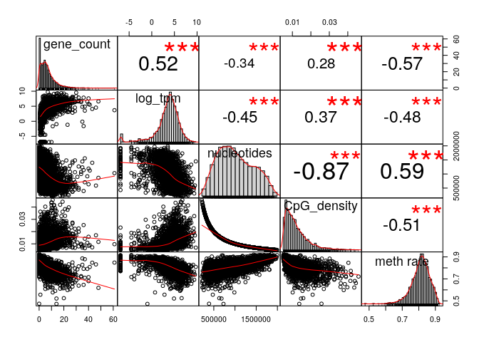

log(TPM) is considered only for fragments with at least a gene.

###### Comparison with simple MSR statistics:

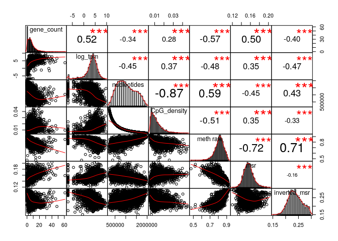

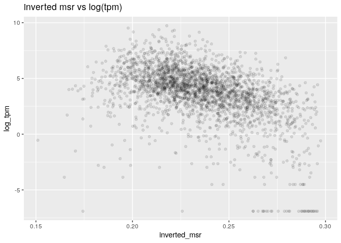

The correlation between the total TPM with the standard deviation of the TPM is:

    ##       cor 
    ## 0.9242963

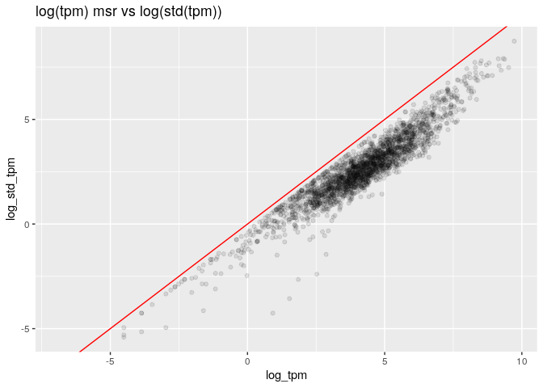

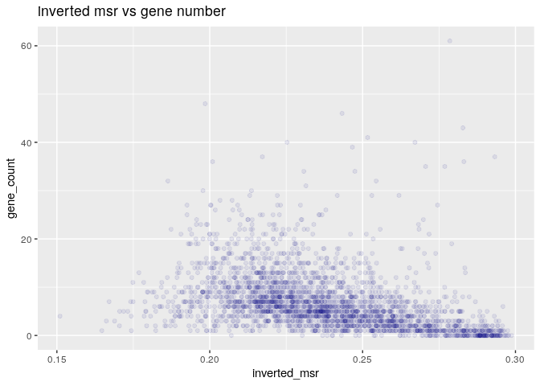

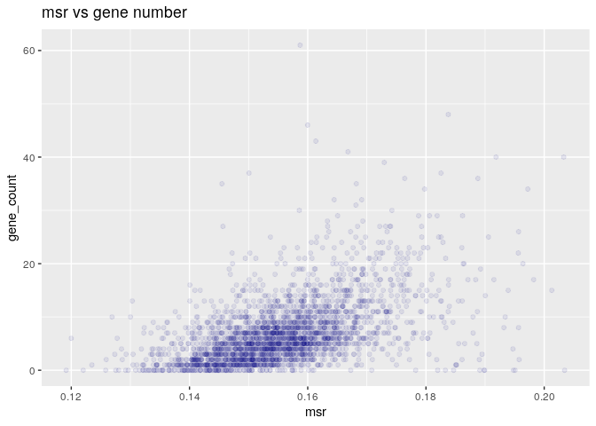

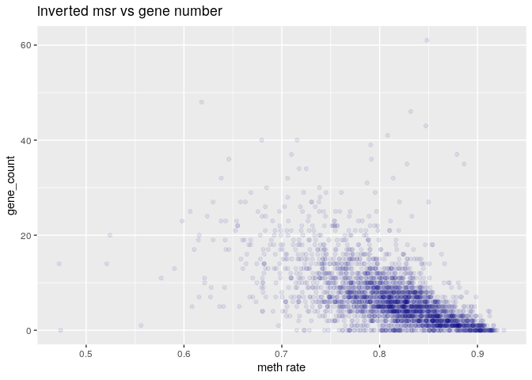

#### Predicting gene number

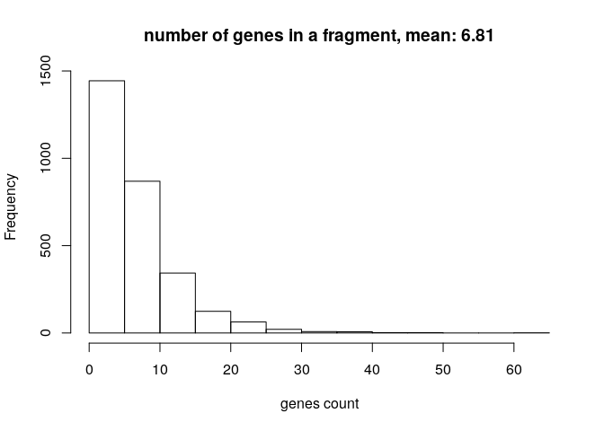

Negative binomial for gene number with basic predictors (nucleotides, CpG\_density, meth rate, msr\_density):

    ## 
    ## Call:
    ## glm.nb(formula = model_data$gene_count ~ nucleotides + CpG_density + 
    ##     `meth rate` + msr_density, data = model_data, init.theta = 3.771133443, 
    ##     link = log)
    ## 
    ## Deviance Residuals: 
    ##     Min       1Q   Median       3Q      Max  
    ## -3.3145  -0.8397  -0.2064   0.4297   7.0998  
    ## 
    ## Coefficients:
    ##               Estimate Std. Error z value Pr(>|z|)    
    ## (Intercept)  1.020e+01  2.507e-01  40.681  < 2e-16 ***
    ## nucleotides -4.550e-07  7.194e-08  -6.325 2.54e-10 ***
    ## CpG_density -2.657e+01  4.236e+00  -6.272 3.56e-10 ***
    ## `meth rate` -8.155e+00  1.705e+00  -4.784 1.72e-06 ***
    ## msr_density -1.100e+00  1.617e+00  -0.680    0.496    
    ## ---
    ## Signif. codes:  0 '***' 0.001 '**' 0.01 '*' 0.05 '.' 0.1 ' ' 1
    ## 
    ## (Dispersion parameter for Negative Binomial(3.7711) family taken to be 1)
    ## 
    ##     Null deviance: 4714.3  on 2706  degrees of freedom
    ## Residual deviance: 2927.6  on 2702  degrees of freedom
    ## AIC: 14638
    ## 
    ## Number of Fisher Scoring iterations: 1
    ## 
    ## 
    ##               Theta:  3.771 
    ##           Std. Err.:  0.166 
    ## 
    ##  2 x log-likelihood:  -14625.899

Negative binomial regression Model with inverted\_msr as predictor

    ## 
    ## Call:
    ## glm.nb(formula = model_data$gene_count ~ model_data$inverted_msr, 
    ##     data = model_data, init.theta = 2.49187074, link = log)
    ## 
    ## Deviance Residuals: 
    ##     Min       1Q   Median       3Q      Max  
    ## -2.8704  -0.8694  -0.3037   0.3399   7.0806  
    ## 
    ## Coefficients:
    ##                         Estimate Std. Error z value Pr(>|z|)    
    ## (Intercept)               5.6160     0.1307   42.97   <2e-16 ***
    ## model_data$inverted_msr -15.7542     0.5536  -28.46   <2e-16 ***
    ## ---
    ## Signif. codes:  0 '***' 0.001 '**' 0.01 '*' 0.05 '.' 0.1 ' ' 1
    ## 
    ## (Dispersion parameter for Negative Binomial(2.4919) family taken to be 1)
    ## 
    ##     Null deviance: 3676.8  on 2706  degrees of freedom
    ## Residual deviance: 2957.5  on 2705  degrees of freedom
    ## AIC: 15371
    ## 
    ## Number of Fisher Scoring iterations: 1
    ## 
    ## 
    ##               Theta:  2.4919 
    ##           Std. Err.:  0.0957 
    ## 
    ##  2 x log-likelihood:  -15364.9810

Negative Binomial Regression Model with several predictors

    ## 
    ## Call:
    ## glm.nb(formula = gene_count ~ ., data = model_data, init.theta = 4.36152541, 
    ##     link = log)
    ## 
    ## Deviance Residuals: 
    ##     Min       1Q   Median       3Q      Max  
    ## -3.6866  -0.8322  -0.2050   0.4276   8.2617  
    ## 
    ## Coefficients: (1 not defined because of singularities)
    ##                     Estimate Std. Error z value Pr(>|z|)    
    ## (Intercept)       -7.636e+00  3.445e+00  -2.216  0.02667 *  
    ## nucleotides       -1.946e-07  7.158e-08  -2.719  0.00656 ** 
    ## CpG_density       -9.947e+00  4.152e+00  -2.396  0.01659 *  
    ## `meth rate`        3.924e+00  1.882e+00   2.085  0.03707 *  
    ## msr                6.061e+01  1.263e+01   4.798 1.60e-06 ***
    ## inverted_msr      -1.190e+01  1.341e+00  -8.875  < 2e-16 ***
    ## ecdf              -4.471e-01  9.079e-02  -4.924 8.46e-07 ***
    ## `inverted ecdf`    9.865e-02  7.206e-02   1.369  0.17099    
    ## residual          -2.337e+01  1.204e+01  -1.941  0.05221 .  
    ## inverted_residual         NA         NA      NA       NA    
    ## ---
    ## Signif. codes:  0 '***' 0.001 '**' 0.01 '*' 0.05 '.' 0.1 ' ' 1
    ## 
    ## (Dispersion parameter for Negative Binomial(4.3615) family taken to be 1)
    ## 
    ##     Null deviance: 5106.1  on 2706  degrees of freedom
    ## Residual deviance: 2909.6  on 2698  degrees of freedom
    ## AIC: 14405
    ## 
    ## Number of Fisher Scoring iterations: 1
    ## 
    ## 
    ##               Theta:  4.362 
    ##           Std. Err.:  0.204 
    ## 
    ##  2 x log-likelihood:  -14385.394

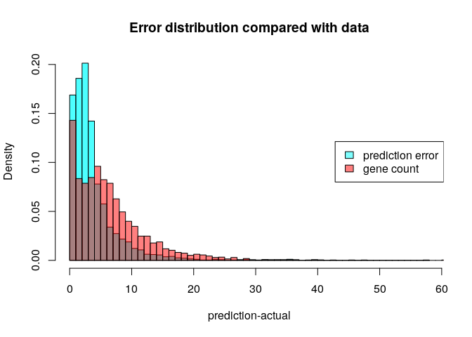

#### Predicting log(TPM)

Distribution of TPM values (only for regions that contains some genes). 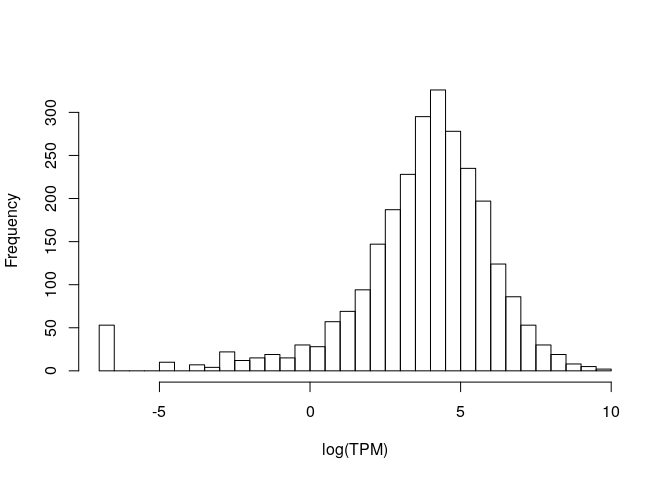

Linear model for log(TPM) with standard predictors:

    ## 
    ## Call:
    ## lm(formula = log_tpm ~ ., data = model_data)
    ## 
    ## Residuals:
    ##      Min       1Q   Median       3Q      Max 
    ## -10.3124  -0.7070   0.1851   0.9970   7.2806 
    ## 
    ## Coefficients:
    ##                           Estimate Std. Error t value Pr(>|t|)    
    ## (Intercept)              1.010e+01  9.678e-01  10.440  < 2e-16 ***
    ## nucleotides             -2.044e-06  2.166e-07  -9.435  < 2e-16 ***
    ## CpG_density             -1.693e+01  1.308e+01  -1.295 0.195618    
    ## `meth rate`             -2.841e+01  5.354e+00  -5.306 1.23e-07 ***
    ## gene_count               1.241e-01  8.159e-03  15.212  < 2e-16 ***
    ## genes_nucleotides_count  1.423e-06  1.579e-07   9.012  < 2e-16 ***
    ## msr_density              1.959e+01  5.162e+00   3.796 0.000151 ***
    ## ---
    ## Signif. codes:  0 '***' 0.001 '**' 0.01 '*' 0.05 '.' 0.1 ' ' 1
    ## 
    ## Residual standard error: 1.859 on 2334 degrees of freedom
    ##   (337 observations deleted due to missingness)
    ## Multiple R-squared:  0.4193, Adjusted R-squared:  0.4178 
    ## F-statistic: 280.9 on 6 and 2334 DF,  p-value: < 2.2e-16

Linear model for TPM with all features and MSR statistics:

    ## 
    ## Call:
    ## lm(formula = log_tpm ~ ., data = model_data)
    ## 
    ## Residuals:
    ##     Min      1Q  Median      3Q     Max 
    ## -9.7812 -0.7328  0.1249  0.9207  6.4915 
    ## 
    ## Coefficients: (2 not defined because of singularities)
    ##                           Estimate Std. Error t value Pr(>|t|)    
    ## (Intercept)             -8.293e+00  2.318e+00  -3.578 0.000353 ***
    ## nucleotides             -1.203e-06  2.139e-07  -5.624 2.09e-08 ***
    ## CpG_density              1.930e+01  1.277e+01   1.512 0.130744    
    ## `meth rate`             -1.725e+01  5.832e+00  -2.957 0.003138 ** 
    ## gene_count               1.343e-01  8.043e-03  16.700  < 2e-16 ***
    ## genes_nucleotides_count  8.569e-07  1.566e-07   5.472 4.92e-08 ***
    ## msr_density              2.771e+01  5.356e+00   5.173 2.50e-07 ***
    ## msr                      4.864e+01  7.788e+00   6.246 4.99e-10 ***
    ## inverted_msr            -2.646e+01  4.269e+00  -6.199 6.70e-10 ***
    ## ecdf                    -1.560e+00  2.658e-01  -5.870 4.97e-09 ***
    ## `inverted ecdf`         -6.032e-02  2.076e-01  -0.291 0.771437    
    ## residual                        NA         NA      NA       NA    
    ## inverted_residual               NA         NA      NA       NA    
    ## ---
    ## Signif. codes:  0 '***' 0.001 '**' 0.01 '*' 0.05 '.' 0.1 ' ' 1
    ## 
    ## Residual standard error: 1.768 on 2330 degrees of freedom
    ##   (337 observations deleted due to missingness)
    ## Multiple R-squared:  0.4753, Adjusted R-squared:  0.473 
    ## F-statistic:   211 on 10 and 2330 DF,  p-value: < 2.2e-16

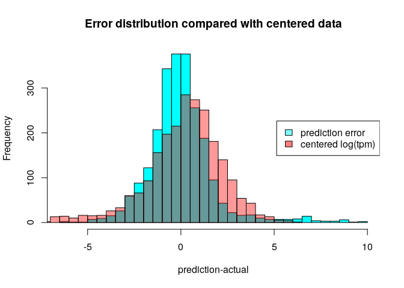

Linear model for TPM with all features and MSR statistics, without information about genes:

    ## 
    ## Call:
    ## lm(formula = log_tpm ~ ., data = model_data[, c(to_predict, basic_predictors, 
    ##     msr_predictors, "msr_density")])
    ## 
    ## Residuals:
    ##      Min       1Q   Median       3Q      Max 
    ## -10.9976  -0.7688   0.1784   1.0823   6.4831 
    ## 
    ## Coefficients: (2 not defined because of singularities)
    ##                     Estimate Std. Error t value Pr(>|t|)    
    ## (Intercept)        2.075e+01  1.141e+01   1.819   0.0690 .  
    ## nucleotides       -1.320e-06  2.290e-07  -5.762 9.40e-09 ***
    ## CpG_density       -2.703e+00  1.373e+01  -0.197   0.8439    
    ## `meth rate`       -7.196e+00  6.179e+00  -1.165   0.2443    
    ## msr               -2.317e+01  4.190e+01  -0.553   0.5804    
    ## inverted_msr      -2.478e+01  4.610e+00  -5.374 8.45e-08 ***
    ## ecdf              -1.837e+00  2.852e-01  -6.442 1.42e-10 ***
    ## `inverted ecdf`   -2.249e-01  2.242e-01  -1.003   0.3160    
    ## residual           9.106e+01  4.036e+01   2.256   0.0241 *  
    ## inverted_residual         NA         NA      NA       NA    
    ## msr_density               NA         NA      NA       NA    
    ## ---
    ## Signif. codes:  0 '***' 0.001 '**' 0.01 '*' 0.05 '.' 0.1 ' ' 1
    ## 
    ## Residual standard error: 1.912 on 2332 degrees of freedom
    ##   (337 observations deleted due to missingness)
    ## Multiple R-squared:  0.3859, Adjusted R-squared:  0.3838 
    ## F-statistic: 183.2 on 8 and 2332 DF,  p-value: < 2.2e-16

Linear model for TPM with some features:

    ## 
    ## Call:
    ## lm(formula = log_tpm ~ ., data = model_data[, c(standard_predictors, 
    ##     "inverted_msr")])
    ## 
    ## Residuals:
    ##      Min       1Q   Median       3Q      Max 
    ## -10.4593  -0.7118   0.1396   0.9707   6.5112 
    ## 
    ## Coefficients:
    ##                           Estimate Std. Error t value Pr(>|t|)    
    ## (Intercept)              6.697e+00  9.245e-01   7.244 5.76e-13 ***
    ## nucleotides             -1.512e-06  2.036e-07  -7.425 1.52e-13 ***
    ## CpG_density              1.131e+01  1.228e+01   0.921    0.357    
    ## `meth rate`             -4.014e+01  5.034e+00  -7.973 2.32e-15 ***
    ## gene_count               1.446e-01  7.742e-03  18.672  < 2e-16 ***
    ## genes_nucleotides_count  9.645e-07  1.506e-07   6.407 1.77e-10 ***
    ## msr_density              4.046e+01  5.028e+00   8.048 1.28e-15 ***
    ## inverted_msr            -2.716e+01  2.080e+00 -13.060  < 2e-16 ***
    ## ---
    ## Signif. codes:  0 '***' 0.001 '**' 0.01 '*' 0.05 '.' 0.1 ' ' 1
    ## 
    ## Residual standard error: 1.793 on 2553 degrees of freedom
    ##   (146 observations deleted due to missingness)
    ## Multiple R-squared:  0.4566, Adjusted R-squared:  0.4551 
    ## F-statistic: 306.4 on 7 and 2553 DF,  p-value: < 2.2e-16
