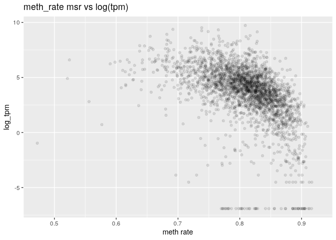

MSR and expression, for H1 cells and window size of 10,000
================

Here I will investigate if there is a relationship between the presence of genes and genes expression in a certain genomic region and the MSR (with some of its derivate statistics).

I chose H1 cells data in order to do this, and CpG windows of size 10,000, that corresponds to a variable window size in term of nucleotides (on average about 1,000,000).

This is an example of total-rna-seq file, that shows for each "gene" its transcripts and some measures of expression. In this case I just kept two colums. The first one indicates the "gene"", the second one is the Transcript Per Million that is a relative measure of how much a gene is expressed.

    ##                    gene_id   TPM
    ##     1:     ENSG00000000003 45.14
    ##     2:     ENSG00000000005  0.92
    ##     3:     ENSG00000000419 28.25
    ##     4:     ENSG00000000457  1.78
    ##     5:     ENSG00000000460 15.50
    ##    ---                          
    ## 60818: gSpikein_ERCC-00165  0.00
    ## 60819: gSpikein_ERCC-00168  0.00
    ## 60820: gSpikein_ERCC-00170  0.16
    ## 60821: gSpikein_ERCC-00171  0.50
    ## 60822:    gSpikein_phiX174  0.00

This is the annotation file that store the position occupied by each human gene.

    ##         chr     start       end strand              id                    anno
    ##     1: chr1     65419     71585      + ENSG00000186092 genebody_protein_coding
    ##     2: chr1    450703    451697      - ENSG00000284733 genebody_protein_coding
    ##     3: chr1    685679    686673      - ENSG00000284662 genebody_protein_coding
    ##     4: chr1    923928    944581      + ENSG00000187634 genebody_protein_coding
    ##     5: chr1    944204    959309      - ENSG00000188976 genebody_protein_coding
    ##    ---                                                                        
    ## 19801: chrY  24763069  24813492      - ENSG00000187191 genebody_protein_coding
    ## 19802: chrY  24833843  24907040      + ENSG00000205916 genebody_protein_coding
    ## 19803: chrY  25030901  25062548      - ENSG00000185894 genebody_protein_coding
    ## 19804: chrY  25622162  25624902      + ENSG00000172288 genebody_protein_coding
    ## 19805: chrX 135309480 135309659      + ENSG00000283644 genebody_protein_coding

The number of genes is much less than the ones in the total-rna-seq file, since the first one also contains so called pseudogenes and other stuff.

So the final dataFrame is the following (excluding some columns for readability):

    ##   start_chr start_position end_position gene_count total_TPM meth rate
    ## 3      chr1        1151546      1390325         17    457.18 0.7370092
    ## 4      chr1        1390325      1647121         13    281.84 0.7250580
    ## 5      chr1        1647121      1981023          8    337.39 0.7924190
    ## 6      chr1        1981023      2270621          4     70.49 0.7807550
    ## 7      chr1        2270621      2559502          7    125.26 0.7869069
    ## 8      chr1        2559502      3015431          3     24.87 0.7908879

The full scheme includes:

**nucleotides**: number of nucleotides in the window

**CpG density**: fraction of nucleotides that is a C of a CpG site (= 10000/nucleotides)

**meth rate**: ratio of methylated CpG sites

**gene\_count**: number of genes included (even partially) inside the interval

**total\_TPM**: sum of the TPMs of the genes in the interval

then the MSR and some related statistics: **msr**, **inverted msr**, **msr ecdf **, **inverted msr ecdf**, **residual** (residual of the linear regression between msr and meth rate), **inverted residual**.

First let's see if there are pairwise correlations between the features.

###### Basic features:

log(TPM) is considered only for fragments with at least a gene.

###### Comparison with simple MSR statistics:

The correlation between the total TPM with the standard deviation of the TPM is:

    ##       cor 
    ## 0.9242963

#### Predicting gene number

Negative binomial for gene number with basic predictors (nucleotides, CpG\_density, meth rate):

    ## 
    ## Call:
    ## glm.nb(formula = model_data$gene_count ~ nucleotides + CpG_density + 
    ##     `meth rate`, data = model_data, init.theta = 2.93533189, 
    ##     link = log)
    ## 
    ## Deviance Residuals: 
    ##     Min       1Q   Median       3Q      Max  
    ## -4.7445  -0.8222  -0.1818   0.4160   6.5909  
    ## 
    ## Coefficients:
    ##               Estimate Std. Error z value Pr(>|z|)    
    ## (Intercept)  1.011e+01  2.400e-01  42.141  < 2e-16 ***
    ## nucleotides -3.594e-07  7.177e-08  -5.008 5.51e-07 ***
    ## CpG_density -2.338e+01  4.280e+00  -5.464 4.66e-08 ***
    ## `meth rate` -9.458e+00  2.876e-01 -32.891  < 2e-16 ***
    ## ---
    ## Signif. codes:  0 '***' 0.001 '**' 0.01 '*' 0.05 '.' 0.1 ' ' 1
    ## 
    ## (Dispersion parameter for Negative Binomial(2.9353) family taken to be 1)
    ## 
    ##     Null deviance: 4778.1  on 2883  degrees of freedom
    ## Residual deviance: 3244.3  on 2880  degrees of freedom
    ## AIC: 15816
    ## 
    ## Number of Fisher Scoring iterations: 1
    ## 
    ## 
    ##               Theta:  2.935 
    ##           Std. Err.:  0.120 
    ## 
    ##  2 x log-likelihood:  -15806.176

Negative binomial regression Model with inverted\_msr as predictor

    ## 
    ## Call:
    ## glm.nb(formula = model_data$gene_count ~ model_data$inverted_msr, 
    ##     data = model_data, init.theta = 2.49187074, link = log)
    ## 
    ## Deviance Residuals: 
    ##     Min       1Q   Median       3Q      Max  
    ## -2.8704  -0.8694  -0.3037   0.3399   7.0806  
    ## 
    ## Coefficients:
    ##                         Estimate Std. Error z value Pr(>|z|)    
    ## (Intercept)               5.6160     0.1307   42.97   <2e-16 ***
    ## model_data$inverted_msr -15.7542     0.5536  -28.46   <2e-16 ***
    ## ---
    ## Signif. codes:  0 '***' 0.001 '**' 0.01 '*' 0.05 '.' 0.1 ' ' 1
    ## 
    ## (Dispersion parameter for Negative Binomial(2.4919) family taken to be 1)
    ## 
    ##     Null deviance: 3676.8  on 2706  degrees of freedom
    ## Residual deviance: 2957.5  on 2705  degrees of freedom
    ## AIC: 15371
    ## 
    ## Number of Fisher Scoring iterations: 1
    ## 
    ## 
    ##               Theta:  2.4919 
    ##           Std. Err.:  0.0957 
    ## 
    ##  2 x log-likelihood:  -15364.9810

Negative Binomial Regression Model with several predictors

    ## 
    ## Call:
    ## glm.nb(formula = gene_count ~ ., data = model_data, init.theta = 4.36152541, 
    ##     link = log)
    ## 
    ## Deviance Residuals: 
    ##     Min       1Q   Median       3Q      Max  
    ## -3.6866  -0.8322  -0.2050   0.4276   8.2617  
    ## 
    ## Coefficients: (1 not defined because of singularities)
    ##                     Estimate Std. Error z value Pr(>|z|)    
    ## (Intercept)       -7.636e+00  3.445e+00  -2.216  0.02667 *  
    ## nucleotides       -1.946e-07  7.158e-08  -2.719  0.00656 ** 
    ## CpG_density       -9.947e+00  4.152e+00  -2.396  0.01659 *  
    ## `meth rate`        3.924e+00  1.882e+00   2.085  0.03707 *  
    ## msr                6.061e+01  1.263e+01   4.798 1.60e-06 ***
    ## inverted_msr      -1.190e+01  1.341e+00  -8.875  < 2e-16 ***
    ## ecdf              -4.471e-01  9.079e-02  -4.924 8.46e-07 ***
    ## `inverted ecdf`    9.865e-02  7.206e-02   1.369  0.17099    
    ## residual          -2.337e+01  1.204e+01  -1.941  0.05221 .  
    ## inverted_residual         NA         NA      NA       NA    
    ## ---
    ## Signif. codes:  0 '***' 0.001 '**' 0.01 '*' 0.05 '.' 0.1 ' ' 1
    ## 
    ## (Dispersion parameter for Negative Binomial(4.3615) family taken to be 1)
    ## 
    ##     Null deviance: 5106.1  on 2706  degrees of freedom
    ## Residual deviance: 2909.6  on 2698  degrees of freedom
    ## AIC: 14405
    ## 
    ## Number of Fisher Scoring iterations: 1
    ## 
    ## 
    ##               Theta:  4.362 
    ##           Std. Err.:  0.204 
    ## 
    ##  2 x log-likelihood:  -14385.394

#### Predicting log(TPM)

Distribution of TPM values (only for regions that contains some genes). 

Linear model for log(TPM) with standard predictors:

    ## 
    ## Call:
    ## lm(formula = log_tpm ~ ., data = model_data)
    ## 
    ## Residuals:
    ##      Min       1Q   Median       3Q      Max 
    ## -10.1217  -0.6813   0.2189   1.0837   7.5911 
    ## 
    ## Coefficients:
    ##                           Estimate Std. Error t value Pr(>|t|)    
    ## (Intercept)              7.915e+00  9.650e-01   8.203 3.63e-16 ***
    ## nucleotides             -1.958e-06  2.178e-07  -8.990  < 2e-16 ***
    ## CpG_density              4.898e+00  1.320e+01   0.371    0.711    
    ## `meth rate`             -2.797e+01  5.272e+00  -5.305 1.22e-07 ***
    ## gene_count               1.333e-01  8.249e-03  16.160  < 2e-16 ***
    ## genes_nucleotides_count  1.904e-06  1.595e-07  11.932  < 2e-16 ***
    ## msr_density              2.087e+01  5.090e+00   4.100 4.25e-05 ***
    ## ---
    ## Signif. codes:  0 '***' 0.001 '**' 0.01 '*' 0.05 '.' 0.1 ' ' 1
    ## 
    ## Residual standard error: 2 on 2648 degrees of freedom
    ##   (23 observations deleted due to missingness)
    ## Multiple R-squared:  0.4011, Adjusted R-squared:  0.3998 
    ## F-statistic: 295.6 on 6 and 2648 DF,  p-value: < 2.2e-16

Linear model for TPM with all features and MSR statistics:

    ## 
    ## Call:
    ## lm(formula = log_tpm ~ ., data = model_data)
    ## 
    ## Residuals:
    ##     Min      1Q  Median      3Q     Max 
    ## -9.8165 -0.7340  0.1249  0.9190  6.4561 
    ## 
    ## Coefficients: (2 not defined because of singularities)
    ##                           Estimate Std. Error t value Pr(>|t|)    
    ## (Intercept)             -7.198e+00  2.195e+00  -3.279 0.001054 ** 
    ## nucleotides             -1.142e-06  2.042e-07  -5.593 2.46e-08 ***
    ## CpG_density              2.392e+01  1.225e+01   1.953 0.050958 .  
    ## `meth rate`             -1.867e+01  5.570e+00  -3.352 0.000814 ***
    ## gene_count               1.359e-01  7.711e-03  17.620  < 2e-16 ***
    ## genes_nucleotides_count  8.629e-07  1.493e-07   5.780 8.38e-09 ***
    ## msr_density              2.828e+01  5.095e+00   5.551 3.13e-08 ***
    ## msr                      4.366e+01  7.379e+00   5.916 3.74e-09 ***
    ## inverted_msr            -2.561e+01  4.052e+00  -6.321 3.06e-10 ***
    ## ecdf                    -1.601e+00  2.523e-01  -6.345 2.62e-10 ***
    ## `inverted ecdf`         -4.174e-02  1.972e-01  -0.212 0.832403    
    ## residual                        NA         NA      NA       NA    
    ## inverted_residual               NA         NA      NA       NA    
    ## ---
    ## Signif. codes:  0 '***' 0.001 '**' 0.01 '*' 0.05 '.' 0.1 ' ' 1
    ## 
    ## Residual standard error: 1.761 on 2550 degrees of freedom
    ##   (117 observations deleted due to missingness)
    ## Multiple R-squared:  0.4766, Adjusted R-squared:  0.4746 
    ## F-statistic: 232.2 on 10 and 2550 DF,  p-value: < 2.2e-16

Linear model for TPM with all features and MSR statistics, without information about genes:

    ## 
    ## Call:
    ## lm(formula = log_tpm ~ ., data = model_data[, c(to_predict, basic_predictors, 
    ##     msr_predictors, "msr_density")])
    ## 
    ## Residuals:
    ##      Min       1Q   Median       3Q      Max 
    ## -11.0676  -0.7554   0.1751   1.0708   6.4409 
    ## 
    ## Coefficients: (2 not defined because of singularities)
    ##                     Estimate Std. Error t value Pr(>|t|)    
    ## (Intercept)        2.413e+01  1.090e+01   2.215   0.0269 *  
    ## nucleotides       -1.251e-06  2.189e-07  -5.717 1.21e-08 ***
    ## CpG_density        1.880e+00  1.318e+01   0.143   0.8866    
    ## `meth rate`       -9.214e+00  5.913e+00  -1.558   0.1193    
    ## msr               -3.602e+01  4.002e+01  -0.900   0.3681    
    ## inverted_msr      -2.420e+01  4.381e+00  -5.523 3.66e-08 ***
    ## ecdf              -1.879e+00  2.713e-01  -6.928 5.38e-12 ***
    ## `inverted ecdf`   -2.070e-01  2.133e-01  -0.970   0.3319    
    ## residual           9.893e+01  3.847e+01   2.571   0.0102 *  
    ## inverted_residual         NA         NA      NA       NA    
    ## msr_density               NA         NA      NA       NA    
    ## ---
    ## Signif. codes:  0 '***' 0.001 '**' 0.01 '*' 0.05 '.' 0.1 ' ' 1
    ## 
    ## Residual standard error: 1.906 on 2552 degrees of freedom
    ##   (117 observations deleted due to missingness)
    ## Multiple R-squared:  0.3862, Adjusted R-squared:  0.3843 
    ## F-statistic: 200.7 on 8 and 2552 DF,  p-value: < 2.2e-16

Linear model for TPM with some features:

    ## 
    ## Call:
    ## lm(formula = log_tpm ~ (model_data$inverted_msr) + (model_data$CpG_density) + 
    ##     (meth_rate) + (model_data$gene_count) + (model_data$msr), 
    ##     data = model_data)
    ## 
    ## Residuals:
    ##      Min       1Q   Median       3Q      Max 
    ## -11.0345  -0.6776   0.1991   0.9951   5.7562 
    ## 
    ## Coefficients:
    ##                           Estimate Std. Error t value Pr(>|t|)    
    ## (Intercept)              -8.752353   2.234351  -3.917 9.19e-05 ***
    ## model_data$inverted_msr -46.630303   3.021509 -15.433  < 2e-16 ***
    ## model_data$CpG_density   70.300078   6.785689  10.360  < 2e-16 ***
    ## meth_rate                13.972199   2.129565   6.561 6.45e-11 ***
    ## model_data$gene_count     0.140686   0.007585  18.548  < 2e-16 ***
    ## model_data$msr           65.703395   7.439307   8.832  < 2e-16 ***
    ## ---
    ## Signif. codes:  0 '***' 0.001 '**' 0.01 '*' 0.05 '.' 0.1 ' ' 1
    ## 
    ## Residual standard error: 1.848 on 2555 degrees of freedom
    ##   (117 observations deleted due to missingness)
    ## Multiple R-squared:  0.4226, Adjusted R-squared:  0.4214 
    ## F-statistic:   374 on 5 and 2555 DF,  p-value: < 2.2e-16
