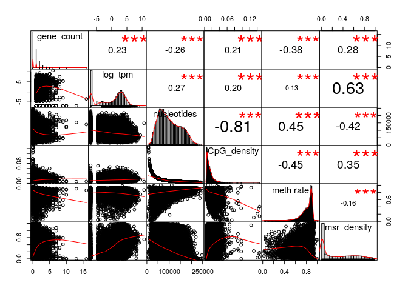
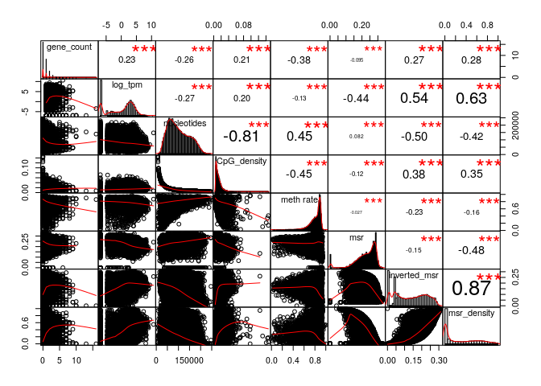

MSR and expression for K562, windows of 1000 sites
================

Here I will investigate if there is a relationship between the presence of genes and genes expression in a certain genomic region and the MSR (with some of its derivate statistics).

I chose K562 cells data in order to do this, and CpG windows of size 1000, that corresponds to a variable window size in term of nucleotides (on average about 100,000).

This is an example of total-rna-seq file, that shows for each "gene" its transcripts and some measures of expression. In this case I just kept two colums. The first one indicates the "gene"", the second one is the Transcript Per Million that is a relative measure of how much a gene is expressed.

    ##                    gene_id   TPM
    ##     1:     ENSG00000000003  0.49
    ##     2:     ENSG00000000005  0.01
    ##     3:     ENSG00000000419 78.32
    ##     4:     ENSG00000000457  8.23
    ##     5:     ENSG00000000460 43.52
    ##    ---                          
    ## 60818: gSpikein_ERCC-00165  0.00
    ## 60819: gSpikein_ERCC-00168  0.09
    ## 60820: gSpikein_ERCC-00170 44.26
    ## 60821: gSpikein_ERCC-00171 29.73
    ## 60822:    gSpikein_phiX174  0.00

This is the annotation file that store the position occupied by each human gene.

    ##         chr     start       end strand              id                    anno
    ##     1: chr1     65419     71585      + ENSG00000186092 genebody_protein_coding
    ##     2: chr1    450703    451697      - ENSG00000284733 genebody_protein_coding
    ##     3: chr1    685679    686673      - ENSG00000284662 genebody_protein_coding
    ##     4: chr1    923928    944581      + ENSG00000187634 genebody_protein_coding
    ##     5: chr1    944204    959309      - ENSG00000188976 genebody_protein_coding
    ##    ---                                                                        
    ## 19801: chrY  24763069  24813492      - ENSG00000187191 genebody_protein_coding
    ## 19802: chrY  24833843  24907040      + ENSG00000205916 genebody_protein_coding
    ## 19803: chrY  25030901  25062548      - ENSG00000185894 genebody_protein_coding
    ## 19804: chrY  25622162  25624902      + ENSG00000172288 genebody_protein_coding
    ## 19805: chrX 135309480 135309659      + ENSG00000283644 genebody_protein_coding

The number of genes is much less than the ones in the total-rna-seq file, since the first one also contains so called pseudogenes and other stuff.

So the final dataFrame is the following (excluding some columns for readability):

    ## 21 rows had too many nucleotides

    ##    start_chr start_position end_position gene_count total_TPM meth rate
    ## 12      chr1         940826       961902          2     75.90 0.4715903
    ## 13      chr1         961902       982731          2      0.10 0.7012655
    ## 14      chr1         982731      1007283          2     13.36 0.4854497
    ## 23      chr1        1206432      1228380          2     31.60 0.8951453
    ## 24      chr1        1228380      1246900          2      5.97 0.6799055
    ## 26      chr1        1274217      1295503          2      9.00 0.8296808

The full scheme includes:

**nucleotides**: number of nucleotides in the window

**CpG density**: fraction of nucleotides that is a C of a CpG site (= 1000/nucleotides)

**meth rate**: ratio of methylated CpG sites

**gene\_count**: number of genes included (even partially) inside the interval

**total\_TPM**: sum of the TPMs of the genes in the interval

then the MSR and some related statistics: **msr**, **inverted msr**, **msr ecdf **, **inverted msr ecdf**, **residual** (residual of the linear regression between msr and meth rate), **inverted residual**.

First let's see if there are pairwise correlations between the features.

###### Basic features:

log(TPM) is considered only for fragments with at least a gene.

###### Comparison with simple MSR statistics:

###### Comparison with other MSR statistics:

inverted msr vs log(tpm): 

#### Predicting gene presence

Check if features can predict gene presence:

The fraction of fragments that have at least one gene inside is

    ## [1] 0.4420778

Logistic Regression Model for gene presence with basic predictors (nucleotides, CpG\_density, meth rate):

    ##        prediction
    ## actual      FALSE      TRUE
    ##   FALSE 0.4524840 0.1054078
    ##   TRUE  0.1903731 0.2517350

    ## 
    ## accuracy:  0.7042191

Logistic Regression Model with inverted\_msr as predictor

    ##        prediction
    ## actual      FALSE      TRUE
    ##   FALSE 0.3780359 0.1660416
    ##   TRUE  0.1862506 0.2696719

    ## 
    ## accuracy:  0.6477078

Adding other predictors doesn't significantly improve the accuracy.

#### Predicting log(TPM)

Distribution of TPM values (only for regions that contains some genes) 

Linear model for TPM with standard predictors:

    ## 
    ## Call:
    ## lm(formula = log_tpm ~ ., data = model_data[, c(essentials)])
    ## 
    ## Residuals:
    ##      Min       1Q   Median       3Q      Max 
    ## -11.7311  -1.0200   0.9115   2.1548   9.7322 
    ## 
    ## Coefficients:
    ##               Estimate Std. Error t value Pr(>|t|)    
    ## (Intercept)  8.101e+00  5.900e-01  13.731  < 2e-16 ***
    ## gene_count   1.790e-01  5.558e-02   3.221  0.00129 ** 
    ## nucleotides -2.982e-05  2.817e-06 -10.585  < 2e-16 ***
    ## CpG_density -7.283e+01  1.196e+01  -6.089 1.24e-09 ***
    ## `meth rate` -3.882e+00  5.305e-01  -7.317 3.02e-13 ***
    ## ---
    ## Signif. codes:  0 '***' 0.001 '**' 0.01 '*' 0.05 '.' 0.1 ' ' 1
    ## 
    ## Residual standard error: 3.359 on 4144 degrees of freedom
    ## Multiple R-squared:  0.06659,    Adjusted R-squared:  0.06569 
    ## F-statistic: 73.91 on 4 and 4144 DF,  p-value: < 2.2e-16

Linear model for TPM with all features and MSR statistics:

    ## 
    ## Call:
    ## lm(formula = log_tpm ~ ., data = model_data[, c(essentials, msr_predictors, 
    ##     "genes_nucleotides_count")])
    ## 
    ## Residuals:
    ##      Min       1Q   Median       3Q      Max 
    ## -11.2368  -1.2055   0.1934   1.6194   9.1641 
    ## 
    ## Coefficients: (1 not defined because of singularities)
    ##                           Estimate Std. Error t value Pr(>|t|)    
    ## (Intercept)              1.326e+01  1.283e+00  10.330  < 2e-16 ***
    ## gene_count               2.224e-01  4.372e-02   5.087 3.79e-07 ***
    ## nucleotides             -3.930e-06  2.392e-06  -1.643      0.1    
    ## CpG_density             -5.584e+01  9.552e+00  -5.846 5.44e-09 ***
    ## `meth rate`             -5.802e+00  4.300e-01 -13.494  < 2e-16 ***
    ## msr                     -4.581e+01  4.026e+00 -11.377  < 2e-16 ***
    ## inverted_msr             2.242e+01  1.843e+00  12.162  < 2e-16 ***
    ## ecdf                    -1.182e+00  2.247e-01  -5.260 1.51e-07 ***
    ## `inverted ecdf`         -1.311e+00  2.245e-01  -5.843 5.54e-09 ***
    ## residual                 3.214e+01  5.385e+00   5.968 2.60e-09 ***
    ## inverted_residual               NA         NA      NA       NA    
    ## genes_nucleotides_count  7.152e-06  1.522e-06   4.699 2.69e-06 ***
    ## ---
    ## Signif. codes:  0 '***' 0.001 '**' 0.01 '*' 0.05 '.' 0.1 ' ' 1
    ## 
    ## Residual standard error: 2.616 on 4138 degrees of freedom
    ## Multiple R-squared:  0.4347, Adjusted R-squared:  0.4334 
    ## F-statistic: 318.3 on 10 and 4138 DF,  p-value: < 2.2e-16

Linear model for TPM with some features:

    ## 
    ## Call:
    ## lm(formula = log_tpm ~ (model_data$inverted_msr) + (model_data$CpG_density) + 
    ##     (meth_rate) + (model_data$gene_count), data = model_data)
    ## 
    ## Residuals:
    ##      Min       1Q   Median       3Q      Max 
    ## -12.7512  -1.3538   0.5991   2.0507   7.3944 
    ## 
    ## Coefficients:
    ##                         Estimate Std. Error t value Pr(>|t|)    
    ## (Intercept)              1.47731    0.47553   3.107   0.0019 ** 
    ## model_data$inverted_msr 25.48461    0.92761  27.473  < 2e-16 ***
    ## model_data$CpG_density  -4.12496    6.71952  -0.614   0.5393    
    ## meth_rate               -6.04404    0.49443 -12.224  < 2e-16 ***
    ## model_data$gene_count    0.22722    0.05182   4.385 1.19e-05 ***
    ## ---
    ## Signif. codes:  0 '***' 0.001 '**' 0.01 '*' 0.05 '.' 0.1 ' ' 1
    ## 
    ## Residual standard error: 3.131 on 4144 degrees of freedom
    ## Multiple R-squared:  0.1891, Adjusted R-squared:  0.1883 
    ## F-statistic: 241.5 on 4 and 4144 DF,  p-value: < 2.2e-16
