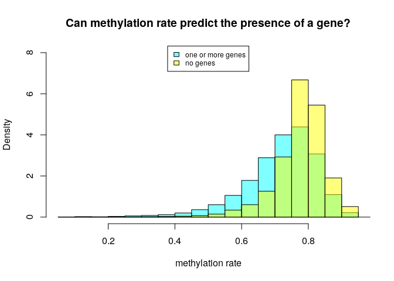

MSR and expression for stomach, windows of 1000 sites
================

Here I will investigate if there is a relationship between the presence of genes and genes expression in a certain genomic region and the MSR (with some of its derivate statistics).

I chose stomach cells data in order to do this, and CpG windows of size 1000, that corresponds to a variable window size in term of nucleotides (on average about 100,000).

This is an example of total-rna-seq file, that shows for each "gene" its transcripts and some measures of expression. In this case I just kept two colums. The first one indicates the "gene"", the second one is the Transcript Per Million that is a relative measure of how much a gene is expressed.

    ##                    gene_id    TPM
    ##     1:     ENSG00000000003   0.49
    ##     2:     ENSG00000000005   0.00
    ##     3:     ENSG00000000419   0.24
    ##     4:     ENSG00000000457   0.28
    ##     5:     ENSG00000000460   2.18
    ##    ---                           
    ## 60818: gSpikein_ERCC-00165   8.98
    ## 60819: gSpikein_ERCC-00168   0.04
    ## 60820: gSpikein_ERCC-00170   0.56
    ## 60821: gSpikein_ERCC-00171 530.85
    ## 60822:    gSpikein_phiX174  98.55

This is the annotation file that store the position occupied by each human gene.

    ##         chr     start       end strand              id                    anno
    ##     1: chr1     65419     71585      + ENSG00000186092 genebody_protein_coding
    ##     2: chr1    450703    451697      - ENSG00000284733 genebody_protein_coding
    ##     3: chr1    685679    686673      - ENSG00000284662 genebody_protein_coding
    ##     4: chr1    923928    944581      + ENSG00000187634 genebody_protein_coding
    ##     5: chr1    944204    959309      - ENSG00000188976 genebody_protein_coding
    ##    ---                                                                        
    ## 19801: chrY  24763069  24813492      - ENSG00000187191 genebody_protein_coding
    ## 19802: chrY  24833843  24907040      + ENSG00000205916 genebody_protein_coding
    ## 19803: chrY  25030901  25062548      - ENSG00000185894 genebody_protein_coding
    ## 19804: chrY  25622162  25624902      + ENSG00000172288 genebody_protein_coding
    ## 19805: chrX 135309480 135309659      + ENSG00000283644 genebody_protein_coding

The number of genes is much less than the ones in the total-rna-seq file, since the first one also contains so called pseudogenes and other stuff.

So the final dataFrame is the following (excluding some columns for readability):

    ## 21 rows had too many nucleotides

    ##    start_chr start_position end_position gene_count total_TPM meth rate
    ## 12      chr1         940826       961902          2      0.82 0.4183129
    ## 13      chr1         961902       982731          2      0.01 0.6514289
    ## 14      chr1         982731      1007283          2      2.39 0.4200074
    ## 23      chr1        1206432      1228380          2      1.19 0.7639069
    ## 24      chr1        1228380      1246900          2      0.10 0.5575582
    ## 26      chr1        1274217      1295503          2      2.01 0.7826838

The full scheme includes:

**nucleotides**: number of nucleotides in the window

**CpG density**: fraction of nucleotides that is a C of a CpG site (= 1000/nucleotides)

**meth rate**: ratio of methylated CpG sites

**gene\_count**: number of genes included (even partially) inside the interval

**total\_TPM**: sum of the TPMs of the genes in the interval

then the MSR and some related statistics: **msr**, **inverted msr**, **msr ecdf **, **inverted msr ecdf**, **residual** (residual of the linear regression between msr and meth rate), **inverted residual**.

First let's see if there are pairwise correlations between the features.

###### Basic features:

log(TPM) is considered only for fragments with at least a gene.

###### Comparison with simple MSR statistics:

###### Comparison with other MSR statistics:

inverted msr vs log(tpm): 

#### Predicting gene presence

Check if features can predict gene presence:

The fraction of fragments that have at least one gene inside is

    ## [1] 0.4420778

Logistic Regression Model for gene presence with basic predictors (nucleotides, CpG\_density, meth rate):

    ##        prediction
    ## actual      FALSE      TRUE
    ##   FALSE 0.4234324 0.1344443
    ##   TRUE  0.2065624 0.2355609

    ## 
    ## accuracy:  0.6589933

Logistic Regression Model with inverted\_msr as predictor

    ##        prediction
    ## actual       FALSE       TRUE
    ##   FALSE 0.46329287 0.08404569
    ##   TRUE  0.17423317 0.27842827

    ## 
    ## accuracy:  0.7417211

Adding other predictors doesn't significantly improve the accuracy.

#### Predicting log(TPM)

Distribution of TPM values (only for regions that contains some genes) 

Linear model for TPM with standard predictors:

    ## 
    ## Call:
    ## lm(formula = log_tpm ~ ., data = model_data[, standard_predictors])
    ## 
    ## Residuals:
    ##      Min       1Q   Median       3Q      Max 
    ## -11.2280  -1.6167   0.6388   1.9195   8.4015 
    ## 
    ## Coefficients:
    ##                           Estimate Std. Error t value Pr(>|t|)    
    ## (Intercept)             -2.302e+00  2.787e-01  -8.259   <2e-16 ***
    ## gene_count               4.735e-01  2.662e-02  17.784   <2e-16 ***
    ## nucleotides             -1.824e-05  1.245e-06 -14.646   <2e-16 ***
    ## CpG_density             -9.746e+00  5.860e+00  -1.663   0.0963 .  
    ## `meth rate`              4.414e+01  1.783e+00  24.759   <2e-16 ***
    ## genes_nucleotides_count  1.595e-05  8.398e-07  18.994   <2e-16 ***
    ## msr_density             -3.911e+01  1.607e+00 -24.344   <2e-16 ***
    ## ---
    ## Signif. codes:  0 '***' 0.001 '**' 0.01 '*' 0.05 '.' 0.1 ' ' 1
    ## 
    ## Residual standard error: 2.709 on 12596 degrees of freedom
    ## Multiple R-squared:  0.1718, Adjusted R-squared:  0.1714 
    ## F-statistic: 435.6 on 6 and 12596 DF,  p-value: < 2.2e-16

Linear model for TPM with all features and MSR statistics:

    ## 
    ## Call:
    ## lm(formula = log_tpm ~ ., data = model_data[, c(standard_predictors, 
    ##     msr_predictors)])
    ## 
    ## Residuals:
    ##     Min      1Q  Median      3Q     Max 
    ## -9.0607 -1.6715  0.4495  1.8276  8.8981 
    ## 
    ## Coefficients: (2 not defined because of singularities)
    ##                           Estimate Std. Error t value Pr(>|t|)    
    ## (Intercept)             -2.835e+00  6.591e-01  -4.302 1.71e-05 ***
    ## gene_count               4.961e-01  2.563e-02  19.357  < 2e-16 ***
    ## nucleotides             -1.112e-05  1.235e-06  -9.009  < 2e-16 ***
    ## CpG_density              2.394e+01  5.819e+00   4.114 3.92e-05 ***
    ## `meth rate`              2.348e+01  1.990e+00  11.799  < 2e-16 ***
    ## genes_nucleotides_count  1.344e-05  8.125e-07  16.542  < 2e-16 ***
    ## msr_density             -1.714e+01  1.714e+00 -10.000  < 2e-16 ***
    ## msr                     -4.926e+00  2.365e+00  -2.083   0.0373 *  
    ## inverted_msr            -7.838e+00  1.467e+00  -5.341 9.39e-08 ***
    ## ecdf                    -9.219e-01  1.678e-01  -5.495 3.99e-08 ***
    ## `inverted ecdf`         -6.901e-01  1.675e-01  -4.121 3.80e-05 ***
    ## residual                        NA         NA      NA       NA    
    ## inverted_residual               NA         NA      NA       NA    
    ## ---
    ## Signif. codes:  0 '***' 0.001 '**' 0.01 '*' 0.05 '.' 0.1 ' ' 1
    ## 
    ## Residual standard error: 2.604 on 12592 degrees of freedom
    ## Multiple R-squared:  0.2351, Adjusted R-squared:  0.2345 
    ## F-statistic: 387.1 on 10 and 12592 DF,  p-value: < 2.2e-16

Linear model for TPM with some features:

    ## 
    ## Call:
    ## lm(formula = log_tpm ~ (model_data$inverted_msr) + (model_data$CpG_density) + 
    ##     (meth_rate) + (model_data$gene_count), data = model_data)
    ## 
    ## Residuals:
    ##      Min       1Q   Median       3Q      Max 
    ## -11.8354  -1.6980   0.5568   1.9555   8.9815 
    ## 
    ## Coefficients:
    ##                          Estimate Std. Error t value Pr(>|t|)    
    ## (Intercept)              -3.70634    0.21847  -16.96   <2e-16 ***
    ## model_data$inverted_msr -25.31141    0.58969  -42.92   <2e-16 ***
    ## model_data$CpG_density   65.19791    3.41323   19.10   <2e-16 ***
    ## meth_rate                 8.05754    0.28722   28.05   <2e-16 ***
    ## model_data$gene_count     0.57886    0.02573   22.50   <2e-16 ***
    ## ---
    ## Signif. codes:  0 '***' 0.001 '**' 0.01 '*' 0.05 '.' 0.1 ' ' 1
    ## 
    ## Residual standard error: 2.681 on 12598 degrees of freedom
    ## Multiple R-squared:  0.1893, Adjusted R-squared:  0.189 
    ## F-statistic: 735.3 on 4 and 12598 DF,  p-value: < 2.2e-16
