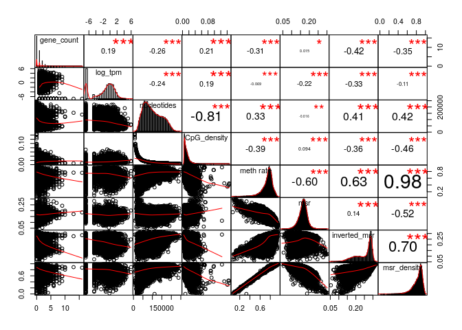
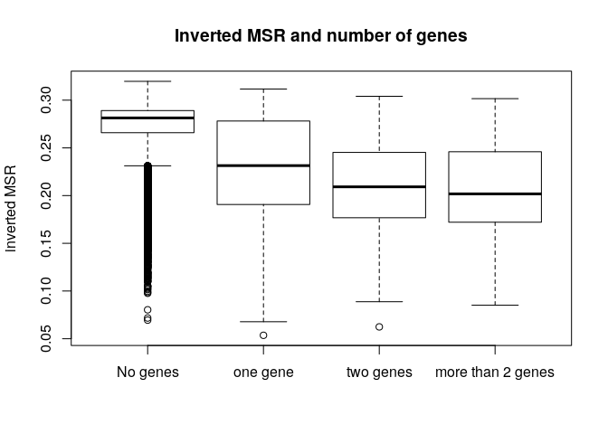

MSR and expression for stomach, windows of 1000 sites
================

Here I will investigate if there is a relationship between the presence of genes and genes expression in a certain genomic region and the MSR (with some of its derivate statistics).

I chose stomach cells data in order to do this, and CpG windows of size 1000, that corresponds to a variable window size in term of nucleotides (on average about 100,000).

This is an example of total-rna-seq file, that shows for each "gene" its transcripts and some measures of expression. In this case I just kept two colums. The first one indicates the "gene"", the second one is the Transcript Per Million that is a relative measure of how much a gene is expressed.

    ##                    gene_id    TPM
    ##     1:     ENSG00000000003   0.49
    ##     2:     ENSG00000000005   0.00
    ##     3:     ENSG00000000419   0.24
    ##     4:     ENSG00000000457   0.28
    ##     5:     ENSG00000000460   2.18
    ##    ---                           
    ## 60818: gSpikein_ERCC-00165   8.98
    ## 60819: gSpikein_ERCC-00168   0.04
    ## 60820: gSpikein_ERCC-00170   0.56
    ## 60821: gSpikein_ERCC-00171 530.85
    ## 60822:    gSpikein_phiX174  98.55

This is the annotation file that store the position occupied by each human gene.

    ##         chr     start       end strand              id                    anno
    ##     1: chr1     65419     71585      + ENSG00000186092 genebody_protein_coding
    ##     2: chr1    450703    451697      - ENSG00000284733 genebody_protein_coding
    ##     3: chr1    685679    686673      - ENSG00000284662 genebody_protein_coding
    ##     4: chr1    923928    944581      + ENSG00000187634 genebody_protein_coding
    ##     5: chr1    944204    959309      - ENSG00000188976 genebody_protein_coding
    ##    ---                                                                        
    ## 19801: chrY  24763069  24813492      - ENSG00000187191 genebody_protein_coding
    ## 19802: chrY  24833843  24907040      + ENSG00000205916 genebody_protein_coding
    ## 19803: chrY  25030901  25062548      - ENSG00000185894 genebody_protein_coding
    ## 19804: chrY  25622162  25624902      + ENSG00000172288 genebody_protein_coding
    ## 19805: chrX 135309480 135309659      + ENSG00000283644 genebody_protein_coding

The number of genes is much less than the ones in the total-rna-seq file, since the first one also contains so called pseudogenes and other stuff.

So the final dataFrame is the following (excluding some columns for readability):

    ## 21 rows had too many nucleotides

    ##    start_chr start_position end_position gene_count total_TPM meth rate
    ## 12      chr1         940826       961902          2      0.82 0.4183129
    ## 13      chr1         961902       982731          2      0.01 0.6514289
    ## 14      chr1         982731      1007283          2      2.39 0.4200074
    ## 23      chr1        1206432      1228380          2      1.19 0.7639069
    ## 24      chr1        1228380      1246900          2      0.10 0.5575582
    ## 26      chr1        1274217      1295503          2      2.01 0.7826838

The full scheme includes:

**nucleotides**: number of nucleotides in the window

**CpG density**: fraction of nucleotides that is a C of a CpG site (= 1000/nucleotides)

**meth rate**: ratio of methylated CpG sites

**gene\_count**: number of genes included (even partially) inside the interval

**total\_TPM**: sum of the TPMs of the genes in the interval

then the MSR and some related statistics: **msr**, **inverted msr**, **msr ecdf **, **inverted msr ecdf**, **residual** (residual of the linear regression between msr and meth rate), **inverted residual**.

First let's see if there are pairwise correlations between the features.

###### Basic features:

log(TPM) is considered only for fragments with at least a gene.

###### Comparison with simple MSR statistics:

###### Comparison with other MSR statistics:

inverted msr vs log(tpm): 

#### Predicting gene presence

Check if features can predict gene presence:

The fraction of fragments that have at least one gene inside is

    ## [1] 0.4420778

Logistic Regression Model for gene presence with basic predictors (nucleotides, CpG\_density, meth rate):

    ##        prediction
    ## actual      FALSE      TRUE
    ##   FALSE 0.4234324 0.1344443
    ##   TRUE  0.2065624 0.2355609

    ## 
    ## accuracy:  0.6589933

Logistic Regression Model with inverted\_msr as predictor

    ##        prediction
    ## actual       FALSE       TRUE
    ##   FALSE 0.46329287 0.08404569
    ##   TRUE  0.17423317 0.27842827

    ## 
    ## accuracy:  0.7417211

Adding other predictors doesn't significantly improve the accuracy.

#### Predicting log(TPM)

Distribution of TPM values (only for regions that contains some genes) 

Linear model for TPM with standard predictors:

    ## 
    ## Call:
    ## lm(formula = log_tpm ~ ., data = model_data[, c(essentials)])
    ## 
    ## Residuals:
    ##     Min      1Q  Median      3Q     Max 
    ## -7.4238 -0.7792  0.6104  1.5610  7.7014 
    ## 
    ## Coefficients:
    ##               Estimate Std. Error t value Pr(>|t|)    
    ## (Intercept)  2.771e+00  4.512e-01   6.141 8.94e-10 ***
    ## gene_count   4.556e-02  3.860e-02   1.180   0.2379    
    ## nucleotides -2.897e-05  1.933e-06 -14.986  < 2e-16 ***
    ## CpG_density -4.607e+01  8.910e+00  -5.170 2.44e-07 ***
    ## `meth rate` -7.976e-01  4.258e-01  -1.873   0.0611 .  
    ## ---
    ## Signif. codes:  0 '***' 0.001 '**' 0.01 '*' 0.05 '.' 0.1 ' ' 1
    ## 
    ## Residual standard error: 2.515 on 4303 degrees of freedom
    ## Multiple R-squared:  0.09628,    Adjusted R-squared:  0.09544 
    ## F-statistic: 114.6 on 4 and 4303 DF,  p-value: < 2.2e-16

Linear model for TPM with all features and MSR statistics:

    ## 
    ## Call:
    ## lm(formula = log_tpm ~ ., data = model_data[, c(essentials, msr_predictors, 
    ##     "genes_nucleotides_count")])
    ## 
    ## Residuals:
    ##     Min      1Q  Median      3Q     Max 
    ## -7.7424 -0.9843  0.3239  1.3389  9.0664 
    ## 
    ## Coefficients: (1 not defined because of singularities)
    ##                           Estimate Std. Error t value Pr(>|t|)    
    ## (Intercept)             -2.378e+01  6.541e+00  -3.635 0.000281 ***
    ## gene_count               1.704e-01  3.517e-02   4.846 1.30e-06 ***
    ## nucleotides             -1.167e-05  1.962e-06  -5.951 2.88e-09 ***
    ## CpG_density              1.279e+01  8.254e+00   1.550 0.121316    
    ## `meth rate`              1.292e+01  3.073e+00   4.205 2.67e-05 ***
    ## msr                      9.113e+01  2.532e+01   3.599 0.000323 ***
    ## inverted_msr            -6.548e+00  2.423e+00  -2.702 0.006915 ** 
    ## ecdf                    -2.030e+00  2.887e-01  -7.032 2.36e-12 ***
    ## `inverted ecdf`         -6.357e-01  2.767e-01  -2.297 0.021651 *  
    ## residual                -9.362e+01  2.517e+01  -3.720 0.000202 ***
    ## inverted_residual               NA         NA      NA       NA    
    ## genes_nucleotides_count  1.105e-05  1.261e-06   8.763  < 2e-16 ***
    ## ---
    ## Signif. codes:  0 '***' 0.001 '**' 0.01 '*' 0.05 '.' 0.1 ' ' 1
    ## 
    ## Residual standard error: 2.241 on 4297 degrees of freedom
    ## Multiple R-squared:  0.2837, Adjusted R-squared:  0.282 
    ## F-statistic: 170.2 on 10 and 4297 DF,  p-value: < 2.2e-16

Linear model for TPM with some features:

    ## 
    ## Call:
    ## lm(formula = log_tpm ~ (model_data$inverted_msr) + (model_data$CpG_density) + 
    ##     (meth_rate) + (model_data$gene_count), data = model_data)
    ## 
    ## Residuals:
    ##     Min      1Q  Median      3Q     Max 
    ## -8.0156 -1.0101  0.3973  1.5320  7.2473 
    ## 
    ## Coefficients:
    ##                         Estimate Std. Error t value Pr(>|t|)    
    ## (Intercept)               0.9250     0.3619   2.556  0.01062 *  
    ## model_data$inverted_msr -26.5922     0.9020 -29.482  < 2e-16 ***
    ## model_data$CpG_density   49.2817     5.1472   9.575  < 2e-16 ***
    ## meth_rate                 4.2406     0.4377   9.689  < 2e-16 ***
    ## model_data$gene_count     0.1117     0.0362   3.087  0.00203 ** 
    ## ---
    ## Signif. codes:  0 '***' 0.001 '**' 0.01 '*' 0.05 '.' 0.1 ' ' 1
    ## 
    ## Residual standard error: 2.353 on 4303 degrees of freedom
    ## Multiple R-squared:  0.2089, Adjusted R-squared:  0.2082 
    ## F-statistic: 284.1 on 4 and 4303 DF,  p-value: < 2.2e-16
