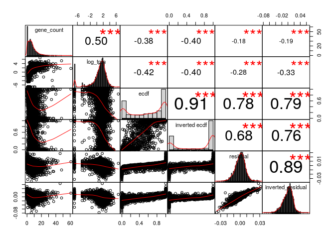
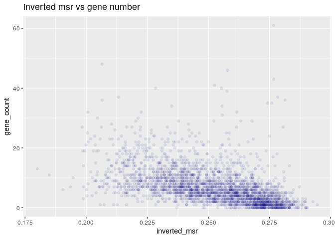
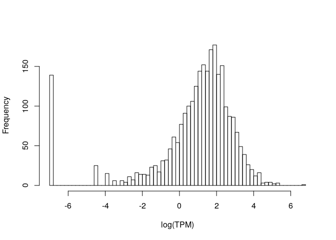

MSR and expression, for stomach cells and window size of 10,000
================

Here I will investigate if there is a relationship between the presence of genes and genes expression in a certain genomic region and the MSR (with some of its derivate statistics).

I chose stomach cells data in order to do this, and CpG windows of size 10,000, that corresponds to a variable window size in term of nucleotides (on average about 1,000,000).

This is an example of total-rna-seq file, that shows for each "gene" its transcripts and some measures of expression. In this case I just kept two colums. The first one indicates the "gene"", the second one is the Transcript Per Million that is a relative measure of how much a gene is expressed.

    ##                    gene_id    TPM
    ##     1:     ENSG00000000003   0.49
    ##     2:     ENSG00000000005   0.00
    ##     3:     ENSG00000000419   0.24
    ##     4:     ENSG00000000457   0.28
    ##     5:     ENSG00000000460   2.18
    ##    ---                           
    ## 60818: gSpikein_ERCC-00165   8.98
    ## 60819: gSpikein_ERCC-00168   0.04
    ## 60820: gSpikein_ERCC-00170   0.56
    ## 60821: gSpikein_ERCC-00171 530.85
    ## 60822:    gSpikein_phiX174  98.55

This is the annotation file that store the position occupied by each human gene.

    ##         chr     start       end strand              id                    anno
    ##     1: chr1     65419     71585      + ENSG00000186092 genebody_protein_coding
    ##     2: chr1    450703    451697      - ENSG00000284733 genebody_protein_coding
    ##     3: chr1    685679    686673      - ENSG00000284662 genebody_protein_coding
    ##     4: chr1    923928    944581      + ENSG00000187634 genebody_protein_coding
    ##     5: chr1    944204    959309      - ENSG00000188976 genebody_protein_coding
    ##    ---                                                                        
    ## 19801: chrY  24763069  24813492      - ENSG00000187191 genebody_protein_coding
    ## 19802: chrY  24833843  24907040      + ENSG00000205916 genebody_protein_coding
    ## 19803: chrY  25030901  25062548      - ENSG00000185894 genebody_protein_coding
    ## 19804: chrY  25622162  25624902      + ENSG00000172288 genebody_protein_coding
    ## 19805: chrX 135309480 135309659      + ENSG00000283644 genebody_protein_coding

The number of genes is much less than the ones in the total-rna-seq file, since the first one also contains so called pseudogenes and other stuff.

So the final dataFrame is the following (excluding some columns for readability):

    ##   start_chr start_position end_position gene_count total_TPM meth rate
    ## 2      chr1         921648      1151546         10     12.65 0.5677261
    ## 3      chr1        1151546      1390325         17     32.56 0.6524979
    ## 4      chr1        1390325      1647121         13     16.74 0.6697962
    ## 5      chr1        1647121      1981023          8     10.67 0.7296424
    ## 6      chr1        1981023      2270621          4      5.49 0.7102574
    ## 7      chr1        2270621      2559502          7      9.64 0.6749857

The full scheme includes:

**nucleotides**: number of nucleotides in the window

**CpG density**: fraction of nucleotides that is a C of a CpG site (= 10000/nucleotides)

**meth rate**: ratio of methylated CpG sites

**gene\_count**: number of genes included (even partially) inside the interval

**total\_TPM**: sum of the TPMs of the genes in the interval

then the MSR and some related statistics: **msr**, **inverted msr**, **msr ecdf **, **inverted msr ecdf**, **residual** (residual of the linear regression between msr and meth rate), **inverted residual**.

First let's see if there are pairwise correlations between the features.

###### Basic features:

log(TPM) is considered only for fragments with at least a gene.

###### Comparison with simple MSR statistics:

###### Comparison with other MSR statistics:

The correlation between the total TPM with the standard deviation of the TPM is:

    ##      cor 
    ## 0.892561

#### Predicting gene number

Poisson regression for gene number with basic predictors (nucleotides, CpG\_density, meth rate):

    ## 
    ## Call:
    ## glm(formula = model_data$gene_count ~ nucleotides + CpG_density + 
    ##     `meth rate`, family = "poisson", data = model_data)
    ## 
    ## Deviance Residuals: 
    ##    Min      1Q  Median      3Q     Max  
    ## -7.188  -1.446  -0.301   0.887  13.107  
    ## 
    ## Coefficients:
    ##               Estimate Std. Error z value Pr(>|z|)    
    ## (Intercept)  7.444e+00  1.221e-01   60.97   <2e-16 ***
    ## nucleotides -9.305e-07  3.844e-08  -24.20   <2e-16 ***
    ## CpG_density -3.425e+01  2.244e+00  -15.27   <2e-16 ***
    ## `meth rate` -5.679e+00  1.396e-01  -40.68   <2e-16 ***
    ## ---
    ## Signif. codes:  0 '***' 0.001 '**' 0.01 '*' 0.05 '.' 0.1 ' ' 1
    ## 
    ## (Dispersion parameter for poisson family taken to be 1)
    ## 
    ##     Null deviance: 14051  on 2883  degrees of freedom
    ## Residual deviance: 10605  on 2880  degrees of freedom
    ## AIC: 20097
    ## 
    ## Number of Fisher Scoring iterations: 5

Poisson regression Model with inverted\_msr as predictor

    ## 
    ## Call:
    ## glm(formula = model_data$gene_count ~ model_data$inverted_msr, 
    ##     family = "poisson", data = model_data)
    ## 
    ## Deviance Residuals: 
    ##     Min       1Q   Median       3Q      Max  
    ## -4.9991  -1.4908  -0.4799   0.6939  14.8572  
    ## 
    ## Coefficients:
    ##                          Estimate Std. Error z value Pr(>|z|)    
    ## (Intercept)               6.92648    0.08308   83.38   <2e-16 ***
    ## model_data$inverted_msr -20.09757    0.33976  -59.15   <2e-16 ***
    ## ---
    ## Signif. codes:  0 '***' 0.001 '**' 0.01 '*' 0.05 '.' 0.1 ' ' 1
    ## 
    ## (Dispersion parameter for poisson family taken to be 1)
    ## 
    ##     Null deviance: 12961.3  on 2766  degrees of freedom
    ## Residual deviance:  9562.1  on 2765  degrees of freedom
    ## AIC: 18876
    ## 
    ## Number of Fisher Scoring iterations: 5

Poisson Regression Model with several predictors

    ## 
    ## Call:
    ## glm(formula = gene_count ~ ., family = "poisson", data = model_data)
    ## 
    ## Deviance Residuals: 
    ##     Min       1Q   Median       3Q      Max  
    ## -6.8874  -1.1790  -0.3495   0.6548  15.0779  
    ## 
    ## Coefficients: (1 not defined because of singularities)
    ##                     Estimate Std. Error z value Pr(>|z|)    
    ## (Intercept)       -5.104e+01  2.138e+00 -23.871  < 2e-16 ***
    ## nucleotides       -3.407e-08  4.613e-08  -0.739 0.460206    
    ## CpG_density       -1.410e+01  2.312e+00  -6.100 1.06e-09 ***
    ## `meth rate`        2.550e+01  9.779e-01  26.077  < 2e-16 ***
    ## msr                2.082e+02  7.197e+00  28.926  < 2e-16 ***
    ## inverted_msr      -1.839e+01  1.274e+00 -14.436  < 2e-16 ***
    ## ecdf               1.971e-01  5.680e-02   3.470 0.000521 ***
    ## `inverted ecdf`    5.795e-02  4.465e-02   1.298 0.194279    
    ## residual          -1.826e+02  7.462e+00 -24.474  < 2e-16 ***
    ## inverted_residual         NA         NA      NA       NA    
    ## ---
    ## Signif. codes:  0 '***' 0.001 '**' 0.01 '*' 0.05 '.' 0.1 ' ' 1
    ## 
    ## (Dispersion parameter for poisson family taken to be 1)
    ## 
    ##     Null deviance: 12961.3  on 2766  degrees of freedom
    ## Residual deviance:  7480.8  on 2758  degrees of freedom
    ## AIC: 16809
    ## 
    ## Number of Fisher Scoring iterations: 5

#### Predicting log(TPM)

Distribution of TPM values (only for regions that contains some genes). 

Linear model for log(TPM) with standard predictors:

    ## 
    ## Call:
    ## lm(formula = log_tpm ~ ., data = model_data)
    ## 
    ## Residuals:
    ##      Min       1Q   Median       3Q      Max 
    ## -12.6703  -0.4418   0.3675   1.0995   5.2812 
    ## 
    ## Coefficients:
    ##               Estimate Std. Error t value Pr(>|t|)    
    ## (Intercept) -2.343e+00  8.573e-01  -2.734  0.00631 ** 
    ## nucleotides -1.974e-06  1.973e-07 -10.001  < 2e-16 ***
    ## CpG_density -2.577e+01  1.272e+01  -2.026  0.04284 *  
    ## `meth rate`  5.510e+00  9.615e-01   5.731 1.11e-08 ***
    ## gene_count   1.803e-01  7.440e-03  24.233  < 2e-16 ***
    ## ---
    ## Signif. codes:  0 '***' 0.001 '**' 0.01 '*' 0.05 '.' 0.1 ' ' 1
    ## 
    ## Residual standard error: 1.975 on 2650 degrees of freedom
    ##   (23 observations deleted due to missingness)
    ## Multiple R-squared:  0.3085, Adjusted R-squared:  0.3074 
    ## F-statistic: 295.6 on 4 and 2650 DF,  p-value: < 2.2e-16

Linear model for TPM with all features and MSR statistics:

    ## 
    ## Call:
    ## lm(formula = log_tpm ~ ., data = model_data)
    ## 
    ## Residuals:
    ##     Min      1Q  Median      3Q     Max 
    ## -8.9883 -0.5826  0.2021  0.9444  5.7676 
    ## 
    ## Coefficients: (1 not defined because of singularities)
    ##                           Estimate Std. Error t value Pr(>|t|)    
    ## (Intercept)             -1.322e+02  1.036e+01 -12.766  < 2e-16 ***
    ## nucleotides              1.459e-07  2.080e-07   0.701  0.48312    
    ## CpG_density              2.303e+01  1.177e+01   1.957  0.05045 .  
    ## `meth rate`              7.530e+01  4.567e+00  16.486  < 2e-16 ***
    ## msr                      4.819e+02  3.551e+01  13.572  < 2e-16 ***
    ## inverted_msr            -5.691e+01  6.212e+00  -9.161  < 2e-16 ***
    ## ecdf                    -1.328e-01  2.747e-01  -0.483  0.62900    
    ## `inverted ecdf`          6.355e-01  2.047e-01   3.104  0.00193 ** 
    ## residual                -3.930e+02  3.770e+01 -10.424  < 2e-16 ***
    ## inverted_residual               NA         NA      NA       NA    
    ## gene_count               1.075e-01  7.212e-03  14.904  < 2e-16 ***
    ## genes_nucleotides_count  9.412e-07  1.436e-07   6.553 6.77e-11 ***
    ## ---
    ## Signif. codes:  0 '***' 0.001 '**' 0.01 '*' 0.05 '.' 0.1 ' ' 1
    ## 
    ## Residual standard error: 1.712 on 2593 degrees of freedom
    ##   (74 observations deleted due to missingness)
    ## Multiple R-squared:  0.4486, Adjusted R-squared:  0.4464 
    ## F-statistic: 210.9 on 10 and 2593 DF,  p-value: < 2.2e-16

Linear model for TPM with all features and MSR statistics, without information about genes:

    ## 
    ## Call:
    ## lm(formula = log_tpm ~ ., data = model_data[, c(to_predict, basic_predictors, 
    ##     msr_predictors)])
    ## 
    ## Residuals:
    ##     Min      1Q  Median      3Q     Max 
    ## -9.6612 -0.6083  0.2365  1.0532  5.8986 
    ## 
    ## Coefficients: (1 not defined because of singularities)
    ##                     Estimate Std. Error t value Pr(>|t|)    
    ## (Intercept)       -1.796e+02  1.064e+01 -16.881   <2e-16 ***
    ## nucleotides        3.592e-07  2.185e-07   1.644   0.1003    
    ## CpG_density        1.603e+00  1.241e+01   0.129   0.8973    
    ## `meth rate`        9.572e+01  4.688e+00  20.417   <2e-16 ***
    ## msr                6.699e+02  3.605e+01  18.583   <2e-16 ***
    ## inverted_msr      -6.296e+01  6.563e+00  -9.593   <2e-16 ***
    ## ecdf               2.068e-01  2.908e-01   0.711   0.4771    
    ## `inverted ecdf`    5.155e-01  2.170e-01   2.376   0.0176 *  
    ## residual          -5.808e+02  3.847e+01 -15.097   <2e-16 ***
    ## inverted_residual         NA         NA      NA       NA    
    ## ---
    ## Signif. codes:  0 '***' 0.001 '**' 0.01 '*' 0.05 '.' 0.1 ' ' 1
    ## 
    ## Residual standard error: 1.817 on 2595 degrees of freedom
    ##   (74 observations deleted due to missingness)
    ## Multiple R-squared:  0.3784, Adjusted R-squared:  0.3764 
    ## F-statistic: 197.4 on 8 and 2595 DF,  p-value: < 2.2e-16

Linear model for TPM with some features:

    ## 
    ## Call:
    ## lm(formula = log_tpm ~ (model_data$inverted_msr) + (model_data$CpG_density) + 
    ##     (meth_rate) + (model_data$gene_count) + (model_data$msr), 
    ##     data = model_data)
    ## 
    ## Residuals:
    ##      Min       1Q   Median       3Q      Max 
    ## -10.2501  -0.5352   0.2486   0.9994   4.6921 
    ## 
    ## Coefficients:
    ##                           Estimate Std. Error t value Pr(>|t|)    
    ## (Intercept)             -32.543413   2.616437 -12.438  < 2e-16 ***
    ## model_data$inverted_msr -85.147389   3.883254 -21.927  < 2e-16 ***
    ## model_data$CpG_density   44.821984   6.489619   6.907 6.21e-12 ***
    ## meth_rate                38.451478   2.285999  16.820  < 2e-16 ***
    ## model_data$gene_count     0.140415   0.006967  20.155  < 2e-16 ***
    ## model_data$msr          132.336954   9.362353  14.135  < 2e-16 ***
    ## ---
    ## Signif. codes:  0 '***' 0.001 '**' 0.01 '*' 0.05 '.' 0.1 ' ' 1
    ## 
    ## Residual standard error: 1.773 on 2598 degrees of freedom
    ##   (74 observations deleted due to missingness)
    ## Multiple R-squared:  0.4074, Adjusted R-squared:  0.4062 
    ## F-statistic: 357.2 on 5 and 2598 DF,  p-value: < 2.2e-16
