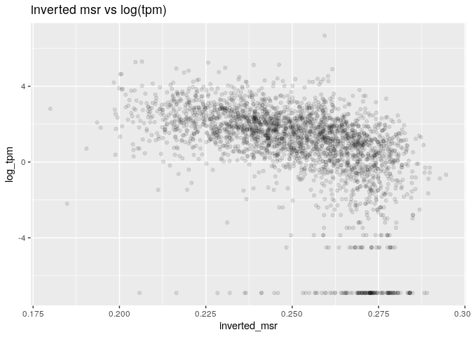

MSR and expression, for stomach cells and window size of 10,000
================

Here I will investigate if there is a relationship between the presence of genes and genes expression in a certain genomic region and the MSR (with some of its derivate statistics).

I chose stomach cells data in order to do this, and CpG windows of size 10,000, that corresponds to a variable window size in term of nucleotides (on average about 1,000,000).

This is an example of total-rna-seq file, that shows for each "gene" its transcripts and some measures of expression. In this case I just kept two colums. The first one indicates the "gene"", the second one is the Transcript Per Million that is a relative measure of how much a gene is expressed.

    ##                    gene_id    TPM
    ##     1:     ENSG00000000003   0.49
    ##     2:     ENSG00000000005   0.00
    ##     3:     ENSG00000000419   0.24
    ##     4:     ENSG00000000457   0.28
    ##     5:     ENSG00000000460   2.18
    ##    ---                           
    ## 60818: gSpikein_ERCC-00165   8.98
    ## 60819: gSpikein_ERCC-00168   0.04
    ## 60820: gSpikein_ERCC-00170   0.56
    ## 60821: gSpikein_ERCC-00171 530.85
    ## 60822:    gSpikein_phiX174  98.55

This is the annotation file that store the position occupied by each human gene.

    ##         chr     start       end strand              id                    anno
    ##     1: chr1     65419     71585      + ENSG00000186092 genebody_protein_coding
    ##     2: chr1    450703    451697      - ENSG00000284733 genebody_protein_coding
    ##     3: chr1    685679    686673      - ENSG00000284662 genebody_protein_coding
    ##     4: chr1    923928    944581      + ENSG00000187634 genebody_protein_coding
    ##     5: chr1    944204    959309      - ENSG00000188976 genebody_protein_coding
    ##    ---                                                                        
    ## 19801: chrY  24763069  24813492      - ENSG00000187191 genebody_protein_coding
    ## 19802: chrY  24833843  24907040      + ENSG00000205916 genebody_protein_coding
    ## 19803: chrY  25030901  25062548      - ENSG00000185894 genebody_protein_coding
    ## 19804: chrY  25622162  25624902      + ENSG00000172288 genebody_protein_coding
    ## 19805: chrX 135309480 135309659      + ENSG00000283644 genebody_protein_coding

The number of genes is much less than the ones in the total-rna-seq file, since the first one also contains so called pseudogenes and other stuff.

So the final dataFrame is the following (excluding some columns for readability):

    ##   start_chr start_position end_position gene_count total_TPM meth rate
    ## 2      chr1         921648      1151546         10     12.65 0.5677261
    ## 3      chr1        1151546      1390325         17     32.56 0.6524979
    ## 4      chr1        1390325      1647121         13     16.74 0.6697962
    ## 5      chr1        1647121      1981023          8     10.67 0.7296424
    ## 6      chr1        1981023      2270621          4      5.49 0.7102574
    ## 7      chr1        2270621      2559502          7      9.64 0.6749857

The full scheme includes:

**nucleotides**: number of nucleotides in the window

**CpG density**: fraction of nucleotides that is a C of a CpG site (= 10000/nucleotides)

**meth rate**: ratio of methylated CpG sites

**gene\_count**: number of genes included (even partially) inside the interval

**total\_TPM**: sum of the TPMs of the genes in the interval

then the MSR and some related statistics: **msr**, **inverted msr**, **msr ecdf **, **inverted msr ecdf**, **residual** (residual of the linear regression between msr and meth rate), **inverted residual**.

First let's see if there are pairwise correlations between the features.

###### Basic features:

log(TPM) is considered only for fragments with at least a gene.

###### Comparison with simple MSR statistics:

###### Comparison with other MSR statistics:

The correlation between the total TPM with the standard deviation of the TPM is:

    ##      cor 
    ## 0.892561

#### Predicting gene number

Negative binomial for gene number with basic predictors (nucleotides, CpG\_density, meth rate, msr\_density):

    ## 
    ## Call:
    ## glm.nb(formula = model_data$gene_count ~ nucleotides + CpG_density + 
    ##     `meth rate` + msr_density, data = model_data, init.theta = 4.017613716, 
    ##     link = log)
    ## 
    ## Deviance Residuals: 
    ##     Min       1Q   Median       3Q      Max  
    ## -4.0967  -0.8063  -0.2119   0.3826   8.1576  
    ## 
    ## Coefficients:
    ##               Estimate Std. Error z value Pr(>|z|)    
    ## (Intercept)  8.078e+00  2.339e-01  34.541  < 2e-16 ***
    ## nucleotides -2.021e-08  7.284e-08  -0.277    0.781    
    ## CpG_density -3.029e+01  4.005e+00  -7.563 3.94e-14 ***
    ## `meth rate`  2.926e+01  1.272e+00  23.004  < 2e-16 ***
    ## msr_density -3.355e+01  1.158e+00 -28.966  < 2e-16 ***
    ## ---
    ## Signif. codes:  0 '***' 0.001 '**' 0.01 '*' 0.05 '.' 0.1 ' ' 1
    ## 
    ## (Dispersion parameter for Negative Binomial(4.0176) family taken to be 1)
    ## 
    ##     Null deviance: 5096.1  on 2766  degrees of freedom
    ## Residual deviance: 2974.5  on 2762  degrees of freedom
    ## AIC: 14796
    ## 
    ## Number of Fisher Scoring iterations: 1
    ## 
    ## 
    ##               Theta:  4.018 
    ##           Std. Err.:  0.179 
    ## 
    ##  2 x log-likelihood:  -14784.411

Negative binomial regression Model with inverted\_msr as predictor

    ## 
    ## Call:
    ## glm.nb(formula = model_data$gene_count ~ model_data$inverted_msr, 
    ##     data = model_data, init.theta = 2.753414566, link = log)
    ## 
    ## Deviance Residuals: 
    ##     Min       1Q   Median       3Q      Max  
    ## -2.8162  -0.8493  -0.2670   0.3648   7.0595  
    ## 
    ## Coefficients:
    ##                         Estimate Std. Error z value Pr(>|z|)    
    ## (Intercept)               7.4171     0.1709   43.39   <2e-16 ***
    ## model_data$inverted_msr -22.0763     0.6825  -32.34   <2e-16 ***
    ## ---
    ## Signif. codes:  0 '***' 0.001 '**' 0.01 '*' 0.05 '.' 0.1 ' ' 1
    ## 
    ## (Dispersion parameter for Negative Binomial(2.7534) family taken to be 1)
    ## 
    ##     Null deviance: 4090.9  on 2766  degrees of freedom
    ## Residual deviance: 3078.7  on 2765  degrees of freedom
    ## AIC: 15533
    ## 
    ## Number of Fisher Scoring iterations: 1
    ## 
    ## 
    ##               Theta:  2.753 
    ##           Std. Err.:  0.110 
    ## 
    ##  2 x log-likelihood:  -15526.564

Negative Binomial Regression Model with several predictors

    ## 
    ## Call:
    ## glm.nb(formula = gene_count ~ ., data = model_data, init.theta = 4.191147656, 
    ##     link = log)
    ## 
    ## Deviance Residuals: 
    ##     Min       1Q   Median       3Q      Max  
    ## -4.3272  -0.7845  -0.2033   0.3758   8.4455  
    ## 
    ## Coefficients: (1 not defined because of singularities)
    ##                     Estimate Std. Error z value Pr(>|z|)    
    ## (Intercept)       -6.864e+01  3.590e+00 -19.119  < 2e-16 ***
    ## nucleotides        1.224e-07  7.476e-08   1.637   0.1017    
    ## CpG_density       -1.855e+01  4.136e+00  -4.485 7.30e-06 ***
    ## `meth rate`        3.273e+01  1.597e+00  20.499  < 2e-16 ***
    ## msr                2.716e+02  1.213e+01  22.384  < 2e-16 ***
    ## inverted_msr      -1.706e+01  2.216e+00  -7.700 1.36e-14 ***
    ## ecdf               1.882e-01  9.802e-02   1.920   0.0548 .  
    ## `inverted ecdf`    9.660e-02  7.458e-02   1.295   0.1952    
    ## residual          -2.444e+02  1.290e+01 -18.950  < 2e-16 ***
    ## inverted_residual         NA         NA      NA       NA    
    ## ---
    ## Signif. codes:  0 '***' 0.001 '**' 0.01 '*' 0.05 '.' 0.1 ' ' 1
    ## 
    ## (Dispersion parameter for Negative Binomial(4.1911) family taken to be 1)
    ## 
    ##     Null deviance: 5214.5  on 2766  degrees of freedom
    ## Residual deviance: 2965.3  on 2758  degrees of freedom
    ## AIC: 14730
    ## 
    ## Number of Fisher Scoring iterations: 1
    ## 
    ## 
    ##               Theta:  4.191 
    ##           Std. Err.:  0.190 
    ## 
    ##  2 x log-likelihood:  -14709.734

#### Predicting log(TPM)

Distribution of TPM values (only for regions that contains some genes). 

Linear model for log(TPM) with standard predictors:

    ## 
    ## Call:
    ## lm(formula = log_tpm ~ ., data = model_data)
    ## 
    ## Residuals:
    ##     Min      1Q  Median      3Q     Max 
    ## -9.3500 -0.5679  0.2381  0.9662  6.2158 
    ## 
    ## Coefficients:
    ##                           Estimate Std. Error t value Pr(>|t|)    
    ## (Intercept)              1.542e+00  8.210e-01   1.878   0.0605 .  
    ## nucleotides             -1.527e-07  2.115e-07  -0.722   0.4703    
    ## CpG_density             -3.678e+00  1.171e+01  -0.314   0.7536    
    ## `meth rate`              7.392e+01  3.957e+00  18.682  < 2e-16 ***
    ## gene_count               1.073e-01  7.645e-03  14.029  < 2e-16 ***
    ## genes_nucleotides_count  1.077e-06  1.520e-07   7.084 1.84e-12 ***
    ## msr_density             -6.898e+01  3.719e+00 -18.548  < 2e-16 ***
    ## ---
    ## Signif. codes:  0 '***' 0.001 '**' 0.01 '*' 0.05 '.' 0.1 ' ' 1
    ## 
    ## Residual standard error: 1.746 on 2381 degrees of freedom
    ##   (290 observations deleted due to missingness)
    ## Multiple R-squared:  0.4254, Adjusted R-squared:  0.4239 
    ## F-statistic: 293.7 on 6 and 2381 DF,  p-value: < 2.2e-16

Linear model for TPM with all features and MSR statistics:

    ## 
    ## Call:
    ## lm(formula = log_tpm ~ ., data = model_data)
    ## 
    ## Residuals:
    ##     Min      1Q  Median      3Q     Max 
    ## -8.9891 -0.5822  0.2163  0.9465  5.7603 
    ## 
    ## Coefficients: (2 not defined because of singularities)
    ##                           Estimate Std. Error t value Pr(>|t|)    
    ## (Intercept)             -1.738e+01  3.570e+00  -4.869 1.19e-06 ***
    ## nucleotides              2.079e-07  2.177e-07   0.955  0.33970    
    ## CpG_density              2.432e+01  1.214e+01   2.003  0.04530 *  
    ## `meth rate`              7.521e+01  4.851e+00  15.504  < 2e-16 ***
    ## gene_count               1.082e-01  7.545e-03  14.337  < 2e-16 ***
    ## genes_nucleotides_count  9.554e-07  1.507e-07   6.341 2.72e-10 ***
    ## msr_density             -4.972e+01  4.955e+00 -10.036  < 2e-16 ***
    ## msr                      8.166e+01  1.185e+01   6.890 7.11e-12 ***
    ## inverted_msr            -5.605e+01  6.501e+00  -8.621  < 2e-16 ***
    ## ecdf                    -5.430e-02  2.882e-01  -0.188  0.85056    
    ## `inverted ecdf`          6.368e-01  2.131e-01   2.988  0.00283 ** 
    ## residual                        NA         NA      NA       NA    
    ## inverted_residual               NA         NA      NA       NA    
    ## ---
    ## Signif. codes:  0 '***' 0.001 '**' 0.01 '*' 0.05 '.' 0.1 ' ' 1
    ## 
    ## Residual standard error: 1.719 on 2377 degrees of freedom
    ##   (290 observations deleted due to missingness)
    ## Multiple R-squared:  0.4441, Adjusted R-squared:  0.4418 
    ## F-statistic: 189.9 on 10 and 2377 DF,  p-value: < 2.2e-16

Linear model for TPM with all features and MSR statistics, without information about genes:

    ## 
    ## Call:
    ## lm(formula = log_tpm ~ ., data = model_data[, c(to_predict, basic_predictors, 
    ##     msr_predictors, "msr_density")])
    ## 
    ## Residuals:
    ##     Min      1Q  Median      3Q     Max 
    ## -9.6828 -0.5922  0.2419  1.0551  5.9243 
    ## 
    ## Coefficients: (2 not defined because of singularities)
    ##                     Estimate Std. Error t value Pr(>|t|)    
    ## (Intercept)       -1.801e+02  1.131e+01 -15.931   <2e-16 ***
    ## nucleotides        4.159e-07  2.290e-07   1.816   0.0695 .  
    ## CpG_density        1.041e+00  1.280e+01   0.081   0.9352    
    ## `meth rate`        9.545e+01  4.992e+00  19.123   <2e-16 ***
    ## msr                6.717e+02  3.835e+01  17.517   <2e-16 ***
    ## inverted_msr      -6.149e+01  6.871e+00  -8.948   <2e-16 ***
    ## ecdf               2.716e-01  3.052e-01   0.890   0.3736    
    ## `inverted ecdf`    5.001e-01  2.260e-01   2.213   0.0270 *  
    ## residual          -5.903e+02  4.090e+01 -14.434   <2e-16 ***
    ## inverted_residual         NA         NA      NA       NA    
    ## msr_density               NA         NA      NA       NA    
    ## ---
    ## Signif. codes:  0 '***' 0.001 '**' 0.01 '*' 0.05 '.' 0.1 ' ' 1
    ## 
    ## Residual standard error: 1.825 on 2379 degrees of freedom
    ##   (290 observations deleted due to missingness)
    ## Multiple R-squared:  0.3728, Adjusted R-squared:  0.3707 
    ## F-statistic: 176.7 on 8 and 2379 DF,  p-value: < 2.2e-16

Linear model for TPM with some features:

    ## 
    ## Call:
    ## lm(formula = log_tpm ~ ., data = model_data[, c(standard_predictors, 
    ##     "inverted_msr")])
    ## 
    ## Residuals:
    ##     Min      1Q  Median      3Q     Max 
    ## -9.2479 -0.5728  0.2242  0.9759  6.0554 
    ## 
    ## Coefficients:
    ##                           Estimate Std. Error t value Pr(>|t|)    
    ## (Intercept)              2.753e+00  8.506e-01   3.237  0.00122 ** 
    ## nucleotides             -3.089e-07  2.036e-07  -1.517  0.12944    
    ## CpG_density             -6.714e+00  1.139e+01  -0.589  0.55574    
    ## `meth rate`              6.550e+01  4.467e+00  14.662  < 2e-16 ***
    ## gene_count               1.073e-01  7.307e-03  14.682  < 2e-16 ***
    ## genes_nucleotides_count  1.011e-06  1.457e-07   6.939 4.97e-12 ***
    ## msr_density             -5.996e+01  4.423e+00 -13.558  < 2e-16 ***
    ## inverted_msr            -8.589e+00  2.834e+00  -3.030  0.00247 ** 
    ## ---
    ## Signif. codes:  0 '***' 0.001 '**' 0.01 '*' 0.05 '.' 0.1 ' ' 1
    ## 
    ## Residual standard error: 1.739 on 2596 degrees of freedom
    ##   (163 observations deleted due to missingness)
    ## Multiple R-squared:  0.4303, Adjusted R-squared:  0.4288 
    ## F-statistic: 280.1 on 7 and 2596 DF,  p-value: < 2.2e-16
