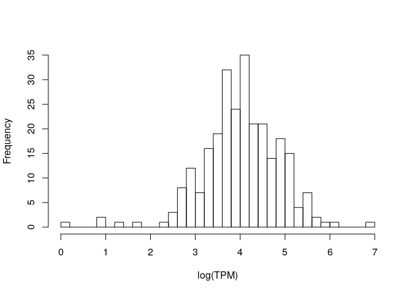

MSR and expression, for stomach cells and window size of 100,000
================

Here I will investigate if there is a relationship between the presence of genes and genes expression in a certain genomic region and the MSR (with some of its derivate statistics).

I chose stomach cells data in order to do this, and CpG windows of size 100,000, that corresponds to a variable window size in term of nucleotides (on average about 10,000,000).

This is an example of total-rna-seq file, that shows for each "gene" its transcripts and some measures of expression. In this case I just kept two colums. The first one indicates the "gene"", the second one is the Transcript Per Million that is a relative measure of how much a gene is expressed.

    ##                    gene_id    TPM
    ##     1:     ENSG00000000003   0.49
    ##     2:     ENSG00000000005   0.00
    ##     3:     ENSG00000000419   0.24
    ##     4:     ENSG00000000457   0.28
    ##     5:     ENSG00000000460   2.18
    ##    ---                           
    ## 60818: gSpikein_ERCC-00165   8.98
    ## 60819: gSpikein_ERCC-00168   0.04
    ## 60820: gSpikein_ERCC-00170   0.56
    ## 60821: gSpikein_ERCC-00171 530.85
    ## 60822:    gSpikein_phiX174  98.55

This is the annotation file that store the position occupied by each human gene.

    ##         chr     start       end strand              id                    anno
    ##     1: chr1     65419     71585      + ENSG00000186092 genebody_protein_coding
    ##     2: chr1    450703    451697      - ENSG00000284733 genebody_protein_coding
    ##     3: chr1    685679    686673      - ENSG00000284662 genebody_protein_coding
    ##     4: chr1    923928    944581      + ENSG00000187634 genebody_protein_coding
    ##     5: chr1    944204    959309      - ENSG00000188976 genebody_protein_coding
    ##    ---                                                                        
    ## 19801: chrY  24763069  24813492      - ENSG00000187191 genebody_protein_coding
    ## 19802: chrY  24833843  24907040      + ENSG00000205916 genebody_protein_coding
    ## 19803: chrY  25030901  25062548      - ENSG00000185894 genebody_protein_coding
    ## 19804: chrY  25622162  25624902      + ENSG00000172288 genebody_protein_coding
    ## 19805: chrX 135309480 135309659      + ENSG00000283644 genebody_protein_coding

The number of genes is much less than the ones in the total-rna-seq file, since the first one also contains so called pseudogenes and other stuff.

So the final dataFrame is the following (excluding some columns for readability):

    ##   start_chr start_position end_position gene_count total_TPM meth rate
    ## 1      chr1          10468      3678351         72    100.50 0.6821182
    ## 2      chr1        3678351      9560488         44     42.32 0.7310695
    ## 3      chr1        9560488     15918278         95     54.86 0.7472515
    ## 4      chr1       15918278     22356198         79     70.45 0.7044660
    ## 5      chr1       22356198     28662002        115    127.10 0.7159432
    ## 6      chr1       28662002     36352847         93     77.56 0.7158006

The full scheme includes:

**nucleotides**: number of nucleotides in the window

**CpG density**: fraction of nucleotides that is a C of a CpG site (= 10000/nucleotides)

**meth rate**: ratio of methylated CpG sites

**gene\_count**: number of genes included (even partially) inside the interval

**total\_TPM**: sum of the TPMs of the genes in the interval

then the MSR and some related statistics: **msr**, **inverted msr**, **msr ecdf **, **inverted msr ecdf**, **residual** (residual of the linear regression between msr and meth rate), **inverted residual**.

First let's see if there are pairwise correlations between the features.

###### Basic features:

log(TPM) is considered only for fragments with at least a gene.

###### Comparison with simple MSR statistics:

The correlation between the total TPM with the standard deviation of the TPM is:

    ##       cor 
    ## 0.7341999

### Predicting gene number

Negative binomial for gene number with basic predictors (nucleotides, CpG\_density, meth rate):

    ## 
    ## Call:
    ## glm.nb(formula = model_data$gene_count ~ nucleotides + CpG_density + 
    ##     `meth rate`, data = model_data, init.theta = 7.182689259, 
    ##     link = log)
    ## 
    ## Deviance Residuals: 
    ##     Min       1Q   Median       3Q      Max  
    ## -3.6977  -0.7592  -0.0588   0.5780   2.6128  
    ## 
    ## Coefficients:
    ##               Estimate Std. Error z value Pr(>|z|)    
    ## (Intercept)  1.418e+01  9.357e-01  15.160  < 2e-16 ***
    ## nucleotides -4.998e-08  1.808e-08  -2.764  0.00571 ** 
    ## CpG_density -4.326e+01  1.486e+01  -2.911  0.00361 ** 
    ## `meth rate` -1.202e+01  1.130e+00 -10.634  < 2e-16 ***
    ## ---
    ## Signif. codes:  0 '***' 0.001 '**' 0.01 '*' 0.05 '.' 0.1 ' ' 1
    ## 
    ## (Dispersion parameter for Negative Binomial(7.1827) family taken to be 1)
    ## 
    ##     Null deviance: 483.87  on 266  degrees of freedom
    ## Residual deviance: 275.74  on 263  degrees of freedom
    ## AIC: 2470.1
    ## 
    ## Number of Fisher Scoring iterations: 1
    ## 
    ## 
    ##               Theta:  7.183 
    ##           Std. Err.:  0.692 
    ## 
    ##  2 x log-likelihood:  -2460.080

Negative binomial regression Model with inverted\_msr as predictor

    ## 
    ## Call:
    ## glm.nb(formula = model_data$gene_count ~ model_data$inverted_msr, 
    ##     data = model_data, init.theta = 8.13837825, link = log)
    ## 
    ## Deviance Residuals: 
    ##     Min       1Q   Median       3Q      Max  
    ## -2.9402  -0.7362  -0.2197   0.4416   3.7677  
    ## 
    ## Coefficients:
    ##                         Estimate Std. Error z value Pr(>|z|)    
    ## (Intercept)              16.7222     0.8258   20.25   <2e-16 ***
    ## model_data$inverted_msr -47.4340     3.1222  -15.19   <2e-16 ***
    ## ---
    ## Signif. codes:  0 '***' 0.001 '**' 0.01 '*' 0.05 '.' 0.1 ' ' 1
    ## 
    ## (Dispersion parameter for Negative Binomial(8.1384) family taken to be 1)
    ## 
    ##     Null deviance: 509.17  on 263  degrees of freedom
    ## Residual deviance: 269.06  on 262  degrees of freedom
    ## AIC: 2412.2
    ## 
    ## Number of Fisher Scoring iterations: 1
    ## 
    ## 
    ##               Theta:  8.138 
    ##           Std. Err.:  0.792 
    ## 
    ##  2 x log-likelihood:  -2406.249

Adding other predictors doesn't significantly improve the performances.

### Predicting log(TPM)

Distribution of TPM values (only for regions that contains some genes). 

Linear model for log(TPM) with standard predictors:

    ## 
    ## Call:
    ## lm(formula = log_tpm ~ ., data = model_data)
    ## 
    ## Residuals:
    ##      Min       1Q   Median       3Q      Max 
    ## -1.56232 -0.31645 -0.03292  0.32842  1.68256 
    ## 
    ## Coefficients:
    ##                           Estimate Std. Error t value Pr(>|t|)    
    ## (Intercept)              5.204e+00  1.695e+00   3.069  0.00237 ** 
    ## nucleotides             -7.860e-08  2.625e-08  -2.994  0.00302 ** 
    ## CpG_density             -2.742e+00  2.087e+01  -0.131  0.89558    
    ## `meth rate`             -7.416e+00  6.290e+00  -1.179  0.23949    
    ## gene_count               1.189e-02  1.455e-03   8.173 1.32e-14 ***
    ## genes_nucleotides_count  1.662e-07  2.566e-08   6.478 4.63e-10 ***
    ## msr_density              4.387e+00  5.783e+00   0.759  0.44876    
    ## ---
    ## Signif. codes:  0 '***' 0.001 '**' 0.01 '*' 0.05 '.' 0.1 ' ' 1
    ## 
    ## Residual standard error: 0.5364 on 260 degrees of freedom
    ##   (23 observations deleted due to missingness)
    ## Multiple R-squared:  0.6143, Adjusted R-squared:  0.6054 
    ## F-statistic: 69.02 on 6 and 260 DF,  p-value: < 2.2e-16

Linear model for TPM with all features and MSR statistics:

    ## 
    ## Call:
    ## lm(formula = log_tpm ~ ., data = model_data)
    ## 
    ## Residuals:
    ##      Min       1Q   Median       3Q      Max 
    ## -1.60555 -0.32192 -0.04405  0.31939  1.77125 
    ## 
    ## Coefficients: (3 not defined because of singularities)
    ##                           Estimate Std. Error t value Pr(>|t|)    
    ## (Intercept)             -7.233e+04  9.547e+04  -0.758   0.4494    
    ## nucleotides             -6.677e-08  2.730e-08  -2.446   0.0151 *  
    ## CpG_density             -1.247e+00  2.202e+01  -0.057   0.9549    
    ## `meth rate`             -6.644e+00  6.865e+00  -0.968   0.3340    
    ## gene_count               1.095e-02  1.482e-03   7.386 2.17e-12 ***
    ## genes_nucleotides_count  1.339e-07  2.741e-08   4.885 1.83e-06 ***
    ## msr_density              1.521e+01  9.589e+00   1.586   0.1139    
    ## msr                      4.332e+01  2.603e+01   1.664   0.0974 .  
    ## inverted_msr            -3.879e+01  1.552e+01  -2.500   0.0131 *  
    ## ecdf                     7.233e+04  9.547e+04   0.758   0.4494    
    ## `inverted ecdf`                 NA         NA      NA       NA    
    ## residual                        NA         NA      NA       NA    
    ## inverted_residual               NA         NA      NA       NA    
    ## ---
    ## Signif. codes:  0 '***' 0.001 '**' 0.01 '*' 0.05 '.' 0.1 ' ' 1
    ## 
    ## Residual standard error: 0.5232 on 254 degrees of freedom
    ##   (26 observations deleted due to missingness)
    ## Multiple R-squared:  0.621,  Adjusted R-squared:  0.6076 
    ## F-statistic: 46.25 on 9 and 254 DF,  p-value: < 2.2e-16

Linear model for TPM with all features and MSR statistics, without information about genes:

    ## 
    ## Call:
    ## lm(formula = log_tpm ~ ., data = model_data[, c(to_predict, basic_predictors, 
    ##     msr_predictors, "msr_density")])
    ## 
    ## Residuals:
    ##      Min       1Q   Median       3Q      Max 
    ## -2.63098 -0.30540 -0.01777  0.36067  2.35308 
    ## 
    ## Coefficients: (3 not defined because of singularities)
    ##                     Estimate Std. Error t value Pr(>|t|)    
    ## (Intercept)       -2.242e+05  1.129e+05  -1.985 0.048161 *  
    ## nucleotides       -7.100e-08  3.277e-08  -2.167 0.031172 *  
    ## CpG_density       -6.274e+01  2.544e+01  -2.466 0.014308 *  
    ## `meth rate`        1.027e+01  8.009e+00   1.282 0.201063    
    ## msr                8.512e+01  5.349e+01   1.591 0.112745    
    ## inverted_msr      -6.095e+01  1.808e+01  -3.371 0.000866 ***
    ## ecdf               2.242e+05  1.129e+05   1.985 0.048165 *  
    ## `inverted ecdf`           NA         NA      NA       NA    
    ## residual          -5.730e+01  7.215e+01  -0.794 0.427833    
    ## inverted_residual         NA         NA      NA       NA    
    ## msr_density               NA         NA      NA       NA    
    ## ---
    ## Signif. codes:  0 '***' 0.001 '**' 0.01 '*' 0.05 '.' 0.1 ' ' 1
    ## 
    ## Residual standard error: 0.6281 on 256 degrees of freedom
    ##   (26 observations deleted due to missingness)
    ## Multiple R-squared:  0.4496, Adjusted R-squared:  0.4345 
    ## F-statistic: 29.87 on 7 and 256 DF,  p-value: < 2.2e-16

Linear model for TPM with some features:

    ## 
    ## Call:
    ## lm(formula = log_tpm ~ (model_data$inverted_msr) + (model_data$CpG_density) + 
    ##     (meth_rate) + (model_data$gene_count) + (model_data$msr), 
    ##     data = model_data)
    ## 
    ## Residuals:
    ##      Min       1Q   Median       3Q      Max 
    ## -2.51653 -0.31752 -0.03205  0.29837  1.98317 
    ## 
    ## Coefficients:
    ##                           Estimate Std. Error t value Pr(>|t|)    
    ## (Intercept)              -1.611503   4.952344  -0.325   0.7451    
    ## model_data$inverted_msr -39.402170   9.403319  -4.190 3.83e-05 ***
    ## model_data$CpG_density   11.452639  11.783725   0.972   0.3320    
    ## meth_rate                10.858919   4.282488   2.536   0.0118 *  
    ## model_data$gene_count     0.012657   0.001386   9.133  < 2e-16 ***
    ## model_data$msr           34.404128  16.628831   2.069   0.0395 *  
    ## ---
    ## Signif. codes:  0 '***' 0.001 '**' 0.01 '*' 0.05 '.' 0.1 ' ' 1
    ## 
    ## Residual standard error: 0.5537 on 258 degrees of freedom
    ##   (26 observations deleted due to missingness)
    ## Multiple R-squared:  0.5689, Adjusted R-squared:  0.5605 
    ## F-statistic: 68.09 on 5 and 258 DF,  p-value: < 2.2e-16
