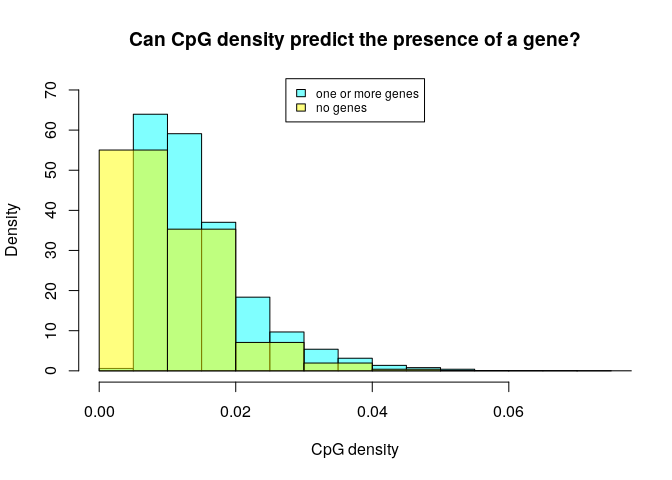
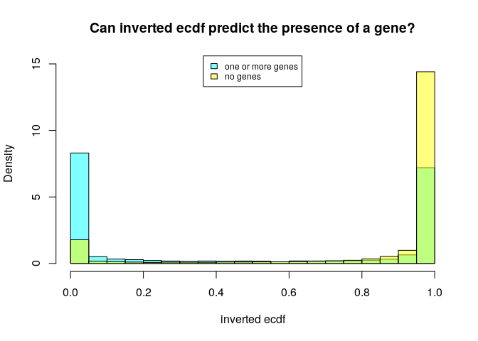
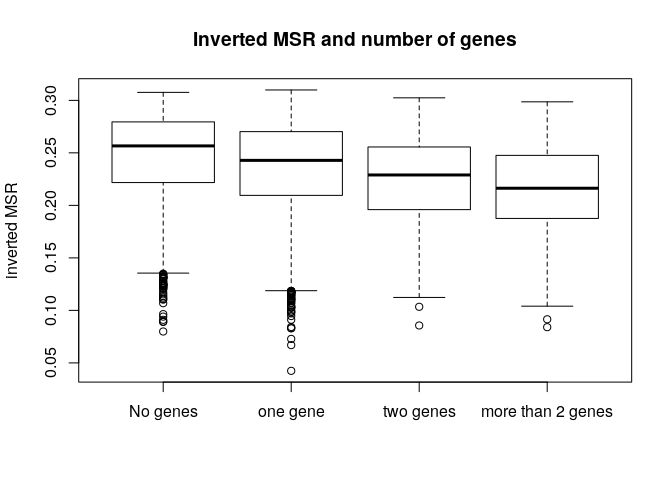

MSR and expression for gm23248, windows of 1000 sites
================

Here I will investigate if there is a relationship between the presence of genes and genes expression in a certain genomic region and the MSR (with some of its derivate statistics).

I chose gm23248 cells data in order to do this, and CpG windows of size 1000, that corresponds to a variable window size in term of nucleotides (on average about 100,000).

This is an example of total-rna-seq file, that shows for each "gene" its transcripts and some measures of expression. In this case I just kept two colums. The first one indicates the "gene"", the second one is the Transcript Per Million that is a relative measure of how much a gene is expressed.

    ##                    gene_id     TPM
    ##     1:     ENSG00000000003   30.19
    ##     2:     ENSG00000000005    0.00
    ##     3:     ENSG00000000419  101.10
    ##     4:     ENSG00000000457    4.64
    ##     5:     ENSG00000000460    3.52
    ##    ---                            
    ## 60818: gSpikein_ERCC-00165   52.73
    ## 60819: gSpikein_ERCC-00168    0.82
    ## 60820: gSpikein_ERCC-00170   24.28
    ## 60821: gSpikein_ERCC-00171 4119.22
    ## 60822:    gSpikein_phiX174    0.00

This is the annotation file that store the position occupied by each human gene.

    ##         chr     start       end strand              id                    anno
    ##     1: chr1     65419     71585      + ENSG00000186092 genebody_protein_coding
    ##     2: chr1    450703    451697      - ENSG00000284733 genebody_protein_coding
    ##     3: chr1    685679    686673      - ENSG00000284662 genebody_protein_coding
    ##     4: chr1    923928    944581      + ENSG00000187634 genebody_protein_coding
    ##     5: chr1    944204    959309      - ENSG00000188976 genebody_protein_coding
    ##    ---                                                                        
    ## 19801: chrY  24763069  24813492      - ENSG00000187191 genebody_protein_coding
    ## 19802: chrY  24833843  24907040      + ENSG00000205916 genebody_protein_coding
    ## 19803: chrY  25030901  25062548      - ENSG00000185894 genebody_protein_coding
    ## 19804: chrY  25622162  25624902      + ENSG00000172288 genebody_protein_coding
    ## 19805: chrX 135309480 135309659      + ENSG00000283644 genebody_protein_coding

The number of genes is much less than the ones in the total-rna-seq file, since the first one also contains so called pseudogenes and other stuff.

So the final dataFrame is the following (excluding some columns for readability):

    ## 21 rows had too many nucleotides

    ##    start_chr start_position end_position gene_count total_TPM meth rate
    ## 12      chr1         940826       961902          2     55.61 0.4359565
    ## 13      chr1         961902       982731          2      1.68 0.6481908
    ## 14      chr1         982731      1007283          2     57.90 0.3828651
    ## 23      chr1        1206432      1228380          2    208.78 0.7997256
    ## 24      chr1        1228380      1246900          2      6.86 0.5304678
    ## 26      chr1        1274217      1295503          2      9.84 0.7334355

The full scheme includes:

**nucleotides**: number of nucleotides in the window

**CpG density**: fraction of nucleotides that is a C of a CpG site (= 1000/nucleotides)

**meth rate**: ratio of methylated CpG sites

**gene\_count**: number of genes included (even partially) inside the interval

**total\_TPM**: sum of the TPMs of the genes in the interval

then the MSR and some related statistics: **msr**, **inverted msr**, **msr ecdf **, **inverted msr ecdf**, **residual** (residual of the linear regression between msr and meth rate), **inverted residual**.

First let's see if there are pairwise correlations between the features.

###### Basic features:

log(TPM) is considered only for fragments with at least a gene.

###### Comparison with simple MSR statistics:

###### Comparison with other MSR statistics:

residual vs log(tpm): 

#### Predicting gene presence

Check if features can predict gene presence:

    ## missing data:  4.212008 %

    ## 
    ## train_data_proportion:  0.2

The fraction of fragments that have at least one gene inside is (train data)

    ## [1] 0.4482079

Logistic Regression Model for gene presence with basic predictors (nucleotides, CpG\_density, meth rate, msr\_density):

    ## TRAIN DATA

    ## accuracy:  0.6270609

    ## TEST DATA

    ## accuracy:  0.6309353

Logistic Regression Model with inverted\_msr as predictor

    ## TRAIN DATA

    ## accuracy:  0.5772401

    ## TEST DATA

    ## accuracy:  0.585155

Logistic Regression Model with all predictors

    ## TRAIN DATA

    ## accuracy:  0.718638

    ## TEST DATA

    ## accuracy:  0.7219136

#### Predicting log(TPM)

Distribution of TPM values (only for regions that contains some genes) 

Linear model for TPM with standard predictors:

    ## 
    ## Call:
    ## lm(formula = log_tpm ~ ., data = train_model_data[, standard_predictors])
    ## 
    ## Residuals:
    ##      Min       1Q   Median       3Q      Max 
    ## -12.1099  -1.8539   0.7001   2.4164   8.9628 
    ## 
    ## Coefficients:
    ##                           Estimate Std. Error t value Pr(>|t|)    
    ## (Intercept)             -6.956e+00  7.277e-01  -9.559  < 2e-16 ***
    ## gene_count               1.090e+00  8.078e-02  13.488  < 2e-16 ***
    ## nucleotides             -1.618e-05  3.617e-06  -4.473 8.07e-06 ***
    ## CpG_density              1.819e+01  1.688e+01   1.078  0.28115    
    ## `meth rate`              7.096e+00  4.510e+00   1.573  0.11577    
    ## msr_density              3.438e+00  3.869e+00   0.889  0.37427    
    ## genes_nucleotides_count  7.758e-06  2.513e-06   3.087  0.00204 ** 
    ## ---
    ## Signif. codes:  0 '***' 0.001 '**' 0.01 '*' 0.05 '.' 0.1 ' ' 1
    ## 
    ## Residual standard error: 3.519 on 2494 degrees of freedom
    ## Multiple R-squared:  0.2672, Adjusted R-squared:  0.2655 
    ## F-statistic: 151.6 on 6 and 2494 DF,  p-value: < 2.2e-16

    ## Test data R squared:  0.2590598

Linear model for TPM with all features and MSR statistics:

    ## 
    ## Call:
    ## lm(formula = log_tpm ~ ., data = train_model_data[, c(standard_predictors, 
    ##     msr_predictors)])
    ## 
    ## Residuals:
    ##      Min       1Q   Median       3Q      Max 
    ## -10.7663  -1.7076   0.2382   2.1039   9.7344 
    ## 
    ## Coefficients:
    ##                           Estimate Std. Error t value Pr(>|t|)    
    ## (Intercept)             -2.117e+01  4.255e+00  -4.974 6.99e-07 ***
    ## gene_count               8.412e-01  7.300e-02  11.523  < 2e-16 ***
    ## nucleotides              3.870e-06  3.324e-06   1.164 0.244392    
    ## CpG_density             -6.044e+00  1.556e+01  -0.388 0.697709    
    ## `meth rate`              8.502e+00  5.003e+00   1.699 0.089384 .  
    ## msr_density             -8.540e+00  5.098e+00  -1.675 0.094073 .  
    ## genes_nucleotides_count  6.682e-07  2.261e-06   0.295 0.767653    
    ## msr                      4.426e+00  1.053e+01   0.420 0.674177    
    ## inverted_msr             8.537e+01  2.240e+01   3.811 0.000142 ***
    ## ecdf                    -1.935e+00  4.842e-01  -3.996 6.64e-05 ***
    ## `inverted ecdf`         -1.276e+00  4.463e-01  -2.859 0.004291 ** 
    ## residual                -4.442e+01  1.514e+01  -2.933 0.003387 ** 
    ## inverted_residual       -7.439e+01  2.313e+01  -3.216 0.001318 ** 
    ## ---
    ## Signif. codes:  0 '***' 0.001 '**' 0.01 '*' 0.05 '.' 0.1 ' ' 1
    ## 
    ## Residual standard error: 3.133 on 2488 degrees of freedom
    ## Multiple R-squared:  0.4205, Adjusted R-squared:  0.4177 
    ## F-statistic: 150.5 on 12 and 2488 DF,  p-value: < 2.2e-16

    ## Test data R squared:  0.415889

Linear model for TPM with some features:

    ## 
    ## Call:
    ## lm(formula = log_tpm ~ ., data = train_model_data[, c(standard_predictors, 
    ##     "inverted_msr")])
    ## 
    ## Residuals:
    ##      Min       1Q   Median       3Q      Max 
    ## -11.5994  -1.9179   0.3236   2.2768   9.0313 
    ## 
    ## Coefficients:
    ##                           Estimate Std. Error t value Pr(>|t|)    
    ## (Intercept)             -4.745e-02  7.515e-01  -0.063    0.950    
    ## gene_count               9.766e-01  7.488e-02  13.043  < 2e-16 ***
    ## nucleotides             -2.718e-06  3.407e-06  -0.798    0.425    
    ## CpG_density             -2.621e+00  1.564e+01  -0.168    0.867    
    ## `meth rate`             -4.263e+00  4.205e+00  -1.014    0.311    
    ## msr_density              1.685e+01  3.635e+00   4.636 3.74e-06 ***
    ## genes_nucleotides_count  1.456e-06  2.343e-06   0.621    0.534    
    ## inverted_msr            -3.939e+01  1.910e+00 -20.624  < 2e-16 ***
    ## ---
    ## Signif. codes:  0 '***' 0.001 '**' 0.01 '*' 0.05 '.' 0.1 ' ' 1
    ## 
    ## Residual standard error: 3.253 on 2493 degrees of freedom
    ## Multiple R-squared:  0.374,  Adjusted R-squared:  0.3723 
    ## F-statistic: 212.8 on 7 and 2493 DF,  p-value: < 2.2e-16

    ## Test data R squared:  0.3736225

Linear model for TPM with basic features but no information about genes:

    ## 
    ## Call:
    ## lm(formula = log_tpm ~ ., data = train_model_data[, c("log_tpm", 
    ##     basic_predictors)])
    ## 
    ## Residuals:
    ##    Min     1Q Median     3Q    Max 
    ## -6.800 -3.698 -1.246  4.170 12.338 
    ## 
    ## Coefficients:
    ##               Estimate Std. Error t value Pr(>|t|)    
    ## (Intercept) -3.476e+00  5.561e-01  -6.250 4.41e-10 ***
    ## nucleotides -2.392e-05  2.461e-06  -9.721  < 2e-16 ***
    ## CpG_density  1.493e+01  1.455e+01   1.026    0.305    
    ## `meth rate` -1.083e-01  2.973e+00  -0.036    0.971    
    ## msr_density  3.618e+00  2.449e+00   1.478    0.140    
    ## ---
    ## Signif. codes:  0 '***' 0.001 '**' 0.01 '*' 0.05 '.' 0.1 ' ' 1
    ## 
    ## Residual standard error: 4.358 on 5575 degrees of freedom
    ## Multiple R-squared:  0.1272, Adjusted R-squared:  0.1266 
    ## F-statistic: 203.2 on 4 and 5575 DF,  p-value: < 2.2e-16

    ## Test data R squared:  0.1315955

Linear model for TPM with all features but no information about genes:

    ## 
    ## Call:
    ## lm(formula = log_tpm ~ ., data = train_model_data[, c("log_tpm", 
    ##     basic_predictors, msr_predictors)])
    ## 
    ## Residuals:
    ##      Min       1Q   Median       3Q      Max 
    ## -10.2175  -2.0269  -0.8001   2.4703  13.6447 
    ## 
    ## Coefficients:
    ##                     Estimate Std. Error t value Pr(>|t|)    
    ## (Intercept)       -2.988e+01  3.156e+00  -9.468  < 2e-16 ***
    ## nucleotides       -4.822e-06  2.184e-06  -2.207   0.0273 *  
    ## CpG_density       -2.973e+01  1.291e+01  -2.303   0.0213 *  
    ## `meth rate`        1.988e+01  3.549e+00   5.602 2.22e-08 ***
    ## msr_density       -9.196e+00  3.488e+00  -2.636   0.0084 ** 
    ## msr                7.315e+01  7.488e+00   9.768  < 2e-16 ***
    ## inverted_msr       3.500e+01  1.632e+01   2.145   0.0320 *  
    ## ecdf              -5.517e-01  4.166e-01  -1.324   0.1855    
    ## `inverted ecdf`   -3.300e+00  4.013e-01  -8.223 2.45e-16 ***
    ## residual          -1.398e+02  1.230e+01 -11.370  < 2e-16 ***
    ## inverted_residual -1.657e+01  1.678e+01  -0.988   0.3233    
    ## ---
    ## Signif. codes:  0 '***' 0.001 '**' 0.01 '*' 0.05 '.' 0.1 ' ' 1
    ## 
    ## Residual standard error: 3.744 on 5569 degrees of freedom
    ## Multiple R-squared:  0.3565, Adjusted R-squared:  0.3554 
    ## F-statistic: 308.6 on 10 and 5569 DF,  p-value: < 2.2e-16

    ## Test data R squared:  0.3630355

Linear model for TPM with inverted msr but no information about genes:

    ## 
    ## Call:
    ## lm(formula = log_tpm ~ ., data = train_model_data[, c("log_tpm", 
    ##     basic_predictors, "inverted_msr")])
    ## 
    ## Residuals:
    ##      Min       1Q   Median       3Q      Max 
    ## -13.6490  -2.5852  -0.9366   2.7999  13.0230 
    ## 
    ## Coefficients:
    ##                Estimate Std. Error t value Pr(>|t|)    
    ## (Intercept)   8.713e+00  6.026e-01  14.459  < 2e-16 ***
    ## nucleotides  -1.553e-05  2.225e-06  -6.977 3.36e-12 ***
    ## CpG_density  -4.302e+01  1.319e+01  -3.263  0.00111 ** 
    ## `meth rate`  -1.293e+01  2.697e+00  -4.793 1.69e-06 ***
    ## msr_density   2.045e+01  2.251e+00   9.086  < 2e-16 ***
    ## inverted_msr -6.291e+01  1.734e+00 -36.277  < 2e-16 ***
    ## ---
    ## Signif. codes:  0 '***' 0.001 '**' 0.01 '*' 0.05 '.' 0.1 ' ' 1
    ## 
    ## Residual standard error: 3.92 on 5574 degrees of freedom
    ## Multiple R-squared:  0.2939, Adjusted R-squared:  0.2933 
    ## F-statistic: 464.1 on 5 and 5574 DF,  p-value: < 2.2e-16

    ## Test data R squared:  0.3105272
