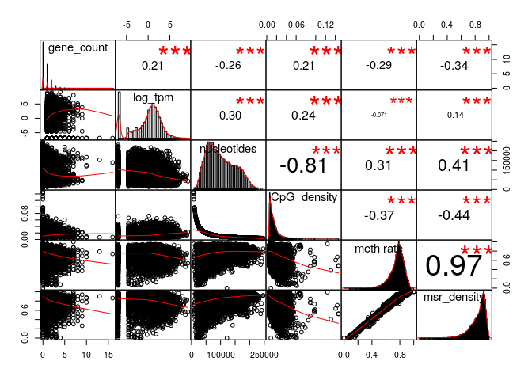
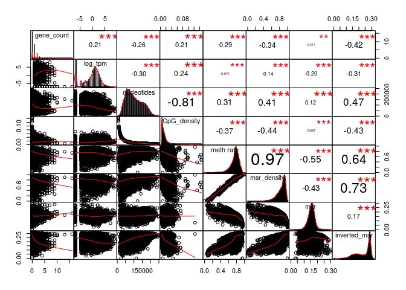
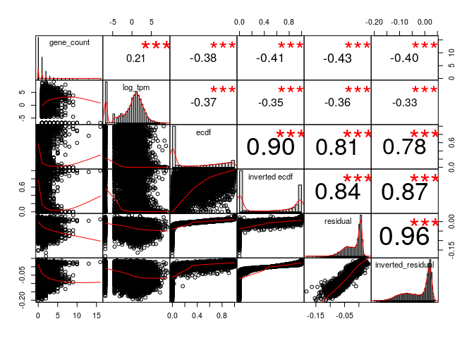
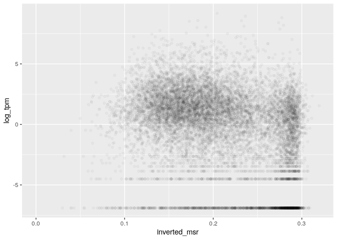
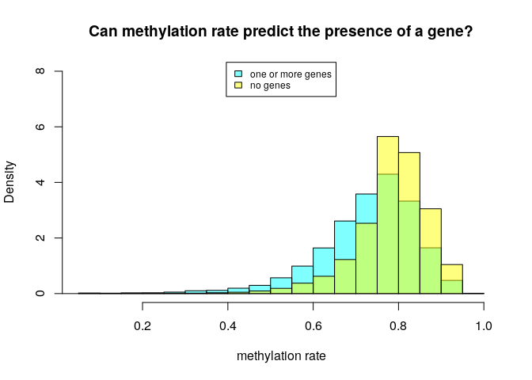
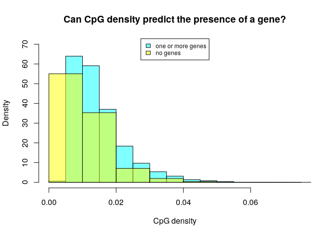
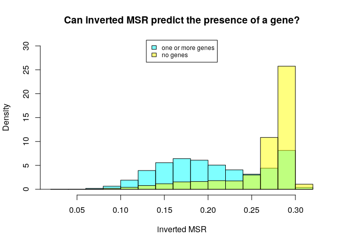
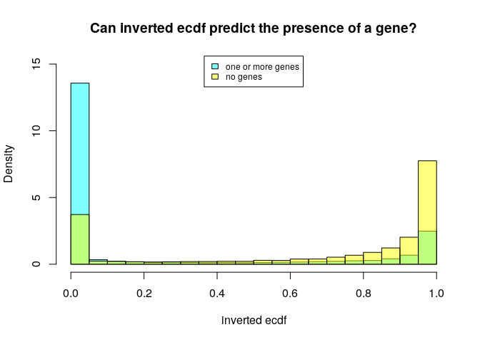
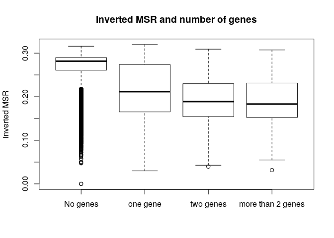
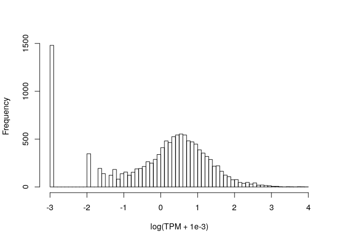

MSR and expression for heart left ventricle, windows of 1000 sites
================

Here I will investigate if there is a relationship between the presence of genes and genes expression in a certain genomic region and the MSR (with some of its derivate statistics).

I chose heart left ventricle cells data in order to do this, and CpG windows of size 1000, that corresponds to a variable window size in term of nucleotides (on average about 100,000).

This is an example of total-rna-seq file, that shows for each "gene" its transcripts and some measures of expression. In this case I just kept two colums. The first one indicates the "gene"", the second one is the Transcript Per Million that is a relative measure of how much a gene is expressed.

    ##                    gene_id  TPM
    ##     1:     ENSG00000000003 1.40
    ##     2:     ENSG00000000005 0.04
    ##     3:     ENSG00000000419 8.65
    ##     4:     ENSG00000000457 0.58
    ##     5:     ENSG00000000460 0.35
    ##    ---                         
    ## 60818: gSpikein_ERCC-00165 0.00
    ## 60819: gSpikein_ERCC-00168 0.00
    ## 60820: gSpikein_ERCC-00170 0.00
    ## 60821: gSpikein_ERCC-00171 0.00
    ## 60822:    gSpikein_phiX174 0.00

This is the annotation file that store the position occupied by each human gene.

    ##         chr     start       end strand              id                    anno
    ##     1: chr1     65419     71585      + ENSG00000186092 genebody_protein_coding
    ##     2: chr1    450703    451697      - ENSG00000284733 genebody_protein_coding
    ##     3: chr1    685679    686673      - ENSG00000284662 genebody_protein_coding
    ##     4: chr1    923928    944581      + ENSG00000187634 genebody_protein_coding
    ##     5: chr1    944204    959309      - ENSG00000188976 genebody_protein_coding
    ##    ---                                                                        
    ## 19801: chrY  24763069  24813492      - ENSG00000187191 genebody_protein_coding
    ## 19802: chrY  24833843  24907040      + ENSG00000205916 genebody_protein_coding
    ## 19803: chrY  25030901  25062548      - ENSG00000185894 genebody_protein_coding
    ## 19804: chrY  25622162  25624902      + ENSG00000172288 genebody_protein_coding
    ## 19805: chrX 135309480 135309659      + ENSG00000283644 genebody_protein_coding

The number of genes is much less than the ones in the total-rna-seq file, since the first one also contains so called pseudogenes and other stuff.

So the final dataFrame is the following (excluding some columns for readability):

    ## 21 rows had too many nucleotides

    ##    start_chr start_position end_position gene_count total_TPM meth rate
    ## 12      chr1         940826       961902          2     16.12 0.4330459
    ## 13      chr1         961902       982731          2     94.04 0.6091376
    ## 14      chr1         982731      1007283          2     24.87 0.4504092
    ## 23      chr1        1206432      1228380          2     28.54 0.7705610
    ## 24      chr1        1228380      1246900          2      1.99 0.5301100
    ## 26      chr1        1274217      1295503          2     18.15 0.7807005

The full scheme includes:

**nucleotides**: number of nucleotides in the window

**CpG density**: fraction of nucleotides that is a C of a CpG site (= 1000/nucleotides)

**meth rate**: ratio of methylated CpG sites

**gene\_count**: number of genes included (even partially) inside the interval

**total\_TPM**: sum of the TPMs of the genes in the interval

then the MSR and some related statistics: **msr**, **inverted msr**, **msr ecdf **, **inverted msr ecdf**, **residual** (residual of the linear regression between msr and meth rate), **inverted residual**.

First let's see if there are pairwise correlations between the features.

###### Basic features:

log(TPM) is considered only for fragments with at least a gene.

###### Comparison with simple MSR statistics:

###### Comparison with other MSR statistics:

inverted msr vs log(tpm): 

#### Predicting gene presence

Check if features can predict gene presence:

    ## missing data:  6.985685 %

    ## 
    ## train_data_proportion:  0.2

The fraction of fragments that have at least one gene inside is (train data)

    ## [1] 0.4574645

Logistic Regression Model for gene presence with basic predictors (nucleotides, CpG\_density, meth rate, msr\_density):

    ## TRAIN DATA

    ## accuracy:  0.7119395

    ## TEST DATA

    ## accuracy:  0.7155049

Logistic Regression Model with inverted\_msr as predictor

    ## TRAIN DATA

    ## accuracy:  0.7366673

    ## TEST DATA

    ## accuracy:  0.7450754

Logistic Regression Model with all predictors

    ## TRAIN DATA

    ## accuracy:  0.7438642

    ## TEST DATA

    ## accuracy:  0.7519491

#### Predicting log(TPM)

Distribution of TPM values (only for regions that contains some genes) 

Linear model for TPM with standard predictors:

    ## 
    ## Call:
    ## lm(formula = log_tpm ~ ., data = train_model_data[, standard_predictors])
    ## 
    ## Residuals:
    ##      Min       1Q   Median       3Q      Max 
    ## -16.6303  -1.3745   0.4503   1.7971  10.6879 
    ## 
    ## Coefficients:
    ##                           Estimate Std. Error t value Pr(>|t|)    
    ## (Intercept)             -1.902e+00  6.518e-01  -2.918  0.00355 ** 
    ## gene_count               7.511e-01  6.615e-02  11.355  < 2e-16 ***
    ## nucleotides             -1.471e-05  2.949e-06  -4.987 6.56e-07 ***
    ## CpG_density              2.915e+01  1.405e+01   2.075  0.03813 *  
    ## `meth rate`              5.091e+01  3.098e+00  16.432  < 2e-16 ***
    ## msr_density             -4.560e+01  2.793e+00 -16.325  < 2e-16 ***
    ## genes_nucleotides_count  1.331e-05  2.092e-06   6.363 2.35e-10 ***
    ## ---
    ## Signif. codes:  0 '***' 0.001 '**' 0.01 '*' 0.05 '.' 0.1 ' ' 1
    ## 
    ## Residual standard error: 2.84 on 2472 degrees of freedom
    ## Multiple R-squared:  0.2532, Adjusted R-squared:  0.2514 
    ## F-statistic: 139.7 on 6 and 2472 DF,  p-value: < 2.2e-16

    ## Test data R squared:  0.2236037

Linear model for TPM with all features and MSR statistics:

    ## 
    ## Call:
    ## lm(formula = log_tpm ~ ., data = train_model_data[, c(standard_predictors, 
    ##     msr_predictors)])
    ## 
    ## Residuals:
    ##      Min       1Q   Median       3Q      Max 
    ## -11.4879  -1.4342   0.3303   1.8082  11.3433 
    ## 
    ## Coefficients:
    ##                           Estimate Std. Error t value Pr(>|t|)    
    ## (Intercept)             -3.772e+01  4.708e+00  -8.012 1.72e-15 ***
    ## gene_count               7.161e-01  6.592e-02  10.863  < 2e-16 ***
    ## nucleotides             -4.737e-06  3.007e-06  -1.575   0.1154    
    ## CpG_density              6.246e+01  1.427e+01   4.378 1.25e-05 ***
    ## `meth rate`              4.651e+01  3.626e+00  12.827  < 2e-16 ***
    ## msr_density             -5.171e+01  4.339e+00 -11.919  < 2e-16 ***
    ## genes_nucleotides_count  1.264e-05  2.033e-06   6.218 5.89e-10 ***
    ## msr                      1.105e+01  6.994e+00   1.579   0.1144    
    ## inverted_msr             1.584e+02  2.488e+01   6.365 2.31e-10 ***
    ## ecdf                    -6.544e-01  4.877e-01  -1.342   0.1798    
    ## `inverted ecdf`         -8.363e-01  4.307e-01  -1.942   0.0523 .  
    ## residual                -2.074e+01  1.063e+01  -1.951   0.0512 .  
    ## inverted_residual       -1.554e+02  2.548e+01  -6.099 1.24e-09 ***
    ## ---
    ## Signif. codes:  0 '***' 0.001 '**' 0.01 '*' 0.05 '.' 0.1 ' ' 1
    ## 
    ## Residual standard error: 2.749 on 2466 degrees of freedom
    ## Multiple R-squared:  0.3022, Adjusted R-squared:  0.2988 
    ## F-statistic: 89.01 on 12 and 2466 DF,  p-value: < 2.2e-16

    ## Test data R squared:  0.2794536

Linear model for TPM with some features:

    ## 
    ## Call:
    ## lm(formula = log_tpm ~ ., data = train_model_data[, c(standard_predictors, 
    ##     "inverted_msr")])
    ## 
    ## Residuals:
    ##      Min       1Q   Median       3Q      Max 
    ## -13.5295  -1.5198   0.3596   1.8289  10.8009 
    ## 
    ## Coefficients:
    ##                           Estimate Std. Error t value Pr(>|t|)    
    ## (Intercept)             -2.449e+00  6.465e-01  -3.787 0.000156 ***
    ## gene_count               7.729e-01  6.532e-02  11.832  < 2e-16 ***
    ## nucleotides             -1.099e-05  2.944e-06  -3.734 0.000193 ***
    ## CpG_density              4.150e+01  1.394e+01   2.976 0.002949 ** 
    ## `meth rate`              4.198e+01  3.243e+00  12.944  < 2e-16 ***
    ## msr_density             -3.425e+01  3.081e+00 -11.117  < 2e-16 ***
    ## genes_nucleotides_count  1.230e-05  2.068e-06   5.950 3.06e-09 ***
    ## inverted_msr            -1.185e+01  1.437e+00  -8.244 2.68e-16 ***
    ## ---
    ## Signif. codes:  0 '***' 0.001 '**' 0.01 '*' 0.05 '.' 0.1 ' ' 1
    ## 
    ## Residual standard error: 2.803 on 2471 degrees of freedom
    ## Multiple R-squared:  0.2732, Adjusted R-squared:  0.2711 
    ## F-statistic: 132.7 on 7 and 2471 DF,  p-value: < 2.2e-16

    ## Test data R squared:  0.2440911

Linear model for TPM with basic features but no information about genes:

    ## 
    ## Call:
    ## lm(formula = log_tpm ~ ., data = train_model_data[, c("log_tpm", 
    ##     basic_predictors)])
    ## 
    ## Residuals:
    ##      Min       1Q   Median       3Q      Max 
    ## -14.3830  -2.8173  -0.5866   3.0431  14.1024 
    ## 
    ## Coefficients:
    ##               Estimate Std. Error t value Pr(>|t|)    
    ## (Intercept)  4.109e+00  5.406e-01   7.600 3.47e-14 ***
    ## nucleotides -1.203e-05  2.069e-06  -5.814 6.44e-09 ***
    ## CpG_density -7.383e+00  1.238e+01  -0.596    0.551    
    ## `meth rate`  4.097e+01  2.114e+00  19.374  < 2e-16 ***
    ## msr_density -4.503e+01  1.929e+00 -23.339  < 2e-16 ***
    ## ---
    ## Signif. codes:  0 '***' 0.001 '**' 0.01 '*' 0.05 '.' 0.1 ' ' 1
    ## 
    ## Residual standard error: 3.527 on 5414 degrees of freedom
    ## Multiple R-squared:  0.2312, Adjusted R-squared:  0.2306 
    ## F-statistic:   407 on 4 and 5414 DF,  p-value: < 2.2e-16

    ## Test data R squared:  0.2377516

Linear model for TPM with all features but no information about genes:

    ## 
    ## Call:
    ## lm(formula = log_tpm ~ ., data = train_model_data[, c("log_tpm", 
    ##     basic_predictors, msr_predictors)])
    ## 
    ## Residuals:
    ##     Min      1Q  Median      3Q     Max 
    ## -9.3924 -1.8346 -0.4697  2.3052 14.3701 
    ## 
    ## Coefficients:
    ##                     Estimate Std. Error t value Pr(>|t|)    
    ## (Intercept)       -2.741e+01  4.396e+00  -6.236 4.82e-10 ***
    ## nucleotides       -6.724e-07  2.047e-06  -0.329  0.74254    
    ## CpG_density        2.162e+01  1.224e+01   1.766  0.07746 .  
    ## `meth rate`        2.695e+01  2.445e+00  11.026  < 2e-16 ***
    ## msr_density       -2.418e+01  3.276e+00  -7.379 1.84e-13 ***
    ## msr                3.348e+01  4.806e+00   6.966 3.64e-12 ***
    ## inverted_msr       6.649e+01  2.335e+01   2.848  0.00442 ** 
    ## ecdf               1.014e+00  3.318e-01   3.055  0.00226 ** 
    ## `inverted ecdf`   -2.357e+00  3.294e-01  -7.156 9.42e-13 ***
    ## residual          -1.089e+02  8.815e+00 -12.350  < 2e-16 ***
    ## inverted_residual -4.309e+01  2.383e+01  -1.808  0.07064 .  
    ## ---
    ## Signif. codes:  0 '***' 0.001 '**' 0.01 '*' 0.05 '.' 0.1 ' ' 1
    ## 
    ## Residual standard error: 3.287 on 5408 degrees of freedom
    ## Multiple R-squared:  0.3328, Adjusted R-squared:  0.3316 
    ## F-statistic: 269.8 on 10 and 5408 DF,  p-value: < 2.2e-16

    ## Test data R squared:  0.3443977

Linear model for TPM with inverted msr but no information about genes:

    ## 
    ## Call:
    ## lm(formula = log_tpm ~ ., data = train_model_data[, c("log_tpm", 
    ##     basic_predictors, "inverted_msr")])
    ## 
    ## Residuals:
    ##     Min      1Q  Median      3Q     Max 
    ## -9.4115 -2.1169 -0.6117  2.4863 13.7917 
    ## 
    ## Coefficients:
    ##                Estimate Std. Error t value Pr(>|t|)    
    ## (Intercept)   2.425e+00  5.214e-01   4.651 3.38e-06 ***
    ## nucleotides  -6.757e-06  1.989e-06  -3.397 0.000686 ***
    ## CpG_density   1.276e+01  1.185e+01   1.076 0.281769    
    ## `meth rate`   2.408e+01  2.149e+00  11.205  < 2e-16 ***
    ## msr_density  -2.041e+01  2.132e+00  -9.573  < 2e-16 ***
    ## inverted_msr -2.918e+01  1.272e+00 -22.934  < 2e-16 ***
    ## ---
    ## Signif. codes:  0 '***' 0.001 '**' 0.01 '*' 0.05 '.' 0.1 ' ' 1
    ## 
    ## Residual standard error: 3.367 on 5413 degrees of freedom
    ## Multiple R-squared:  0.2993, Adjusted R-squared:  0.2986 
    ## F-statistic: 462.4 on 5 and 5413 DF,  p-value: < 2.2e-16

    ## Test data R squared:  0.3091047
