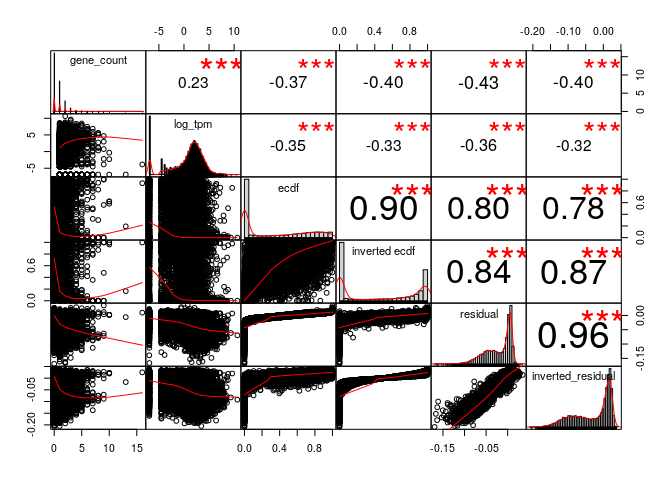

MSR and expression for lung, windows of 1000 sites
================

Here I will investigate if there is a relationship between the presence of genes and genes expression in a certain genomic region and the MSR (with some of its derivate statistics).

I chose lung cells data in order to do this, and CpG windows of size 1000, that corresponds to a variable window size in term of nucleotides (on average about 100,000).

This is an example of total-rna-seq file, that shows for each "gene" its transcripts and some measures of expression. In this case I just kept two colums. The first one indicates the "gene"", the second one is the Transcript Per Million that is a relative measure of how much a gene is expressed.

    ##                    gene_id   TPM
    ##     1:     ENSG00000000003  7.67
    ##     2:     ENSG00000000005  0.00
    ##     3:     ENSG00000000419 14.43
    ##     4:     ENSG00000000457  1.95
    ##     5:     ENSG00000000460  1.11
    ##    ---                          
    ## 60818: gSpikein_ERCC-00165  0.00
    ## 60819: gSpikein_ERCC-00168  0.00
    ## 60820: gSpikein_ERCC-00170  0.00
    ## 60821: gSpikein_ERCC-00171  0.00
    ## 60822:    gSpikein_phiX174  0.00

This is the annotation file that store the position occupied by each human gene.

    ##         chr     start       end strand              id                    anno
    ##     1: chr1     65419     71585      + ENSG00000186092 genebody_protein_coding
    ##     2: chr1    450703    451697      - ENSG00000284733 genebody_protein_coding
    ##     3: chr1    685679    686673      - ENSG00000284662 genebody_protein_coding
    ##     4: chr1    923928    944581      + ENSG00000187634 genebody_protein_coding
    ##     5: chr1    944204    959309      - ENSG00000188976 genebody_protein_coding
    ##    ---                                                                        
    ## 19801: chrY  24763069  24813492      - ENSG00000187191 genebody_protein_coding
    ## 19802: chrY  24833843  24907040      + ENSG00000205916 genebody_protein_coding
    ## 19803: chrY  25030901  25062548      - ENSG00000185894 genebody_protein_coding
    ## 19804: chrY  25622162  25624902      + ENSG00000172288 genebody_protein_coding
    ## 19805: chrX 135309480 135309659      + ENSG00000283644 genebody_protein_coding

The number of genes is much less than the ones in the total-rna-seq file, since the first one also contains so called pseudogenes and other stuff.

So the final dataFrame is the following (excluding some columns for readability):

    ## 21 rows had too many nucleotides

    ##    start_chr start_position end_position gene_count total_TPM meth rate
    ## 12      chr1         940826       961902          2     52.11 0.4380840
    ## 13      chr1         961902       982731          2      1.63 0.6650541
    ## 14      chr1         982731      1007283          2    119.71 0.4254677
    ## 23      chr1        1206432      1228380          2     62.29 0.7848827
    ## 24      chr1        1228380      1246900          2      7.94 0.5454628
    ## 26      chr1        1274217      1295503          2     23.37 0.7764103

The full scheme includes:

**nucleotides**: number of nucleotides in the window

**CpG density**: fraction of nucleotides that is a C of a CpG site (= 1000/nucleotides)

**meth rate**: ratio of methylated CpG sites

**gene\_count**: number of genes included (even partially) inside the interval

**total\_TPM**: sum of the TPMs of the genes in the interval

then the MSR and some related statistics: **msr**, **inverted msr**, **msr ecdf **, **inverted msr ecdf**, **residual** (residual of the linear regression between msr and meth rate), **inverted residual**.

First let's see if there are pairwise correlations between the features.

###### Basic features:

log(TPM) is considered only for fragments with at least a gene.

###### Comparison with simple MSR statistics:

###### Comparison with other MSR statistics:

inverted msr vs log(tpm): 

#### Predicting gene presence

Check if features can predict gene presence:

    ## missing data:  8.077306 %

    ## 
    ## train_data_proportion:  0.2

The fraction of fragments that have at least one gene inside is (train data)

    ## [1] 0.464239

Logistic Regression Model for gene presence with basic predictors (nucleotides, CpG\_density, meth rate, msr\_density):

    ## TRAIN DATA

    ## accuracy:  0.7273576

    ## TEST DATA

    ## accuracy:  0.7284227

Logistic Regression Model with inverted\_msr as predictor

    ## TRAIN DATA

    ## accuracy:  0.7434174

    ## TEST DATA

    ## accuracy:  0.74378

Logistic Regression Model with all predictors

    ## TRAIN DATA

    ## accuracy:  0.757423

    ## TEST DATA

    ## accuracy:  0.7530691

#### Predicting log(TPM)

Distribution of TPM values (only for regions that contains some genes) 

Linear model for TPM with standard predictors:

    ## 
    ## Call:
    ## lm(formula = log_tpm ~ ., data = train_model_data[, standard_predictors])
    ## 
    ## Residuals:
    ##     Min      1Q  Median      3Q     Max 
    ## -10.418  -1.048   0.463   1.635   7.862 
    ## 
    ## Coefficients:
    ##                           Estimate Std. Error t value Pr(>|t|)    
    ## (Intercept)             -7.979e-01  6.317e-01  -1.263    0.207    
    ## gene_count               7.789e-01  5.833e-02  13.352  < 2e-16 ***
    ## nucleotides             -2.454e-05  2.671e-06  -9.188  < 2e-16 ***
    ## CpG_density             -3.538e+00  1.293e+01  -0.274    0.784    
    ## `meth rate`              3.857e+01  2.994e+00  12.883  < 2e-16 ***
    ## msr_density             -3.230e+01  2.634e+00 -12.266  < 2e-16 ***
    ## genes_nucleotides_count  9.116e-06  1.821e-06   5.005 5.98e-07 ***
    ## ---
    ## Signif. codes:  0 '***' 0.001 '**' 0.01 '*' 0.05 '.' 0.1 ' ' 1
    ## 
    ## Residual standard error: 2.617 on 2479 degrees of freedom
    ## Multiple R-squared:  0.2411, Adjusted R-squared:  0.2393 
    ## F-statistic: 131.3 on 6 and 2479 DF,  p-value: < 2.2e-16

    ## Test data R squared:  0.2019025

Linear model for TPM with all features and MSR statistics:

    ## 
    ## Call:
    ## lm(formula = log_tpm ~ ., data = train_model_data[, c(standard_predictors, 
    ##     msr_predictors)])
    ## 
    ## Residuals:
    ##     Min      1Q  Median      3Q     Max 
    ## -9.0491 -1.0983  0.3437  1.5393  7.7950 
    ## 
    ## Coefficients:
    ##                           Estimate Std. Error t value Pr(>|t|)    
    ## (Intercept)             -2.189e+01  3.559e+00  -6.150 9.02e-10 ***
    ## gene_count               7.513e-01  5.720e-02  13.133  < 2e-16 ***
    ## nucleotides             -1.333e-05  2.719e-06  -4.901 1.01e-06 ***
    ## CpG_density              2.626e+01  1.310e+01   2.005   0.0451 *  
    ## `meth rate`              3.132e+01  3.538e+00   8.851  < 2e-16 ***
    ## msr_density             -2.974e+01  3.971e+00  -7.490 9.52e-14 ***
    ## genes_nucleotides_count  7.738e-06  1.765e-06   4.385 1.21e-05 ***
    ## msr                      8.482e+00  6.283e+00   1.350   0.1771    
    ## inverted_msr             8.308e+01  1.792e+01   4.637 3.72e-06 ***
    ## ecdf                    -6.733e-01  4.642e-01  -1.450   0.1471    
    ## `inverted ecdf`         -8.896e-01  3.977e-01  -2.237   0.0254 *  
    ## residual                -2.916e+01  9.121e+00  -3.197   0.0014 ** 
    ## inverted_residual       -7.656e+01  1.882e+01  -4.067 4.90e-05 ***
    ## ---
    ## Signif. codes:  0 '***' 0.001 '**' 0.01 '*' 0.05 '.' 0.1 ' ' 1
    ## 
    ## Residual standard error: 2.51 on 2473 degrees of freedom
    ## Multiple R-squared:  0.3038, Adjusted R-squared:  0.3004 
    ## F-statistic: 89.91 on 12 and 2473 DF,  p-value: < 2.2e-16

    ## Test data R squared:  0.2554938

Linear model for TPM with some features:

    ## 
    ## Call:
    ## lm(formula = log_tpm ~ ., data = train_model_data[, c(standard_predictors, 
    ##     "inverted_msr")])
    ## 
    ## Residuals:
    ##    Min     1Q Median     3Q    Max 
    ## -9.669 -1.129  0.351  1.626  8.081 
    ## 
    ## Coefficients:
    ##                           Estimate Std. Error t value Pr(>|t|)    
    ## (Intercept)             -1.326e+00  6.209e-01  -2.136   0.0328 *  
    ## gene_count               8.112e-01  5.722e-02  14.175  < 2e-16 ***
    ## nucleotides             -2.011e-05  2.652e-06  -7.584 4.71e-14 ***
    ## CpG_density              1.070e+01  1.274e+01   0.840   0.4012    
    ## `meth rate`              2.736e+01  3.129e+00   8.745  < 2e-16 ***
    ## msr_density             -1.881e+01  2.895e+00  -6.497 9.84e-11 ***
    ## genes_nucleotides_count  7.280e-06  1.793e-06   4.060 5.06e-05 ***
    ## inverted_msr            -1.300e+01  1.265e+00 -10.278  < 2e-16 ***
    ## ---
    ## Signif. codes:  0 '***' 0.001 '**' 0.01 '*' 0.05 '.' 0.1 ' ' 1
    ## 
    ## Residual standard error: 2.564 on 2478 degrees of freedom
    ## Multiple R-squared:  0.2721, Adjusted R-squared:  0.2701 
    ## F-statistic: 132.4 on 7 and 2478 DF,  p-value: < 2.2e-16

    ## Test data R squared:  0.2283526

Linear model for TPM with basic features but no information about genes:

    ## 
    ## Call:
    ## lm(formula = log_tpm ~ ., data = train_model_data[, c("log_tpm", 
    ##     basic_predictors)])
    ## 
    ## Residuals:
    ##      Min       1Q   Median       3Q      Max 
    ## -14.0429  -3.0406  -0.6598   3.3982  12.0992 
    ## 
    ## Coefficients:
    ##               Estimate Std. Error t value Pr(>|t|)    
    ## (Intercept)  6.303e+00  6.341e-01   9.940  < 2e-16 ***
    ## nucleotides -1.815e-05  2.228e-06  -8.147 4.61e-16 ***
    ## CpG_density -2.244e+01  1.390e+01  -1.615    0.106    
    ## `meth rate`  4.778e+01  2.767e+00  17.269  < 2e-16 ***
    ## msr_density -5.195e+01  2.465e+00 -21.079  < 2e-16 ***
    ## ---
    ## Signif. codes:  0 '***' 0.001 '**' 0.01 '*' 0.05 '.' 0.1 ' ' 1
    ## 
    ## Residual standard error: 3.883 on 5350 degrees of freedom
    ## Multiple R-squared:  0.2476, Adjusted R-squared:  0.247 
    ## F-statistic:   440 on 4 and 5350 DF,  p-value: < 2.2e-16

    ## Test data R squared:  0.2473145

Linear model for TPM with all features but no information about genes:

    ## 
    ## Call:
    ## lm(formula = log_tpm ~ ., data = train_model_data[, c("log_tpm", 
    ##     basic_predictors, msr_predictors)])
    ## 
    ## Residuals:
    ##      Min       1Q   Median       3Q      Max 
    ## -13.4213  -1.9809  -0.5288   2.6542  11.6701 
    ## 
    ## Coefficients:
    ##                     Estimate Std. Error t value Pr(>|t|)    
    ## (Intercept)       -2.428e+01  4.370e+00  -5.556 2.89e-08 ***
    ## nucleotides       -3.769e-06  2.242e-06  -1.681  0.09286 .  
    ## CpG_density        2.033e+01  1.374e+01   1.479  0.13924    
    ## `meth rate`        3.091e+01  3.168e+00   9.756  < 2e-16 ***
    ## msr_density       -1.929e+01  3.951e+00  -4.881 1.08e-06 ***
    ## msr                5.020e+01  5.103e+00   9.838  < 2e-16 ***
    ## inverted_msr       2.087e+01  2.323e+01   0.899  0.36894    
    ## ecdf               1.102e+00  3.703e-01   2.977  0.00292 ** 
    ## `inverted ecdf`   -2.902e+00  3.575e-01  -8.116 5.93e-16 ***
    ## residual          -1.263e+02  9.105e+00 -13.872  < 2e-16 ***
    ## inverted_residual  6.239e+00  2.406e+01   0.259  0.79542    
    ## ---
    ## Signif. codes:  0 '***' 0.001 '**' 0.01 '*' 0.05 '.' 0.1 ' ' 1
    ## 
    ## Residual standard error: 3.603 on 5344 degrees of freedom
    ## Multiple R-squared:  0.3531, Adjusted R-squared:  0.3519 
    ## F-statistic: 291.7 on 10 and 5344 DF,  p-value: < 2.2e-16

    ## Test data R squared:  0.3420659

Linear model for TPM with inverted msr but no information about genes:

    ## 
    ## Call:
    ## lm(formula = log_tpm ~ ., data = train_model_data[, c("log_tpm", 
    ##     basic_predictors, "inverted_msr")])
    ## 
    ## Residuals:
    ##      Min       1Q   Median       3Q      Max 
    ## -11.1408  -2.3417  -0.6905   2.8203  12.4657 
    ## 
    ## Coefficients:
    ##                Estimate Std. Error t value Pr(>|t|)    
    ## (Intercept)   4.133e+00  6.151e-01   6.719 2.01e-11 ***
    ## nucleotides  -1.292e-05  2.146e-06  -6.020 1.86e-09 ***
    ## CpG_density   1.978e+00  1.335e+01   0.148    0.882    
    ## `meth rate`   2.503e+01  2.844e+00   8.801  < 2e-16 ***
    ## msr_density  -2.148e+01  2.735e+00  -7.854 4.83e-15 ***
    ## inverted_msr -3.022e+01  1.371e+00 -22.038  < 2e-16 ***
    ## ---
    ## Signif. codes:  0 '***' 0.001 '**' 0.01 '*' 0.05 '.' 0.1 ' ' 1
    ## 
    ## Residual standard error: 3.719 on 5349 degrees of freedom
    ## Multiple R-squared:  0.3102, Adjusted R-squared:  0.3095 
    ## F-statistic: 481.1 on 5 and 5349 DF,  p-value: < 2.2e-16

    ## Test data R squared:  0.3096084
