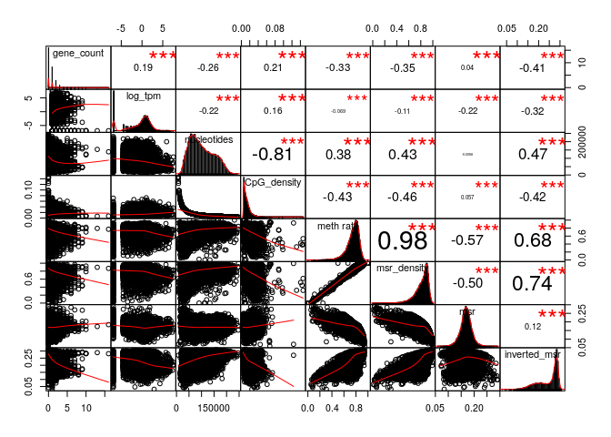

MSR and expression for ovary, windows of 1000 sites
================

Here I will investigate if there is a relationship between the presence of genes and genes expression in a certain genomic region and the MSR (with some of its derivate statistics).

I chose ovary cells data in order to do this, and CpG windows of size 1000, that corresponds to a variable window size in term of nucleotides (on average about 100,000).

This is an example of total-rna-seq file, that shows for each "gene" its transcripts and some measures of expression. In this case I just kept two colums. The first one indicates the "gene"", the second one is the Transcript Per Million that is a relative measure of how much a gene is expressed.

    ##                    gene_id    TPM
    ##     1:     ENSG00000000003   5.72
    ##     2:     ENSG00000000005   0.71
    ##     3:     ENSG00000000419   3.88
    ##     4:     ENSG00000000457   0.93
    ##     5:     ENSG00000000460   0.56
    ##    ---                           
    ## 58873: gSpikein_ERCC-00165   2.21
    ## 58874: gSpikein_ERCC-00168   0.00
    ## 58875: gSpikein_ERCC-00170   0.36
    ## 58876: gSpikein_ERCC-00171 220.92
    ## 58877:    gSpikein_phiX174 599.72

This is the annotation file that store the position occupied by each human gene.

    ##         chr     start       end strand              id                    anno
    ##     1: chr1     65419     71585      + ENSG00000186092 genebody_protein_coding
    ##     2: chr1    450703    451697      - ENSG00000284733 genebody_protein_coding
    ##     3: chr1    685679    686673      - ENSG00000284662 genebody_protein_coding
    ##     4: chr1    923928    944581      + ENSG00000187634 genebody_protein_coding
    ##     5: chr1    944204    959309      - ENSG00000188976 genebody_protein_coding
    ##    ---                                                                        
    ## 19801: chrY  24763069  24813492      - ENSG00000187191 genebody_protein_coding
    ## 19802: chrY  24833843  24907040      + ENSG00000205916 genebody_protein_coding
    ## 19803: chrY  25030901  25062548      - ENSG00000185894 genebody_protein_coding
    ## 19804: chrY  25622162  25624902      + ENSG00000172288 genebody_protein_coding
    ## 19805: chrX 135309480 135309659      + ENSG00000283644 genebody_protein_coding

The number of genes is much less than the ones in the total-rna-seq file, since the first one also contains so called pseudogenes and other stuff.

So the final dataFrame is the following (excluding some columns for readability):

    ## 21 rows had too many nucleotides

    ##    start_chr start_position end_position gene_count total_TPM meth rate
    ## 12      chr1         940826       961902          2      2.05 0.3971166
    ## 13      chr1         961902       982731          2      0.01 0.6196993
    ## 14      chr1         982731      1007283          2      1.44 0.3961765
    ## 23      chr1        1206432      1228380          2      4.88 0.7500134
    ## 24      chr1        1228380      1246900          2      1.22 0.4456788
    ## 26      chr1        1274217      1295503          2      2.47 0.7270221

The full scheme includes:

**nucleotides**: number of nucleotides in the window

**CpG density**: fraction of nucleotides that is a C of a CpG site (= 1000/nucleotides)

**meth rate**: ratio of methylated CpG sites

**gene\_count**: number of genes included (even partially) inside the interval

**total\_TPM**: sum of the TPMs of the genes in the interval

then the MSR and some related statistics: **msr**, **inverted msr**, **msr ecdf **, **inverted msr ecdf**, **residual** (residual of the linear regression between msr and meth rate), **inverted residual**.

First let's see if there are pairwise correlations between the features.

###### Basic features:

log(TPM) is considered only for fragments with at least a gene.

###### Comparison with simple MSR statistics:

###### Comparison with other MSR statistics:

inverted msr vs log(tpm): 

#### Predicting gene presence

Check if features can predict gene presence:

    ## missing data:  4.64797 %

    ## 
    ## train_data_proportion:  0.2

The fraction of fragments that have at least one gene inside is (train data)

    ## [1] 0.4581458

Logistic Regression Model for gene presence with basic predictors (nucleotides, CpG\_density, meth rate, msr\_density):

    ## TRAIN DATA

    ## accuracy:  0.689829

    ## TEST DATA

    ## accuracy:  0.695707

Logistic Regression Model with inverted\_msr as predictor

    ## TRAIN DATA

    ## accuracy:  0.7366337

    ## TEST DATA

    ## accuracy:  0.7332823

Logistic Regression Model with all predictors

    ## TRAIN DATA

    ## accuracy:  0.740234

    ## TEST DATA

    ## accuracy:  0.7393574

#### Predicting log(TPM)

Distribution of TPM values (only for regions that contains some genes) 

Linear model for TPM with standard predictors:

    ## 
    ## Call:
    ## lm(formula = log_tpm ~ ., data = train_model_data[, standard_predictors])
    ## 
    ## Residuals:
    ##      Min       1Q   Median       3Q      Max 
    ## -10.0013  -1.0878   0.5302   1.7063   9.3671 
    ## 
    ## Coefficients:
    ##                           Estimate Std. Error t value Pr(>|t|)    
    ## (Intercept)             -1.052e+00  5.905e-01  -1.782   0.0748 .  
    ## gene_count               5.606e-01  5.715e-02   9.808  < 2e-16 ***
    ## nucleotides             -2.063e-05  2.579e-06  -8.000 1.87e-15 ***
    ## CpG_density             -7.795e+00  1.248e+01  -0.625   0.5322    
    ## `meth rate`              5.382e+01  3.428e+00  15.699  < 2e-16 ***
    ## msr_density             -4.839e+01  3.113e+00 -15.546  < 2e-16 ***
    ## genes_nucleotides_count  1.291e-05  1.853e-06   6.966 4.13e-12 ***
    ## ---
    ## Signif. codes:  0 '***' 0.001 '**' 0.01 '*' 0.05 '.' 0.1 ' ' 1
    ## 
    ## Residual standard error: 2.626 on 2538 degrees of freedom
    ## Multiple R-squared:  0.221,  Adjusted R-squared:  0.2192 
    ## F-statistic:   120 on 6 and 2538 DF,  p-value: < 2.2e-16

    ## Test data R squared:  0.191659

Linear model for TPM with all features and MSR statistics:

    ## 
    ## Call:
    ## lm(formula = log_tpm ~ ., data = train_model_data[, c(standard_predictors, 
    ##     msr_predictors)])
    ## 
    ## Residuals:
    ##     Min      1Q  Median      3Q     Max 
    ## -9.2557 -1.1476  0.3961  1.6001  8.8917 
    ## 
    ## Coefficients:
    ##                           Estimate Std. Error t value Pr(>|t|)    
    ## (Intercept)             -3.811e+01  5.363e+00  -7.105 1.56e-12 ***
    ## gene_count               5.558e-01  5.525e-02  10.060  < 2e-16 ***
    ## nucleotides             -9.859e-06  2.626e-06  -3.754 0.000178 ***
    ## CpG_density              2.376e+01  1.241e+01   1.915 0.055619 .  
    ## `meth rate`              4.529e+01  3.739e+00  12.113  < 2e-16 ***
    ## msr_density             -5.270e+01  4.673e+00 -11.277  < 2e-16 ***
    ## genes_nucleotides_count  1.144e-05  1.785e-06   6.411 1.72e-10 ***
    ## msr                      2.824e+00  7.495e+00   0.377 0.706340    
    ## inverted_msr             1.742e+02  2.958e+01   5.891 4.34e-09 ***
    ## ecdf                    -1.816e-01  4.086e-01  -0.445 0.656690    
    ## `inverted ecdf`         -8.694e-01  3.726e-01  -2.333 0.019717 *  
    ## residual                -1.783e+01  1.167e+01  -1.527 0.126863    
    ## inverted_residual       -1.755e+02  2.998e+01  -5.853 5.47e-09 ***
    ## ---
    ## Signif. codes:  0 '***' 0.001 '**' 0.01 '*' 0.05 '.' 0.1 ' ' 1
    ## 
    ## Residual standard error: 2.521 on 2532 degrees of freedom
    ## Multiple R-squared:  0.2834, Adjusted R-squared:   0.28 
    ## F-statistic: 83.45 on 12 and 2532 DF,  p-value: < 2.2e-16

    ## Test data R squared:  0.2566094

Linear model for TPM with some features:

    ## 
    ## Call:
    ## lm(formula = log_tpm ~ ., data = train_model_data[, c(standard_predictors, 
    ##     "inverted_msr")])
    ## 
    ## Residuals:
    ##     Min      1Q  Median      3Q     Max 
    ## -9.6781 -1.1911  0.4295  1.6878  8.9997 
    ## 
    ## Coefficients:
    ##                           Estimate Std. Error t value Pr(>|t|)    
    ## (Intercept)             -1.353e+00  5.757e-01  -2.350   0.0189 *  
    ## gene_count               5.789e-01  5.569e-02  10.394  < 2e-16 ***
    ## nucleotides             -1.424e-05  2.570e-06  -5.538 3.37e-08 ***
    ## CpG_density              1.393e+01  1.229e+01   1.133   0.2574    
    ## `meth rate`              4.290e+01  3.466e+00  12.378  < 2e-16 ***
    ## msr_density             -3.390e+01  3.273e+00 -10.358  < 2e-16 ***
    ## genes_nucleotides_count  1.141e-05  1.809e-06   6.303 3.42e-10 ***
    ## inverted_msr            -1.779e+01  1.514e+00 -11.750  < 2e-16 ***
    ## ---
    ## Signif. codes:  0 '***' 0.001 '**' 0.01 '*' 0.05 '.' 0.1 ' ' 1
    ## 
    ## Residual standard error: 2.558 on 2537 degrees of freedom
    ## Multiple R-squared:  0.2612, Adjusted R-squared:  0.2592 
    ## F-statistic: 128.1 on 7 and 2537 DF,  p-value: < 2.2e-16

    ## Test data R squared:  0.2302978

Linear model for TPM with basic features but no information about genes:

    ## 
    ## Call:
    ## lm(formula = log_tpm ~ ., data = train_model_data[, c("log_tpm", 
    ##     basic_predictors)])
    ## 
    ## Residuals:
    ##      Min       1Q   Median       3Q      Max 
    ## -10.9604  -2.6212  -0.9337   3.2223  11.6963 
    ## 
    ## Coefficients:
    ##               Estimate Std. Error t value Pr(>|t|)    
    ## (Intercept)  5.017e+00  4.966e-01  10.101  < 2e-16 ***
    ## nucleotides -1.831e-05  1.849e-06  -9.906  < 2e-16 ***
    ## CpG_density -4.152e+01  1.128e+01  -3.681 0.000235 ***
    ## `meth rate`  3.049e+01  2.463e+00  12.378  < 2e-16 ***
    ## msr_density -3.613e+01  2.281e+00 -15.839  < 2e-16 ***
    ## ---
    ## Signif. codes:  0 '***' 0.001 '**' 0.01 '*' 0.05 '.' 0.1 ' ' 1
    ## 
    ## Residual standard error: 3.352 on 5550 degrees of freedom
    ## Multiple R-squared:  0.1844, Adjusted R-squared:  0.1838 
    ## F-statistic: 313.7 on 4 and 5550 DF,  p-value: < 2.2e-16

    ## Test data R squared:  0.1908172

Linear model for TPM with all features but no information about genes:

    ## 
    ## Call:
    ## lm(formula = log_tpm ~ ., data = train_model_data[, c("log_tpm", 
    ##     basic_predictors, msr_predictors)])
    ## 
    ## Residuals:
    ##     Min      1Q  Median      3Q     Max 
    ## -8.4427 -1.5993 -0.7182  2.2879 11.6351 
    ## 
    ## Coefficients:
    ##                     Estimate Std. Error t value Pr(>|t|)    
    ## (Intercept)       -3.158e+01  5.449e+00  -5.795 7.21e-09 ***
    ## nucleotides       -5.312e-06  1.828e-06  -2.907 0.003669 ** 
    ## CpG_density       -6.482e-01  1.085e+01  -0.060 0.952379    
    ## `meth rate`        1.494e+01  2.639e+00   5.662 1.57e-08 ***
    ## msr_density       -1.900e+01  3.799e+00  -5.002 5.86e-07 ***
    ## msr                2.350e+01  5.451e+00   4.311 1.65e-05 ***
    ## inverted_msr       1.104e+02  2.964e+01   3.725 0.000197 ***
    ## ecdf               8.638e-01  3.100e-01   2.786 0.005349 ** 
    ## `inverted ecdf`   -2.515e+00  3.098e-01  -8.118 5.79e-16 ***
    ## residual          -8.071e+01  1.041e+01  -7.755 1.05e-14 ***
    ## inverted_residual -1.021e+02  3.000e+01  -3.404 0.000670 ***
    ## ---
    ## Signif. codes:  0 '***' 0.001 '**' 0.01 '*' 0.05 '.' 0.1 ' ' 1
    ## 
    ## Residual standard error: 3.082 on 5544 degrees of freedom
    ## Multiple R-squared:  0.3114, Adjusted R-squared:  0.3101 
    ## F-statistic: 250.7 on 10 and 5544 DF,  p-value: < 2.2e-16

    ## Test data R squared:  0.3012332

Linear model for TPM with inverted msr but no information about genes:

    ## 
    ## Call:
    ## lm(formula = log_tpm ~ ., data = train_model_data[, c("log_tpm", 
    ##     basic_predictors, "inverted_msr")])
    ## 
    ## Residuals:
    ##     Min      1Q  Median      3Q     Max 
    ## -9.4721 -1.9090 -0.8269  2.4314 10.8190 
    ## 
    ## Coefficients:
    ##                Estimate Std. Error t value Pr(>|t|)    
    ## (Intercept)   4.539e+00  4.651e-01   9.760  < 2e-16 ***
    ## nucleotides  -1.057e-05  1.752e-06  -6.033 1.71e-09 ***
    ## CpG_density  -1.383e+01  1.060e+01  -1.305    0.192    
    ## `meth rate`   1.328e+01  2.386e+00   5.565 2.75e-08 ***
    ## msr_density  -9.310e+00  2.339e+00  -3.981 6.96e-05 ***
    ## inverted_msr -3.917e+01  1.395e+00 -28.068  < 2e-16 ***
    ## ---
    ## Signif. codes:  0 '***' 0.001 '**' 0.01 '*' 0.05 '.' 0.1 ' ' 1
    ## 
    ## Residual standard error: 3.137 on 5549 degrees of freedom
    ## Multiple R-squared:  0.2858, Adjusted R-squared:  0.2852 
    ## F-statistic: 444.1 on 5 and 5549 DF,  p-value: < 2.2e-16

    ## Test data R squared:  0.2737325
