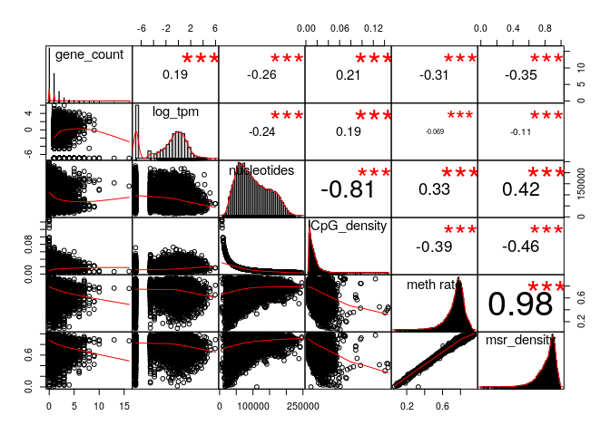
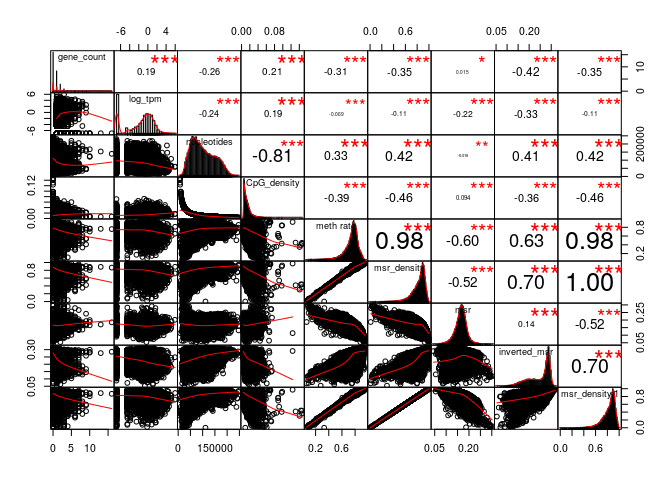
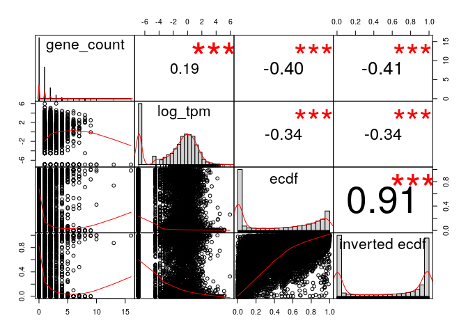
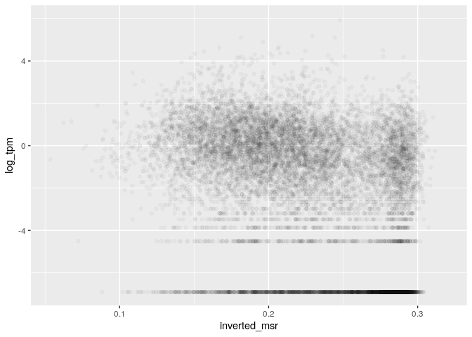
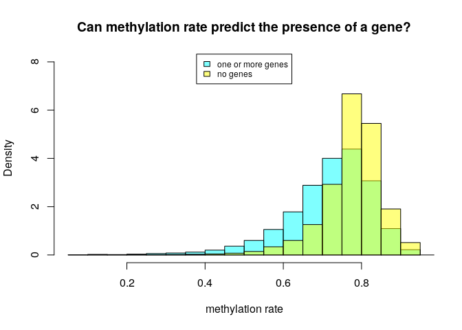
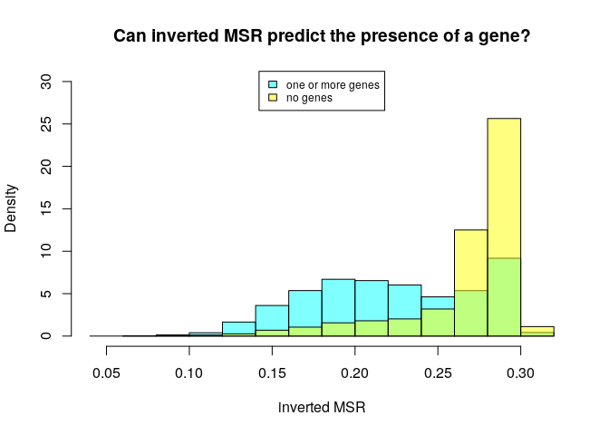
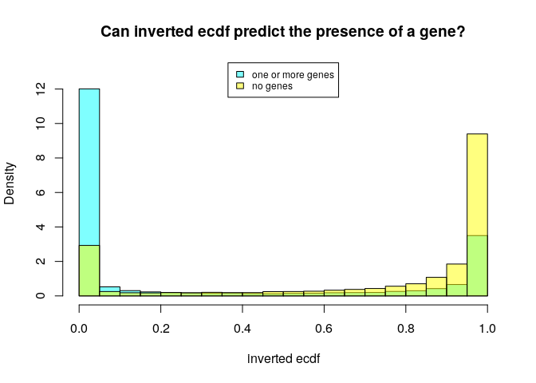
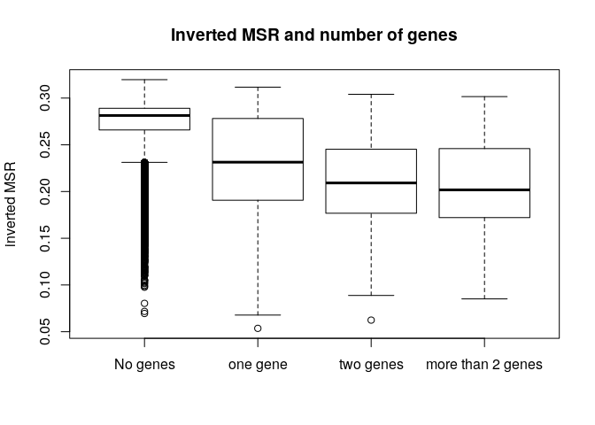
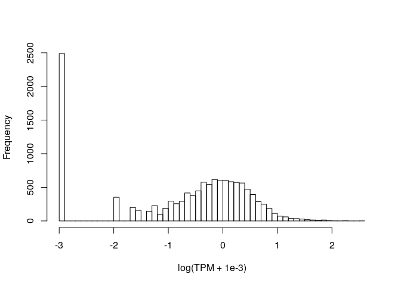

MSR and expression for stomach, windows of 1000 sites
================

Here I will investigate if there is a relationship between the presence of genes and genes expression in a certain genomic region and the MSR (with some of its derivate statistics).

I chose stomach cells data in order to do this, and CpG windows of size 1000, that corresponds to a variable window size in term of nucleotides (on average about 100,000).

This is an example of total-rna-seq file, that shows for each "gene" its transcripts and some measures of expression. In this case I just kept two colums. The first one indicates the "gene"", the second one is the Transcript Per Million that is a relative measure of how much a gene is expressed.

    ##                    gene_id    TPM
    ##     1:     ENSG00000000003   0.49
    ##     2:     ENSG00000000005   0.00
    ##     3:     ENSG00000000419   0.24
    ##     4:     ENSG00000000457   0.28
    ##     5:     ENSG00000000460   2.18
    ##    ---                           
    ## 60818: gSpikein_ERCC-00165   8.98
    ## 60819: gSpikein_ERCC-00168   0.04
    ## 60820: gSpikein_ERCC-00170   0.56
    ## 60821: gSpikein_ERCC-00171 530.85
    ## 60822:    gSpikein_phiX174  98.55

This is the annotation file that store the position occupied by each human gene.

    ##         chr     start       end strand              id                    anno
    ##     1: chr1     65419     71585      + ENSG00000186092 genebody_protein_coding
    ##     2: chr1    450703    451697      - ENSG00000284733 genebody_protein_coding
    ##     3: chr1    685679    686673      - ENSG00000284662 genebody_protein_coding
    ##     4: chr1    923928    944581      + ENSG00000187634 genebody_protein_coding
    ##     5: chr1    944204    959309      - ENSG00000188976 genebody_protein_coding
    ##    ---                                                                        
    ## 19801: chrY  24763069  24813492      - ENSG00000187191 genebody_protein_coding
    ## 19802: chrY  24833843  24907040      + ENSG00000205916 genebody_protein_coding
    ## 19803: chrY  25030901  25062548      - ENSG00000185894 genebody_protein_coding
    ## 19804: chrY  25622162  25624902      + ENSG00000172288 genebody_protein_coding
    ## 19805: chrX 135309480 135309659      + ENSG00000283644 genebody_protein_coding

The number of genes is much less than the ones in the total-rna-seq file, since the first one also contains so called pseudogenes and other stuff.

So the final dataFrame is the following (excluding some columns for readability):

    ## 21 rows had too many nucleotides

    ##    start_chr start_position end_position gene_count total_TPM meth rate
    ## 12      chr1         940826       961902          2      0.82 0.4183129
    ## 13      chr1         961902       982731          2      0.01 0.6514289
    ## 14      chr1         982731      1007283          2      2.39 0.4200074
    ## 23      chr1        1206432      1228380          2      1.19 0.7639069
    ## 24      chr1        1228380      1246900          2      0.10 0.5575582
    ## 26      chr1        1274217      1295503          2      2.01 0.7826838

The full scheme includes:

**nucleotides**: number of nucleotides in the window

**CpG density**: fraction of nucleotides that is a C of a CpG site (= 1000/nucleotides)

**meth rate**: ratio of methylated CpG sites

**gene\_count**: number of genes included (even partially) inside the interval

**total\_TPM**: sum of the TPMs of the genes in the interval

then the MSR and some related statistics: **msr**, **inverted msr**, **msr ecdf **, **inverted msr ecdf**, **residual** (residual of the linear regression between msr and meth rate), **inverted residual**.

First let's see if there are pairwise correlations between the features.

###### Basic features:

log(TPM) is considered only for fragments with at least a gene.

###### Comparison with simple MSR statistics:

###### Comparison with other MSR statistics:

inverted msr vs log(tpm): 

#### Predicting gene presence

Check if features can predict gene presence:

    ## missing data:  4.42484 %

    ## train_data_proportion:  0.2

The fraction of fragments that have at least one gene inside is (train data)

    ## [1] 0.4606681

Logistic Regression Model for gene presence with basic predictors (nucleotides, CpG\_density, meth rate, msr\_density):

    ## TRAIN DATA

    ## accuracy:  0.7121049

    ## TEST DATA

    ## accuracy:  0.720616

Logistic Regression Model with inverted\_msr as predictor

    ## TRAIN DATA

    ## accuracy:  0.7410201

    ## TEST DATA

    ## accuracy:  0.7440963

Logistic Regression Model with all predictors

    ## TRAIN DATA

    ## accuracy:  0.7519756

    ## TEST DATA

    ## accuracy:  0.7539283

#### Predicting log(TPM)

Distribution of TPM values (only for regions that contains some genes) 

Linear model for TPM with standard predictors:

    ## 
    ## Call:
    ## lm(formula = log_tpm ~ ., data = train_model_data[, standard_predictors])
    ## 
    ## Residuals:
    ##     Min      1Q  Median      3Q     Max 
    ## -9.8872 -1.6320  0.6385  1.9199  8.3848 
    ## 
    ## Coefficients:
    ##                           Estimate Std. Error t value Pr(>|t|)    
    ## (Intercept)             -1.875e+00  6.078e-01  -3.086  0.00205 ** 
    ## gene_count               4.113e-01  5.993e-02   6.864 8.35e-12 ***
    ## nucleotides             -1.605e-05  2.743e-06  -5.850 5.56e-09 ***
    ## CpG_density             -7.628e+00  1.269e+01  -0.601  0.54775    
    ## `meth rate`              4.607e+01  4.009e+00  11.491  < 2e-16 ***
    ## msr_density             -4.152e+01  3.629e+00 -11.442  < 2e-16 ***
    ## genes_nucleotides_count  1.512e-05  1.872e-06   8.076 1.02e-15 ***
    ## ---
    ## Signif. codes:  0 '***' 0.001 '**' 0.01 '*' 0.05 '.' 0.1 ' ' 1
    ## 
    ## Residual standard error: 2.712 on 2558 degrees of freedom
    ## Multiple R-squared:  0.1655, Adjusted R-squared:  0.1635 
    ## F-statistic: 84.55 on 6 and 2558 DF,  p-value: < 2.2e-16

    ## Test data R squared:  0.1719977

Linear model for TPM with all features and MSR statistics:

    ## 
    ## Call:
    ## lm(formula = log_tpm ~ ., data = train_model_data[, c(standard_predictors, 
    ##     msr_predictors)])
    ## 
    ## Residuals:
    ##     Min      1Q  Median      3Q     Max 
    ## -7.4822 -1.6555  0.4212  1.7893  8.8540 
    ## 
    ## Coefficients:
    ##                           Estimate Std. Error t value Pr(>|t|)    
    ## (Intercept)             -3.251e+00  1.440e+00  -2.257 0.024061 *  
    ## gene_count               4.648e-01  5.749e-02   8.084 9.55e-16 ***
    ## nucleotides             -9.164e-06  2.682e-06  -3.417 0.000644 ***
    ## CpG_density              2.865e+01  1.248e+01   2.295 0.021809 *  
    ## `meth rate`              2.125e+01  4.494e+00   4.728 2.39e-06 ***
    ## msr_density             -1.466e+01  3.921e+00  -3.739 0.000189 ***
    ## genes_nucleotides_count  1.143e-05  1.809e-06   6.320 3.07e-10 ***
    ## msr                     -2.557e+00  5.246e+00  -0.487 0.625973    
    ## inverted_msr            -9.621e+00  3.242e+00  -2.968 0.003024 ** 
    ## ecdf                    -1.438e+00  3.698e-01  -3.888 0.000104 ***
    ## `inverted ecdf`         -4.350e-01  3.685e-01  -1.180 0.237963    
    ## ---
    ## Signif. codes:  0 '***' 0.001 '**' 0.01 '*' 0.05 '.' 0.1 ' ' 1
    ## 
    ## Residual standard error: 2.59 on 2554 degrees of freedom
    ## Multiple R-squared:  0.2396, Adjusted R-squared:  0.2366 
    ## F-statistic: 80.46 on 10 and 2554 DF,  p-value: < 2.2e-16

    ## Test data R squared:  0.2316035

Linear model for TPM with some features:

    ## 
    ## Call:
    ## lm(formula = log_tpm ~ ., data = train_model_data[, c(standard_predictors, 
    ##     "inverted_msr")])
    ## 
    ## Residuals:
    ##     Min      1Q  Median      3Q     Max 
    ## -8.0869 -1.6523  0.4648  1.8627  8.5073 
    ## 
    ## Coefficients:
    ##                           Estimate Std. Error t value Pr(>|t|)    
    ## (Intercept)             -1.803e+00  5.872e-01  -3.071  0.00216 ** 
    ## gene_count               4.368e-01  5.793e-02   7.540 6.50e-14 ***
    ## nucleotides             -1.195e-05  2.668e-06  -4.480 7.80e-06 ***
    ## CpG_density              1.908e+01  1.242e+01   1.537  0.12447    
    ## `meth rate`              2.514e+01  4.170e+00   6.029 1.88e-09 ***
    ## msr_density             -1.760e+01  3.926e+00  -4.483 7.69e-06 ***
    ## genes_nucleotides_count  1.202e-05  1.823e-06   6.591 5.30e-11 ***
    ## inverted_msr            -2.029e+01  1.498e+00 -13.544  < 2e-16 ***
    ## ---
    ## Signif. codes:  0 '***' 0.001 '**' 0.01 '*' 0.05 '.' 0.1 ' ' 1
    ## 
    ## Residual standard error: 2.62 on 2557 degrees of freedom
    ## Multiple R-squared:  0.2213, Adjusted R-squared:  0.2192 
    ## F-statistic: 103.8 on 7 and 2557 DF,  p-value: < 2.2e-16

    ## Test data R squared:  0.2213785

Linear model for TPM with basic features but no information about genes:

    ## 
    ## Call:
    ## lm(formula = log_tpm ~ ., data = train_model_data[, c("log_tpm", 
    ##     basic_predictors)])
    ## 
    ## Residuals:
    ##      Min       1Q   Median       3Q      Max 
    ## -11.9430  -2.1917  -0.6816   2.5270   9.5661 
    ## 
    ## Coefficients:
    ##               Estimate Std. Error t value Pr(>|t|)    
    ## (Intercept)  2.340e+00  4.454e-01   5.255 1.54e-07 ***
    ## nucleotides -6.908e-06  1.685e-06  -4.101 4.18e-05 ***
    ## CpG_density -2.019e+01  9.836e+00  -2.053   0.0401 *  
    ## `meth rate`  4.805e+01  2.473e+00  19.429  < 2e-16 ***
    ## msr_density -5.056e+01  2.246e+00 -22.516  < 2e-16 ***
    ## ---
    ## Signif. codes:  0 '***' 0.001 '**' 0.01 '*' 0.05 '.' 0.1 ' ' 1
    ## 
    ## Residual standard error: 2.906 on 5563 degrees of freedom
    ## Multiple R-squared:   0.21,  Adjusted R-squared:  0.2094 
    ## F-statistic: 369.7 on 4 and 5563 DF,  p-value: < 2.2e-16

    ## Test data R squared:  0.2089588

Linear model for TPM with all features but no information about genes:

    ## 
    ## Call:
    ## lm(formula = log_tpm ~ ., data = train_model_data[, c("log_tpm", 
    ##     basic_predictors, msr_predictors)])
    ## 
    ## Residuals:
    ##     Min      1Q  Median      3Q     Max 
    ## -6.8124 -1.4905 -0.4115  1.8202 10.6452 
    ## 
    ## Coefficients:
    ##                   Estimate Std. Error t value Pr(>|t|)    
    ## (Intercept)     -3.993e+00  1.089e+00  -3.667 0.000248 ***
    ## nucleotides     -1.952e-06  1.606e-06  -1.215 0.224400    
    ## CpG_density      2.313e+01  9.386e+00   2.464 0.013777 *  
    ## `meth rate`      2.350e+01  2.762e+00   8.508  < 2e-16 ***
    ## msr_density     -1.608e+01  2.414e+00  -6.661 2.99e-11 ***
    ## msr              1.388e+01  3.491e+00   3.976 7.11e-05 ***
    ## inverted_msr    -2.565e+01  2.389e+00 -10.734  < 2e-16 ***
    ## ecdf            -8.080e-01  2.326e-01  -3.473 0.000518 ***
    ## `inverted ecdf` -9.593e-01  2.559e-01  -3.749 0.000180 ***
    ## ---
    ## Signif. codes:  0 '***' 0.001 '**' 0.01 '*' 0.05 '.' 0.1 ' ' 1
    ## 
    ## Residual standard error: 2.696 on 5559 degrees of freedom
    ## Multiple R-squared:  0.3205, Adjusted R-squared:  0.3195 
    ## F-statistic: 327.8 on 8 and 5559 DF,  p-value: < 2.2e-16

    ## Test data R squared:  0.3070855

Linear model for TPM with inverted msr but no information about genes:

    ## 
    ## Call:
    ## lm(formula = log_tpm ~ ., data = train_model_data[, c("log_tpm", 
    ##     basic_predictors, "inverted_msr")])
    ## 
    ## Residuals:
    ##     Min      1Q  Median      3Q     Max 
    ## -7.9442 -1.5854 -0.5975  1.8864 10.6080 
    ## 
    ## Coefficients:
    ##                Estimate Std. Error t value Pr(>|t|)    
    ## (Intercept)   2.224e+00  4.173e-01   5.330 1.02e-07 ***
    ## nucleotides  -4.538e-06  1.581e-06  -2.871  0.00411 ** 
    ## CpG_density   9.588e+00  9.278e+00   1.033  0.30146    
    ## `meth rate`   2.318e+01  2.484e+00   9.333  < 2e-16 ***
    ## msr_density  -1.899e+01  2.390e+00  -7.946 2.31e-15 ***
    ## inverted_msr -3.247e+01  1.167e+00 -27.831  < 2e-16 ***
    ## ---
    ## Signif. codes:  0 '***' 0.001 '**' 0.01 '*' 0.05 '.' 0.1 ' ' 1
    ## 
    ## Residual standard error: 2.723 on 5562 degrees of freedom
    ## Multiple R-squared:  0.3066, Adjusted R-squared:  0.306 
    ## F-statistic: 491.8 on 5 and 5562 DF,  p-value: < 2.2e-16

    ## Test data R squared:  0.2956287
