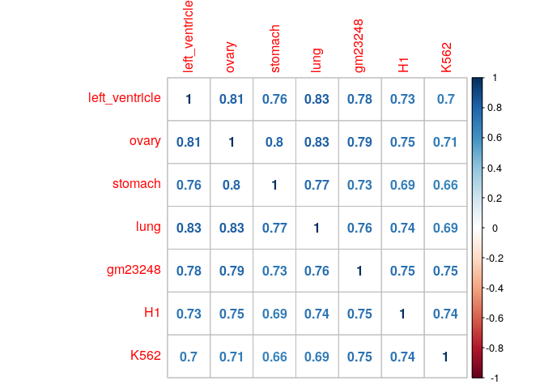
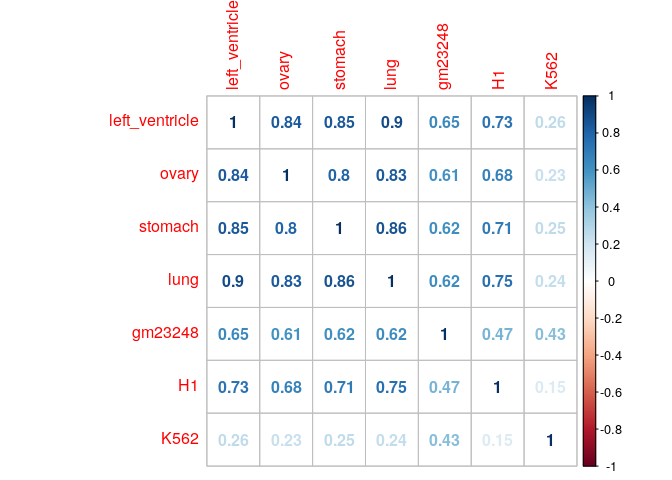
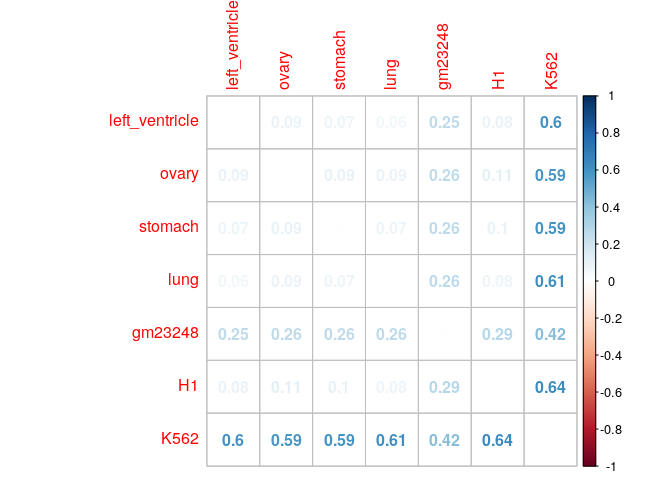

Tissues data comparison
================

Correlation in gene expression ( log(TPM+1e-3) ): 

Methylation Levels:

    ## Methylation Levels

    ## left_ventricle : 75.97694 %
    ## ovary : 74.80754 %
    ## stomach : 74.96795 %
    ## lung : 77.23368 %
    ## gm23248 : 60.67859 %
    ## H1 : 81.20174 %
    ## K562 : 27.96945 %

Correlation in CpG methylation: 

Normalized Hamming distance: 

    ##                left_ventricle ovary stomach  lung gm23248    H1  K562
    ## left_ventricle           0.00  8.51    7.44  5.79   25.49  8.37 60.28
    ## ovary                    8.51  0.00    9.11  8.62   25.62 11.02 58.81
    ## stomach                  7.44  9.11    0.00  7.09   25.67  9.77 59.28
    ## lung                     5.79  8.62    7.09  0.00   26.04  7.50 61.03
    ## gm23248                 25.49 25.62   25.67 26.04    0.00 28.56 42.25
    ## H1                       8.37 11.02    9.77  7.50   28.56  0.00 63.63
    ## K562                    60.28 58.81   59.28 61.03   42.25 63.63  0.00
