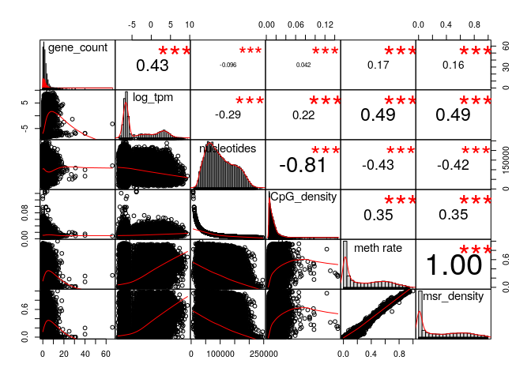
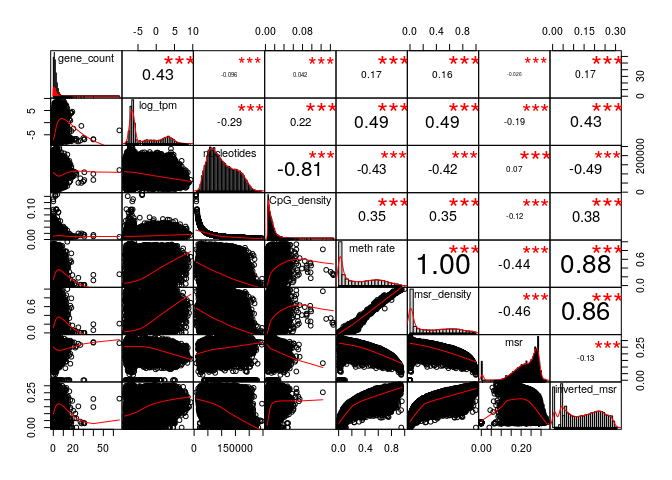
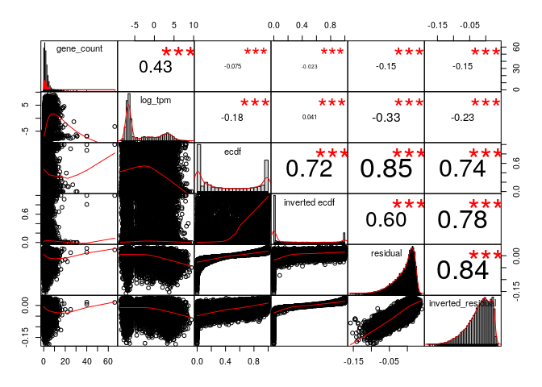
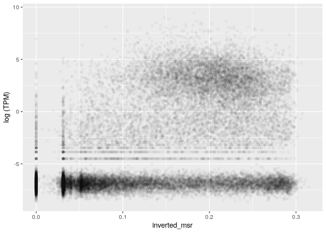
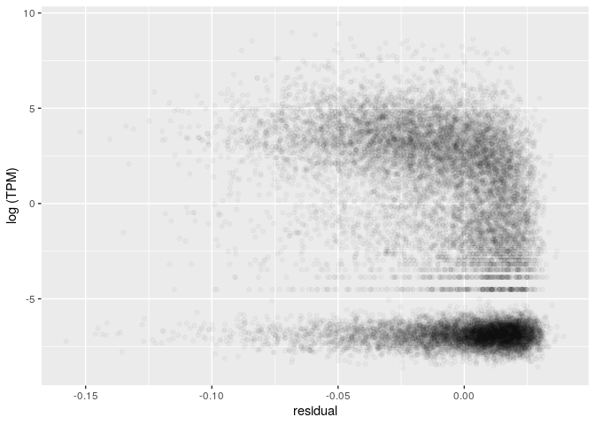
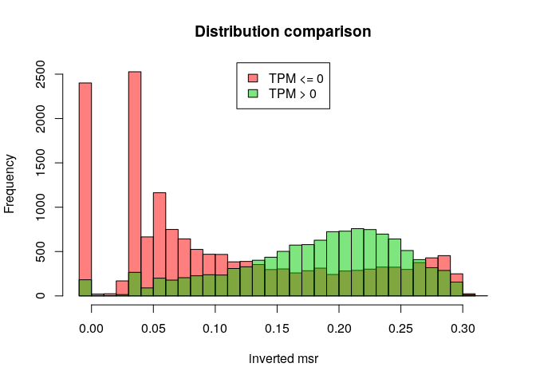
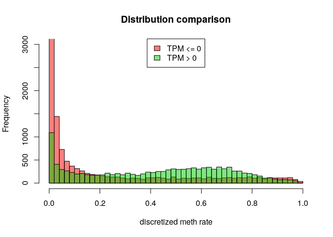
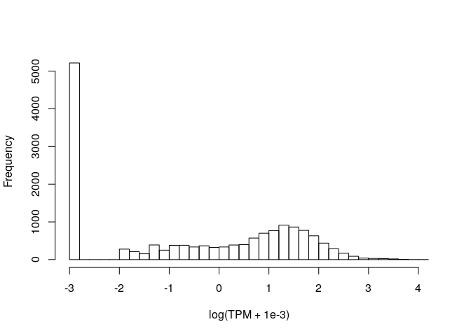

MSR and expression for K562, windows of 1000 sites, extended genes set
================

The DataFrame is the following (excluding some columns for readability):

    ## 21 rows had too many nucleotides

    ##    start_chr start_position end_position gene_count total_TPM meth rate
    ## 8       chr1         742325       827393          8     20.59 0.5631645
    ## 9       chr1         827393       891580          3      0.37 0.3982295
    ## 10      chr1         891580       921648          4      0.16 0.3629747
    ## 12      chr1         940826       961902          2     75.90 0.4369406
    ## 13      chr1         961902       982731          2      0.10 0.4100463
    ## 14      chr1         982731      1007283          3      3.93 0.2483796

The full scheme includes:

**nucleotides**: number of nucleotides in the window

**CpG density**: fraction of nucleotides that is a C of a CpG site (= 1000/nucleotides)

**meth rate**: ratio of methylated CpG sites

**gene\_count**: number of genes included (even partially) inside the interval

**total\_TPM**: sum of the TPMs of the genes in the interval

then the MSR and some related statistics: **msr**, **inverted msr**, **msr ecdf **, **inverted msr ecdf**, **residual** (residual of the linear regression between msr and meth rate), **inverted residual**.

First let's see if there are pairwise correlations between the features.

TPM for regions with 0 genes is considered 0.

###### Basic features:

###### Comparison with simple MSR statistics:

###### Comparison with other MSR statistics:

inverted msr vs log(tpm): 

    ## missing data:  37.1048 %

    ## 
    ## train_data_proportion:  0.2

The fraction of fragments that have TPM&gt;0 (train data)

    ## [1] 0.5750546

Logistic Regression Model for TPM presence with basic predictors (nucleotides, CpG\_density, meth rate, msr\_density):

    ## TRAIN DATA

    ## accuracy:  0.6364629

    ## TEST DATA

    ## accuracy:  0.6420385

Logistic Regression Model with inverted\_msr as predictor

    ## TRAIN DATA

    ## accuracy:  0.6241812

    ## TEST DATA

    ## accuracy:  0.6270296

Logistic Regression Model with all predictors

    ## TRAIN DATA

    ## accuracy:  0.6678493

    ## TEST DATA

    ## accuracy:  0.6848138

#### Predicting log(TPM)

Distribution of TPM values (only for regions that contains some genes) 

Linear model for TPM with standard predictors, available information about genes:

    ## 
    ## Call:
    ## lm(formula = log_tpm ~ ., data = train_model_data[, standard_predictors])
    ## 
    ## Residuals:
    ##     Min      1Q  Median      3Q     Max 
    ## -31.628  -2.936  -0.173   3.030  12.234 
    ## 
    ## Coefficients:
    ##                           Estimate Std. Error t value Pr(>|t|)    
    ## (Intercept)             -6.030e+00  5.113e-01 -11.794   <2e-16 ***
    ## gene_count               7.625e-01  3.574e-02  21.336   <2e-16 ***
    ## nucleotides             -1.256e-05  3.094e-06  -4.060    5e-05 ***
    ## CpG_density              3.066e+01  1.470e+01   2.086    0.037 *  
    ## `meth rate`              1.226e+00  3.473e+00   0.353    0.724    
    ## msr_density              2.891e+00  3.028e+00   0.955    0.340    
    ## genes_nucleotides_count  3.651e-05  2.108e-06  17.318   <2e-16 ***
    ## ---
    ## Signif. codes:  0 '***' 0.001 '**' 0.01 '*' 0.05 '.' 0.1 ' ' 1
    ## 
    ## Residual standard error: 3.848 on 3657 degrees of freedom
    ## Multiple R-squared:  0.326,  Adjusted R-squared:  0.3249 
    ## F-statistic: 294.8 on 6 and 3657 DF,  p-value: < 2.2e-16

    ## Test data R squared:  0.3471364

Linear model for TPM with all features and MSR statistics, available information about genes:

    ## 
    ## Call:
    ## lm(formula = log_tpm ~ ., data = train_model_data[, c(standard_predictors, 
    ##     msr_predictors)])
    ## 
    ## Residuals:
    ##      Min       1Q   Median       3Q      Max 
    ## -25.9260  -2.5687  -0.0293   2.6893  12.4660 
    ## 
    ## Coefficients:
    ##                           Estimate Std. Error t value Pr(>|t|)    
    ## (Intercept)             -2.301e+01  2.041e+00 -11.274  < 2e-16 ***
    ## gene_count               6.479e-01  3.470e-02  18.673  < 2e-16 ***
    ## nucleotides             -1.018e-05  2.985e-06  -3.412 0.000653 ***
    ## CpG_density              9.160e+00  1.419e+01   0.646 0.518597    
    ## `meth rate`              1.092e+01  3.821e+00   2.859 0.004271 ** 
    ## msr_density             -3.697e+00  3.114e+00  -1.187 0.235302    
    ## genes_nucleotides_count  3.090e-05  2.034e-06  15.187  < 2e-16 ***
    ## msr                      4.961e+01  7.857e+00   6.314 3.05e-10 ***
    ## inverted_msr             2.630e+01  4.732e+00   5.558 2.92e-08 ***
    ## ecdf                    -1.001e+00  3.555e-01  -2.817 0.004873 ** 
    ## `inverted ecdf`         -1.169e+00  3.151e-01  -3.709 0.000211 ***
    ## residual                -4.544e+01  9.791e+00  -4.641 3.59e-06 ***
    ## inverted_residual       -3.206e+01  6.217e+00  -5.158 2.63e-07 ***
    ## ---
    ## Signif. codes:  0 '***' 0.001 '**' 0.01 '*' 0.05 '.' 0.1 ' ' 1
    ## 
    ## Residual standard error: 3.67 on 3651 degrees of freedom
    ## Multiple R-squared:  0.388,  Adjusted R-squared:  0.3859 
    ## F-statistic: 192.9 on 12 and 3651 DF,  p-value: < 2.2e-16

    ## Test data R squared:  0.4214225

Linear model for TPM with adding inverted msr, available information about genes:

    ## 
    ## Call:
    ## lm(formula = log_tpm ~ ., data = train_model_data[, c(standard_predictors, 
    ##     "inverted_msr")])
    ## 
    ## Residuals:
    ##      Min       1Q   Median       3Q      Max 
    ## -31.2894  -2.7746  -0.1881   2.9300  12.0442 
    ## 
    ## Coefficients:
    ##                           Estimate Std. Error t value Pr(>|t|)    
    ## (Intercept)             -4.683e+00  5.427e-01  -8.629  < 2e-16 ***
    ## gene_count               7.551e-01  3.552e-02  21.260  < 2e-16 ***
    ## nucleotides             -1.417e-05  3.082e-06  -4.599 4.39e-06 ***
    ## CpG_density              1.733e+01  1.472e+01   1.177  0.23929    
    ## `meth rate`              1.194e+01  3.772e+00   3.167  0.00155 ** 
    ## msr_density             -4.147e+00  3.170e+00  -1.308  0.19088    
    ## genes_nucleotides_count  3.537e-05  2.100e-06  16.842  < 2e-16 ***
    ## inverted_msr            -1.285e+01  1.826e+00  -7.036 2.36e-12 ***
    ## ---
    ## Signif. codes:  0 '***' 0.001 '**' 0.01 '*' 0.05 '.' 0.1 ' ' 1
    ## 
    ## Residual standard error: 3.823 on 3656 degrees of freedom
    ## Multiple R-squared:  0.335,  Adjusted R-squared:  0.3338 
    ## F-statistic: 263.1 on 7 and 3656 DF,  p-value: < 2.2e-16

    ## Test data R squared:  0.3588967

Linear model for TPM with basic features but no information about genes:

    ## 
    ## Call:
    ## lm(formula = log_tpm ~ ., data = train_model_data[, c("log_tpm", 
    ##     basic_predictors)])
    ## 
    ## Residuals:
    ##     Min      1Q  Median      3Q     Max 
    ## -8.9778 -3.8432  0.0141  4.0604 11.6355 
    ## 
    ## Coefficients:
    ##               Estimate Std. Error t value Pr(>|t|)    
    ## (Intercept) -2.069e+00  5.797e-01  -3.569 0.000364 ***
    ## nucleotides -1.628e-05  3.578e-06  -4.550 5.55e-06 ***
    ## CpG_density -2.927e+01  1.699e+01  -1.723 0.084955 .  
    ## `meth rate`  2.587e-01  4.043e+00   0.064 0.948975    
    ## msr_density  4.108e+00  3.524e+00   1.166 0.243870    
    ## ---
    ## Signif. codes:  0 '***' 0.001 '**' 0.01 '*' 0.05 '.' 0.1 ' ' 1
    ## 
    ## Residual standard error: 4.479 on 3659 degrees of freedom
    ## Multiple R-squared:  0.08625,    Adjusted R-squared:  0.08525 
    ## F-statistic: 86.34 on 4 and 3659 DF,  p-value: < 2.2e-16

    ## Test data R squared:  0.09460334

Linear model for TPM with all features but no information about genes:

    ## 
    ## Call:
    ## lm(formula = log_tpm ~ ., data = train_model_data[, c("log_tpm", 
    ##     basic_predictors, msr_predictors)])
    ## 
    ## Residuals:
    ##     Min      1Q  Median      3Q     Max 
    ## -9.2263 -3.4075  0.1945  3.3292 11.5136 
    ## 
    ## Coefficients:
    ##                     Estimate Std. Error t value Pr(>|t|)    
    ## (Intercept)       -2.725e+01  2.283e+00 -11.934  < 2e-16 ***
    ## nucleotides       -1.161e-05  3.328e-06  -3.489 0.000490 ***
    ## CpG_density       -4.619e+01  1.577e+01  -2.929 0.003424 ** 
    ## `meth rate`        1.410e+01  4.282e+00   3.294 0.000999 ***
    ## msr_density       -5.746e+00  3.491e+00  -1.646 0.099901 .  
    ## msr                7.041e+01  8.777e+00   8.022 1.39e-15 ***
    ## inverted_msr       3.962e+01  5.278e+00   7.507 7.56e-14 ***
    ## ecdf              -1.279e+00  3.981e-01  -3.214 0.001323 ** 
    ## `inverted ecdf`   -2.061e+00  3.518e-01  -5.860 5.04e-09 ***
    ## residual          -7.008e+01  1.094e+01  -6.404 1.71e-10 ***
    ## inverted_residual -4.173e+01  6.962e+00  -5.995 2.23e-09 ***
    ## ---
    ## Signif. codes:  0 '***' 0.001 '**' 0.01 '*' 0.05 '.' 0.1 ' ' 1
    ## 
    ## Residual standard error: 4.115 on 3653 degrees of freedom
    ## Multiple R-squared:  0.2299, Adjusted R-squared:  0.2278 
    ## F-statistic: 109.1 on 10 and 3653 DF,  p-value: < 2.2e-16

    ## Test data R squared:  0.262449

Linear model for TPM with inverted msr but no information about genes:

    ## 
    ## Call:
    ## lm(formula = log_tpm ~ ., data = train_model_data[, c("log_tpm", 
    ##     basic_predictors, "inverted_msr")])
    ## 
    ## Residuals:
    ##      Min       1Q   Median       3Q      Max 
    ## -10.3442  -3.7887   0.1479   3.9834  11.4932 
    ## 
    ## Coefficients:
    ##                Estimate Std. Error t value Pr(>|t|)    
    ## (Intercept)  -1.659e-01  6.105e-01  -0.272 0.785785    
    ## nucleotides  -1.869e-05  3.549e-06  -5.266 1.47e-07 ***
    ## CpG_density  -4.719e+01  1.692e+01  -2.789 0.005309 ** 
    ## `meth rate`   1.621e+01  4.369e+00   3.711 0.000209 ***
    ## msr_density  -6.393e+00  3.673e+00  -1.740 0.081887 .  
    ## inverted_msr -1.908e+01  2.105e+00  -9.066  < 2e-16 ***
    ## ---
    ## Signif. codes:  0 '***' 0.001 '**' 0.01 '*' 0.05 '.' 0.1 ' ' 1
    ## 
    ## Residual standard error: 4.43 on 3658 degrees of freedom
    ## Multiple R-squared:  0.1063, Adjusted R-squared:  0.1051 
    ## F-statistic: 87.05 on 5 and 3658 DF,  p-value: < 2.2e-16

    ## Test data R squared:  0.1223802
