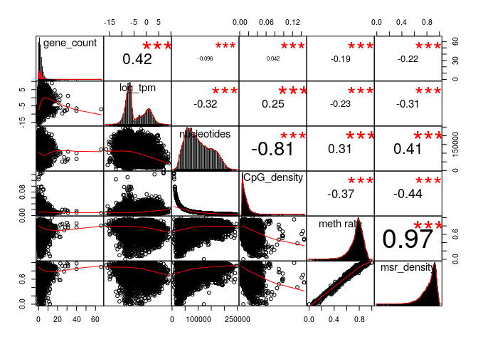
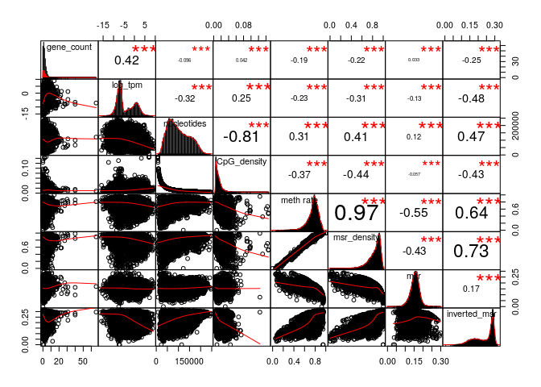
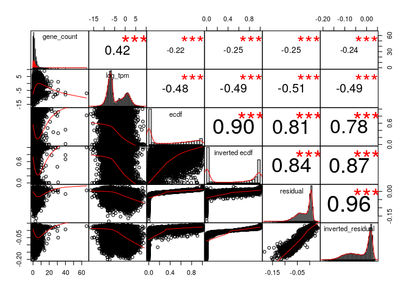
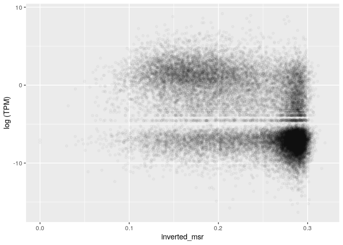
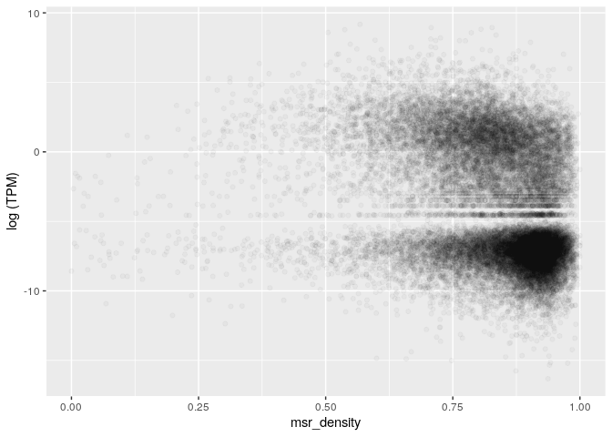
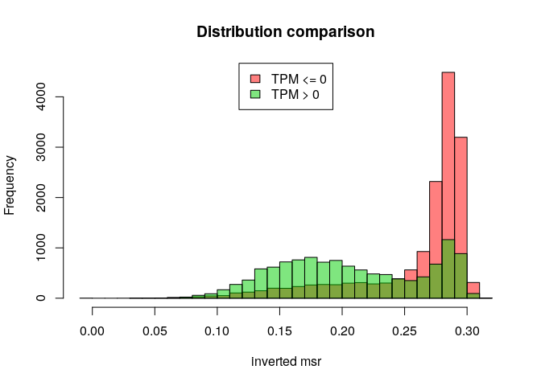
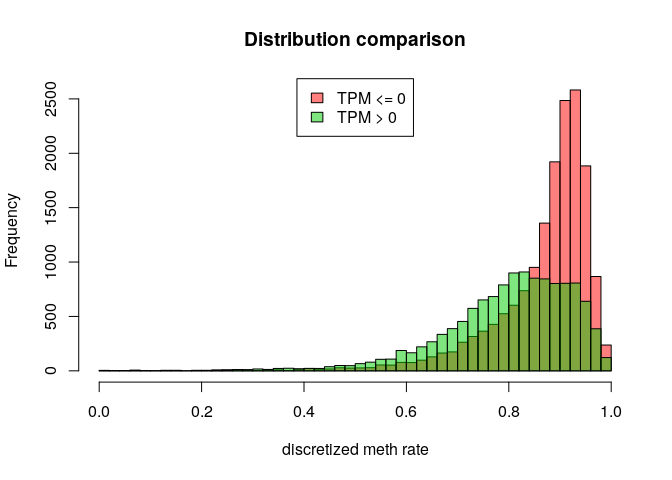

MSR and expression for heart left ventricle, windows of 1000 sites, extended genes set
================

The DataFrame is the following (excluding some columns for readability):

    ## 21 rows had too many nucleotides

    ##    start_chr start_position end_position gene_count total_TPM meth rate
    ## 8       chr1         742325       827393          8     19.46 0.6926883
    ## 9       chr1         827393       891580          3      0.03 0.6604949
    ## 10      chr1         891580       921648          4      0.06 0.5515606
    ## 12      chr1         940826       961902          2     16.12 0.4330459
    ## 13      chr1         961902       982731          2     94.04 0.6091376
    ## 14      chr1         982731      1007283          3      8.32 0.4504092

The full scheme includes:

**nucleotides**: number of nucleotides in the window

**CpG density**: fraction of nucleotides that is a C of a CpG site (= 1000/nucleotides)

**meth rate**: ratio of methylated CpG sites

**gene\_count**: number of genes included (even partially) inside the interval

**total\_TPM**: sum of the TPMs of the genes in the interval

then the MSR and some related statistics: **msr**, **inverted msr**, **msr ecdf **, **inverted msr ecdf**, **residual** (residual of the linear regression between msr and meth rate), **inverted residual**.

First let's see if there are pairwise correlations between the features.

TPM for regions with 0 genes is considered 0.

###### Basic features:

###### Comparison with simple MSR statistics:

###### Comparison with other MSR statistics:

inverted msr vs log(tpm): 

    ## missing data:  6.985685 %

    ## 
    ## train_data_proportion:  0.2

The fraction of fragments that have at least TPM (train data)

    ## [1] 0.4331057

Logistic Regression Model for TPM presence with basic predictors (nucleotides, CpG\_density, meth rate, msr\_density):

    ## TRAIN DATA

    ## accuracy:  0.7065879

    ## TEST DATA

    ## accuracy:  0.7073857

Logistic Regression Model with inverted\_msr as predictor

    ## TRAIN DATA

    ## accuracy:  0.7265178

    ## TEST DATA

    ## accuracy:  0.7303594

Logistic Regression Model with all predictors

    ## TRAIN DATA

    ## accuracy:  0.742757

    ## TEST DATA

    ## accuracy:  0.7468284

#### Predicting log(TPM)

Distribution of TPM values (only for regions that contains some genes) 

Linear model for TPM with standard predictors, available information about genes:

    ## 
    ## Call:
    ## lm(formula = log_tpm ~ ., data = train_model_data[, standard_predictors])
    ## 
    ## Residuals:
    ##      Min       1Q   Median       3Q      Max 
    ## -18.6226  -2.2073  -0.0402   2.3126  12.3446 
    ## 
    ## Coefficients:
    ##                           Estimate Std. Error t value Pr(>|t|)    
    ## (Intercept)             -2.889e+00  5.508e-01  -5.245 1.62e-07 ***
    ## gene_count               5.822e-01  2.734e-02  21.294  < 2e-16 ***
    ## nucleotides             -8.059e-06  1.973e-06  -4.084 4.48e-05 ***
    ## CpG_density              7.487e+01  1.228e+01   6.099 1.14e-09 ***
    ## `meth rate`              2.938e+01  2.038e+00  14.416  < 2e-16 ***
    ## msr_density             -3.050e+01  1.874e+00 -16.274  < 2e-16 ***
    ## genes_nucleotides_count  2.795e-05  1.413e-06  19.780  < 2e-16 ***
    ## ---
    ## Signif. codes:  0 '***' 0.001 '**' 0.01 '*' 0.05 '.' 0.1 ' ' 1
    ## 
    ## Residual standard error: 3.325 on 5412 degrees of freedom
    ## Multiple R-squared:  0.3789, Adjusted R-squared:  0.3782 
    ## F-statistic: 550.2 on 6 and 5412 DF,  p-value: < 2.2e-16

    ## Test data R squared:  0.3737463

Linear model for TPM with all features and MSR statistics, available information about genes:

    ## 
    ## Call:
    ## lm(formula = log_tpm ~ ., data = train_model_data[, c(standard_predictors, 
    ##     msr_predictors)])
    ## 
    ## Residuals:
    ##     Min      1Q  Median      3Q     Max 
    ## -16.454  -2.076   0.082   2.057  11.993 
    ## 
    ## Coefficients:
    ##                           Estimate Std. Error t value Pr(>|t|)    
    ## (Intercept)             -3.427e+01  4.353e+00  -7.872 4.18e-15 ***
    ## gene_count               5.417e-01  2.662e-02  20.351  < 2e-16 ***
    ## nucleotides             -4.812e-07  2.011e-06  -0.239    0.811    
    ## CpG_density              8.266e+01  1.241e+01   6.659 3.02e-11 ***
    ## `meth rate`              2.056e+01  2.385e+00   8.621  < 2e-16 ***
    ## msr_density             -2.376e+01  3.164e+00  -7.508 6.98e-14 ***
    ## genes_nucleotides_count  2.410e-05  1.382e-06  17.437  < 2e-16 ***
    ## msr                      1.987e+01  4.748e+00   4.184 2.90e-05 ***
    ## inverted_msr             1.097e+02  2.332e+01   4.703 2.63e-06 ***
    ## ecdf                     4.273e-01  3.247e-01   1.316    0.188    
    ## `inverted ecdf`         -1.844e+00  3.241e-01  -5.689 1.35e-08 ***
    ## residual                -6.343e+01  8.732e+00  -7.264 4.30e-13 ***
    ## inverted_residual       -9.490e+01  2.347e+01  -4.044 5.32e-05 ***
    ## ---
    ## Signif. codes:  0 '***' 0.001 '**' 0.01 '*' 0.05 '.' 0.1 ' ' 1
    ## 
    ## Residual standard error: 3.206 on 5406 degrees of freedom
    ## Multiple R-squared:  0.4232, Adjusted R-squared:  0.4219 
    ## F-statistic: 330.5 on 12 and 5406 DF,  p-value: < 2.2e-16

    ## Test data R squared:  0.4247826

Linear model for TPM with adding inverted msr, available information about genes:

    ## 
    ## Call:
    ## lm(formula = log_tpm ~ ., data = train_model_data[, c(standard_predictors, 
    ##     "inverted_msr")])
    ## 
    ## Residuals:
    ##      Min       1Q   Median       3Q      Max 
    ## -17.2833  -2.0435   0.0355   2.1055  12.0164 
    ## 
    ## Coefficients:
    ##                           Estimate Std. Error t value Pr(>|t|)    
    ## (Intercept)             -3.476e+00  5.397e-01  -6.440 1.30e-10 ***
    ## gene_count               5.762e-01  2.673e-02  21.554  < 2e-16 ***
    ## nucleotides             -4.841e-06  1.940e-06  -2.496   0.0126 *  
    ## CpG_density              7.868e+01  1.200e+01   6.555 6.10e-11 ***
    ## `meth rate`              1.899e+01  2.098e+00   9.051  < 2e-16 ***
    ## msr_density             -1.499e+01  2.077e+00  -7.214 6.19e-13 ***
    ## genes_nucleotides_count  2.476e-05  1.396e-06  17.734  < 2e-16 ***
    ## inverted_msr            -2.019e+01  1.274e+00 -15.853  < 2e-16 ***
    ## ---
    ## Signif. codes:  0 '***' 0.001 '**' 0.01 '*' 0.05 '.' 0.1 ' ' 1
    ## 
    ## Residual standard error: 3.25 on 5411 degrees of freedom
    ## Multiple R-squared:  0.4065, Adjusted R-squared:  0.4057 
    ## F-statistic: 529.3 on 7 and 5411 DF,  p-value: < 2.2e-16

    ## Test data R squared:  0.4078751

Linear model for TPM with basic features but no information about genes:

    ## 
    ## Call:
    ## lm(formula = log_tpm ~ ., data = train_model_data[, c("log_tpm", 
    ##     basic_predictors)])
    ## 
    ## Residuals:
    ##      Min       1Q   Median       3Q      Max 
    ## -15.0588  -2.8095  -0.3727   3.0901  12.7734 
    ## 
    ## Coefficients:
    ##               Estimate Std. Error t value Pr(>|t|)    
    ## (Intercept)  2.898e+00  5.884e-01   4.925 8.69e-07 ***
    ## nucleotides -9.728e-06  2.205e-06  -4.411 1.05e-05 ***
    ## CpG_density  1.546e+01  1.368e+01   1.130    0.258    
    ## `meth rate`  4.219e+01  2.257e+00  18.697  < 2e-16 ***
    ## msr_density -4.562e+01  2.057e+00 -22.178  < 2e-16 ***
    ## ---
    ## Signif. codes:  0 '***' 0.001 '**' 0.01 '*' 0.05 '.' 0.1 ' ' 1
    ## 
    ## Residual standard error: 3.736 on 5414 degrees of freedom
    ## Multiple R-squared:  0.2156, Adjusted R-squared:  0.215 
    ## F-statistic:   372 on 4 and 5414 DF,  p-value: < 2.2e-16

    ## Test data R squared:  0.2186387

Linear model for TPM with all features but no information about genes:

    ## 
    ## Call:
    ## lm(formula = log_tpm ~ ., data = train_model_data[, c("log_tpm", 
    ##     basic_predictors, msr_predictors)])
    ## 
    ## Residuals:
    ##     Min      1Q  Median      3Q     Max 
    ## -12.458  -2.271  -0.249   2.611  12.280 
    ## 
    ## Coefficients:
    ##                     Estimate Std. Error t value Pr(>|t|)    
    ## (Intercept)       -3.741e+01  4.798e+00  -7.797 7.55e-15 ***
    ## nucleotides        5.856e-07  2.206e-06   0.265 0.790675    
    ## CpG_density        3.800e+01  1.362e+01   2.789 0.005299 ** 
    ## `meth rate`        3.173e+01  2.607e+00  12.169  < 2e-16 ***
    ## msr_density       -3.143e+01  3.477e+00  -9.040  < 2e-16 ***
    ## msr                3.937e+01  5.202e+00   7.569 4.40e-14 ***
    ## inverted_msr       1.096e+02  2.569e+01   4.267 2.02e-05 ***
    ## ecdf               1.014e+00  3.571e-01   2.840 0.004527 ** 
    ## `inverted ecdf`   -2.678e+00  3.565e-01  -7.513 6.72e-14 ***
    ## residual          -1.001e+02  9.555e+00 -10.475  < 2e-16 ***
    ## inverted_residual -8.741e+01  2.587e+01  -3.379 0.000733 ***
    ## ---
    ## Signif. codes:  0 '***' 0.001 '**' 0.01 '*' 0.05 '.' 0.1 ' ' 1
    ## 
    ## Residual standard error: 3.538 on 5408 degrees of freedom
    ## Multiple R-squared:  0.2973, Adjusted R-squared:  0.296 
    ## F-statistic: 228.8 on 10 and 5408 DF,  p-value: < 2.2e-16

    ## Test data R squared:  0.307366

Linear model for TPM with inverted msr but no information about genes:

    ## 
    ## Call:
    ## lm(formula = log_tpm ~ ., data = train_model_data[, c("log_tpm", 
    ##     basic_predictors, "inverted_msr")])
    ## 
    ## Residuals:
    ##      Min       1Q   Median       3Q      Max 
    ## -13.8392  -2.4129  -0.3891   2.7259  12.2778 
    ## 
    ## Coefficients:
    ##                Estimate Std. Error t value Pr(>|t|)    
    ## (Intercept)   1.796e+00  5.727e-01   3.136  0.00172 ** 
    ## nucleotides  -5.694e-06  2.146e-06  -2.654  0.00799 ** 
    ## CpG_density   2.502e+01  1.325e+01   1.888  0.05914 .  
    ## `meth rate`   2.739e+01  2.320e+00  11.807  < 2e-16 ***
    ## msr_density  -2.399e+01  2.294e+00 -10.457  < 2e-16 ***
    ## inverted_msr -2.658e+01  1.398e+00 -19.010  < 2e-16 ***
    ## ---
    ## Signif. codes:  0 '***' 0.001 '**' 0.01 '*' 0.05 '.' 0.1 ' ' 1
    ## 
    ## Residual standard error: 3.617 on 5413 degrees of freedom
    ## Multiple R-squared:  0.2647, Adjusted R-squared:  0.264 
    ## F-statistic: 389.6 on 5 and 5413 DF,  p-value: < 2.2e-16

    ## Test data R squared:  0.2764523
