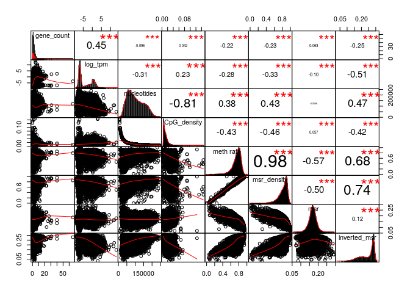
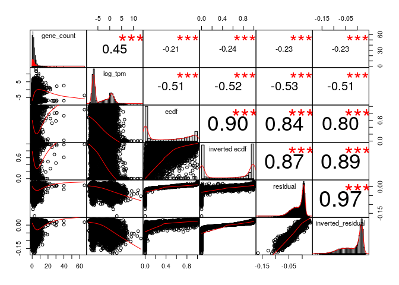
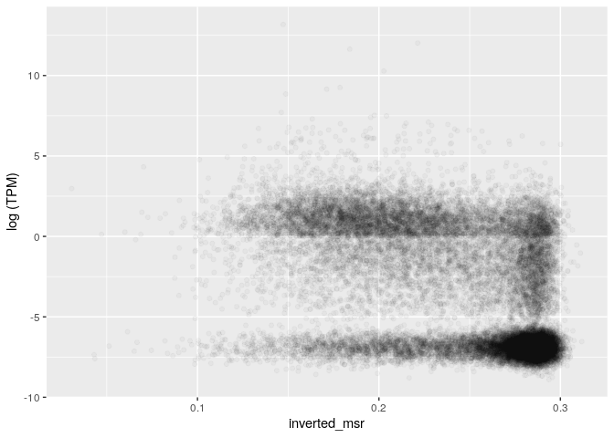
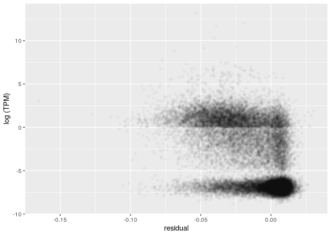
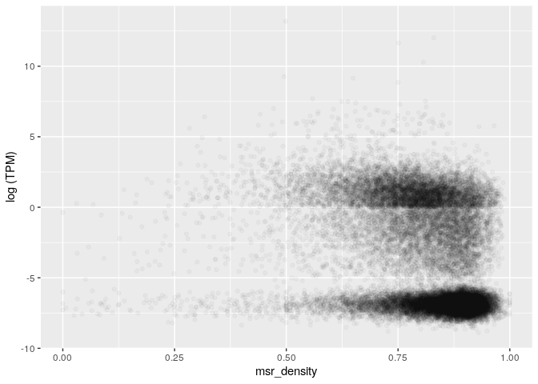
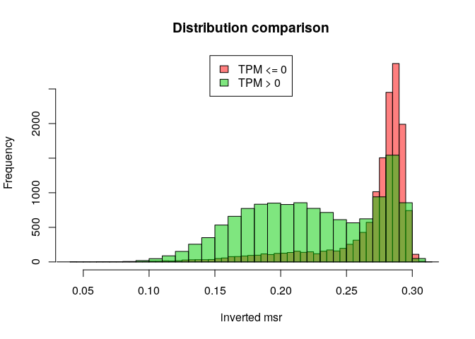
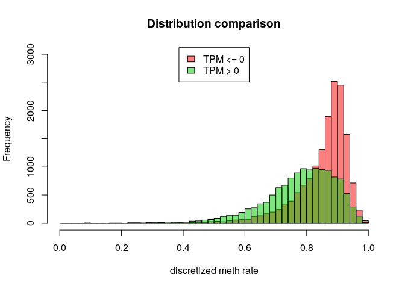
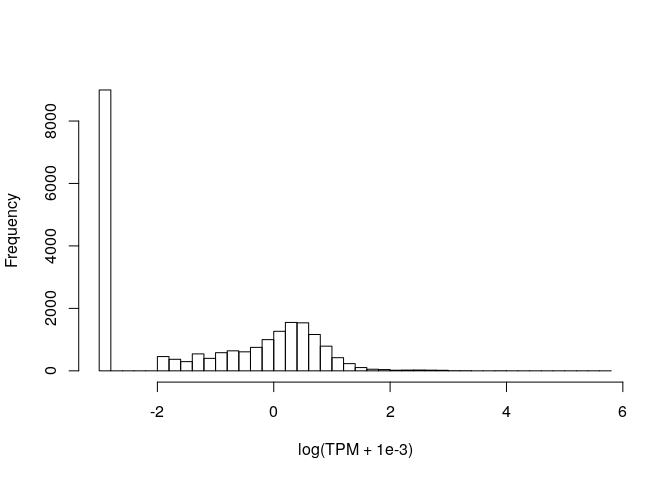

MSR and expression for ovary, windows of 1000 sites, extended genes set
================

The DataFrame is the following (excluding some columns for readability):

    ## 21 rows had too many nucleotides

    ##    start_chr start_position end_position gene_count total_TPM meth rate
    ## 8       chr1         742325       827393          8      1.57 0.7116420
    ## 9       chr1         827393       891580          3      0.00 0.6440638
    ## 10      chr1         891580       921648          4      0.02 0.5002695
    ## 12      chr1         940826       961902          2      2.05 0.3971166
    ## 13      chr1         961902       982731          2      0.01 0.6196993
    ## 14      chr1         982731      1007283          3      1.45 0.3961765

The full scheme includes:

**nucleotides**: number of nucleotides in the window

**CpG density**: fraction of nucleotides that is a C of a CpG site (= 1000/nucleotides)

**meth rate**: ratio of methylated CpG sites

**gene\_count**: number of genes included (even partially) inside the interval

**total\_TPM**: sum of the TPMs of the genes in the interval

then the MSR and some related statistics: **msr**, **inverted msr**, **msr ecdf **, **inverted msr ecdf**, **residual** (residual of the linear regression between msr and meth rate), **inverted residual**.

First let's see if there are pairwise correlations between the features.

TPM for regions with 0 genes is considered 0.

###### Basic features:

###### Comparison with simple MSR statistics:

###### Comparison with other MSR statistics:

inverted msr vs log(tpm): 

    ## missing data:  4.64797 %

    ## 
    ## train_data_proportion:  0.2

The fraction of fragments that have TPM&gt;0 (train data)

    ## [1] 0.4608461

Logistic Regression Model for TPM presence with basic predictors (nucleotides, CpG\_density, meth rate, msr\_density):

    ## TRAIN DATA

    ## accuracy:  0.6894689

    ## TEST DATA

    ## accuracy:  0.6945819

Logistic Regression Model with inverted\_msr as predictor

    ## TRAIN DATA

    ## accuracy:  0.7274527

    ## TEST DATA

    ## accuracy:  0.7345423

Logistic Regression Model with all predictors

    ## TRAIN DATA

    ## accuracy:  0.7353735

    ## TEST DATA

    ## accuracy:  0.7441274

#### Predicting log(TPM)

Distribution of TPM values (only for regions that contains some genes) 

Linear model for TPM with standard predictors, available information about genes:

    ## 
    ## Call:
    ## lm(formula = log_tpm ~ ., data = train_model_data[, standard_predictors])
    ## 
    ## Residuals:
    ##     Min      1Q  Median      3Q     Max 
    ## -18.693  -1.963  -0.127   2.002  13.411 
    ## 
    ## Coefficients:
    ##                           Estimate Std. Error t value Pr(>|t|)    
    ## (Intercept)              6.979e-01  4.413e-01   1.581    0.114    
    ## gene_count               4.374e-01  2.014e-02  21.723   <2e-16 ***
    ## nucleotides             -1.815e-05  1.546e-06 -11.741   <2e-16 ***
    ## CpG_density             -3.633e+00  9.544e+00  -0.381    0.704    
    ## `meth rate`              2.514e+01  2.056e+00  12.229   <2e-16 ***
    ## msr_density             -2.837e+01  1.914e+00 -14.823   <2e-16 ***
    ## genes_nucleotides_count  3.625e-05  1.194e-06  30.352   <2e-16 ***
    ## ---
    ## Signif. codes:  0 '***' 0.001 '**' 0.01 '*' 0.05 '.' 0.1 ' ' 1
    ## 
    ## Residual standard error: 2.817 on 5548 degrees of freedom
    ## Multiple R-squared:  0.4298, Adjusted R-squared:  0.4292 
    ## F-statistic:   697 on 6 and 5548 DF,  p-value: < 2.2e-16

    ## Test data R squared:  0.4339922

Linear model for TPM with all features and MSR statistics, available information about genes:

    ## 
    ## Call:
    ## lm(formula = log_tpm ~ ., data = train_model_data[, c(standard_predictors, 
    ##     msr_predictors)])
    ## 
    ## Residuals:
    ##      Min       1Q   Median       3Q      Max 
    ## -17.3073  -1.6945  -0.0785   1.6919  13.4887 
    ## 
    ## Coefficients:
    ##                           Estimate Std. Error t value Pr(>|t|)    
    ## (Intercept)             -2.478e+01  3.667e+00  -6.758 1.54e-11 ***
    ## gene_count               4.191e-01  1.927e-02  21.747  < 2e-16 ***
    ## nucleotides             -9.449e-06  1.597e-06  -5.915 3.51e-09 ***
    ## CpG_density              2.048e+01  9.617e+00   2.130 0.033208 *  
    ## `meth rate`              1.557e+01  2.274e+00   6.848 8.28e-12 ***
    ## msr_density             -1.834e+01  2.920e+00  -6.281 3.61e-10 ***
    ## genes_nucleotides_count  3.225e-05  1.157e-06  27.881  < 2e-16 ***
    ## msr                      1.775e+01  4.958e+00   3.580 0.000347 ***
    ## inverted_msr             7.849e+01  1.964e+01   3.997 6.50e-05 ***
    ## ecdf                     5.379e-01  2.683e-01   2.005 0.045013 *  
    ## `inverted ecdf`         -1.412e+00  2.692e-01  -5.245 1.62e-07 ***
    ## residual                -5.850e+01  9.117e+00  -6.416 1.51e-10 ***
    ## inverted_residual       -7.250e+01  1.994e+01  -3.637 0.000279 ***
    ## ---
    ## Signif. codes:  0 '***' 0.001 '**' 0.01 '*' 0.05 '.' 0.1 ' ' 1
    ## 
    ## Residual standard error: 2.689 on 5542 degrees of freedom
    ## Multiple R-squared:  0.4811, Adjusted R-squared:   0.48 
    ## F-statistic: 428.2 on 12 and 5542 DF,  p-value: < 2.2e-16

    ## Test data R squared:  0.4940766

Linear model for TPM with adding inverted msr, available information about genes:

    ## 
    ## Call:
    ## lm(formula = log_tpm ~ ., data = train_model_data[, c(standard_predictors, 
    ##     "inverted_msr")])
    ## 
    ## Residuals:
    ##      Min       1Q   Median       3Q      Max 
    ## -18.1538  -1.7290  -0.1244   1.7760  13.3110 
    ## 
    ## Coefficients:
    ##                           Estimate Std. Error t value Pr(>|t|)    
    ## (Intercept)              6.210e-01  4.258e-01   1.459    0.145    
    ## gene_count               4.288e-01  1.943e-02  22.069  < 2e-16 ***
    ## nucleotides             -1.318e-05  1.512e-06  -8.721  < 2e-16 ***
    ## CpG_density              1.209e+01  9.240e+00   1.308    0.191    
    ## `meth rate`              1.433e+01  2.053e+00   6.977 3.37e-12 ***
    ## msr_density             -1.156e+01  2.023e+00  -5.714 1.16e-08 ***
    ## genes_nucleotides_count  3.305e-05  1.163e-06  28.421  < 2e-16 ***
    ## inverted_msr            -2.495e+01  1.227e+00 -20.340  < 2e-16 ***
    ## ---
    ## Signif. codes:  0 '***' 0.001 '**' 0.01 '*' 0.05 '.' 0.1 ' ' 1
    ## 
    ## Residual standard error: 2.718 on 5547 degrees of freedom
    ## Multiple R-squared:  0.4694, Adjusted R-squared:  0.4687 
    ## F-statistic:   701 on 7 and 5547 DF,  p-value: < 2.2e-16

    ## Test data R squared:  0.4795558

Linear model for TPM with basic features but no information about genes:

    ## 
    ## Call:
    ## lm(formula = log_tpm ~ ., data = train_model_data[, c("log_tpm", 
    ##     basic_predictors)])
    ## 
    ## Residuals:
    ##      Min       1Q   Median       3Q      Max 
    ## -11.9968  -2.7004  -0.5705   3.0457  14.1429 
    ## 
    ## Coefficients:
    ##               Estimate Std. Error t value Pr(>|t|)    
    ## (Intercept)  6.667e+00  4.947e-01  13.476  < 2e-16 ***
    ## nucleotides -2.233e-05  1.814e-06 -12.308  < 2e-16 ***
    ## CpG_density -7.406e+01  1.115e+01  -6.645 3.33e-11 ***
    ## `meth rate`  3.317e+01  2.418e+00  13.718  < 2e-16 ***
    ## msr_density -3.917e+01  2.245e+00 -17.450  < 2e-16 ***
    ## ---
    ## Signif. codes:  0 '***' 0.001 '**' 0.01 '*' 0.05 '.' 0.1 ' ' 1
    ## 
    ## Residual standard error: 3.332 on 5550 degrees of freedom
    ## Multiple R-squared:  0.2021, Adjusted R-squared:  0.2016 
    ## F-statistic: 351.5 on 4 and 5550 DF,  p-value: < 2.2e-16

    ## Test data R squared:  0.201473

Linear model for TPM with all features but no information about genes:

    ## 
    ## Call:
    ## lm(formula = log_tpm ~ ., data = train_model_data[, c("log_tpm", 
    ##     basic_predictors, msr_predictors)])
    ## 
    ## Residuals:
    ##     Min      1Q  Median      3Q     Max 
    ## -8.8405 -1.9871 -0.5756  2.3386 13.6079 
    ## 
    ## Coefficients:
    ##                     Estimate Std. Error t value Pr(>|t|)    
    ## (Intercept)       -2.417e+01  4.270e+00  -5.661 1.58e-08 ***
    ## nucleotides       -9.889e-06  1.844e-06  -5.364 8.49e-08 ***
    ## CpG_density       -3.216e+01  1.111e+01  -2.896 0.003793 ** 
    ## `meth rate`        1.910e+01  2.643e+00   7.225 5.71e-13 ***
    ## msr_density       -2.123e+01  3.399e+00  -6.246 4.53e-10 ***
    ## msr                2.730e+01  5.764e+00   4.737 2.22e-06 ***
    ## inverted_msr       7.865e+01  2.285e+01   3.442 0.000581 ***
    ## ecdf               4.827e-01  3.119e-01   1.548 0.121742    
    ## `inverted ecdf`   -2.006e+00  3.128e-01  -6.413 1.54e-10 ***
    ## residual          -7.942e+01  1.060e+01  -7.493 7.79e-14 ***
    ## inverted_residual -6.878e+01  2.320e+01  -2.965 0.003041 ** 
    ## ---
    ## Signif. codes:  0 '***' 0.001 '**' 0.01 '*' 0.05 '.' 0.1 ' ' 1
    ## 
    ## Residual standard error: 3.131 on 5544 degrees of freedom
    ## Multiple R-squared:  0.2964, Adjusted R-squared:  0.2951 
    ## F-statistic: 233.5 on 10 and 5544 DF,  p-value: < 2.2e-16

    ## Test data R squared:  0.3164158

Linear model for TPM with inverted msr but no information about genes:

    ## 
    ## Call:
    ## lm(formula = log_tpm ~ ., data = train_model_data[, c("log_tpm", 
    ##     basic_predictors, "inverted_msr")])
    ## 
    ## Residuals:
    ##     Min      1Q  Median      3Q     Max 
    ## -9.5392 -2.2062 -0.6787  2.4773 13.1924 
    ## 
    ## Coefficients:
    ##                Estimate Std. Error t value Pr(>|t|)    
    ## (Intercept)   6.158e+00  4.727e-01  13.028  < 2e-16 ***
    ## nucleotides  -1.564e-05  1.755e-06  -8.913  < 2e-16 ***
    ## CpG_density  -4.772e+01  1.070e+01  -4.461 8.34e-06 ***
    ## `meth rate`   1.800e+01  2.398e+00   7.509 6.92e-14 ***
    ## msr_density  -1.590e+01  2.364e+00  -6.728 1.89e-11 ***
    ## inverted_msr -3.304e+01  1.418e+00 -23.303  < 2e-16 ***
    ## ---
    ## Signif. codes:  0 '***' 0.001 '**' 0.01 '*' 0.05 '.' 0.1 ' ' 1
    ## 
    ## Residual standard error: 3.18 on 5549 degrees of freedom
    ## Multiple R-squared:  0.2733, Adjusted R-squared:  0.2726 
    ## F-statistic: 417.3 on 5 and 5549 DF,  p-value: < 2.2e-16

    ## Test data R squared:  0.2874023
